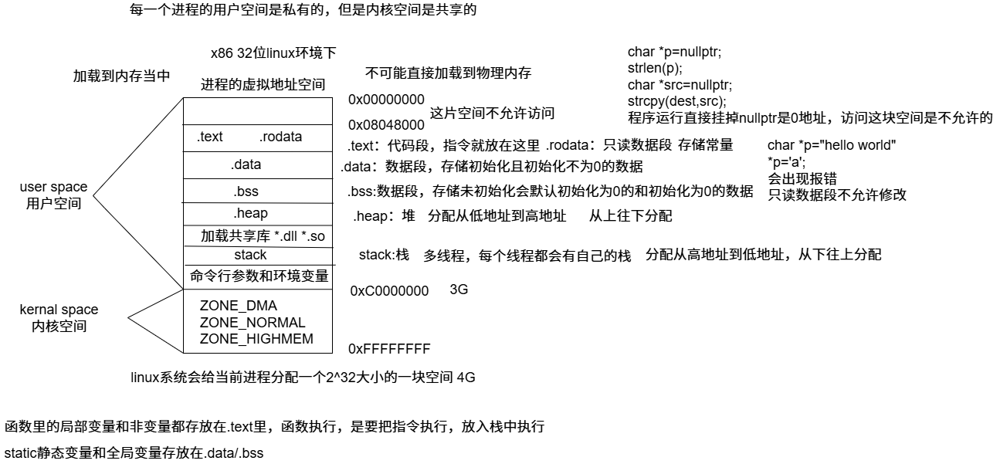
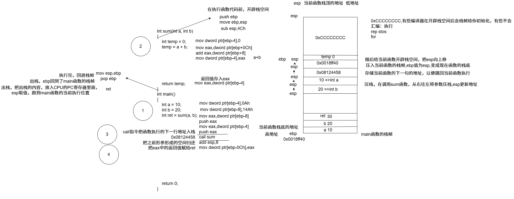
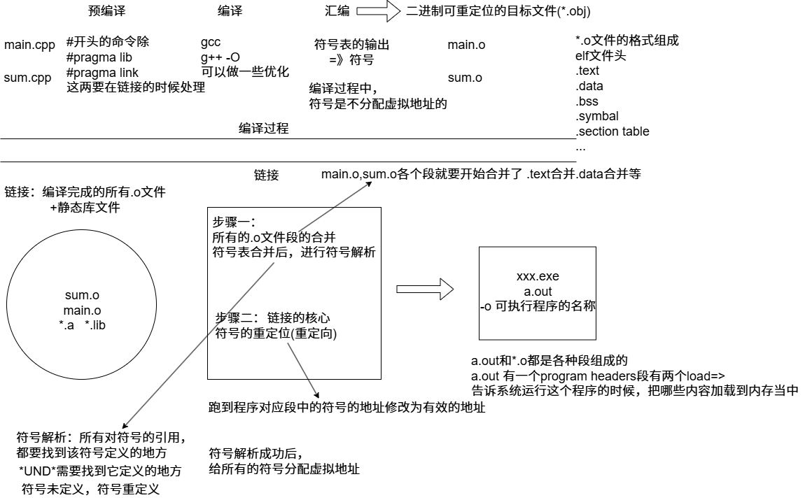

## 代码底层机制

### 进程虚拟地址空间区域划分



### 指令角度函数调用堆栈详细过程



### 编译器角度理解C++代码的编译和链接原理

```bash
objdump -t main.o#查看当前文件的符号表
readelf -h a.out#查看当前文件的很多信息(程序方向的)
```



**运行可执行文件，操作系统如何操作的**

 前提理解

- **可执行文件**（ELF等）经过链接器处理后，划分为不同的段（`.text`, `.data`, `.bss`, `.rodata`, ...）。
- **32位进程**有**4GB虚拟地址空间**：地址范围是 `0x00000000 ~ 0xFFFFFFFF`。
- **虚拟地址** ≠ **物理地址**，中间通过页表等机制完成**映射**。
- 可执行文件运行时，操作系统通过 `execve` 系统调用把文件加载到进程空间中。

------

加载过程简述

1. **可执行文件被加载**：
   - 内核根据 ELF 文件头，知道每个段该放到虚拟空间的哪个地址。
   - 如 `.text` 放在 `0x08048000`（很多 Linux 默认），`.data` 放在 `0x08049000` 等。
   - 这时还**没真正加载全部内容进内存**，只是建立了**虚拟内存映射**。
2. **虚拟地址空间初始化（页表）**：
   - 虚拟地址空间被分页（Page），每页通常 4KB。
   - 页表记录“虚拟页 -> 物理页”的映射关系。
   - 一开始很多段是通过 `mmap` 映射（如 lazy loading），并**不真正加载数据**。
3. **访问虚拟地址 → 缺页中断**：
   - 当程序第一次访问 `.text` 段的某一地址，CPU查页表发现没有对应的物理页。
   - 触发 **缺页异常（Page Fault）**，操作系统：
     - 找到可执行文件中该段的位置；
     - 把对应部分内容读入内存；
     - 更新页表。
4. **之后访问就命中页表，快速转换**：
   - 虚拟地址 → 通过页表 → 物理地址。
   - 再加上 TLB（快表）缓存页表项，加速访问。