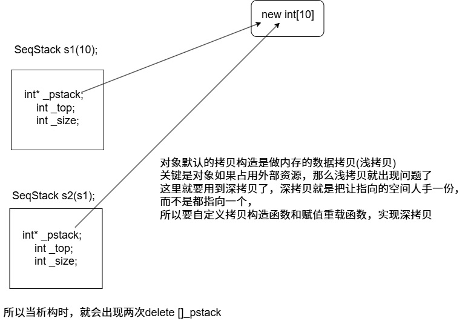
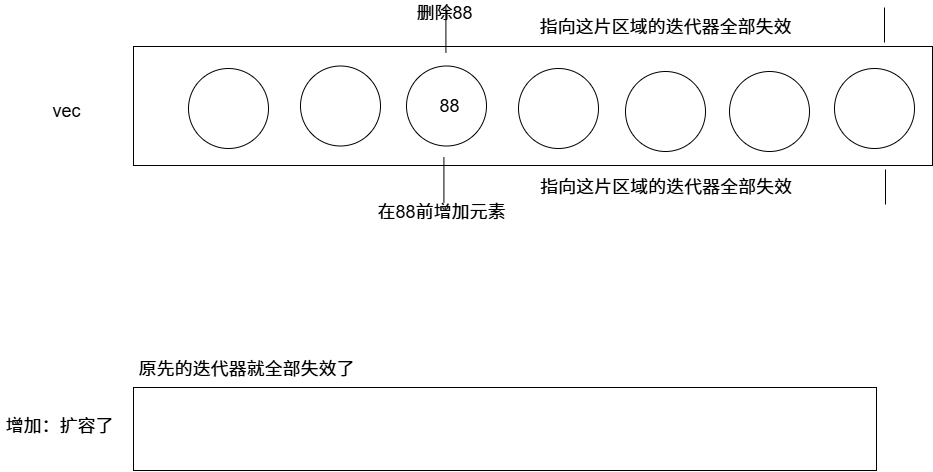
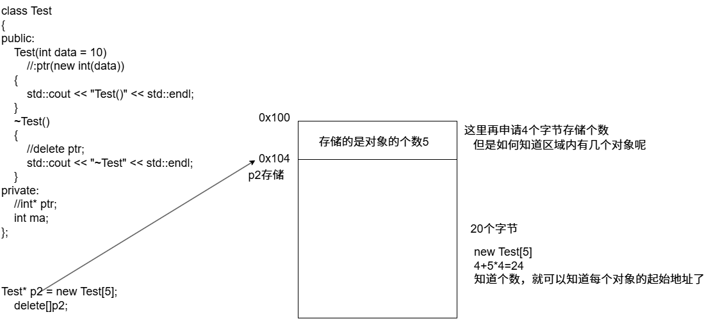
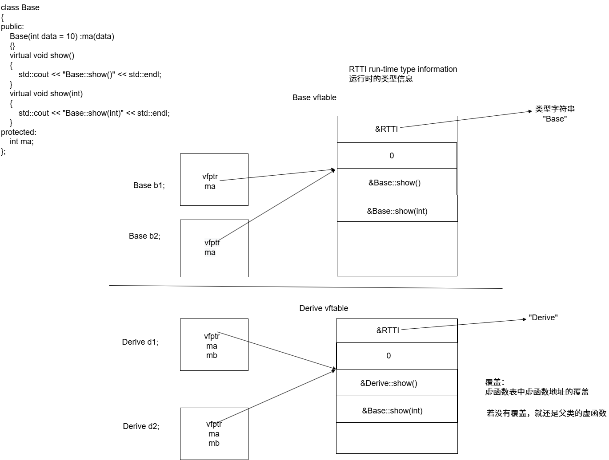
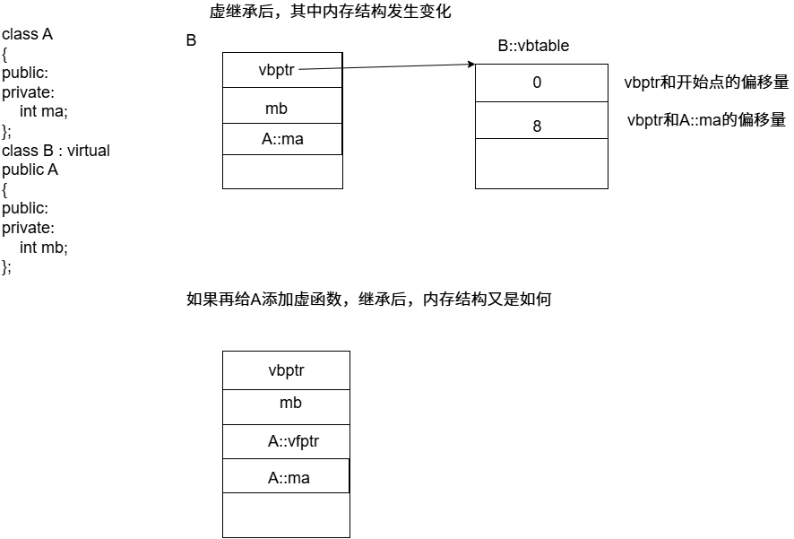

## 代码底层机制

### 进程虚拟地址空间区域划分


### 指令角度函数调用堆栈详细过程


### 编译器角度理解C++代码的编译和链接原理

```bash
objdump -t main.o#查看当前文件的符号表
readelf -h a.out#查看当前文件的很多信息(程序方向的)
```


**运行可执行文件，操作系统如何操作的**

 前提理解

- **可执行文件**（ELF等）经过链接器处理后，划分为不同的段（`.text`, `.data`, `.bss`, `.rodata`, ...）。
- **32位进程**有**4GB虚拟地址空间**：地址范围是 `0x00000000 ~ 0xFFFFFFFF`。
- **虚拟地址** ≠ **物理地址**，中间通过页表等机制完成**映射**。
- 可执行文件运行时，操作系统通过 `execve` 系统调用把文件加载到进程空间中。

------

加载过程简述

1. **可执行文件被加载**：
   - 内核根据 ELF 文件头，知道每个段该放到虚拟空间的哪个地址。
   - 如 `.text` 放在 `0x08048000`（很多 Linux 默认），`.data` 放在 `0x08049000` 等。
   - 这时还**没真正加载全部内容进内存**，只是建立了**虚拟内存映射**。
2. **虚拟地址空间初始化（页表）**：
   - 虚拟地址空间被分页（Page），每页通常 4KB。
   - 页表记录“虚拟页 -> 物理页”的映射关系。
   - 一开始很多段是通过 `mmap` 映射（如 lazy loading），并**不真正加载数据**。
3. **访问虚拟地址 → 缺页中断**：
   - 当程序第一次访问 `.text` 段的某一地址，CPU查页表发现没有对应的物理页。
   - 触发 **缺页异常（Page Fault）**，操作系统：
     - 找到可执行文件中该段的位置；
     - 把对应部分内容读入内存；
     - 更新页表。
4. **之后访问就命中页表，快速转换**：
   - 虚拟地址 → 通过页表 → 物理地址。
   - 再加上 TLB（快表）缓存页表项，加速访问。

## C++基础

### 形参带默认值的函数

```c++
#include <iostream>
using namespace std;

//形参带默认值的函数
//1.给默认值的时候，从右往左给
//2.调用效率的问题
//3.定义时可以给形参默认值，声明也可以给形参默认值
//4.形参给默认值的时候，不管是定义处给，还是声明处给，形参默认值只能出现一次
int sum(int a, int b = 20);
int sum(int a = 10, int b);//声明出现多次，定义只有一次
int main()
{
    int a = 10;
    int b = 20;
    int ret = sum(a, b);
    /*
    mov eax,dword ptr[ebp-8]
    push eax

    mov ecx,dword ptr[ebp-4];
    push ecx
    call sum

    */
    //如果加了形参默认值
    // int sum(int a, int b = 20);
    //调用sum(10);
    /*
    mov eax,dword ptr[ebp-8]
    push eax

    mov ecx,dword ptr[ebp-4];这句就不会有
    push 0aH
    call sum
    相比不加形参默认值，节省了这条指令。
    */
    std::cout << ret <<"\nHello World!\n";
}
int sum(int a, int b) 
{
    return a + b;
}
```

```bash
30
Hello World!
```

### inline内联函数

```c++
#include <iostream>
using namespace std;
/*
  inline内联函数和普通函数的区别？
  inline内联函数：在编译过程中，就没有函数的调用开销了，在函数的调用点
  直接把函数的代码进行展开处理了

  inline函数不再生成相应的函数符号
  但是，不是所有的inline都会被编译器处理成内联函数 - 递归
  inline标识符只是建议编译器把这个函数处理成内联函数。
  如果inline函数体内的代码过多，可能会出错，编译器可能不会内联。
  毕竟直接在函数的调用点展开，很有可能出错。

  debug版本上，inline是不起作用的；inline只有在release版本下才能出现
  g++ -c main.cpp -O2
  objdump -t main.o就看不见sum的函数符号了
*/
int sum(int x, int y) 
{
    return x + y;
}
int main()
{
    int a = 10;
    int b = 20;
    int ret = sum(a, b);
    //此处有标准的函数调用过程  参数压栈，函数栈帧的开辟和回退过程
    //有函数调用的开销
    //这个函数只是进行x+y,当函数调用开销大于函数执行的开销时，函数非常简单可以考虑用内联函数
    std::cout << "Hello World!\n";
}
```

### 函数重载

```c++
#include <iostream>
#include<typeinfo>
/*
函数重载
1.C++为什么支持函数重载，C语言不支持函数重载
    C++代码产生函数符号的时候，函数名+参数列表类型组成的
    C代码产生函数符号的时候，函数名来决定！
2.函数重载需要注意些什么？
3.C++和C语言代码之间如何互相调用

什么是函数重载？
    1.一组函数，其中函数名相同，参数列表的个数或者类型不同，那么这一组函数就称作函数重载
    2.一组函数要称得上重载，一定先是处在同一个作用域当中的。
    3.const或者volatile，是如何影响形参类型的。
    4.一组函数，函数名相同，参数列表也相同，仅仅是返回值不同？不叫重载

请你解释一下，什么是多态？
静态(编译时期)的多态：函数重载
动态(运行时期)的多态：

C++调用C代码：无法直接调用了！函数符号不统一
同样的int sum(int a,int b);C:sum，C++:sum_int_int
在C++文件C函数的声明括在extern "C"里面后续就可以使用了
extern "C"
{
    int sum(int a,int b);//按照C的方式生成符号
}
C调用C++：无法直接调用了！函数符号不统一
在C++文件中把C++源码括在extern "C"中。
extern "C"
{
    int sum(int a,int b)//按照C的方式生成符号
    {
        return a+b;
    }
}

只要是C++编译器，都内置了_cplusplus
#ifdef _cplusplus
extern "C"{
#endif
    int sum(int a,int b)
    {
        return a+b;
    }
#ifdef _cplusplus
}
这样既可以在C++编译器编译还可以在其他语言的编译器下运行
#endif
*/
void func(int a) {} //int
void func(const int a) {}//int 这样不算重载
int main() 
{
    int a = 10;
    const int b = 10;
    std::cout << typeid(a).name() << std::endl;//int
    std::cout << typeid(b).name() << std::endl;//int
    return 0;
}

#if 0
bool compare(int a, int b) //compare_int_int
{
    std::cout << "compare_int_int" << std::endl;
    return a > b;
}
bool compare(double a, double b) //compare_double_double
{
    std::cout << "compare_double_double" << std::endl;
    return a > b;
}
bool compare(const char* a, const char* b) //compare_const char*_const char*
{
    std::cout << "compare_char*_char*" << std::endl;
    return strcmp(a, b) > 0;
}
int main()
{
    //bool compare(int a, int b);//函数声明如果在函数体内声明，函数内重载的都会使用这个函数，优先当前作用域
    compare(10, 20);
    compare(10.0, 20.0);
    compare("aaa", "bbb");
    std::cout << "Hello World!\n";
}
#endif
```

### const

#### const基本用法

```c++
#include <iostream>
#include <typeinfo>
using namespace std;

/*
const如何理解
const修饰的变量不能够再作为左值，初始化完成后，值不能够被修改
常量是左值（const 是左值），但它是不能作为赋值语句左边的左值，因为它是只读的

C和C++中const的区别是什么
const的编译方式不同，C中，const就是当作一个变量来编译生成指令的。
C++中，所有出现const常量名字的地方，都被常量的初始化值替换了。

C++的const必须初始化，叫常量
但是如果初始化的值是一个变量，不是立即数。这个const变量就变为常变量了，和C中的一样
int b=20;
const int a = b;
*/
int main()
{
    const int a = 20;//必须初始化
    int array[a] = {};//可以执行
    int* p = (int*)&a;
    *p = 30;//这里已经把a的值改为30

    printf("%d %d %d \n", a, *p, *(&a));
    //输出结果20 30 20
    //为什呢a和*(&a)是20呢，在编译阶段就已经将a和 *(&a)->优化为a替换为20
    //*p指向的a对应地址空间的值，所以为30
    return 0;
}
```

```c
#include<stdio.h>
/*
const修饰的量，可以不用初始化
不叫常量，叫做常变量
*/

void main() 
{
	const int a = 20;//不初始化可以过
	//int array[a]={};这个是不允许的
	int* p = (int*)&a;
	*p = 30;

	printf("%d %d %d \n", a, *p, *(&a));
	//输出结果为30 30 30
}
```

#### const和一二级指针的结合

```c++
#include <iostream>
#include <typeinfo>
using namespace std;
/*
const和一级指针的结合
const和二级(多级)指针的结合

const修饰的量   叫常量
和普通变量的区别:C++有两点区别？1.编译方式不同(直接替换) 2.不能作为左值了

const修饰的常量出现的错误：
1.常量不能作为左值 =》直接修改常量的值
2.不能把常量的地址泄露给一个普通的指针或者普通的引用变量 =》可以间接修改常量的值

const和一级指针的结合：有两种情况
C++语言规范：const修饰的是离他最近的类型
const int *p; 
这个修饰的是*p，可以任意指向不同的int类型的内存，但是不能通过指针间接修改指向的内存的值。
int const *p;
这个和上面相同。
int *const p;
这个修饰的是p,p变为常量了。不能再指向其他内存，但是可以通过指针解引用修改指向的内存的值
const int *const p;
这个即不能再指向其他内存，也不可以通过指针解引用修改指向的的内存的值。


总结const和指针的类型转换公式：
int * <= const int* 是错误的
const int* <= int*  是可以的

int ** <=const int **   是错误的 这两个两边都有const才可以
const int ** <=int **   是错误的

int ** <= int* const*   是错误的 这俩个可以通过推一级指针看是否可以
int*const* <= int**     是可以的
*/
int main01()
{
    const int a = 10;
    //int* p = &a;//int * <= const int*,C++编译器是不允许的，那该如何修改呢，
    //这里我不想p通过解引用修改a的值，因为a是const修饰的。至于p本身可不可以被修改，不关心。
    const int* p = &a;
    int b = 20;
    const int* p2 = &b;//const int* 《= int *
    int* const p3 = &b;//int * 《= int *


    int* q1 = nullptr;
    int* const q2 = nullptr;
    std::cout << typeid(q1).name() << std::endl;
    std::cout << typeid(q2).name() << std::endl;
    //这两个结果都是int *
    //在编译器角度，const如果右边没有指针*的话，const是不参与类型的
    return 0;
}

/*
const和二级指针的结合
C++语言规范：const修饰的是离他最近的类型
const int **q;
int *const*q;
int **const q;
*/
int main() 
{
    int a = 10;
    int* p = &a;
    //const int** q = &p;//const int** <= int** 是错误的 
    //有两种解决办法，const int** q目的是保证a是不能通过q修改，但是*q是可以修改a的地址
    //所以const int* const * q 让*q不可以修改。
    //另一种把int *p=&a变为const int * p=&a;    
    return 0;
}
```

### C++引用

```c++
#include <iostream>
#include <typeinfo>
using namespace std;
/*
C++的引用 引用和指针的区别？
1.左值引用和右值引用
2.引用的实例

引用是一种更安全的指针。
1.引用是必须初始化的，指针可以不初始化
2.引用只有一级引用，没有多级引用，指针可以有一级指针，也可以有多级指针
3.定义一个引用变量，和定义一个指针变量，其汇编指令是一模一样的;通过引用变量修改所引用内存的值，和通过指针解引用
修改所引用内存的值，和通过指针解引用修改指针指向的内存的值，其底层指令也是一模一样的。


右值引用
1.int &&c=20;专门用来引用右值类型，指令上，可以自动产生临时量，然后直接引用临时量，可以进行修改c=40;
2.右值引用变量本身是一个左值，只能用左值引用来引用它
3.不能用一个右值引用变量，来引用一个左值。
*/
#if 0
int main()
{
    int a = 10;
    int* p = &a;
    int& b = a;
    /*
    int* p = &a;
    00007FF7D3B323C4  lea         rax,[a]  
    00007FF7D3B323C8  mov         qword ptr [p],rax  
    int& b = a;
    00007FF7D3B323CC  lea         rax,[a]  
    00007FF7D3B323D0  mov         qword ptr [b],rax  
    从这里可以看出引用底层和指针是一样的
    *p = 20;
    00007FF7977E23D4  mov         rax,qword ptr [p]
    00007FF7977E23D8  mov         dword ptr [rax],14h
    b = 30;
    00007FF7977E243A  mov         rax,qword ptr [b]
    00007FF7977E243E  mov         dword ptr [rax],1Eh
    引用底层也是解引用实现赋值操作
    */
    *p = 20;
    //20 20 20
    std::cout << a << " " << *p << " " << b << std::endl;

    b = 30;
    //30 30 30
    std::cout << a << " " << *p << " " << b << std::endl;
    //int& c = 20;//这个是不可以的，必须是可以取地址的
    return 0;
}


int main() 
{
    int array[5] = {};
    int* p = array;
    //定义一个引用变量，来引用array数组
    //int(*q)[5] = &array;
    int(&q)[5] = array;
    std::cout << sizeof(array) << std::endl;//20
    std::cout << sizeof(p) << std::endl;//4(32位) 8(64位)
    std::cout << sizeof(q) << std::endl;//20 q相当于array的别名
}
#endif
int main() 
{
    int a = 10;//左值，它有内存，有名字，值可以修改的
    int& b = a;
    //int& c = 20;//20是右值：没内存，没名字
    //C++提供了右值引用
    int&& c = 20;
    //这个是和下面是一样的，区别在于c是可以修改的，d不可以
    const int& d = 20;
    /*
    int temp=20;
    tmep-> d对应的底层地址

    int&& c = 20;
    00007FF73A5C1F4C  mov         dword ptr [rbp+64h],14h
    00007FF73A5C1F53  lea         rax,[rbp+64h]
    00007FF73A5C1F57  mov         qword ptr [c],rax
    const int& d = 20;
    00007FF73A5C1F5B  mov         dword ptr [rbp+0A4h],14h
    00007FF73A5C1F65  lea         rax,[rbp+0A4h]
    00007FF73A5C1F6C  mov         qword ptr [d],rax
    可以看出底层代码是一致的
    */
    c = 30;
    /*
    c = 30;
    00007FF73A5C1F73  mov         rax,qword ptr [c]  
    00007FF73A5C1F77  mov         dword ptr [rax],1Eh 
    这里也是通过临时量修改
    */
    int& e = c;//一个右值引用变量，本身是一个左值。
}
```

### const，指针，引用的结合使用

```c++
#include <iostream>


/*
const,一级指针，引用的结合使用
*/
int main()
{
    //写一句代码，在内存的0x0018ff44处写一个4字节的10
    //int* const &p = (int*)0x0018ff44;
    //int* &&p= (int*)0x0018ff44;
    int a = 10;
    int* p = &a;
    //const int*& q = p;这句是执行不了的
    //const int*& q = p;首先&不参与类型指定，所以单看好像是const int * 《= int *好像没问题
    //但是底层&是和指针相同的，我们前面学过const和多级指针的判断
    //还原成const int **q=&p;这时候const int ** 《= int **,这下是有问题的。
    return 0;
}
```

### new和delete

```c++
#include <iostream>
/*
new和delete
new和malloc的区别
delete和free的区别

malloc和free,称作C的库函数
new和delete,称作运算符

new不仅可以做内存开辟，还可以做内存初始化操作
malloc开辟内存失败，是通过返回值和nullptr作比较；
而new开辟内存失败，是通过抛出bad_alloc类型的异常来判断的。

delete和free
free一般用于C,delete用于C++。free只是释放所对应的内存。delete在对象中除了会释放所对应的内存，还会执行对象的析构函数
*/
#if 0
int main()
{
    int* p = (int*)malloc(sizeof(int));
    if (p == nullptr)
    {
        return -1;
    }
    *p = 20;
    free(p);

    int* p1 = new int(20);
    delete p1;

    
    //开辟数组
    int* q = (int*)malloc(sizeof(int) * 20);
    if (q == nullptr)
    {
        return -1;
    }
    free(q);
    
    int* q1 = new int[20];//20个int
    delete[]q1;
    
    return 0;
}
#endif
int main()
{
    //new有多少种
    int* p1 = new int(20);
    int* p2 = new (std::nothrow) int;//未开辟成功，不会抛出异常
    const int* p3 = new const int(40);//在堆区开辟一个常量
    //定位new
    int data = 0;
    int* p4 = new (&data) int(50);//在指定的地址开辟空间
    std::cout << "data:" << data << std::endl;//data变为50
    return 0;
}
```

## C++面向对象

### 类和对象，this指针

```c++
#include <iostream>
/*
C++ OOP面向对象 OOP编程，this指针
C: 各种各样的函数的定义 struct
C++：类 =》实体的抽象类型
实体（属性，行为） -> ADT(abstract data type)抽象数据类型
  |                                 |
对象      (实例化) <- 类(属性->成员变量  行为->成员方法)

OOP语言的四大特征是什么？
抽象     封装/隐藏    继承  多态

访问限定符：public公有的 private私有的 protected保护的
*/
const int NAME_LEN = 20;
class CGoods //=>商品的抽象数据类型
{
public://给外部提供公有的成员方法，来访问私有的属性
    //做商品数据初始化用的
    void init(const char* name, double price, int amount);
    //打印商品信息
    void show();
    //给成员变量提供一个getXXX或者setXXX的方法
    //类体内实现的方法，自动处理成inline内联函数
    void setName(char* name) { strcpy(_name, name); }
    void setPrice(double price) { _price = price; }
    void setAmount(int amount) { _amount = amount; }
    const char* getName() { return _name; }
    double getPrice() { return _price;}
    int getAmount() { return _amount; }
private://属性一般都是私有的成员变量
    char _name[NAME_LEN];
    double _price;
    int _amount;
};
void CGoods::init(const char* name, double price, int amount)
{
    strcpy(_name, name);
    _price = price;
    _amount = amount;
}
void CGoods::show()
{
    std::cout << "name:" << _name << std::endl;
    std::cout << "price:" << _price << std::endl;
    std::cout << "amount:" << _amount << std::endl;
}
int main()
{
    /*
    CGoods可以定义无数的对象，每一个对象都有自己的成员变量，但是他们共享一套成员方法
    成员方法如何知道自己所要修改的对象是谁呢？
    类的成员方法一经编译，所有的方法参数，都会加一个this指针，接收调用该方法的的对象的地址。
    底层会自动转变void init(CGoods *this,const char* name, double price, int amount)，里面的变量会变成this.变量名。
    这样就可以区分是哪个对象了。
    */
    //对象内存大小=》只和成员变量有关，与成员方法无关
    CGoods good;//类实例化了一个对象
    good.init("面包", 10.0, 200);
    good.show();
    good.setPrice(20.5);
    good.setAmount(100);
    good.show();
    return 0;
}
```

### 构造函数和析构函数

```c++
#include <iostream>
/*
构造函数和析构函数
OOP实现一个顺序栈

构造函数和析构函数
函数的名字和类名一样
没有返回值
*/
class SeqStack
{
public:
    //构造函数
    SeqStack(int size = 10) //是可以带参数的，因此可以提供多个构造函数，叫做构造函数的重载
    {
        std::cout << this << "SeqStack()" << std::endl;
        _pstack = new int[size];
        _top = -1;
        _size = size;
    }
    //析构函数
    ~SeqStack() //是不带参数的，所有析构函数只能有一个
    {
        std::cout << this << "~SeqStack()" << std::endl;
        delete[]_pstack;
        _pstack = nullptr;
    }
    void init(int size = 10) 
    {
        _pstack = new int[size];
        _top = -1;
        _size = size;
    }
    void release()
    {
        delete[]_pstack;
        _pstack = nullptr;
    }
    void push(int val)
    {
        if (full())
            resize();
        _pstack[++_top] = val;
    }
    void pop() 
    {
        if (empty())
            return;
        --_top;
    }
    int top() 
    {
        return _pstack[_top];
    }
    bool empty()
    {
        return _top == -1;
    }
    bool full()
    {
        return _top == _size - 1;
    }
private:
    int* _pstack;//动态开辟数组，存储顺序栈的元素
    int _top;//指向栈顶元素的位置
    int _size;//数组扩容的总大小
    void resize() 
    {
        int* ptmp = new int[_size * 2];
        for (int i = 0;i < _size;i++) 
        {
            ptmp[i] = _pstack[i];
        }
        delete[]_pstack;
        _pstack = ptmp;
        _size *= 2;
    }
};
SeqStack s;//是建立在数据段上的，程序结束析构函数执行(最后析构)
int main()
{
    /*
    .data
    heap
    stack
    */
    SeqStack* ps = new SeqStack(60);//这个是建立在堆上的，相当于malloc内存开辟+SeqStack(60)构造
    ps->push(70);
    ps->push(80);
    ps->pop();
    std::cout << ps->top() << std::endl;
    delete ps;//只有delete后才会触发析构函数，delete过程：先调用ps->~SeqStack(),然后free(ps)
    SeqStack s;//1.开辟内存 2.调用构造函数 这个析构函数执行在当前函数结束时
    //s.init(5);
    for (int i = 0;i < 15;i++)
    {
        s.push(rand() % 100);
    }
    while (!s.empty())
    {
        std::cout << s.top() << " ";
        s.pop();
    }
    //s.release();
    //s.~SeqStack();//析构函数调用以后，对象不存在了
    //s.push(30);//堆内存的非法访问，所以不建议自己单独调用析构函数。
    return 0;
}
```

### 对象的深拷贝和浅拷贝



```c++
#include <iostream>
/*
this指针 =》类 ->很多对象 共享一套成员方法
成员方法，方法的参数都会添加一个this指针

构造函数：
    定义对象时，自动调用的；可以重载的；构造完成，对象产生了
析构函数：
    不带参数，不能重载，只有一个析构函数；析构完成，对象就不存在了

对象的深拷贝和浅拷贝
*/

class SeqStack
{
public:
    //构造函数
    SeqStack(int size = 10) //是可以带参数的，因此可以提供多个构造函数，叫做构造函数的重载
    {
        std::cout << this << "SeqStack()" << std::endl;
        _pstack = new int[size];
        _top = -1;
        _size = size;
    }
    //自定义拷贝构造函数 《=对象的浅拷贝现在有问题了
    SeqStack(const SeqStack& src) 
    {
        _pstack = new int[src._size];
        for (int i = 0;i < src._top;i++)
        {
            _pstack[i] = src._pstack[i];
        }
        //这里赋值为什么不使用memcpy或者realloc,如果是对指针数组的拷贝的话
        //那它本身是浅拷贝。所以这里一定要用for循环赋值
        _top = src._top;
        _size = src._size;
    }
    //赋值重载函数(浅拷贝存在问题)
    void operator=(const SeqStack& src)
    {
        //防止自赋值
        if (this == &src)
            return;
        //需要先释放当前对象占用的外部资源
        delete[]_pstack;
        _pstack = new int[src._size];
        for (int i = 0;i < src._top;i++)
        {
            _pstack[i] = src._pstack[i];
        }
        //这里赋值为什么不使用memcpy或者realloc,如果是对指针数组的拷贝的话
        //那它本身是浅拷贝。所以这里一定要用for循环赋值
        _top = src._top;
        _size = src._size;
    }
    //析构函数
    ~SeqStack() //是不带参数的，所有析构函数只能有一个
    {
        std::cout << this << "~SeqStack()" << std::endl;
        delete[]_pstack;
        _pstack = nullptr;
    }
    void init(int size = 10)
    {
        _pstack = new int[size];
        _top = -1;
        _size = size;
    }
    void release()
    {
        delete[]_pstack;
        _pstack = nullptr;
    }
    void push(int val)
    {
        if (full())
            resize();
        _pstack[++_top] = val;
    }
    void pop()
    {
        if (empty())
            return;
        --_top;
    }
    int top()
    {
        return _pstack[_top];
    }
    bool empty()
    {
        return _top == -1;
    }
    bool full()
    {
        return _top == _size - 1;
    }
private:
    int* _pstack;//动态开辟数组，存储顺序栈的元素
    int _top;//指向栈顶元素的位置
    int _size;//数组扩容的总大小
    void resize()
    {
        int* ptmp = new int[_size * 2];
        for (int i = 0;i < _size;i++)
        {
            ptmp[i] = _pstack[i];
        }
        delete[]_pstack;
        _pstack = ptmp;
        _size *= 2;
    }
};
int main()
{
    //SeqStack s;//没有提供任意构造函数的时候，会为你生成默认构造和默认析构，是空函数。
    SeqStack s1(10);
    SeqStack s2 = s1;//默认拷贝构造函数=》做直接内存数据拷贝
    //SeqStack s3(s1);

    //s2.operator=(s1)
    //void operator=(const SeqStack &src)
    s2 = s1;//默认的赋值函数 =》做直接的内存拷贝(浅拷贝)
    return 0;
}
```

### 类和对象代码应用实践

```c++
#include <iostream>

/*
String类型
循环队列 Queue
*/
#if 0
class String
{
public:
    String(const char* str = nullptr)//普通构造函数
    {
        if (str != nullptr) 
        {
            //strlen计算字符串长度时，是不计入'\0'的
            m_data = new char[strlen(str) + 1];
            strcpy(this->m_data, str);
        }
        else
        {
            //这里不能直接把m_data赋值为nullptr，如果这里赋值
            //后面的构造函数都要判断地址为空的条件。
            m_data = new char[1];
            *m_data = '\0';
        }
       
    }
    String(const String& other)//拷贝构造函数
    {
        m_data = new char[strlen(other.m_data) + 1];
        strcpy(m_data, other.m_data);
    }
    ~String(void)//析构函数
    {
        delete[]m_data;
        m_data = nullptr;
    }
    String& operator = (const String &other)//赋值重载函数
    {
        //防止自赋值
        if (this == &other)
        {
            return *this;
        }
        delete[]m_data;
        m_data = new char[strlen(other.m_data) + 1];
        strcpy(m_data, other.m_data);
        return *this;
    }
private:
    char* m_data;//用于保存字符串

};
int main()
{
    //这三个都是使用普通的构造函数String(const char* str = nullptr)
    String str1;
    String str2("hello");
    String str3 = "World";
    
    //这两个都是调用拷贝构造函数
    String str4 = str3;
    String str5(str3);
    //下面调用赋值重载函数
    str1 = str2;

    /*
    下面执行顺序从右向左
    str1=str2;
    str1.operator=(str2);如果返回值变成了void
    str3=void这样就会出错，所以返回值变为 String&
    这样是为了支持连续赋值
    */
    str3 = str1 = str2;
    return 0;
}
#endif

//循环队列
class Queue
{
public:
    Queue(int size = 5)
    {
        _pQue = new int[size];
        _front = _rear = 0;
        _size = size;
    }
    //C++11可以把拷贝和赋值删除掉，用户就无法使用了，禁用后，使用会报错
    //Queue(const Queue&) = delete;
    //Queue& operator=(const Queue&) = delete;
    Queue(const Queue& src) 
    {
        _size = src._size;
        _front = src._front;
        _rear = src._rear;
        _pQue = new int[_size];
        for (int i = _front;i != _rear;i = (i + 1) % _size)
        {
            _pQue[i] = src._pQue[i];
        }
    }
    Queue& operator=(const Queue&src)
    {
        if (this == &src)
            return *this;
        delete[]_pQue;
        _size = src._size;
        _front = src._front;
        _rear = src._rear;
        _pQue = new int[_size];
        for (int i = _front;i != _rear;i = (i + 1) % _size)
        {
            _pQue[i] = src._pQue[i];
        }
        return *this;
    }
    ~Queue() 
    {
        delete[]_pQue;
        _pQue = nullptr;
    }
    void push(int val)//入队操作
    {
        if (full())
        {
            resize();
        }
        _pQue[_rear] = val;
        _rear = (_rear + 1) % _size;
    }
    void pop()//出队操作
    {
        if (empty()) 
        {
            return;
        }
        _front = (_front + 1) % _size;
    }
    int front()//获取队头元素
    {
        return _pQue[_front];
    }
    bool full()
    {
        return (_rear + 1) % _size == _front;
    }
    bool empty()
    {
        return _front == _rear;
    }
private:
    int* _pQue;//申请队列的数组空间
    int _front;//指示队头的位置
    int _rear;//指示队尾的位置
    int _size;//队列扩容的总大小

    void resize()
    {
        int* ptmp = new int[2 * _size];
        int index = 0;
        //使用循环队列，不要直接搬过去，会出现问题不符合队列的特性，所以把循环队列重新放入新空间中。
        for (int i = _front;i != _rear;i = (i + 1) % _size)
        {
            ptmp[index++] = _pQue[i];
        }
        delete[]_pQue;
        _pQue = ptmp;
        _front = 0;
        _rear = index;
        _size *= 2;
    }
};
int main()
{
    Queue queue;
    for (int i = 0;i < 20;i++)
    {
        queue.push(rand() % 100);
    }
    while (!queue.empty()) 
    {
        std::cout << queue.front() << " ";
        queue.pop();
    }
    std::cout << std::endl;


    return 0;
}
```

### 构造函数的初始化列表

```c++
#include <iostream>

#if 0
/*
日期类
*/
class CDate
{
public:
    CDate(int y, int m, int d)//自定义了构造函数，编译器就不会产生默认的构造函数
    {
        _year = y;
        _month = m;
        _day = d;
    }
    void show()
    {
        std::cout << _year << "/" << _month << "/" << _day << std::endl;
    }
private:
    int _year;
    int _month;
    int _day;
};
/*
构造函数的初始化列表 可以指定当前对象成员变量的初始化方式
CDate信息 CGoods商品信息的一部分
*/
class CGoods
{
public:
    CGoods(const char* n, int a, double p,int y,int m,int d)
        :_date(y,m,d)//相当于CDate _date(y,m,d);
        ,_amount(a)//相当于int _amount=a;
        ,_price(p)//构造函数的初始化列表
    {
        //当前类类型构造函数体
        strcpy(_name, n);
        //_amount=a;相当于int _amount;_amount=a;
    }
    void show()
    {
        std::cout << "name:" << _name << std::endl;
        std::cout << "amount:" << _amount << std::endl;
        std::cout << "price:" << _price << std::endl;
        _date.show();
    }
private:
    char _name[20];
    int _amount;
    double _price;
    CDate _date;//成员对象 1.分配内存 2.调用构造函数 这里会调用默认构造函数,所以要在当前类的构造函数放入初始化
};
int main()
{
    CGoods good("商品", 100, 35.0, 2019, 5, 12);
    good.show();
    return 0;
}
#endif

class Test 
{
public:
    Test(int data = 10) :mb(data), ma(mb) {}//这里初始化的顺序是按照变量的定义顺序指定的，和你赋值的顺序无关
    void show()
    {
        std::cout << "ma:" << ma << "mb:" << mb << std::endl;
        //0xCCCCCCCC就是后面的数字 ma:-858993460mb:10
    }
private:
    //成员变量初始化和他们定义的顺序有关，和构造函数初始化列表中出现的先后顺序无关！
    int ma;
    int mb;
};

int main()
{
    Test t;
    t.show();
    return 0;
}
```

### 类的各种成员方法以及区别

```c++
#include <iostream>

/*
类的各种成员 - 成员方法/变量
普通的成员方法 =》编译器会添加一个this形参变量
1.属于类的作用域
2.调用该方法时，需要依赖一个对象（常对象是无法调用的）
3.可以任意访问对象的私有成员变量   先不考虑protected继承 只看public private

static静态成员方法 =》不会生成this形参
1.属于类的作用域
2.用类名作用域来调用方法
3.可以任意访问对象的私有成员，仅限于不依赖对象的成员(只能调用其他的static静态成员)

const常成员方法 =》const CGoods *this
1.属于类的作用域
2.调用依赖一个对象，普通对象或者常对象都可以
3.可以任意访问对象的私有成员，但是只能读，而不能写
*/
class CDate
{
public:
    CDate(int y, int m, int d)//自定义了构造函数，编译器就不会产生默认的构造函数
    {
        _year = y;
        _month = m;
        _day = d;
    }
    void show()const
    {
        std::cout << _year << "/" << _month << "/" << _day << std::endl;
    }
private:
    int _year;
    int _month;
    int _day;
};
/*
构造函数的初始化列表 可以指定当前对象成员变量的初始化方式
CDate信息 CGoods商品信息的一部分
*/
class CGoods
{
public:
    CGoods(const char* n, int a, double p, int y, int m, int d)
        :_date(y, m, d)//相当于CDate _date(y,m,d);
        , _amount(a)//相当于int _amount=a;
        , _price(p)//构造函数的初始化列表
    {
        //当前类类型构造函数体
        strcpy(_name, n);
        //_amount=a;相当于int _amount;_amount=a;

        _count++;//记录所有产生的新对象的数量
    }
    //普通成员方法 CGoods *this
    void show()//打印商品私有的信息
    {
        std::cout << "name:" << _name << std::endl;
        std::cout << "amount:" << _amount << std::endl;
        std::cout << "price:" << _price << std::endl;
        _date.show();
    }
    //常成员方法 只要是只读操作的成员方法，一律实现成const常成员方法
    //这样普通对象可以调，常对象也可以调用
    void show() const //const CGoods *this
    {
        std::cout << "name:" << _name << std::endl;
        std::cout << "amount:" << _amount << std::endl;
        std::cout << "price:" << _price << std::endl;
        _date.show();
    }
    //静态成员方法 没有this指针的
    static void showCGoodsCount()//打印的是所有商品共享的信息
    {
        std::cout << "所有商品的种类数量是：" << _count << std::endl;
    }
private:
    char _name[20];
    int _amount;
    double _price;
    CDate _date;//成员对象 1.分配内存 2.调用构造函数 这里会调用默认构造函数,所以要在当前类的构造函数放入初始化
    static int _count;//声明 用来记录商品数量的总数量 不属于对象而是属于类级别
};
//static成员变量一定要在类外进行定义并且初始化
int CGoods::_count = 0;
int main()
{
    CGoods good1("商品1", 100, 35.0, 2019, 5, 12);
    good1.show();
    CGoods good2("商品2", 100, 35.0, 2019, 5, 12);
    good2.show();
    CGoods good3("商品3", 100, 35.0, 2019, 5, 12);
    good3.show();
    CGoods good4("商品4", 100, 35.0, 2019, 5, 12);
    good4.show();

    //统计所有商品的总数量
    CGoods::showCGoodsCount();

    const CGoods good5("非卖品商品5", 100, 35.0, 2019, 5, 12);
    good5.show();//CGoods::show(&good5) const CGoods* => CGoods *this这样是会报错的
    return 0;
}
```

### 指向类成员(成员方法和成员变量)的指针

```c++
#include <iostream>

/*
指向类成员(成员变量和成员方法)的指针(public可从外界访问)
*/
class Test
{
public:
    void func()
    {
        std::cout << "call Test::func" << std::endl;
    }
    static void static_func()
    {
        std::cout << "Test::static_func" << std::endl;
    }
    int ma;
    static int mb;
};
int Test::mb = 0;
int main()
{
#if 0
    Test t1;
    Test* t2 = new Test();

    int Test::* p = &Test::ma;
    t1.*p = 20;
    std::cout << t1.*p << std::endl;

    t2->*p = 30;
    std::cout << t2->*p << std::endl;

    int* p1 = &Test::mb;
    *p1 = 40;
    std::cout << *p1 << std::endl;
    delete t2;
#endif
    
    Test t1;
    Test* t2 = new Test();
    //指向成员方法的指针
    void (Test:: * pfunc)() = &Test::func;
    (t1.*pfunc)();
    (t2->*pfunc)();

    //如何定义函数指针指向类的static成员方法
    void (*pfunc1)() = &Test::static_func;
    (*pfunc1)();
    return 0;
}
```

## C++模板

### 函数模板

```c++
#include <iostream>

/*
函数模板
模板的意义：对类型也可以进行参数化了
int sum(int a,int b){return a+b}

函数模板    《=是不进行编译的,因为类型不知
模板的实例化 《=函数调用点进行实例化
模板函数 <=这个才是要被编译器所编译的

模板类型参数 typename/class
模板非类型参数

模板的实参推演 => 可以根据用户传入的实参类型，来推导出模板类型参数的具体类型

模板的特例化（专用化） 不是编译器提供的，而是用户提供的实例化
函数模板，模板的特例化，非模板函数的重载关系

模板代码不能在一个文件中定义，在另一个文件中使用的。
模板代码调用前，一定要看到模板定义的地方，这样的话，模板才能够进行正常的实例化，产生能够被编译器编译的代码
所以，模板代码都是放在头文件当中的，然后在源文件中直接进行include包含
*/

//函数模板
template<typename T> //定义一个模板参数列表
bool compare(T a, T b)  //compare是一个函数模板
{
    std::cout << "template compare" << std::endl;
    return a > b;
}

//模板的特例化
//针对compare函数模板，提供const char *类型的特例化版本
template<>
bool compare<const char*>(const char* a, const char* b)
{
    std::cout << "compare<const char*>" << std::endl;
    return strcmp(a, b) > 0;
}

//非模板函数 普通函数
bool compare(const char* a, const char* b)
{
    std::cout << "normal comapre" << std::endl;
    return strcmp(a, b) > 0;
}
/*
在函数调用点，编译器用用户指定的类型，从原模版实例化一份函数代码出来
bool compare<int>(int a,int b)
{
    return a > b;
}
bool compare<double>(double a,double b)
{
    return a > b;
}
这两个就是模板函数
*/
int main()
{
    //函数调用点 在函数调用点，编译器用用户指定的类型，从原模版实例化一份函数代码出来
    compare<int>(10, 20);
    compare<double>(10.5, 20.5);
    //模板的实参推演 = > 可以根据用户传入的实参类型，来推导出模板类型参数的具体类型
    compare(20, 30);//这次还是使用的是int类型的代码，之前产生过了，就不会再产生了。不然会出现重定义


    //compare(30, 40.5); 会报错
    compare<int>(30, 40.5);//这里会把double强制转换int

    //T const char *
    //对于某些类型来说，依赖编译器默认实例化的模板代码，代码处理逻辑是有错误的
    compare("aaa", "bbb");//直接a>b比较，比较的是地址大小，满足不了需求，所以这里要用到特例化
    //编译器优先把compare处理成函数名字，没有的话，才去找compare模板
    //compare("aaa", "bbb");如果有对应的非模板函数，优先非模板函数
    return 0;
}
```

### 类模板

```c++
#include <iostream>

/*
函数模板
模板的非类型参数 必须是整数类型(整数或者地址/引用都可以)都是常量，只能使用，不能修改
类模板 =>实例化 =》模板类

*/
#if 0
template<typename T,int SIZE>
void sort(T* arr) 
{
	for (int i = 0;i < SIZE - 1;i++)
	{
		for (int j = 0;j < SIZE - 1 - i;j++)
		{
			if (arr[j] > arr[j + 1])
			{
				int tmp = arr[j];
				arr[j] = arr[j + 1];
				arr[j + 1] = tmp;
			}
		}
	}
}
int main()
{
	int arr[] = { 12,5,7,89,32,21,35 };
	const int size = sizeof(arr) / sizeof(arr[0]);
	sort<int, size>(arr);
	for (int val : arr)
	{
		std::cout << val << " ";
	}
	std::cout << std::endl;
	return 0;
}
#endif
//基于类模板实现的顺序栈
template<typename T>
class SeqStack //模板名称+类型参数列表 = 类名称 :SeqStack<T>
{
public:
	//构造和析构函数不用加<T>,其他出现模板的地方都加上类型参数列表
	SeqStack(int size = 10)
		:_pstack(new T[size])
		, _top(0)
		, _size(size)
	{}
	~SeqStack()
	{
		delete[]_pstack;
		_pstack = nullptr;
	}
	SeqStack(const SeqStack<T>& stack)
		:_top(stack._top)
		,_size(stack._size)
	{
		_pstack = new T[_size];
		//不要用memcpy进行拷贝
		for (int i = 0;i < _top;i++)
		{
			_pstack[i] = stack._pstack[i];
		}
	}
	SeqStack<T>& operator=(const SeqStack<T>& stack) 
	{
		if (this == &stack) 
		{
			return *this;
		}
		delete[]_pstack;
		_top = stack._top;
		_size = stack._size;
		_pstack = new T[_size];
		//不要用memcpy进行拷贝
		for (int i = 0;i < _top;i++)
		{
			_pstack[i] = stack._pstack[i];
		}
		return *this;
	}
	void push(const T& val)//入栈操作
	{
		if (full()) 
		{
			expand();
		}
		_pstack[_top++] = val;
	}
	void pop() 
	{
		if (empty())
			return;
		--_top;
	}
	T top()const 
	{
		if (empty())
			throw "stack is empty!";//抛异常也代表函数逻辑结束
		return _pstack[_top-1];
	}
	bool full()const 
	{
		return _top == _size;
	}
	bool empty()const 
	{
		return _top == 0;
	}

private:
	T* _pstack;
	int _top;
	int _size;
	//顺序栈底层数组按两倍的方式扩容
	void expand()
	{
		T* ptmp = new T[2 * _size];
		for (int i = 0;i < _top;i++)
		{
			ptmp[i] = _pstack[i];
		}
		delete[]_pstack;
		_pstack = ptmp;
		_size *= 2;
	}
};
int main()
{
	//类模板的选择性实例化 调用过的方法才会加入到实例化，成为模板类
	//模板类 class SeqStack<int>{};
	SeqStack<int>s1;
	s1.push(20);
	s1.push(78);
	s1.push(32);
	s1.push(15);
	s1.pop();
	std::cout << s1.top() << std::endl;
	return 0;
}
```

### 类模板实现vector

```c++
#include <iostream>
#include<vector>
/*
类模板 =》实现一个C++ STL里面的一个顺序容器 vector 向量容器
容器：
空间配置器allocator
_EXPORT_STD template <class _Ty, class _Alloc = allocator<_Ty>>
class vector { // varying size array of values
*/

template<typename T>
class vector
{
public:
    vector(int size = 10)
    {
        _first = new T[size];
        _last = _first;
        _end = _first + size;
    }
    ~vector()
    {
        delete[]_first;
        _first = _last = _end = nullptr;
    }
    vector(const vector<T>& rhs)
    {
        int size = rhs._end - rhs._first;
        _first = new T[size];
        int len = rhs._last - rhs._first;
        for (int i = 0;i < len;i++)
        {
            _first[i] = rhs._first[i];
        }
        _last = _first + len;
        _end = _first + size;
    }
    vector<T>& operator=(const vector<T>& rhs)
    {
        if (this == &rhs)
        {
            return *this;
        }
        delete[]_first;

        int size = rhs._end - rhs._first;
        _first = new T[size];
        int len = rhs._last - rhs._first;
        for (int i = 0;i < len;i++)
        {
            _first[i] = rhs._first[i];
        }
        _last = _first + len;
        _end = _first + size;
        return *this;
    }
    void push_back(const T &val)//向容器末尾添加元素
    {
        if (full())
            expand();
        *_last++ = val;
    }
    void pop_vack()//从容器末尾删除元素
    {
        if (empty())
            return;
        --_last;
    }
    T back() const//返回容器末尾的元素值
    {
        return *(_last - 1);
    }
    bool full() const
    {
        return _last == _end;
    }
    bool empty() const
    {
        return _first == _last;
    }
    int size() const
    {
        return _last - _first;
    }
private:
    T* _first;//指向数组起始的位置
    T* _last;//指向数组中有效元素的后继位置
    T* _end;//指向数组空间的后继位置
    void expand()//容器的二倍扩容
    {
        int size = _end - _first;
        T* ptmp = new T[2 * size];
        for (int i = 0;i < size;i++)
        {
            ptmp[i] = _first[i];
        }
        delete[]_first;
        _first = ptmp;
        _last = _first + size;
        _end = _first + 2 * size;
    }
};
int main()
{
    vector<int> vec;
    for (int i = 0;i < 20;i++)
    {
        vec.push_back(rand() % 100);
    }
    while (!vec.empty())
    {
        std::cout << vec.back() << " ";
        vec.pop_vack();
    }
    std::cout << std::endl;
    return 0;
}
```

### 容器空间配置器allocator

**为什么会使用到空间配置器？**

1. **空间配置器是把内存开辟/内存释放 对象构造/对象析构这几个分离开来，如果只用new它是会将内存开辟和对象构造都做了，delete也是一样。有时候，我们最好不要这样做。**
2. **在上一节，对于vector里面类型如果为自定义的类型，使用new，它会在size块的空间创建相应对象，调用构造函数，但是刚开始我们只是想申请地址空间，而不是去构造，所以要把内存开辟对象构造这两项分离开。**
3. **如果其中一个对象想要析构，我使用delete,不仅析构了而且释放了它属于的空间这样是不可以的，我只要析构，释放是由最后释放数组时释放的，所以要分离开来，如果一个对象有外界资源，也是只需要析构，而非释放所对应的地址空间。**

```c++
#include <iostream>
#include<vector>
/*
类模板 =》实现一个C++ STL里面的一个顺序容器 vector 向量容器
容器：
空间配置器allocator
_EXPORT_STD template <class _Ty, class _Alloc = allocator<_Ty>>
class vector { // varying size array of values

容器的空间配置器allocator 做四件事 内存开辟/内存释放 对象构造/对象析构
*/
//定义容器的空间配置器，和C++标准库的allocator实现一样
template<typename T>
struct Allocator
{
    T* allocate(size_t size)//负责内存开辟
    {
        return (T*)malloc(sizeof(T) * size);
    }
    void deallocate(void* p)//负责内存释放
    {
        free(p);
    }
    void construct(T* p, const T& val)//负责对象构造
    {
        new (p) T(val);//定位new:在指定地址去构造值为val的对象
    }
    void destroy(T* p)//负责对象析构
    {
        p->~T(); //~T()代表T类型的析构函数
    }
};
/*
容器底层内存开辟，内存释放，对象构造和析构，都通过allocator空间配置器来实现
*/
template<typename T,typename Alloc=Allocator<T>>
class vector
{
public:
    vector(int size = 10)
    {
        //需要把内存开辟和对象构造分开处理，不然我使用vector<Test> vec;
        //自动创建10个Test对象
        //_first = new T[size];
        _first = _allocator.allocate(size);
        _last = _first;
        _end = _first + size;
    }
    ~vector()
    {
        //析构容器有效的元素，然后释放_first指针指向的堆内存
        //delete[]_first;
        for (T* p = _first;p != _last;p++)
        {
            _allocator.destroy(p);//把_first指针指向的数组的有效元素进行析构操作
        }
        _allocator.deallocate(_first);//释放堆上的数组内存
        _first = _last = _end = nullptr;
    }
    vector(const vector<T>& rhs)
    {
        int size = rhs._end - rhs._first;
        //_first = new T[size];
        _first = _allocator.allocate(size);
        int len = rhs._last - rhs._first;
        for (int i = 0;i < len;i++)
        {
            //_first[i] = rhs._first[i];
            _allocator.construct(_first+i.rhs._first[i]);
        }
        _last = _first + len;
        _end = _first + size;
    }
    vector<T>& operator=(const vector<T>& rhs)
    {
        if (this == &rhs)
        {
            return *this;
        }
        //delete[]_first;
        for (T* p = _first;p != _last;p++)
        {
            _allocator.destroy(p);//把_first指针指向的数组的有效元素进行析构操作
        }
        _allocator.deallocate(_first);//释放堆上的数组内存
        int size = rhs._end - rhs._first;
        //_first = new T[size];
        _first = _allocator.allocate(size);
        int len = rhs._last - rhs._first;
        for (int i = 0;i < len;i++)
        {
            //_first[i] = rhs._first[i];
            _allocator.construct(_first + i.rhs._first[i]);
        }
        _last = _first + len;
        _end = _first + size;
        return *this;
    }
    void push_back(const T &val)//向容器末尾添加元素
    {
        if (full())
            expand();
        //*_last++ = val;
        //_last指针指向的内存构造一个值为val的对象
        _allocator.construct(_last, val);
        _last++;
    }
    void pop_back()//从容器末尾删除元素
    {
        if (empty())
            return;
        //--_last;
        //不仅要把_last指针--，还要析构删除的元素
        --_last;
        _allocator.destroy(_last);
    }
    T back() const//返回容器末尾的元素值
    {
        return *(_last - 1);
    }
    bool full() const
    {
        return _last == _end;
    }
    bool empty() const
    {
        return _first == _last;
    }
    int size() const
    {
        return _last - _first;
    }
private:
    T* _first;//指向数组起始的位置
    T* _last;//指向数组中有效元素的后继位置
    T* _end;//指向数组空间的后继位置
    Alloc _allocator;//定义容器的空间配置器对象
    void expand()//容器的二倍扩容
    {
        int size = _end - _first;
        //T* ptmp = new T[2 * size];
        T* ptmp = _allocator.allocate(2 * size);
        for (int i = 0;i < size;i++)
        {
            //ptmp[i] = _first[i];
            _allocator.construct(ptmp + i, _first[i]);
        }
        //delete[]_first;
        for (T* p = _first;p != _last;p++)
        {
            _allocator.destroy(p);
        }
        _allocator.deallocate(_first);
        _first = ptmp;
        _last = _first + size;
        _end = _first + 2 * size;
    }
};
class Test 
{
public:
    Test()
    {
        std::cout << "Test()" << std::endl;
    }
    ~Test() 
    {
        std::cout << "~Test()" << std::endl;
    }
    Test(const Test&)
    {
        std::cout << "Test(const Test&)" << std::endl;
    }
};
int main()
{
    Test t1, t2, t3;
    std::cout << "-----------------------------" << std::endl;
    vector<Test> vec;
    vec.push_back(t1);
    vec.push_back(t2);
    vec.push_back(t3);
    std::cout << "-------------------------------" << std::endl;
    //从结果上看，没有做任何操作，只是将指针前移，如果存在外部资源，是会出现问题的
    //所以只需要析构对象。但是要把对象的析构和内存释放分隔开。因为内存释放是由delete构建的数组释放的，不能直接释放，所以要分离开,所以要使用到空间配置器allocator
    vec.pop_back();
    std::cout << "-------------------------------" << std::endl;
    return 0;
}
```

这是没有使用空间配置器，只有new了，对应区域都构造相应的对象。

```c++
Test()
Test()
Test()
-----------------------------
Test()
Test()
Test()
Test()
Test()
Test()
Test()
Test()
Test()
Test()
-------------------------------
-------------------------------
~Test()
~Test()
~Test()
~Test()
~Test()
~Test()
~Test()
~Test()
~Test()
~Test()
~Test()
~Test()
~Test()
```

这是使用空间配置器后,在构造时，申请空间，在插入和删除时再对对象进行构造和析构

```c++
Test()
Test()
Test()
-----------------------------
Test(const Test&)
Test(const Test&)
Test(const Test&)
-------------------------------
~Test()
-------------------------------
~Test()
~Test()
~Test()
~Test()
~Test()
```

## C++运算符重载

### 复数类CComplex

**写一个复数类了解运算符重载。**

```c++
#include <iostream>
/*
C++的运算符重载：使对象的运算表现的和编译器内置类型一样
复数类
*/
class CComplex
{
public:
    CComplex(int r =0, int i = 0) 
        :mreal(r),mimage(i)
    {}
    //指导编译器怎么做CComplex类对象的加法操作
    CComplex operator+(const CComplex& src)
    {
        /*CComplex comp;
        comp.mreal = this->mreal + src.mreal;
        comp.mimage = this->mimage + src.mimage;
        return comp;*/
        return CComplex(this->mreal + src.mreal, this->mimage + src.mimage);
    }
    void show()
    {
        std::cout << "real:" << mreal << " image :" << mimage << std::endl;
    }
    CComplex operator++(int)
    {
        //CComplex comp = *this;
        //mreal += 1;
        //mimage += 1;
        //return comp;
        return CComplex(mreal++, mimage++);
    }
    CComplex& operator++()
    {
        mreal += 1;
        mimage += 1;
        return *this;
    }
    void operator +=(const CComplex &src)
    {
        mreal += src.mreal;
        mimage += src.mimage;
    }
private:
    int mreal;
    int mimage;
    friend CComplex operator+(const CComplex& lhs, const CComplex& rhs);
    friend std::ostream& operator<<(std::ostream& out, const CComplex& src);
    friend std::istream& operator>>(std::istream& in, CComplex& src);
};
CComplex operator+(const CComplex& lhs, const CComplex& rhs)
{
    return CComplex(lhs.mreal + rhs.mreal, lhs.mimage + rhs.mimage);
}
std::ostream& operator<<(std::ostream& out, const CComplex& src)
{
    out << "mreal:" << src.mreal << " mimage:" << src.mimage << std::endl;
    return out;
}
std::istream& operator>>(std::istream& in, CComplex& src)
{
    in >> src.mreal >> src.mimage;
    return in;
}
int main()
{
    CComplex comp1(10, 10);
    CComplex comp2(20, 20);
    // comp1.operator+(comp2) 加法运算符的重载函数    
    CComplex comp3 = comp1 + comp2;
    comp3.show();
    CComplex comp4 = comp1 + 20; //comp1.operator+(20) int -> CComplex  CComplex(int)
    comp4.show();
    //编译器做对象运算的时候，会调用对象的运算符重载函数（优先调用成员方法）;如果没有成员方法，就在全局作用域找合适的运算符重载函数
    CComplex comp5 = 30 + comp1;
    comp5.show();
    //CComplex operator++(int)
    comp5 = comp1++;//++ --单目运算符 operator++()前置++  operator++(int) 后置++
    comp1.show();
    comp5.show();
    //CComplex operator++()
    comp5 = ++comp1;
    comp1.show();
    comp5.show();
    //void comp1.operator+=(comp2) ::operator+=(comp1,comp2);
    comp1 += comp2;
    comp1.show();
    //对象信息的输出
    //只能做全局重载函数
    //cout ::operator<<(cout,comp1)
    //ostream& operator<<(ostream &out,const CComplex &src)
    std::cout << comp1 << std::endl;
    std::cin >> comp1 >> comp2;
    std::cout << comp1<< comp2 << std::endl;
    return 0;
}
```

```c++
real:30 image :30
real:30 image :10
real:40 image :10
real:11 image :11
real:10 image :10
real:12 image :12
real:12 image :12
real:32 image :32
mreal:32 mimage:32

1 1
2 2
mreal:1 mimage:1
mreal:2 mimage:2
```

### 模拟实现string类代码

```c++
#include <iostream>
#include <string>
//char arr[]="jkhsdkf";

//自己实现一个字符串对象
class String
{
public:
    String(const char* p = nullptr)
    {
        if (p != nullptr)
        {
            _pstr = new char[strlen(p) + 1];
            strcpy(_pstr, p);
        }
        else
        {
            _pstr = new char[1];
            *_pstr = '\0';
        }

    }
    ~String()
    {
        delete[] _pstr;
        _pstr = nullptr;
    }
    String(const String& src)
    {
        _pstr = new char[strlen(src._pstr) + 1];
        strcpy(_pstr, src._pstr);
    }
    String& operator=(const String& src)
    {
        if (this == &src)
        {
            return *this;
        }
        delete[] _pstr;
        _pstr = new char[strlen(src._pstr) + 1];
        strcpy(_pstr, src._pstr);
        return *this;
    }
    bool operator>(const String& str) const
    {
        return strcmp(_pstr, str._pstr) > 0;
    }
    bool operator<(const String& str) const
    {
        return strcmp(_pstr, str._pstr) < 0;
    }
    bool operator==(const String& str) const
    {
        return strcmp(_pstr, str._pstr) == 0;
    }
    int length()const
    {
        return strlen(_pstr);
    }
    char& operator[](int index)
    {
        return _pstr[index];
    }
    const char& operator[](int index) const
    {
        return _pstr[index];
    }
    const char* c_str() const
    {
        return _pstr;
    }
    //给String字符串提供迭代器的实现
    class iterator
    {
    public:
        iterator(char* p = nullptr)
            :_p(p)
        {}
        bool operator!=(const iterator& it)
        {
            return _p != it._p;
        }
        void operator++()
        {
            ++_p;
        }
        char& operator*()
        {
            return *_p;
        }
    private:
        char* _p;
    };
    //begin返回的是容器底层首元素的迭代器的表示
    iterator begin()
    {
        return iterator(_pstr);
    }
    //end返回的是容器末尾元素后继位置的迭代器的表示
    iterator end()
    {
        return iterator(_pstr + length());
    }

private:
    char* _pstr;
    friend std::ostream& operator<<(std::ostream& out, const String& str);
    friend String operator+(const String& lhs, const String& rhs);
};
String operator+(const String& lhs, const String& rhs)
{
    /*char* ptmp = new char[strlen(lhs._pstr) + strlen(rhs._pstr) + 1];
    strcpy(ptmp, lhs._pstr);
    strcat(ptmp, rhs._pstr);
    String tmp(ptmp);
    delete[]ptmp;
    return tmp;*/
    //上述这种做法效率有点低
    String tmp;
    tmp._pstr= new char[strlen(lhs._pstr) + strlen(rhs._pstr) + 1];
    strcpy(tmp._pstr, lhs._pstr);
    strcat(tmp._pstr, rhs._pstr);
    return tmp;
    //这种做法少了一次new和delete操作
}
std::ostream& operator<<(std::ostream& out, const String& str)
{
    out << str._pstr;
    return out;
}
int main()
{
#if 0
    String str1;
    String str2 = "aaa";//string(const char*)
    String str3 = "bbb";
    String str4 = str2 + str3;
    String str5 = str2 + "ccc";
    String str6 = "ddd" + str2;

    std::cout << "str5:" << str6 << std::endl;
    if (str5 > str6)
    {
        std::cout << str5 << " > " << str6 << std::endl;
    }
    else
    {
        std::cout << str5 << " < " << str6 << std::endl;
    }
    int len = str6.length();
    for (int i = 0;i < len;i++)
    {
        //char& str6.operator[](i)
        std::cout << str6[i] << " ";
    }
    std::cout << std::endl;

    //string -> char *
    char buf[1024] = { 0 };
    strcpy(buf, str6.c_str());
    std::cout << "buf: " << buf << std::endl;
#endif
    String str1 = "hello world";
    //容器的迭代器
    //迭代器的功能：提供一种统一的方式，来透明的遍历容器
    auto it = str1.begin();
    for (;it != str1.end();++it)
    {
        std::cout << *it << " ";
    }
    std::cout << std::endl;
    //C++11 foreach的方式来遍历容器内部元素的值=>底层通过迭代器遍历的
    for (char ch : str1)
    {
        std::cout << ch << " ";
    }
    std::cout << std::endl;
    return 0;
}
```

### vector容器的迭代器iterator实现

```c++
#include <iostream>
#include<vector>
/*
类模板 =》实现一个C++ STL里面的一个顺序容器 vector 向量容器
容器：
空间配置器allocator
_EXPORT_STD template <class _Ty, class _Alloc = allocator<_Ty>>
class vector { // varying size array of values

容器的空间配置器allocator 做四件事 内存开辟/内存释放 对象构造/对象析构
*/
//定义容器的空间配置器，和C++标准库的allocator实现一样
template<typename T>
struct Allocator
{
    T* allocate(size_t size)//负责内存开辟
    {
        return (T*)malloc(sizeof(T) * size);
    }
    void deallocate(void* p)//负责内存释放
    {
        free(p);
    }
    void construct(T* p, const T& val)//负责对象构造
    {
        new (p) T(val);//定位new:在指定地址去构造值为val的对象
    }
    void destroy(T* p)//负责对象析构
    {
        p->~T(); //~T()代表T类型的析构函数
    }
};
/*
容器底层内存开辟，内存释放，对象构造和析构，都通过allocator空间配置器来实现
*/
template<typename T, typename Alloc = Allocator<T>>
class vector
{
public:
    vector(int size = 10)
    {
        //需要把内存开辟和对象构造分开处理，不然我使用vector<Test> vec;
        //自动创建10个Test对象
        //_first = new T[size];
        _first = _allocator.allocate(size);
        _last = _first;
        _end = _first + size;
    }
    ~vector()
    {
        //析构容器有效的元素，然后释放_first指针指向的堆内存
        //delete[]_first;
        for (T* p = _first;p != _last;p++)
        {
            _allocator.destroy(p);//把_first指针指向的数组的有效元素进行析构操作
        }
        _allocator.deallocate(_first);//释放堆上的数组内存
        _first = _last = _end = nullptr;
    }
    vector(const vector<T>& rhs)
    {
        int size = rhs._end - rhs._first;
        //_first = new T[size];
        _first = _allocator.allocate(size);
        int len = rhs._last - rhs._first;
        for (int i = 0;i < len;i++)
        {
            //_first[i] = rhs._first[i];
            _allocator.construct(_first + i.rhs._first[i]);
        }
        _last = _first + len;
        _end = _first + size;
    }
    vector<T>& operator=(const vector<T>& rhs)
    {
        if (this == &rhs)
        {
            return *this;
        }
        //delete[]_first;
        for (T* p = _first;p != _last;p++)
        {
            _allocator.destroy(p);//把_first指针指向的数组的有效元素进行析构操作
        }
        _allocator.deallocate(_first);//释放堆上的数组内存
        int size = rhs._end - rhs._first;
        //_first = new T[size];
        _first = _allocator.allocate(size);
        int len = rhs._last - rhs._first;
        for (int i = 0;i < len;i++)
        {
            //_first[i] = rhs._first[i];
            _allocator.construct(_first + i.rhs._first[i]);
        }
        _last = _first + len;
        _end = _first + size;
        return *this;
    }
    void push_back(const T& val)//向容器末尾添加元素
    {
        if (full())
            expand();
        //*_last++ = val;
        //_last指针指向的内存构造一个值为val的对象
        _allocator.construct(_last, val);
        _last++;
    }
    void pop_back()//从容器末尾删除元素
    {
        if (empty())
            return;
        //--_last;
        //不仅要把_last指针--，还要析构删除的元素
        --_last;
        _allocator.destroy(_last);
    }
    T back() const//返回容器末尾的元素值
    {
        return *(_last - 1);
    }
    bool full() const
    {
        return _last == _end;
    }
    bool empty() const
    {
        return _first == _last;
    }
    int size() const
    {
        return _last - _first;
    }
    T& operator[](int index)
    {
        if (index < 0 || index >= size())
        {
            throw "OutOfRangeException";
        }
        return _first[index];
    }
    //迭代器一般实现成容器的嵌套类型
    class iterator
    {
    public:
        iterator(T* ptr = nullptr)
            :_ptr(ptr)
        {

        }
        bool operator!=(const iterator& it) const
        {
            return _ptr != it._ptr;
        }
        void operator++()
        {
            _ptr++;
        }
        T& operator*()
        {
            return *_ptr;
        }
        const T& operator*()const 
        {
            return *_ptr;
        }
    private:
        T* _ptr;
    };
    //需要给容器提供begin和end方法
    iterator begin()
    {
        return iterator(_first);
    }
    iterator end()
    {
        return iterator(_last);
    }
private:
    T* _first;//指向数组起始的位置
    T* _last;//指向数组中有效元素的后继位置
    T* _end;//指向数组空间的后继位置
    Alloc _allocator;//定义容器的空间配置器对象
    void expand()//容器的二倍扩容
    {
        int size = _end - _first;
        //T* ptmp = new T[2 * size];
        T* ptmp = _allocator.allocate(2 * size);
        for (int i = 0;i < size;i++)
        {
            //ptmp[i] = _first[i];
            _allocator.construct(ptmp + i, _first[i]);
        }
        //delete[]_first;
        for (T* p = _first;p != _last;p++)
        {
            _allocator.destroy(p);
        }
        _allocator.deallocate(_first);
        _first = ptmp;
        _last = _first + size;
        _end = _first + 2 * size;
    }
};
class Test
{
public:
    Test()
    {
        std::cout << "Test()" << std::endl;
    }
    ~Test()
    {
        std::cout << "~Test()" << std::endl;
    }
    Test(const Test&)
    {
        std::cout << "Test(const Test&)" << std::endl;
    }
};
int main()
{
    vector<int>vec;
    for (int i = 0;i < 20;i++)
    {
        vec.push_back(rand() % 100 + 1);
    }
    int size = vec.size();
    for (int i = 0;i < size;i++)
    {
        std::cout << vec[i] << " ";
    }
    std::cout << std::endl;
    vector<int>::iterator it = vec.begin();
    for (;it != vec.end();++it)
    {
        std::cout << *it << " ";
    }
    std::cout << std::endl;
    for (int val : vec)//其底层原理，就是通过容器的迭代器来实现容器遍历的
    {
        std::cout << val << " ";
    }
    std::cout << std::endl;
    return 0;
}
```

### 迭代器失效问题



```c++
#include <iostream>
#include <vector>
/*
迭代器为什么会失效
    当容器调用erase方法后，当前位置到容器末尾元素的所有的迭代器全部失效了
    当容器调用insert方法后，当前位置到容器末尾元素的所有的迭代器全部失效了
      迭代器依然有效       迭代器全部失效  
首元素     -》插入点/删除点       =》末尾元素
insert，如果引起容器内存扩容
    原来容器的所有迭代器都全部失效了
首元素     -》插入点/删除点       =》末尾元素

不同容器的迭代器是不能进行比较运算的

迭代器失效了以后，问题该如何解决？
对插入/删除点的迭代器进行更新操作
*/
int main()
{
    std::vector<int> vec;
    for (int i = 0;i < 20;++i)
    {
        vec.push_back(rand() % 100 + 1);
    }
    for (int v : vec)
    {
        std::cout << v << " ";
    }
    std::cout << std::endl;
#if 1
    //给vec容器中所有的偶数前面添加一个小于偶数值1的数字
    auto it = vec.begin();
    for (;it != vec.end();++it)
    {
        if (*it % 2 == 0)
        {
            //这里的迭代器在第一次insert之后，iterator就失效了
            //所以用返回值更新it
            it=vec.insert(it,*it-1);
            ++it;
            //break;
        }
    }
    for (int v : vec)
    {
        std::cout << v << " ";
    }
    std::cout << std::endl;
#endif
#if 0
    //把vec容器中所有偶数全部删除
    auto it = vec.begin();
    while(it!=vec.end())
    {
        if (*it % 2 == 0)
        {
            //迭代器失效的问题，第一次调用erase以后，迭代器it就失效了
            //E:\Desktop\C++base\23\x64\Debug\23.exe (进程 26640)已退出，代码为 -1073741819。
            //所以这里要用it接受返回的iterator,实现更新it
            it=vec.erase(it);//insert(it,val) erase(it)
            //break;
        }
        else
        {
            ++it;
        }
    }
    for (int v : vec)
    {
        std::cout << v << " ";
    }
    std::cout << std::endl;
#endif
    return 0;
}
```

### 自编写vector容器实现解决迭代器失效问题

```c++
#include <iostream>
/*
类模板 =》实现一个C++ STL里面的一个顺序容器 vector 向量容器
容器：
空间配置器allocator
_EXPORT_STD template <class _Ty, class _Alloc = allocator<_Ty>>
class vector { // varying size array of values

容器的空间配置器allocator 做四件事 内存开辟/内存释放 对象构造/对象析构
*/
//定义容器的空间配置器，和C++标准库的allocator实现一样
template<typename T>
struct Allocator
{
    T* allocate(size_t size)//负责内存开辟
    {
        return (T*)malloc(sizeof(T) * size);
    }
    void deallocate(void* p)//负责内存释放
    {
        free(p);
    }
    void construct(T* p, const T& val)//负责对象构造
    {
        new (p) T(val);//定位new:在指定地址去构造值为val的对象
    }
    void destroy(T* p)//负责对象析构
    {
        p->~T(); //~T()代表T类型的析构函数
    }
};
/*
容器底层内存开辟，内存释放，对象构造和析构，都通过allocator空间配置器来实现
*/
template<typename T, typename Alloc = Allocator<T>>
class vector
{
public:
    vector(int size = 10)
    {
        //需要把内存开辟和对象构造分开处理，不然我使用vector<Test> vec;
        //自动创建10个Test对象
        //_first = new T[size];
        _first = _allocator.allocate(size);
        _last = _first;
        _end = _first + size;
    }
    ~vector()
    {
        //析构容器有效的元素，然后释放_first指针指向的堆内存
        //delete[]_first;
        for (T* p = _first;p != _last;p++)
        {
            _allocator.destroy(p);//把_first指针指向的数组的有效元素进行析构操作
        }
        _allocator.deallocate(_first);//释放堆上的数组内存
        _first = _last = _end = nullptr;
    }
    vector(const vector<T>& rhs)
    {
        int size = rhs._end - rhs._first;
        //_first = new T[size];
        _first = _allocator.allocate(size);
        int len = rhs._last - rhs._first;
        for (int i = 0;i < len;i++)
        {
            //_first[i] = rhs._first[i];
            _allocator.construct(_first + i.rhs._first[i]);
        }
        _last = _first + len;
        _end = _first + size;
    }
    vector<T>& operator=(const vector<T>& rhs)
    {
        if (this == &rhs)
        {
            return *this;
        }
        //delete[]_first;
        for (T* p = _first;p != _last;p++)
        {
            _allocator.destroy(p);//把_first指针指向的数组的有效元素进行析构操作
        }
        _allocator.deallocate(_first);//释放堆上的数组内存
        int size = rhs._end - rhs._first;
        //_first = new T[size];
        _first = _allocator.allocate(size);
        int len = rhs._last - rhs._first;
        for (int i = 0;i < len;i++)
        {
            //_first[i] = rhs._first[i];
            _allocator.construct(_first + i.rhs._first[i]);
        }
        _last = _first + len;
        _end = _first + size;
        return *this;
    }
    void push_back(const T& val)//向容器末尾添加元素
    {
        if (full())
            expand();
        //*_last++ = val;
        //_last指针指向的内存构造一个值为val的对象
        _allocator.construct(_last, val);
        _last++;
    }
    void pop_back()//从容器末尾删除元素
    {
        if (empty())
            return;
        //erase(it); verify(it._ptr,_last);
        //insert(it,val);verify(it._ptr,_last);
        verify(_last - 1, _last);
        //--_last;
        //不仅要把_last指针--，还要析构删除的元素
        --_last;
        _allocator.destroy(_last);
    }
    T back() const//返回容器末尾的元素值
    {
        return *(_last - 1);
    }
    bool full() const
    {
        return _last == _end;
    }
    bool empty() const
    {
        return _first == _last;
    }
    int size() const
    {
        return _last - _first;
    }
    T& operator[](int index)
    {
        if (index < 0 || index >= size())
        {
            throw "OutOfRangeException";
        }
        return _first[index];
    }
    //迭代器一般实现成容器的嵌套类型
    class iterator
    {
        friend vector<T>;
    public:
        iterator(vector<T,Alloc> *pvec=nullptr,T* ptr = nullptr)
            :_ptr(ptr),_pVec(pvec)
        {
            Iterator_Base* itb = new Iterator_Base(this, _pVec->_head._next);
            _pVec->_head._next = itb;
        }
        bool operator!=(const iterator& it) const
        {
            //检查迭代器的有效性
            if (_pVec == nullptr || _pVec != it._pVec)
            {
                throw "iterator incompatable";
            }
            return _ptr != it._ptr;
        }
        void operator++()
        {
            //检查迭代器的有效性
            if (_pVec == nullptr)
            {
                throw "iterator invalid!";
            }
            _ptr++;
        }
        T& operator*()
        {
            if (_pVec == nullptr)
            {
                throw "iterator invalid!";
            }
            return *_ptr;
        }
        const T& operator*()const
        {
            if (_pVec == nullptr)
            {
                throw "iterator invalid!";
            }
            return *_ptr;
        }
    private:
        T* _ptr;
        //当前迭代器迭代的是哪一个容器对象
        vector<T, Alloc>* _pVec;
    };
    //需要给容器提供begin和end方法
    iterator begin()
    {
        return iterator(this,_first);
    }
    iterator end()
    {
        return iterator(this,_last);
    }

    //检查迭代器失效
    void verify(T* first, T* last)
    {
        Iterator_Base* pre = &this->_head;
        Iterator_Base* it = this->_head._next;
        while (it != nullptr)
        {
            if (it->_cur->_ptr > first && it->_cur->_ptr <= last)
            {
                //迭代器失效，把iterator持有的容器指针置nullptr
                it->_cur->_pVec = nullptr;
                //删除当前迭代器节点，继续判断后面的迭代器节点是否有效
                pre->_next = it->_next;
                delete it;
                it = pre->_next;
            }
            else
            {
                pre = it;
                it = it->_next;
            }
        }
    }

    //自定义vector容器insert方法的实现
    iterator insert(iterator it, const T& val)
    {
        //写简单点
        //不考虑扩容
        //不考虑it._ptr的指针合法性
        verify(it._ptr - 1, _last);
        T* p = _last;
        while (p > it._ptr)
        {
            _allocator.construct(p,*(p-1));
            _allocator.destroy(p - 1);
            p--;
        }
        _allocator.construct(p, val);
        _last++;
        return iterator(this, p);
    }
    //自定义vector容器erase方法的实现
    iterator erase(iterator it)
    {
        verify(it._ptr - 1, _last);
        T* p = it._ptr;
        while (p<_last-1)
        {
            _allocator.destroy(p);
            _allocator.construct(p, *(p + 1));
            p++;
        }
        _allocator.destroy(p);
        _last--;
        return iterator(this, it._ptr);
    }
private:
    T* _first;//指向数组起始的位置
    T* _last;//指向数组中有效元素的后继位置
    T* _end;//指向数组空间的后继位置
    Alloc _allocator;//定义容器的空间配置器对象

    //容器迭代器失效增加代码
    struct Iterator_Base
    {
        Iterator_Base(iterator* c = nullptr, Iterator_Base* n = nullptr)
            :_cur(c), _next(n)
        {}
        iterator* _cur;
        Iterator_Base* _next;
    };
    Iterator_Base _head;
    void expand()//容器的二倍扩容
    {
        int size = _end - _first;
        //T* ptmp = new T[2 * size];
        T* ptmp = _allocator.allocate(2 * size);
        for (int i = 0;i < size;i++)
        {
            //ptmp[i] = _first[i];
            _allocator.construct(ptmp + i, _first[i]);
        }
        //delete[]_first;
        for (T* p = _first;p != _last;p++)
        {
            _allocator.destroy(p);
        }
        _allocator.deallocate(_first);
        _first = ptmp;
        _last = _first + size;
        _end = _first + 2 * size;
    }
};
int main()
{
    vector<int> vec(200);
    for (int i = 0;i < 20;++i)
    {
        vec.push_back(rand() % 100 + 1);
    }
#if 0
    //给vec容器中所有的偶数前面添加一个小于偶数值1的数字
    auto it = vec.begin();
    for (;it != vec.end();++it)
    {
        if (*it % 2 == 0)
        {
            //这里的迭代器在第一次insert之后，iterator就失效了
            //所以用返回值更新it
            it=vec.insert(it, *it - 1);
            ++it;
            //break;
        }
    }
    for (int v : vec)
    {
        std::cout << v << " ";
    }
    std::cout << std::endl;
#endif
    //把vec容器中所有偶数全部删除
    auto it = vec.begin();
    while (it != vec.end())
    {
        if (*it % 2 == 0)
        {
            //迭代器失效的问题，第一次调用erase以后，迭代器it就失效了
            //E:\Desktop\C++base\23\x64\Debug\23.exe (进程 26640)已退出，代码为 -1073741819。
            //所以这里要用it接受返回的iterator,实现更新it
            it = vec.erase(it);//insert(it,val) erase(it)
            //break;
        }
        else
        {
            ++it;
        }
    }
    for (int v : vec)
    {
        std::cout << v << " ";
    }
    std::cout << std::endl;
    return 0;
}
```

### 深入理解new和delete的原理



```c++
#include <iostream>
/*
new和delete
1.malloc和new的区别？
    a.malloc是按字节开辟内存的；new开辟内存时需要指定类型 new int[10]
    所以malloc开辟内存返回的都是void*  operator new ->int *
    b.malloc只负责开辟空间，new不仅仅有malloc的功能，可以进行数据的初始化
        new int(20);  new int[20]();
    c.malloc开辟内存失败返回nullptr指针；new抛出的是bad_alloc类型的异常

2.free和delete的区别
delete :调用析构函数；再free,如果是普通数据类型就没有析构了

new -> operator new
delete -> operator delete

new和delete能混用吗？ C++为什么区分单个元素和数组的内存分配和释放
new delete
new[] delete[]
对于普通的编译器内置类型 new/delete[]  new[]/delete这样是可以混用的
自定义的类类型，有析构函数，为了调用正确的析构函数，那么开辟对象数组的时候，会多开辟4/8个字节记录对象的个数
所以自定义的是不可以混用的。
*/

//先调用operator new 开辟内存空间，然后调用对象的构造函数（初始化）
void* operator new(size_t size)
{
    void* p = malloc(size);
    if (p == nullptr)
        throw std::bad_alloc();
    std::cout << "operator new addr:" << p << std::endl;
    return p;
}
//delete p; 调用p指向对象的析构函数，再调用operator delete释放内存空间
void operator delete(void* ptr)
{
    std::cout << "operator delete addr:" << ptr << std::endl;
    free(ptr);
}


void* operator new[](size_t size)
{
    void* p = malloc(size);
    if (p == nullptr)
        throw std::bad_alloc();
    std::cout << "operator new[] addr:" << p << std::endl;
    return p;
}

void operator delete[](void* ptr)
{
    std::cout << "operator delete[] addr:" << ptr << std::endl;
    free(ptr);
}
class Test
{
public:
    Test(int data = 10)
        //:ptr(new int(data))
    {
        std::cout << "Test()" << std::endl;
    }
    ~Test()
    {
        //delete ptr;
        std::cout << "~Test" << std::endl;
    }
private:
    //int* ptr;
};
int main()
{
#if 0
    try
    {
        int* p = new int;
        delete p;
        int* q = new int[10];
        delete[] q;
    }
    catch (const std::bad_alloc &err)
    {
        std::cerr << err.what() << std::endl;
    }
#endif   
    //Test* p1 = new Test();
    //delete[] p1; //首先取对象的个数就会出错。取到一个未知数，危险的
    Test* p2 = new Test[5];
    std::cout << "p2:" << p2 << std::endl;
    //delete p2;//Test[0]对象析构，直接free(p2);
    delete[] p2;
    /*
    operator new[] addr:0000017CBBEA4A40
    Test()
    Test()
    Test()
    Test()
    Test()
    p2:0000017CBBEA4A48
    ~Test
    ~Test
    ~Test
    ~Test
    ~Test
    operator delete[] addr:0000017CBBEA4A40
    */
}
```

### new和delete重载实现的对象池

```c++
#include <iostream>

/*
运算符的重载：成员方法，全局方法
内存池 进程池 线程池 连接池 对象池
*/
template<typename T>
class Queue
{
public:
    Queue()
    {
        _front = _rear = new QueueItem();
    }
    ~Queue()
    {
        QueueItem* cur = _front;
        while(cur!=nullptr)
        {
            _front = _front->_next;
            delete cur;
            cur = _front;
        }
    }
    void push(const T& val)//入队操作
    {
        QueueItem* item = new QueueItem(val);
        _rear->_next = item;
        _rear = item;
    }
    void pop()
    {
        if (empty())
            return;
        QueueItem* first = _front->_next;
        _front->_next = first->_next;
        if (_front->_next == nullptr)
        {
            _rear = _front;
        }
        delete first;
    }
    T front() const
    {
        return _front->_next->_data;
    }
    bool empty() const
    {
        return _front == _rear;
    }
private:
    //产生一个QueueItem的对象池(10000个QueueItem节点)
    struct QueueItem 
    {
        QueueItem(T data = T())
            :_data(data)
            , _next(nullptr)
        {}
        //QueueItem提供自定义内存管理
        void* operator new(size_t size)//编译器自动处理成静态方法
        {
            if (_itemPool == nullptr)
            {
                _itemPool = (QueueItem*)new char[POOL_ITEM_SIZE * sizeof(QueueItem)];
                QueueItem* p = _itemPool;
                for (;p < _itemPool + POOL_ITEM_SIZE - 1;++p)
                {
                    p->_next = p + 1;
                }
                p->_next = nullptr;
            }
            QueueItem* p = _itemPool;
            _itemPool = _itemPool->_next;
            return p;
        }
        void operator delete(void* ptr)//编译器自动处理成静态方法
        {
            QueueItem* p = (QueueItem*)ptr;
            p->_next = _itemPool;
            _itemPool = p;
        }
        T _data;
        QueueItem* _next;
        static const int POOL_ITEM_SIZE = 100000;
        static QueueItem* _itemPool;
    };
    QueueItem* _front;//指向头节点
    QueueItem* _rear;//指向队尾
};
template<typename T>
typename Queue<T>::QueueItem* Queue<T>::QueueItem::_itemPool = nullptr;
int main()
{
    Queue<int> que;
    for(int i=0;i<1000000;++i)
    {
        que.push(i);//这里频繁的new delete,这样很影响性能，所以这里需要构建一个对象池
        que.pop();
    }
    std::cout << que.empty() << std::endl;
    return 0;
}
//这里还没有对程序结束后，对象池的释放，后续可以用智能指针来管理
```

## 继承和多态

### 继承基础

```c++
#include <iostream>
/*
1.继承的本质和原理
继承的本质：a.代码的复用 b.

类和类的关系：
组合：a part of ... 一部分的关系
继承：a kind of ... 一种的关系

私有成员只有自己和友元能访问，继承也不行
继承方式    基类的访问限定     派生类的访问限定        外部的访问限定
public
            public              public                  Y
            protected           protected               N
            private             不可见的                N
protected(基类的成员的访问限定，在派生类里面是不可能超过继承方式的)
            public              protected               N
            protected           protected               N
            private             不可见的                N
private
            public              private                 N
            protected           private                 N
            private             不可见的                N

总结：
1.外部只能访问对象public的成员，protected和private的成员无法直接访问。
2.在继承结构中，派生类从基类可以继承private的成员，但是派生类无法直接访问
3.protected和private的区别？在基类中定义的成员，想被派生类访问，但是不想被外界访问，那么在基类中
把相关成员定义为protected保护的；如果派生类和外部都不打算访问，那么在基类中，就把相关成员定义为private私有的

默认的继承方式是什么？
要看派生类使用class定义的，还是struct定义的?
class定义派生类，默认继承方式就是private私有的
struct定义派生类，默认继承方式就是public公有的
*/
class A
{
public:
    int ma;
protected:
    int mb;
private:
    int mc;
};
//继承 A 基类/父类  B 派生类/子类
class B : private A 
{
public:
    int md;
protected:
    int me;
private:
    int mf;
};
class C : public B
{
    //在C里面，请问ma的访问限定是什么? 不可见的，但是可以继承下来
};
int main()
{
    std::cout << "Hello World!\n";
}
```

### 派生类的构造过程

```c++
#include <iostream>
/*
派生类的构造过程


1.派生类从继承可以继承来所有的成员（变量和方法），除过构造函数和析构函数
派生类如何初始化从基类继承来的成员变量呢？
    通过调用基类对应的构造函数来初始化

派生类的构造函数和析构函数，负责初始化和清理派生类部分
派生类从基类继承来的成员的初始化和清理由基类的构造和析构函数负责

派生类对象构造和析构的过程是：
1.派生类调用基类的构造函数，初始化从基类继承来的成员
2.调用派生类自己的构造函数，初始化派生类自己特有的成员
....派生类对象的作用域到期了
3.调用派生类的析构函数，释放派生类成员可能占用的外部资源(堆内存，文件)
4.调用基类的析构函数，释放派生类内存中从基类继承来的成员可能占用的外部资源(堆内存，文件)
*/

class Base
{
public:
    Base(int data) :ma(data)
    {
        std::cout << "Base()" << std::endl;
    }
    ~Base()
    {
        std::cout << "~Base()" << std::endl;
    }
protected:
    int ma;
};
class Derive :public Base
{
public:
    Derive(int data)
        :Base(data), mb(data)
    {
        std::cout << "Derive()" << std::endl;
    }
    ~Derive()
    {
        std::cout << "~Derive()" << std::endl;
    }
private:
    int mb;
};
int main()
{
    Derive d(20);
    /*
    Base()
    Derive()
    ~Derive()
    ~Base()
    */
}
```

### 重载，隐藏，覆盖

```c++
#include <iostream>
/*
重载，隐藏，覆盖
1.重载关系
一组函数要重载，必须处在同一个作用域当中；而且函数名字相同，参数列表不同

2.隐藏(作用域的隐藏)的关系
在继承结构当中，派生类的同名成员，把基类的同名成员给隐藏了

=================================================================
1.把继承结构，也说成从上(基类)到下(派生类)的结构
2.
基类对象 -》 派生类对象
派生类对象 -》 基类对象

基类指针(引用) -》 派生类对象
派生类指针(引用) -》 基类对象

//在继承结构中进行上下的类型转换，默认只支持从下往上的类型的转换
*/
class Base
{
public:
    Base(int data = 10) :ma(data) {}
    void show()
    {
        std::cout << "Base::show()" << std::endl;
    }
    void show(int)
    {
        std::cout << "Base::show(int)" << std::endl;
    }
private:
    int ma;
};
class Derive :public Base
{
public:
    Derive(int data = 20) :Base(data), mb(data) {}
    void show()
    {
        std::cout << "Derive::show()" << std::endl;
    }
private:
    int mb;
};
int main()
{
#if 0
    Derive d;
    d.show();
    d.Base::show();
    d.Base::show(10);
    d.show(20);//优先找的是派生类自己作用域的show名字成员；没有的话，采取基类找，但是这个是会报错的
#endif

    Base b(10);
    Derive d(20);
    
    //基类对象 《- 派生类对象 类型从下到上的转换 Y
    b = d;

    //派生类对象 《- 基类对象 类型从上往下的转换 N
    //d = b;

    //基类指针(引用) <- 派生类对象 类型从下到上的转换 Y
    //但是只能访问派生类中基类成员，这里要想访问Derive特有的，要做类型强转
    Base* pb = &d;
    pb->show();
    //((Derive*)pb)->show();
    pb->show(10);
    //派生类指针(引用) <- 基类对象 类型从上往下的转换 N
    //Derive* pd = &b;存在非法访问
    //在继承结构中进行上下的类型转换，默认只支持从下往上的类型的转换
    return 0;
}
```

### 虚函数，静态绑定和动态绑定



```c++
#include <iostream>
#include <typeinfo>
/*
虚函数，静态绑定和动态绑定

覆盖：
基类和派生类的方法，返回值，函数名以及参数列表都相同，而且基类的方法是虚函数，
那么派生类的方法自动处理成虚函数，他们之间成为覆盖关系

1.如果一个类里面定义了虚函数，那么编译阶段，编译器给这个类类型产生一个唯一的vftable虚函数表，
虚函数表中主要存储的内容就是RTTI指针和虚函数的地址。当程序运行时，每一张虚函数表都会加载到内存的.rodata区，所以只读，不能写。

2。一个类里面定义了虚函数，那么这个类定义的对象，其运行时，内存中开始部分，对存储一个vfptr虚函数指针，指向相应类型的虚函数表vftable。一个类型定义的n个对象，他们的vfptr指向的都是同一张虚函数表。

3.一个类里面虚函数的个数，不影响对象内存大小(vfptr),影响的是虚函数表的大小
*/
class Base
{
public:
    Base(int data = 10) :ma(data)
    {}
    virtual void show()
    {
        std::cout << "Base::show()" << std::endl;
    }
    virtual void show(int)
    {
        std::cout << "Base::show(int)" << std::endl;
    }
protected:
    int ma;
};
class Derive :public Base
{
public:
    Derive(int data = 20) :Base(data), mb(data) {}
    /*
    4.如果派生类中的方法，和基类继承来的某个方法，返回值，函数名，参数列表都相同，而且基类的方法是virtual虚函数，
    那么派生类的这个方法，自动处理成虚函数。
    重写《=》覆盖
    */
    void show()
    {
        std::cout << "Derive::show()" << std::endl;
    }
private:
    int mb;
};
int main()
{
    Derive d(50);
    Base* pb = &d;
    /*
    pb->show() pb -> Base Base::show()如果show是普通函数，就进行静态绑定 call Base::show
    pb->show() pb -> Base Base::show()如果show是虚函数，就进行动态绑定了
    mov eax,dword ptr[pb] vfptr
    mov ecx,dword ptr[eax]
    call ecx(虚函数的地址) 动态(运行时期)的绑定（函数的调用）
    */
    pb->show();//静态(编译时期)的绑定(函数的调用)

    pb->show(10);//静态绑定
    std::cout << sizeof(Base) << std::endl;//4 8
    std::cout << sizeof(Derive) << std::endl;//8 12

    std::cout << typeid(pb).name() << std::endl;//class Base *

    /*
    pb的类型：Base ->有没有虚函数
    如果Base没有虚函数,*pb识别的就是编译时期的类型 *pb <=> Base类型
    如果Base有虚函数，*pb识别的就是运行时期的类型 RTTI类型
    */
    std::cout << typeid(*pb).name() << std::endl;//class Base  class Derive
    /*
    //给Base的两个show方法定义成普通函数
    Base::show()
    Base::show(int)
    4
    8
    class Base * __ptr64
    class Base
    */
    /*
    //给Base的两个show方法定义成virtual虚函数
    Derive::show()
    Base::show(int)
    16
    24
    class Base * __ptr64
    class Derive
    */

    return 0;
}
```

```c++
#include <iostream>
/*
虚函数和动态绑定 
是不是虚函数的调用一定就是动态绑定？肯定不是的！
在类的构造函数当中，调用虚函数，也是静态绑定。
如果不是通过指针或者引用变量来调用虚函数，那就是静态绑定。
*/
class Base
{
public:
    Base(int data = 0) :ma(data) {}
    virtual void show()
    {
        std::cout << "Base::show()" << std::endl;
    }
protected:
    int ma;
};
class Derive :public Base
{
public:
    Derive(int data = 0) :Base(data), mb(data) {}
    void show() 
    {
        std::cout << "Derive::show()" << std::endl;
    }
private:
    int mb;
};
int main()
{
    Base b;
    Derive d;
    //静态绑定 用对象本身调用虚函数，是静态绑定
    b.show();//虚函数  call Base::show
    d.show();//虚函数  call Derive::show

    //动态绑定（必须由指针调用虚函数）
    Base* pb1 = &b;
    pb1->show();
    Base* pb2 = &d;
    pb2->show();

    //动态绑定（必须由引用变量调用虚函数）
    Base& rb1 = b;
    rb1.show();
    Base& rb2 = d;
    rb2.show();
    //动态绑定（虚函数通过指针或者引用变量调用，才发生动态绑定）
    Derive* pd1 = &d;
    pd1->show();
    Derive& rd1 = d;
    rd1.show();
    /*
    Base::show()
    Derive::show()
    Base::show()
    Derive::show()
    Base::show()
    Derive::show()
    Derive::show()
    Derive::show()
    */
    return 0;
}
```

### 虚析构函数

```c++
#include <iostream>

/*
哪些函数不能实现成虚函数?
虚函数依赖：
    1.虚函数能产生地址，存储在vftable当中
    2.对象必须存在(vfptr->vftable ->虚函数地址)
    构造函数：
        1.构造函数不能作为虚函数，它执行完，对象才存在
        2.构造函数内调用的任何函数都是静态绑定的，对象不存在。调用虚函数，也不会动态绑定
    static静态成员方法也不能作为虚函数，它不依赖对象而存在

虚析构函数 析构函数调用的时候，对象是存在的
什么时候把基类的析构函数必须实现成虚函数？
基类的指针(引用)指向堆上new出来的派生类对象的时候，delete pb(基类的指针)，
它调用析构函数的时候，必须发生动态绑定，否则会导致派生类的析构函数无法调用。
*/
class Base
{
public:
    Base(int data) :ma(data)
    {
        std::cout << "Base()" << std::endl;
    }
    //虚析构函数
    virtual ~Base()
    {
        std::cout << "~Base()" << std::endl;
    }
    virtual void show()
    {
        std::cout << "call Base::show()" << std::endl;
    }
protected:
    int ma;
};
class Derive :public Base
{
public:
    Derive(int data)
        :Base(data), mb(data),ptr(new int(10))
    {
        std::cout << "Derive()" << std::endl;
    }
    //基类的析构函数是virtual虚函数，那么派生类的析构函数自动成为虚函数
    ~Derive()
    {
        delete ptr;
        std::cout << "~Derive()" << std::endl;
    }
private:
    int mb;
    int* ptr;
};
int main()
{
    Base* pb = new Derive(10);
    pb->show();//动态绑定 pb Base* *pb Derive
    delete pb;//派生类的析构函数没有调用
    /*
    pb ->Base Base::~Base 对于析构函数的调用，就是静态绑定了
    call Base::~Base

    pb ->Base Base::virtual ~Base对于析构函数的调用，就是动态绑定了
    pb -> Derive Derive vftable &Derive::~Derive()
    */

    //Derive d(10);
    //Base* pb = &d;
    //pb->show();
    return 0;
}
```

### 多态

```c++
#include <iostream>
#include<string>
/*
如何解释多态？
静态(编译时期)的多态：函数重载，模板（函数模板和类模板）
bool compare(int,int){}
bool compare(double,double){}
compare(10,20); call compare_int_int 在编译阶段就确定好调用的函数版本
compare(10.5,20.5); call compare_double_double 在编译阶段就确定好调用的函数版本

template<typename T>
bool compare(T a,T b){}
compare<int>(10,20);=>int 实例化一个compare<int>
compare(10.5,20.5);=>double 实例化一个compare<double>

动态(运行时期)的多态:
在继承结构中，基类指针(引用)指向派生类对象，通过该指针(引用)调用同名覆盖方法(虚函数)，
基类指针指向哪个派生类对象，就会调用哪个派生类对象的同名覆盖方法，称为多态
pbase->show();
多态底层是通过动态绑定来实现的，pbase -> 访问谁的vfptr -> 继续访问谁的vftable -> 当然调用的是对应的派生类对象的方法了

继承的好处是什么？
1.可以做代码的复用
2.在基类中给所有派生类提供统一的虚函数接口，让派生类进行重写，然后就可以使用多态了
*/

//动物的基类
class Animal
{
public:
    Animal(std::string name) :_name(name) {}
    virtual void bark() {}
protected:
    std::string _name;
};
class Cat : public Animal
{
public:
    Cat(std::string name) :Animal(name) {}
    void bark()
    {
        std::cout << _name << "bark:miao miao" << std::endl;
    }
};
class Dog : public Animal
{
public:
    Dog(std::string name) :Animal(name) {}
    void bark()
    {
        std::cout << _name << "bark:wang wang" << std::endl;
    }
};
class Pig : public Animal
{
public:
    Pig(std::string name) :Animal(name) {}
    void bark()
    {
        std::cout << _name << "bark:heng heng" << std::endl;
    }
};
void bark(Animal *p)
{
    p->bark(); //Animal::bark虚函数，动态绑定了
}
int main()
{
    Cat cat("猫咪");
    Dog dog("二哈");
    Pig pig("佩奇");
    bark(&cat);
    bark(&dog);
    bark(&pig);
    return 0;
}
```

### 抽象类

```c++
#include <iostream>
/*
抽象类和普通类有什么区别？
一般把什么类设计成抽象类    基类
*/
//类 -》抽象一个实体的类型
//动物的基类
/*
定义Animal的初衷，并不是让Animal抽象某个实体的类型
1.string _name;让所有的动物实体类通过继承Animal直接复用该属性
2.给所有的派生类保留统一的覆盖/重写接口

拥有纯虚函数的类，叫做抽象类！（Animal）
抽象类不能再实例化对象，但是可以定义指针和引用变量
*/
class Animal
{
public:
    Animal(std::string name) :_name(name) {}
    //纯虚函数
    virtual void bark() = 0;
protected:
    std::string _name;
};
class Cat : public Animal
{
public:
    Cat(std::string name) :Animal(name) {}
    void bark()
    {
        std::cout << _name << "bark:miao miao" << std::endl;
    }
};
class Dog : public Animal
{
public:
    Dog(std::string name) :Animal(name) {}
    void bark()
    {
        std::cout << _name << "bark:wang wang" << std::endl;
    }
};
class Pig : public Animal
{
public:
    Pig(std::string name) :Animal(name) {}
    void bark()
    {
        std::cout << _name << "bark:heng heng" << std::endl;
    }
};
void bark(Animal* p)
{
    p->bark(); //Animal::bark虚函数，动态绑定了
}

//汽车的基类
class Car //抽象类
{
public:
    Car(std::string name,double oil) :_name(name),_oil(oil) {}
    //获取汽车剩余油量还能跑的公里数
    double getLeftMiles()
    {

        return _oil * getMilePerGallon();//动态绑定
    }
    std::string getName() const
    {
        return _name;
    }
protected:
    std::string _name;
    double _oil;
    virtual double getMilePerGallon() = 0;//纯虚函数
};
class Bnze :public Car
{
public:
    Bnze(std::string name, double oil) :Car(name,oil){}
    double getMilePerGallon() { return 20.0; }
};
class Audi :public Car
{
public:
    Audi(std::string name, double oil) :Car(name, oil) {}
    double getMilePerGallon() { return 18.0; }
};
class BMW :public Car
{
public:
    BMW(std::string name, double oil) :Car(name, oil) {}
    double getMilePerGallon() { return 19.0; }
};
//给外部提供一个统一的获取汽车剩余路程数的API
void showCarLeftMiles(Car& car)
{
    std::cout << car.getName() << "left miles:" << car.getLeftMiles() << "公里数" << std::endl;
    //return car.getLeftMiles(); //静态绑定
}
int main()
{
    Bnze c1("奔驰",20.0);
    Audi a("奥迪",20.0);
    BMW b2("宝马", 20.0);
    showCarLeftMiles(b2);
    showCarLeftMiles(a);
    showCarLeftMiles(c1);
    return 0;
}
```

`getName()` 访问的是 **对象独有的数据成员**，每个对象都不同，自然返回不同值，不依赖多态。

`getMilePerGallon()` 属于 **类的行为（方法）**，只有加了 `virtual` 才能运行时多态，否则就固定走基类的实现。

### 继承多态的一些面试题

```c++
#include <iostream>

class Base
{
public:
    Base()
    {
        /*
        push ebp
        mov ebp,esp
        sub esp,4ch
        rep stos esp<->ebp 0xCCCCCCCC(windows VS)
        vfptr <- &Base::vftable //虚函数地址就是在构造函数准备工作(开辟栈帧等)做完后赋值的
        */
        std::cout << "call Base()" << std::endl;
        clear();
    }
    void clear()
    {
        memset(this, 0, sizeof(*this));
    }
    virtual void show()
    {
        std::cout << "call Base::show()" << std::endl;
    }
};
class Derive : public Base
{
public:
    Derive()
    {
        /*
        push ebp
        mov ebp,esp
        sub esp,4ch
        rep stos esp<->ebp 0xCCCCCCCC(windows VS)
        vfptr <- &Derive::vftable
        */
        std::cout << "call Derive()" << std::endl;
    }
    void show()
    {
        std::cout << "call Derive::show()" << std::endl;
    }
};

int main()
{
    //Base* pb1 = new Base();
    //pb1->show();//动态绑定 这个会出问题
    /*
    mov eax, dword ptr[p]
    mov ecx, dword ptr[eax] eax:0x00000000 不是Base::vftable
    call ecx
    */
    //delete pb1;

    Base* pb2 = new Derive();

    pb2->show();//动态绑定
    delete pb2;

    return 0;
}

#if 0
class Base
{
public:
    virtual void show()
    {
        std::cout << "call Base::show" << std::endl;
    }
};
class Derive :public Base
{
private:
    void show()
    {
        std::cout << "call Derive::show" <<std::endl;
    }
};
int main()
{
    Base* p = new Derive();
    /*
    成员方法能不能调用，就是说方法的访问权限是不是public的，是在编译阶段就需要确定好的

    编译阶段 Base::show
    */
    p->show();//最终能调用到Derive::show,是在运行时期才确定的。
    //结果：call Derive::show
    delete p;
    return 0;
}
#endif


#if 0
class Base
{
public:
    virtual void show(int i = 10)
    {
        std::cout << "call Base::show i:" << i << std::endl;
    }
};
class Derive :public Base
{
public:
    void show(int i = 20)
    {
        std::cout << "call Derive::show i:" << i << std::endl;
    }
};
int main()
{
    Base* p = new Derive();//虚析构函数
    /*
    push 0Ah =>函数调用，参数压栈是在编译时期就确定好的
    mov eax,dword ptr[p]
    mov ecx,dword ptr[eax]
    call ecx
    */
    p->show();//动态绑定 p->Derive vfptr-> Derive vftable
    //结果：call Derive::show i:10 所以是10而不是20，所以虚函数继承后重写函数的默认值就发挥不了作用了
    delete p;
    return 0;
}
#endif

#if 0
class Animal
{
public:
    Animal(std::string name) :_name(name) {}
    //纯虚函数
    virtual void bark() = 0;
protected:
    std::string _name;
};
class Cat : public Animal
{
public:
    Cat(std::string name) :Animal(name) {}
    void bark()
    {
        std::cout << _name << "bark:miao miao" << std::endl;
    }
};
class Dog : public Animal
{
public:
    Dog(std::string name) :Animal(name) {}
    void bark()
    {
        std::cout << _name << "bark:wang wang" << std::endl;
    }
};
class Pig : public Animal
{
public:
    Pig(std::string name) :Animal(name) {}
    void bark()
    {
        std::cout << _name << "bark:heng heng" << std::endl;
    }
};
void bark(Animal* p)
{
    p->bark(); //Animal::bark虚函数，动态绑定了
}
int main()
{
    Animal* p1 = new Cat("加菲猫");
    Animal* p2 = new Dog("二哈");

    int* p11 = (int*)p1;
    int* p22 = (int*)p2;
    int tmp = p11[0];//p11[0]访问的就是Cat的前4个字节
    p11[0] = p22[0];//p22[0]访问的就是Dog的前4个字节
    p22[0] = tmp;

    p1->bark(); //p1 -> cat vfptr ->Dog vftable bark
    p2->bark(); //p2 -> Dog vfptr ->Cat vftable bark
    /*
    * 结果：
    加菲猫bark:wang wang
    二哈bark:miao miao
    */
    delete p1;
    delete p2;
    return 0;
}
#endif
```

### 虚基类和虚继承



```c++
#include <iostream>
/*
多重继承：代码的复用  一个派生类有多个基类
class C : public A,public B
{

};
抽象类(有纯虚函数的类) / 虚基类	被虚继承的类，称作虚基类
virtual
1.修饰成员方法是虚函数
2.可以修饰继承方式，是虚继承。被虚继承的类，称作虚基类
*/
class A
{
public:
    virtual void func()
    {
        std::cout << "call A::func" << std::endl;
    }
    void operator delete(void *ptr)
    {
        std::cout << "operator delete p:" << ptr << std::endl;
        free(ptr);
    }
private:
    int ma;
};
class B : virtual public A
{
public:
    void func()
    {
        std::cout << "call B::func" << std::endl;
    }
    void* operator new(size_t size)
    {
        void* p = malloc(size);
        std::cout << "operator new p:" << p << std::endl;
        return p;
    }
private:
    int mb;
};
/*
A a;4个字节
B b; ma,mb vbptr 12个字节
*/
int main()
{
    //基类指针指向派生类对象，永远指向的是派生类基类部分数据的起始地址
    //在Linux可以运行，在vs会出错
    A* p = new B();
    p->func();
    std::cout << "main p:" << p << std::endl;
    delete p;
    return 0;
}
```

### 菱形继承的问题

```c++
#include <iostream>
/*
C++的多重继承 - 菱形继承的问题 派生类有多份间接基类的数据
好处：可以做更多代码的复用
*/
class A
{
public:
    A(int data) :ma(data) { std::cout << "A()" << std::endl; }
    ~A() { std::cout << "~A()" << std::endl; }
protected:
    int ma;
};
class B : virtual public A
{
public:
    B(int data) :A(data),mb(data) { std::cout << "B()" << std::endl; }
    ~B() { std::cout << "~B()" << std::endl; }
protected:
    int mb;
};
class C : virtual public A
{
public:
    C(int data) :A(data), mc(data) { std::cout << "C()" << std::endl; }
    ~C() { std::cout << "~C()" << std::endl; }
protected:
    int mc;
};

class D :public B, public C
{
public:
    //这里需要加上A的构造，由当前类亲自初始化
    D(int data) :A(data),B(data),C(data),md(data) { std::cout << "D()" << std::endl; }
    ~D() { std::cout << "~D()" << std::endl; }
protected:
    int md;
};
int main()
{
    D d(10);
    return 0;
}
```

### C++的四种类型转换

```c++
#include <iostream>
/*
C++语言级别提供的四种类型转换方式
C语言：int a=(int) b;
const_cast: 去掉(指针或者引用)常量属性的一个类型转换
static_cast: 提供编译器认为安全的类型转换(没有任何联系的类型之间的转换就被否定了)
reinterpret_cast:类似于C风格的强制类型转换，安全性较低
dynamic_cast:主要用在继承结构中，可以支持RTTI类型识别的上下转换
*/
class Base
{
public:
    virtual void func() = 0;
};
class Derive1 :public Base
{
public:
    void func()
    {
        std::cout << "call Derive1::func" << std::endl;
    }
};
class Derive2 :public Base
{
public:
    void func()
    {
        std::cout << "call Derive2::func" << std::endl;
    }
    //Derive2实现新功能的API接口函数
    void derive02func()
    {
        std::cout << "call Derive2::derive02func" << std::endl;
    }
};
void showFunc(Base* p)
{
    //dynamic_cast会检查p指针是否指向的是一个Derive2类型的对象?
    //p->vfptr->vftable RTTI信息 如果是，dynamic_cast转换类型成功，返回Derive2对象的地址，给pd2;否则返回nullptr。
    //static_cast编译时期的类型转换 dynamic_cast运行时期的类型转换 可以支持RTTI类型识别的上下转换
    Derive2* pd2 = dynamic_cast<Derive2*>(p);
    if (pd2 != nullptr)
    {
        pd2->derive02func();
    }
    else
    {
        p->func();//动态绑定
    } 
}
int main()
{
    //const int a = 10;
    //int* p = (int*)&a;
    //int* p2 = const_cast<int*>(&a);
    //int b = const_cast<int>(a);//会出错const_cast<必须是指针或者引用类型 int* int&>
    
    //static_cast 基类类型《=》派生类类型 能不能用static_cast？当然可以
    //int a = 0;
    //char b = static_cast<int>(a);

    Derive1 d1;
    Derive2 d2;
    showFunc(&d1);
    showFunc(&d2);
    return 0;
}
```

## C++ STL

### vector容器

```c++
#include <iostream>
#include <vector>

/*
vector:向量容器
底层数据结构：动态开辟的数组，每次以原来空间的二倍进行扩容的
vector<int> vec;
增加：
vec.push_back(20);末尾添加元素 O(1) 可能导致扩容
vec.insert(it,20); it迭代器指向的位置添加一个元素20 O(n) 可能导致扩容
删除：
vec.pop_back(); 末尾删除元素 O(1)
vec.erase(it);  删除it迭代器指向的元素 O(n)

查询：
operator[] 下标的随机访问vec[5] O(1)
iterator迭代器进行遍历
find,for_each
foreach => 通过iterator来实现的

注意：对容器进行连续插入或者删除操作(insert/erase),一定要更新迭代器，否则第一次insert或者erase完成后，
迭代器就失效了

常用方法介绍：
size()
empty()
reserve(20):vector预留空间 只给容器底层开辟指定大小的内存空间，并不会添加新的元素
resize(20):扩容 不仅给容器底层开辟指定大小的内存空间，还会添加新的元素
swap:两个容器进行元素交换
*/
int main()
{
    std::vector<int> vec;
    //vec.reserve(20);//给vector容器预留空间
    vec.resize(20);//不仅给容器底层开辟指定大小的内存空间，还会添加新的元素0
    std::cout << vec.empty() << std::endl;
    std::cout << vec.size() << std::endl;

    for (int i = 0;i < 20;++i)
    {
        vec.push_back(rand() % 100 + 1);
    }
    std::cout << vec.empty() << std::endl;
    std::cout << vec.size() << std::endl;
#if 0
    int size = vec.size();
    for (int i = 0;i < size;++i)
    {
        std::cout << vec[i] << " ";
    }
    std::cout << std::endl;
    //把vec容器中所有的偶数全部删除
    auto it2 = vec.begin();
    for (;it2 != vec.end();)
    {
        if (*it2 % 2 == 0)
        {
            it2=vec.erase(it2);
        }
        else
        {
            ++it2;
        }
    }

    auto it1 = vec.begin();
    for (;it1 != vec.end();++it1)
    {
        std::cout << *it1 << " ";
    }
    std::cout << std::endl;

    //给所有vector容器中所有的奇数前面都添加一个小于奇数的偶数
    for (it1 = vec.begin();it1 != vec.end();++it1)
    {
        if (*it1 % 2 != 0)
        {
            it1=vec.insert(it1, *it1 - 1);
            ++it1;
        }
    }
    it1 = vec.begin();
    for (;it1 != vec.end();++it1)
    {
        std::cout << *it1 << " ";
    }
    std::cout << std::endl;
#endif
    return 0;
}
```

### deque容器和list容器

```c++
#include <iostream>
#include<list>
#include<deque>
/*
deque:双端队列容器
底层数据结构：动态开辟的二维数组，一维数组从2开始，以2倍的方式进行扩容，每次扩容后，原来第二维的数组，从新的
第一维数组的下标oldsize/2开始存放，上下都预留相同的空行，方便支持deque的首尾元素添加

deque<int> deq;
增加：
deq.push_back(20);从末尾添加元素 O(1)
deq.push_front(20); 从首部添加元素 O(1)
deq.insert(it,20); it指向的位置添加元素 O(n)

删除：
deq.pop_back();从末尾删除元素 O(1)
deq.pop_front(); 从首部删除元素 O(1)
deq.erase(it); 从it指向的位置删除元素 O(n)

查询搜索：
iterator(连续的insert和erase一定要考虑迭代器失效的问题)

list:链表容器
底层数据结构：双向的循环链表 pre data next

list<int> mylist;
增加：
list.push_back(20);从末尾添加元素 O(1)
list.push_front(20); 从首部添加元素 O(1)
list.insert(it,20); it指向的位置添加元素 O(1) //链表中进行insert的时候，先要进行一个query查询操作
对于链表来说，查询操作效率就比较慢了

删除：
list.pop_back();从末尾删除元素 O(1)
list.pop_front(); 从首部删除元素 O(1)
list.erase(it); 从it指向的位置删除元素 O(1)

查询搜索：
iterator(连续的insert和erase一定要考虑迭代器失效的问题)
*/
int main()
{
    std::cout << "Hello World!\n";
}
```

### vector,deque,list对比

```c++
#include <iostream>
/*
vector特点：动态数组，内存是连续的，2倍的方式进行扩容
deque特点：动态开辟的二维数组空间，第二维是固定长度的数组空间，扩容的时候（第一维的数组进行二倍扩容）
        deque底层内存是否是连续的？ 并不是，每一个第二维是连续的
vector和deque之间的区别？
1.底层数据结构：
2.前中后插入删除元素的事件复杂度：中间O(n)和末尾O(1) 前:dequeO(1) vector O(n)
3.对于内存的使用效率:vector需要的内存空间必须是连续的 deque可以分块进行数据存储，不需要内存空间是一片连续的
4.在中间进行insert或者erase,vector和deque的效率谁能好一点？肯定是vector,因为deque的第二维内存空间不是连续的，所以在deque进行元素的insert或者erase，造成元素移动的时候比vector慢

vector和list之间的区别？ 数组：增加删除O(n) 查询O(n) 随机访问O(1) 链表：增加删除O(1) 查询O(n) 无随机访问
1.底层数据结构：数组 双向循环链表
*/
int main()
{
    std::cout << "Hello World!\n";
}
```

### 容器适配器(stack,queue,priority_queue)

```c++
#include <iostream>
#include<deque>
#include<stack>//stack
#include<queue>//queue和priority_queue
/*
标准容器 - 容器适配器
怎么理解这个适配器？
1.适配器底层没有自己的数据结构，它是另外一个容器的封装，它的方法，全部由底层依赖的容器进行实现的
2.没有实现自己的迭代器
template<typename T,typename Container=std::deque<T>>
class Stack
{
public:
    void push(const T& val)
    {
        con.push_back(val);
    }
    void pop()
    {
        con.pop_back();
    }
    T top()const
    {
        return con.back();
    }

private:
    Container con;
};

stack:push入栈 pop出栈 top查看栈顶元素 empty判断栈空 size返回元素个数
queue:push入队 pop出队 front查看队头元素 back查看队尾元素 empty判断队空 size返回元素个数
stack => deque 为什么不依赖vector?
queue => deque 为什么不依赖vector?
1.vector的初始内存使用效率太低了，没有deque好 queue<int> stack<int> vector 0-1-2-4-8.. deque 4096/sizeof(int)=1024
2.对于queue来说，需要支持尾部插入，头部删除，O(1) 如果queue依赖vector,其出队效率很低
3.vector需要大片的连续内存，而deque只需要分段的内存，当存储大量数据，显然deque对于内存的利用率更好一些
priority_queue:push入队 pop出队 top查看队顶元素 empty判断队空 size返回元素个数  默认：大根堆
priority_queue => vector 为什么依赖vector?
底层默认把数据组成一个大根堆结构，所以需要在一个内存连续的数组上构建一个大根堆或者小根堆的
*/

int main()
{
    /*//push入栈 pop出栈 top查看栈顶元素 empty判断栈空 size返回元素个数
    std::stack<int> s1;
    for (int i = 0;i < 20;++i)
    {
        s1.push(rand() % 100 + 1);
    }
    std::cout << s1.size() << std::endl;
    while (!s1.empty())
    {
        std::cout << s1.top() << " ";
        s1.pop();
    }
    */
    /*
    std::queue<int> que;
    for (int i = 0;i < 20;++i)
    {
        que.push(rand() % 100 + 1);
    }
    std::cout << que.size() << std::endl;
    while (!que.empty())
    {
        std::cout << que.front() << " ";
        que.pop();
    }
    */
    std::priority_queue<int> pque;
    for (int i = 0;i < 20;++i)
    {
        pque.push(rand() % 100 + 1);
    }
    std::cout << pque.size() << std::endl;
    while (!pque.empty())
    {
        std::cout << pque.top() << " ";
        pque.pop();
    }
    return 0;
}
```

### 无序关联容器

```c++
#include <iostream>
#include<set>
#include<map>
#include<unordered_map>
#include<unordered_set>
#include<string>
/*
关联容器
set：集合 key      map:映射表 [key,value]
无序关联容器 =》 链式哈希表 增删查O(1)
unordered_set 单重集合
unordered_multiset 多重集合
unordered_map 单重映射表
unordered_multimap 多重映射表

有序关联容器 =》红黑树 增删查O(log2n) 2是底数
set
multiset
map
multimap

关联容器：
1.各个容器底层的数据结构 O(1) O(log2n)
2.常用增删查方法
增加：insert(val)
遍历：iterator自己搜索，调用find成员方法
删除：erase(key) erase(it)
*/
int main()
{
    //处理海量数据查重复；去重复的时候
    const int ARR_LEN = 100;
    int arr[ARR_LEN] = { 0 };
    for (int i = 0;i < ARR_LEN;++i)
    {
        arr[i] = rand() % 20 + 1;
    }
    //把上面数组中数字去重打印 set 
    std::unordered_set<int>set;
    for (int v : arr)
    {
        set.insert(v);
    }
    for (int v : set)
    {
        std::cout << v << " ";
    }
    std::cout << std::endl;

#if 0
    //上面的整数中，统计哪些数字重复了，并且统计数字重复的次数
    std::unordered_map<int, int> map1;
    for (int k : arr)
    {
        /*auto it = map1.find(k);
        if (it == map1.end())
        {
            map1.insert({ k,1 });
        }
        else
        {
            it->second++;
        }*/
        //上面相当于
        map1[k]++;
    }
    for (const std::pair<int, int> &p : map1)
    {
        if (p.second > 1)
        {
            std::cout << "key:" << p.first << " count:" << p.second << std::endl;
        }
    }
    auto it = map1.begin();
    for (;it != map1.end();++it)
    {
        if (it->second > 1)
        {
            std::cout << "key:" << it->first << " count:" << it->second << std::endl;
        }
    }
#endif
#if 0
    std::unordered_set<int> set1;//不会存储key值重复的元素,重复存不进去
    for (int i = 0;i < 50;++i)
    {
        set1.insert(rand() % 20 + 1);
    }
    std::cout << set1.size() << std::endl;
    std::cout << set1.count(15) << std::endl;

    auto it1 = set1.begin();
    for (;it1 != set1.end();++it1)
    {
        std::cout << *it1 << " ";
    }
    std::cout << std::endl;
    set1.erase(20);//按key值删除元素

    for (it1 = set1.begin();it1 != set1.end();)
    {
        if (*it1 == 30)
        {
            it1 = set1.erase(it1);
        }
        else
        {
            ++it1;
        }
    }
    it1 = set1.find(20);
    if (it1 != set1.end())
    {
        set1.erase(it1);
    }
    for (int v : set1)
    {
        std::cout << v << " ";
    }
    std::cout << std::endl;
#endif

#if 0
    /*
    [key,value]
    struct pair
    {
        first;=>key
        second;=>value
       
    }
    map的operator[]
    1.查询
    2.如果key不存在，他会插入一队数据[key,string()]
    */
    std::unordered_map<int, std::string> map1;
    map1.insert(std::make_pair(1000, "张三"));
    map1.insert({ 1010,"李四" });
    map1.insert({ 1020,"王五" });
    map1.insert({ 1030,"王凯" });
    map1.erase(1020);

    auto it1 = map1.find(1030);
    if (it1 != map1.end())
    {
        std::cout << "key:" << it1->first << "  value:" << it1->second;
    }
    //map1[2000];
    //std::cout << map1.size() << std::endl;
    //map operator[](key) => value
    //std::cout << map1[1000] << std::endl;
#endif
    return 0;
}
```

### 有序关联容器

```c++
#include <iostream>
#include <set>
#include<map>
#include<string>
class Student
{
public:
    Student(int id=0, std::string name="")
        :_id(id),_name(name)
    {

    }
    bool operator<(const Student& stu) const
    {
        return _id < stu._id;
    }
private:
    int _id;
    std::string _name;
    friend std::ostream& operator<<(std::ostream& out, const Student& stu);
};
std::ostream& operator<<(std::ostream& out, const Student& stu)
{
    out << "id:" << stu._id << " name:" << stu._name << std::endl;
    return out;
}
int main()
{
    std::map<int, Student>stuMap;
    stuMap.insert({ 1000,Student(1000,"张雯") });
    stuMap.insert({ 1020,Student(1020,"李广") });
    stuMap.insert({ 1030,Student(1030,"高洋") });
    //stuMap.erase(it) stuMap.erase(1020)
    //std::cout << stuMap[1020] << std::endl;
    auto it = stuMap.begin();
    for (;it != stuMap.end();++it)
    {
        std::cout << "key:" << it->first << " value:" << it->second << std::endl;
    }

    return 0;
}

#if 0
int main()
{
    /*
    std::set<int> set1;
    for (int i = 0;i < 20;++i)
    {
        set1.insert(rand() % 20 + 1);
    }
    for (int v : set1)
    {
        std::cout << v << " ";
    }
    std::cout << std::endl;
    */
    std::set<Student> set1;
    set1.insert(Student(1000, "张雯"));
    set1.insert(Student(1020, "李广"));
    for (auto it = set1.begin();it != set1.end();++it)
    {
        std::cout << *it << std::endl;
    }
    return 0;
}
#endif
```

### 迭代器

```c++
#include <iostream>
#include <vector>
/*
容器的迭代器
iterator:普通正向迭代器
const_iterator:常量的正向迭代器 只能读而不能写了
class const_iterator
{
public:
    const T& operator*(){return *_ptr;}
        
}
class iterator:public const_iterator
{
    T& operator*(){return *_ptr;}
}

reverse_iterator:普通反向迭代器
const_reverse_iterator:常量的反向迭代器
*/
int main()
{
    std::vector<int> vec;
    for (int i = 0;i < 20;++i)
    {
        vec.push_back(rand() % 100);
    }
    auto it1 = vec.begin();
    for (;it1 != vec.end();++it1)
    {
        std::cout << *it1 << " ";
        if (*it1 % 2 == 0)
        {
            *it1 = 0;
        }
    }
    std::cout << std::endl;
    for (int v : vec)
    {
        std::cout << v << " ";
    }
    std::cout << std::endl;
    //rbegin():返回的是最后一个元素的反向迭代器的表示
    //rend():返回的是首元素前驱位置的迭代器的表示
    std::vector<int>::reverse_iterator rit = vec.rbegin();
    for (;rit != vec.rend();++rit)
    {
        std::cout << *rit << " ";
    }
    return 0;
}
```

### 函数对象

```c++
#include <iostream>
#if 0
/*
函数对象  C语言里面的函数指针
拥有operator()小括号运算符重载函数的对象，称作函数对象或者称作仿函数。

*/
//使用C的函数指针解决方案
/*template<typename T>
bool mygreater(T a, T b)
{
    return a > b;
}
template<typename T>
bool myless(T a, T b)
{
    return a < b;
}
*/
/*
1.通过函数对象调用operator()，可以省略函数的调用开销，比通过函数指针调用函数效率高
2.因为函数对象是用类生成的，所以可以添加相关的成员变量，用来记录函数对象的使用时的信息
*/
//C++函数对象的版本实现
template<typename T>
class mygreater
{
public:
    bool operator()(T a, T b)
    {
        return a > b;
    }
};
template<typename T>
class myless
{
public:
    bool operator()(T a, T b)//二元函数对象
    {
        return a < b;
    }
};
//compare是C++的库函数模板
template<typename T,typename Compare>
bool compare(T a, T b,Compare comp)
{
    //通过函数指针调用函数，是没有内联的，效率很低，因为有函数调用开销。
    return comp(a,b);
}
int main()
{
    std::cout << compare(10, 20,mygreater<int>()) << std::endl;
    std::cout << compare(10, 20, myless<int>()) << std::endl;
    //std::cout << compare('b', 'y') << std::endl;
    return 0;
}
#endif
#include<queue>
#include<set>
#include<vector>
int main()
{
    std::priority_queue<int> que;
    for (int i = 0;i < 10;++i)
    {
        que.push(rand() % 100);
    }
    while (!que.empty())
    {
        std::cout << que.top() << " ";
        que.pop();
    }
    std::cout << std::endl;
    using MinHeap = std::priority_queue<int, std::vector<int>, std::greater<int>>;
    MinHeap que2;
    for (int i = 0;i < 10;++i)
    {
        que2.push(rand() % 100);
    }
    while (!que2.empty())
    {
        std::cout << que2.top() << " ";
        que2.pop();
    }
    std::cout << std::endl;
}
```

### 泛型算法和绑定器

```c++
#include <iostream>
#include <algorithm>
#include <vector>
#include <functional>//包含函数对象和绑定器
/*
泛型算法 =template +迭代器 + 函数对象
特点一：泛型算法的参数接收的都是迭代器
特点二：泛型算法的参数还可以接收函数对象（C函数指针区别）
sort,find,find_if,binary_search,for_each

绑定器 + 二元函数对象 =》一元函数对象
bind1st:把二元函数对象的operator()(a,b)的第一个形参绑定起来
bind2nd:把二元函数对象的operator()(a,b)的第二个形参绑定起来
*/
int main()
{
    int arr[] = { 12,4,78,9,21,43 };
    std::vector<int> vec(arr, arr + sizeof(arr) / sizeof(arr[0]));
    for (int v : vec)
    {
        std::cout << v << " ";
    }
    std::cout << std::endl;
    sort(vec.begin(), vec.end());
    for (int v : vec)
    {
        std::cout << v << " ";
    }
    std::cout << std::endl;
    //有序容器中进行二分查找
    if (std::binary_search(vec.begin(), vec.end(), 21))
    {
        std::cout << "binary_search 21存在" << std::endl;
    }
    auto it1 = std::find(vec.begin(), vec.end(), 21);
    if (it1 != vec.end())
    {
        std::cout << "find 21 存在" << std::endl;
    }
    //传入函数对象greater,改变容器元素排序时的比较方式
    sort(vec.begin(), vec.end(),std::greater<int>());
    for (int v : vec)
    {
        std::cout << v << " ";
    }
    std::cout << std::endl;
    //把48插入到vector容器当中 找第一个小于48的数字
    //find_if需要一个一元函数对象
    //greater a>b less a < b
    auto it2 = std::find_if(vec.begin(), vec.end(),
        //std::bind2nd(std::less<int>(), 48));
        //std::bind1st(std::greater<int>(), 48));
        [](int val)->bool
        {
            return val < 48;
        });
    vec.insert(it2, 48);
    for (int v : vec)
    {
        std::cout << v << " ";
    }
    std::cout << std::endl;
    //for_each可以遍历容器的所有元素，可以自行添加合适的函数对象对容器的元素进行过滤
    std::for_each(vec.begin(), vec.end(),
        [](int val)->void
        {
            if (val % 2 == 0)
            {
                std::cout << val << " ";
            }
        });
    std::cout << std::endl;
    return 0;
}
```

