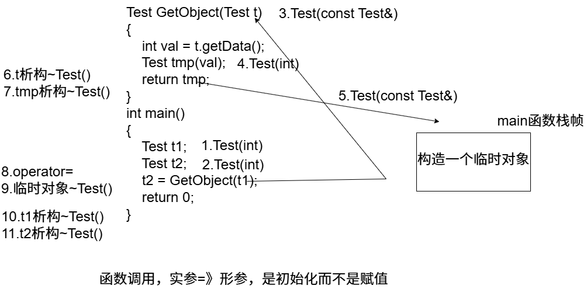
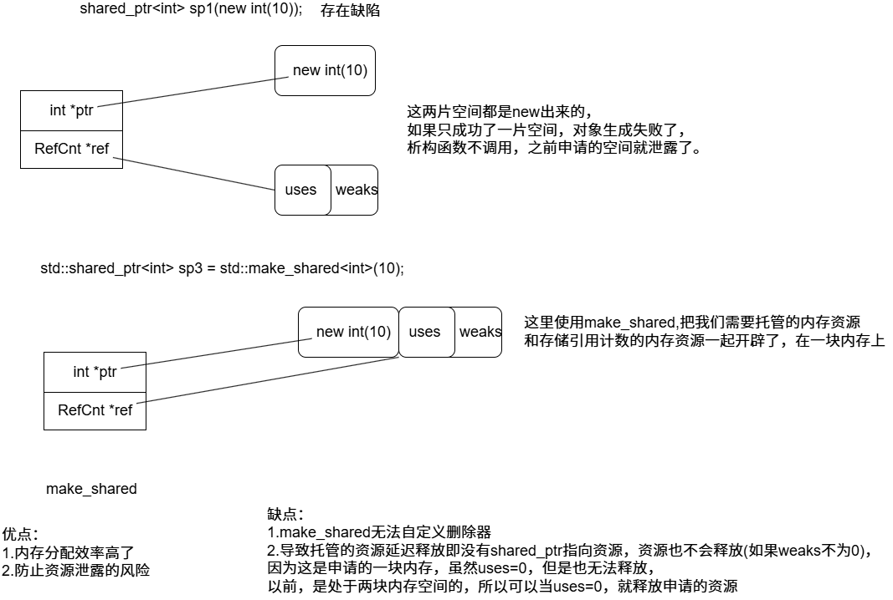

## C++对象应用优化

### 对象使用过程背后调用了那些方法？

```c++
#include <iostream>
class Test
{
public:
    Test(int a = 5, int b = 5) :ma(a), mb(b)
    {
        std::cout << "Test(int,int)" << std::endl;
    }
    ~Test()
    {
        std::cout << "~Test()" << std::endl;
    }
    Test(const Test& t) :ma(t.ma),mb(t.mb) { std::cout << "Test(const Test&)" << std::endl; }
    void operator=(const Test& t)
    {
        std::cout << " operator=" << std::endl;
        ma = t.ma;
        mb = t.mb;
    }
private:
    int ma;
    int mb;
};
Test t1(10, 10);//1.Test(int,int)
int main()
{
    Test t2(20, 20);//3.Test(int,int)
    Test t3 = t2;//4.Test(const Test&)
    static Test t4 = Test(30, 30);//5.Test(int,int)
    t2 = Test(40, 40);//6.Test(int,int) operator= ~Test()
    //逗号表达式 (50,50)=50
    t2 = (Test)(50, 50);//=>Test(50) 7.Test(int,int) operator= ~Test()
    t2 = 60;//8.Test(int,int) operator= ~Test()
    Test* p1 = new Test(70, 70);//9.Test(int,int)
    Test* p2 = new Test[2];//10.Test(int,int) Test(int,int)
    //Test* p3 = &Test(80,80);
    const Test& p4 = Test(90, 90);//11 Test(int,int) 生命周期延长
    delete p1;//12.~Test()
    delete[] p2;//13 ~Test() ~Test()
    return 0;
}
Test t5(100, 100);//2.Test(int,int)
#if 0
class Test
{
public:
    Test(int a = 10) :ma(a)
    {
        std::cout << "Test()" << std::endl;
    }
    ~Test()
    {
        std::cout << "~Test()" << std::endl;
    }
    Test(const Test& t) :ma(t.ma) { std::cout << "Test(const Test&)" << std::endl; }
    Test& operator=(const Test& t)
    {
        std::cout << " operator=" << std::endl;
        ma = t.ma;
        return *this;
    }
private:
    int ma;

};

int main()
{
    Test t1;
    Test t2(t1);
    Test t3 = t1;
    //Test(20) 显式生成临时对象 生存周期：所在的语句
    /*
    C++编译器对于对象构造的优化：用临时对象生成新对象的时候，临时对象就不产生了，直接构造新对象就可以了
    */
    Test t4 = Test(20);//Test t4(20);没有区别

    std::cout << "-----------------------" << std::endl;
    t4 = t2;
    //t4.operator=(const Test &t)
    //显式生成临时对象
    t4 = Test(30);
    t4 = (Test)30;//int ->Test(int) 显式转换，但是得有Test(int)这种类型的构造函数才可以转
    //隐式生成临时对象
    t4 = 30;//int ->Test(int) 隐式转换，但是得有Test(int)这种类型的构造函数才可以转
    std::cout << "-----------------------" << std::endl;
    //const Test* p = &Test(40);
    //语句结束，p指向的是一个已经析构的临时对象,所以指针指向临时对象是不安全的
    const Test& ref = Test(50);
    //按道理说，这句结束，Test要析构了，但是这个临时对象有名字了，所以延长了生命周期
    std::cout << "-----------------------" << std::endl;
    return 0;
}
#endif
```

```c++
对象的构造函数，拷贝构造，析构函数调用过程
临时对象
```

### 函数调用过程中背后调用的方法



```c++
#include <iostream>

class Test
{
public:
    Test(int data = 10):ma(data)
    {
        std::cout << "Test(int)" << std::endl;
    }
    ~Test()
    {
        std::cout << "~Test()" << std::endl;
    }
    Test(const Test& t) :ma(t.ma)
    {
        std::cout << "Test(const Test&)" << std::endl;
    }
    void operator=(const Test& t)
    {
        std::cout << "operator=" << std::endl;
        ma = t.ma;
    }
    int getData()const
    {
        return ma;
    }
private:
    int ma;
};
//不能返回局部的或者临时对象的指针或者引用
Test GetObject(Test t)
{
    int val = t.getData();
    Test tmp(val);
    return tmp;
}
int main()
{
    Test t1;
    Test t2;
    t2 = GetObject(t1);
    return 0;
}
```

```c++
Test(int)
Test(int)
Test(const Test&)
Test(int)
~Test()
operator=
~Test()
~Test()
~Test()
这里看出函数调用背后方法有点多，要优化
```

### 三条对象优化的原则

```c++
#include <iostream>

class Test
{
public:
    Test(int data = 10) :ma(data)
    {
        std::cout << "Test(int)" << std::endl;
    }
    ~Test()
    {
        std::cout << "~Test()" << std::endl;
    }
    Test(const Test& t) :ma(t.ma)
    {
        std::cout << "Test(const Test&)" << std::endl;
    }
    void operator=(const Test& t)
    {
        std::cout << "operator=" << std::endl;
        ma = t.ma;
    }
    int getData()const
    {
        return ma;
    }
private:
    int ma;
};
//不能返回局部的或者临时对象的指针或者引用

/*
1.函数参数传递过程中，对象优先按引用传递，不要按值传递
2.函数返回对象的时候，应该优先返回一个临时对象，而不要返回一个定义过的对象
3.接收返回值是对象的函数调用的时候，优先按初始化的方式接收，不要按赋值的方式接收。
*/
Test GetObject(Test &t)
{
    int val = t.getData();
    /*Test tmp(val);
    return tmp;*/
    //返回临时对象
    return Test(val);
}
int main()
{
    Test t1;
    Test t2 = GetObject(t1);
    //t2 = GetObject(t1);
    return 0;
}
```

```c++
Test(int)
Test(int)
~Test()
~Test()
```

### 右值引用参数的成员方法

```c++
#include <iostream>

class String
{
public:
    String(const char* str = nullptr)//普通构造函数
    {
        if (str != nullptr)
        {
            //strlen计算字符串长度时，是不计入'\0'的
            m_data = new char[strlen(str) + 1];
            strcpy(this->m_data, str);
        }
        else
        {
            //这里不能直接把m_data赋值为nullptr，如果这里赋值
            //后面的构造函数都要判断地址为空的条件。
            m_data = new char[1];
            *m_data = '\0';
        }
        std::cout << "String(const char *)" << std::endl;

    }
    String(const String& other)//拷贝构造函数
    {
        m_data = new char[strlen(other.m_data) + 1];
        strcpy(m_data, other.m_data);
        std::cout << "String(const String&)" << std::endl;
    }
    ~String(void)//析构函数
    {
        delete[]m_data;
        m_data = nullptr;
        std::cout << "~String()" << std::endl;
    }
    String& operator = (const String& other)//赋值重载函数
    {
        std::cout << "String& operator=(const String&)" << std::endl;
        //防止自赋值
        if (this == &other)
        {
            return *this;
        }
        delete[]m_data;
        m_data = new char[strlen(other.m_data) + 1];
        strcpy(m_data, other.m_data);
        return *this;
    }
    const char* c_str()const
    {
        return m_data;
    }
private:
    char* m_data;//用于保存字符串
    friend String operator+(const String& lhs, const String& rhs);
};
String GetString(String& str)
{
    const char* pstr = str.c_str();
    String tmp(pstr);
    return tmp;
}
int main()
{
    String str1("aaaaaaaaaaaaaa");
    String str2;
    str2 = GetString(str1);
    std::cout << str2.c_str() << std::endl;
    /*
    C++17之前
    String(const char *)
    String(const char *)
    String(const char *)
    String(const String&) =>tmp拷贝构造main函数栈帧上的临时对象
    ~String()
    String& operator=(const String&)=》main函数栈帧上的临时对象给str2赋值
    ~String()
    aaaaaaaaaaaaaa
    ~String()
    ~String()
    */
    return 0;
}
```

```c++
str2 = GetString(str1);
这里需要解决的是当返回值是String,如何优化其中的临时对象，老是创建对象，如果还有申请别的空间，是很耗费效率的。所以我们应该利用临时对象，节省资源。下一节，使用右值引用解决问题
String(const char *)
String(const String&) =>tmp拷贝构造main函数栈帧上的临时对象
~String()
String& operator=(const String&)=》main函数栈帧上的临时对象给str2赋值
~String()
所以在C++17之后进行了强制优化，叫做
    RVO(返回值优化)：在函数返回一个临时对象时，编译器可以直接在调用者的栈帧上构造这个返回值，而不在函数内部再创建一个临时对象。
所以这是在C++17之后的效果：所以是直接在main函数上栈帧完成构造，所以就没有拷贝函数出现
String(const char *)
String(const char *)
String(const char *)
String& operator=(const String&)
~String()
aaaaaaaaaaaaaa
~String()
~String()
这里还是会构造一个临时对象，因为str2存在，所以在main函数上构造了，所以会产生一个临时对象
如果
String str2 = GetString(str1);
结果就大不一样了，这句会直接在str2上构造
String(const char *)
String(const char *)
aaaaaaaaaaaaaa
~String()
~String()
这样就不会有临时对象了。
```

| 写法                             | 会发生什么                                                   | 调用情况           |
| -------------------------------- | ------------------------------------------------------------ | ------------------ |
| `str2 = GetString(str1);`        | 返回值临时对象 → `operator=` 赋值给已有的 `str2` → 临时对象析构 | 构造 + 赋值 + 析构 |
| `String str2 = GetString(str1);` | 返回值直接在 `str2` 上构造（RVO）                            | 只有一次构造       |

### 使用带右值引用参数的赋值重载函数解决临时对象的使用

```c++
#include <iostream>

class String
{
public:
    String(const char* str = nullptr)//普通构造函数
    {
        if (str != nullptr)
        {
            //strlen计算字符串长度时，是不计入'\0'的
            m_data = new char[strlen(str) + 1];
            strcpy(this->m_data, str);
        }
        else
        {
            //这里不能直接把m_data赋值为nullptr，如果这里赋值
            //后面的构造函数都要判断地址为空的条件。
            m_data = new char[1];
            *m_data = '\0';
        }
        std::cout << "String(const char *)" << std::endl;

    }
    //带左值引用参数的拷贝构造
    String(const String& other)//拷贝构造函数
    {
        m_data = new char[strlen(other.m_data) + 1];
        strcpy(m_data, other.m_data);
        std::cout << "String(const String&)" << std::endl;
    }
    //带右值引用参数的拷贝构造
    String(String&& other)//拷贝构造函数
    {
        std::cout << "String(String&&)" << std::endl;
        m_data = other.m_data;
        other.m_data = nullptr;
    }
    ~String(void)//析构函数
    {
        delete[]m_data;
        m_data = nullptr;
        std::cout << "~String()" << std::endl;
    }
    //带左值引用参数的赋值重载函数
    String& operator = (const String& other)//赋值重载函数
    {
        std::cout << "String& operator=(const String&)" << std::endl;
        //防止自赋值
        if (this == &other)
        {
            return *this;
        }
        delete[]m_data;
        m_data = new char[strlen(other.m_data) + 1];
        strcpy(m_data, other.m_data);
        return *this;
    }
    //带右值引用参数的赋值重载函数
    String& operator = (String&& other)//赋值重载函数
    {
        std::cout << "String& operator=(String&&)" << std::endl;
        //防止自赋值
        if (this == &other)
        {
            return *this;
        }
        delete[]m_data;
        m_data = other.m_data;
        other.m_data = nullptr;
        return *this;
    }
    const char* c_str()const
    {
        return m_data;
    }
private:
    char* m_data;//用于保存字符串
    friend String operator+(const String& lhs, const String& rhs);
};
String GetString(String& str)
{
    const char* pstr = str.c_str();
    String tmp(pstr);
    return tmp;
}
#if 0
int main()
{
    //右值引用
    int a = 10;
    int& b = a;//左值：有内存，有名字 右值：没名字(临时量)、没内存
    //int&& c = a;//无法将左值绑定到右值引用上
    //int& c = 20;//不能用左值引用绑定一个右值
    const int& c = 20;
    int&& d= 20;//可以把一个右值绑定到一个右值引用上
    /*
    const int& c = 20;
    int&& d= 20;
    这两的区别一个可以修改，一个不可以，c不可以，d可以
    */
    String&& e = String("aaa");//=》这是个临时量，所以是个右值

    int& f = d;//一个右值引用变量，本身是一个左值
    return 0;
}
#endif
int main()
{
    String str1("aaaaaaaaaaaaaa");
    String str2;
    str2 = GetString(str1);
    std::cout << str2.c_str() << std::endl;
    return 0;
    /*
    C++17以前
    String(const char *)
    String(const char *)
    String(const char *)
    String(String&&)
    ~String()
    String& operator=(String&&)
    ~String()
    aaaaaaaaaaaaaa
    ~String()
    ~String()
    */
}
```

```c++
我们使用带有右值引用的拷贝构造和赋值重载函数，解决临时对象的使用问题
str2 = GetString(str1);
如果没有重载带右值引用的函数，编译器会使用带左值引用的函数。
//带右值引用参数的拷贝构造
    String(String&& other)//拷贝构造函数
    {
        std::cout << "String(String&&)" << std::endl;
        m_data = other.m_data;
        other.m_data = nullptr;
    }
//带右值引用参数的赋值重载函数
    String& operator = (String&& other)//赋值重载函数
    {
        std::cout << "String& operator=(String&&)" << std::endl;
        //防止自赋值
        if (this == &other)
        {
            return *this;
        }
        delete[]m_data;
        m_data = other.m_data;
        other.m_data = nullptr;
        return *this;
    }
这里重载就是为了把临时对象的资源弄到手，不用先申请赋值后再释放后，太浪费资源。
但是这里使用后，并没有调用带右值引用参数的拷贝构造
String(const char *)
String(const char *)
String(const char *)
String& operator=(String&&)
~String()
aaaaaaaaaaaaaa
~String()
~String()
C++17之后引入RVO(返回值优化),所以没有拷贝调用出现
```

### 自定义对象在vector容器上的应用

```c++
#include <iostream>
#include <vector>
class String
{
public:
    String(const char* str = nullptr)//普通构造函数
    {
        if (str != nullptr)
        {
            //strlen计算字符串长度时，是不计入'\0'的
            m_data = new char[strlen(str) + 1];
            strcpy(this->m_data, str);
        }
        else
        {
            //这里不能直接把m_data赋值为nullptr，如果这里赋值
            //后面的构造函数都要判断地址为空的条件。
            m_data = new char[1];
            *m_data = '\0';
        }
        std::cout << "String(const char *)" << std::endl;

    }
    //带左值引用参数的拷贝构造
    String(const String& other)//拷贝构造函数
    {
        m_data = new char[strlen(other.m_data) + 1];
        strcpy(m_data, other.m_data);
        std::cout << "String(const String&)" << std::endl;
    }
    //带右值引用参数的拷贝构造
    String(String&& other)//拷贝构造函数
    {
        std::cout << "String(String&&)" << std::endl;
        m_data = other.m_data;
        other.m_data = nullptr;
    }
    ~String(void)//析构函数
    {
        delete[]m_data;
        m_data = nullptr;
        std::cout << "~String()" << std::endl;
    }
    //带左值引用参数的赋值重载函数
    String& operator = (const String& other)//赋值重载函数
    {
        std::cout << "String& operator=(const String&)" << std::endl;
        //防止自赋值
        if (this == &other)
        {
            return *this;
        }
        delete[]m_data;
        m_data = new char[strlen(other.m_data) + 1];
        strcpy(m_data, other.m_data);
        return *this;
    }
    //带右值引用参数的赋值重载函数
    String& operator = (String&& other)//赋值重载函数
    {
        std::cout << "String& operator=(String&&)" << std::endl;
        //防止自赋值
        if (this == &other)
        {
            return *this;
        }
        delete[]m_data;
        m_data = other.m_data;
        other.m_data = nullptr;
        return *this;
    }
    const char* c_str()const
    {
        return m_data;
    }
private:
    char* m_data;//用于保存字符串
    friend String operator+(const String& lhs, const String& rhs);
    friend std::ostream& operator<<(std::ostream& out, const String& str);
};
String GetString(String& str)
{
    const char* pstr = str.c_str();
    String tmp(pstr);
    return tmp;
}
String operator+(const String& lhs, const String& rhs)
{
    /*char* ptmp = new char[strlen(lhs.m_data) + strlen(rhs.m_data) + 1];
    //这里需要释放，所以不能直接返回
    strcpy(ptmp, lhs.m_data);
    strcat(ptmp, rhs.m_data);
    String tmpstr(ptmp);
    delete[]ptmp;
    //return String(ptmp);
    return tmpstr;
    */
    //虽然上面这么写，已经很行了，但是还要优化
    String tmpStr;
    tmpStr.m_data= new char[strlen(lhs.m_data) + strlen(rhs.m_data) + 1];
    strcpy(tmpStr.m_data, lhs.m_data);
    strcat(tmpStr.m_data, rhs.m_data);
    return tmpStr;
}
std::ostream& operator<<(std::ostream& out, const String& str)
{
    out << str.m_data;
    return out;
}
int main()
{
    /*
    String str1 = "hello";
    String str2 = "world";
    std::cout << "-------------------------------------------------"<<std::endl;
    String str3 = str1 + str2;
    std::cout << "-------------------------------------------------" << std::endl;
    std::cout << str3 << std::endl;
    return 0;
    */
    /*
    String(const char *)
    String(const char *)
    -------------------------------------------------
    String(const char *)
    -------------------------------------------------
    helloworld
    ~String()
    ~String()
    ~String()
    */
    

    String str1 = "aaa";
    std::vector<String> vec;
    vec.reserve(10);
    std::cout << "-------------------------------------------------" << std::endl;
    vec.push_back(str1);
    vec.push_back(String("bbb"));
    std::cout << "-------------------------------------------------" << std::endl;
    /*
    String(const char *)
    -------------------------------------------------
    String(const String&)
    String(const char *)
    String(String&&)
    ~String()
    -------------------------------------------------
    ~String()
    ~String()
    ~String()
    */
}
```

### move和forward

```c++
#include <iostream>
class String
{
public:
    String(const char* str = nullptr)//普通构造函数
    {
        if (str != nullptr)
        {
            //strlen计算字符串长度时，是不计入'\0'的
            m_data = new char[strlen(str) + 1];
            strcpy(this->m_data, str);
        }
        else
        {
            //这里不能直接把m_data赋值为nullptr，如果这里赋值
            //后面的构造函数都要判断地址为空的条件。
            m_data = new char[1];
            *m_data = '\0';
        }
        std::cout << "String(const char *)" << std::endl;

    }
    //带左值引用参数的拷贝构造
    String(const String& other)//拷贝构造函数
    {
        m_data = new char[strlen(other.m_data) + 1];
        strcpy(m_data, other.m_data);
        std::cout << "String(const String&)" << std::endl;
    }
    //带右值引用参数的拷贝构造
    String(String&& other)//拷贝构造函数
    {
        std::cout << "String(String&&)" << std::endl;
        m_data = other.m_data;
        other.m_data = nullptr;
    }
    ~String(void)//析构函数
    {
        delete[]m_data;
        m_data = nullptr;
        std::cout << "~String()" << std::endl;
    }
    //带左值引用参数的赋值重载函数
    String& operator = (const String& other)//赋值重载函数
    {
        std::cout << "String& operator=(const String&)" << std::endl;
        //防止自赋值
        if (this == &other)
        {
            return *this;
        }
        delete[]m_data;
        m_data = new char[strlen(other.m_data) + 1];
        strcpy(m_data, other.m_data);
        return *this;
    }
    //带右值引用参数的赋值重载函数
    String& operator = (String&& other)//赋值重载函数
    {
        std::cout << "String& operator=(String&&)" << std::endl;
        //防止自赋值
        if (this == &other)
        {
            return *this;
        }
        delete[]m_data;
        m_data = other.m_data;
        other.m_data = nullptr;
        return *this;
    }
    const char* c_str()const
    {
        return m_data;
    }
private:
    char* m_data;//用于保存字符串
    friend String operator+(const String& lhs, const String& rhs);
    friend std::ostream& operator<<(std::ostream& out, const String& str);
};
String GetString(String& str)
{
    const char* pstr = str.c_str();
    String tmp(pstr);
    return tmp;
}
String operator+(const String& lhs, const String& rhs)
{
    /*char* ptmp = new char[strlen(lhs.m_data) + strlen(rhs.m_data) + 1];
    //这里需要释放，所以不能直接返回
    strcpy(ptmp, lhs.m_data);
    strcat(ptmp, rhs.m_data);
    String tmpstr(ptmp);
    delete[]ptmp;
    //return String(ptmp);
    return tmpstr;
    */
    //虽然上面这么写，已经很行了，但是还要优化
    String tmpStr;
    tmpStr.m_data = new char[strlen(lhs.m_data) + strlen(rhs.m_data) + 1];
    strcpy(tmpStr.m_data, lhs.m_data);
    strcat(tmpStr.m_data, rhs.m_data);
    return tmpStr;
}
std::ostream& operator<<(std::ostream& out, const String& str)
{
    out << str.m_data;
    return out;
}
template<typename T>
struct Allocator
{
    T* allocate(size_t size)//负责内存开辟
    {
        return (T*)malloc(sizeof(T) * size);
    }
    void deallocate(void* p)//负责内存释放
    {
        free(p);
    }
    /*
    void construct(T* p, const T& val)//负责对象构造
    {
        new (p) T(val);//定位new:在指定地址去构造值为val的对象
    }
    void construct(T* p, T&& val)//负责对象构造
    {
        new (p) T(std::move(val));//定位new:在指定地址去构造值为val的对象
    }
    */
    template<typename Ty>
    void construct(T* p, Ty&& val)//负责对象构造
    {
        new (p) T(std::forward<Ty>(val));//定位new:在指定地址去构造值为val的对象
    }
    void destroy(T* p)//负责对象析构
    {
        p->~T(); //~T()代表T类型的析构函数
    }
};
/*
容器底层内存开辟，内存释放，对象构造和析构，都通过allocator空间配置器来实现
*/
template<typename T, typename Alloc = Allocator<T>>
class vector
{
public:
    vector(int size = 10)
    {
        //需要把内存开辟和对象构造分开处理，不然我使用vector<Test> vec;
        //自动创建10个Test对象
        //_first = new T[size];
        _first = _allocator.allocate(size);
        _last = _first;
        _end = _first + size;
    }
    ~vector()
    {
        //析构容器有效的元素，然后释放_first指针指向的堆内存
        //delete[]_first;
        for (T* p = _first;p != _last;p++)
        {
            _allocator.destroy(p);//把_first指针指向的数组的有效元素进行析构操作
        }
        _allocator.deallocate(_first);//释放堆上的数组内存
        _first = _last = _end = nullptr;
    }
    vector(const vector<T>& rhs)
    {
        int size = rhs._end - rhs._first;
        //_first = new T[size];
        _first = _allocator.allocate(size);
        int len = rhs._last - rhs._first;
        for (int i = 0;i < len;i++)
        {
            //_first[i] = rhs._first[i];
            _allocator.construct(_first + i.rhs._first[i]);
        }
        _last = _first + len;
        _end = _first + size;
    }
    vector<T>& operator=(const vector<T>& rhs)
    {
        if (this == &rhs)
        {
            return *this;
        }
        //delete[]_first;
        for (T* p = _first;p != _last;p++)
        {
            _allocator.destroy(p);//把_first指针指向的数组的有效元素进行析构操作
        }
        _allocator.deallocate(_first);//释放堆上的数组内存
        int size = rhs._end - rhs._first;
        //_first = new T[size];
        _first = _allocator.allocate(size);
        int len = rhs._last - rhs._first;
        for (int i = 0;i < len;i++)
        {
            //_first[i] = rhs._first[i];
            _allocator.construct(_first + i.rhs._first[i]);
        }
        _last = _first + len;
        _end = _first + size;
        return *this;
    }
    void pop_back()//从容器末尾删除元素
    {
        if (empty())
            return;
        //--_last;
        //不仅要把_last指针--，还要析构删除的元素
        --_last;
        _allocator.destroy(_last);
    }
    T back() const//返回容器末尾的元素值
    {
        return *(_last - 1);
    }
    bool full() const
    {
        return _last == _end;
    }
    bool empty() const
    {
        return _first == _last;
    }
    int size() const
    {
        return _last - _first;
    }
    /*
    //接收左值
    void push_back(const T& val)//向容器末尾添加元素
    {
        if (full())
            expand();
        //*_last++ = val;
        //_last指针指向的内存构造一个值为val的对象
        _allocator.construct(_last, val);
        _last++;
    }
    //接收右值
    void push_back(T&& val)//一个右值引用变量本身是一个左值，所以调用construct是使用左值的construct
    {
        if (full())
            expand();
        _allocator.construct(_last, std::move(val));
        _last++;
    }
    */
    template<typename Ty> //函数模板的类型推演 + 引用折叠，就可以实现一个函数相当于两个函数
    void push_back(Ty&& val) //Ty String && + & =String& 引用折叠
    {
        if (full())
            expand();
        //move:移动语义，得到右值类型
        //std::forward<Ty>：类型的完美转发，能够识别左值和右值类型，并以对应的类型转发
        _allocator.construct(_last, std::forward<Ty>(val));
        _last++;
    }
private:
    T* _first;//指向数组起始的位置
    T* _last;//指向数组中有效元素的后继位置
    T* _end;//指向数组空间的后继位置
    Alloc _allocator;//定义容器的空间配置器对象
    void expand()//容器的二倍扩容
    {
        int size = _end - _first;
        //T* ptmp = new T[2 * size];
        T* ptmp = _allocator.allocate(2 * size);
        for (int i = 0;i < size;i++)
        {
            //ptmp[i] = _first[i];
            _allocator.construct(ptmp + i, _first[i]);
        }
        //delete[]_first;
        for (T* p = _first;p != _last;p++)
        {
            _allocator.destroy(p);
        }
        _allocator.deallocate(_first);
        _first = ptmp;
        _last = _first + size;
        _end = _first + 2 * size;
    }
};
int main()
{
    String str1 = "aaa";
    vector<String> vec;
    std::cout << "-------------------------------------------------" << std::endl;
    vec.push_back(str1);
    vec.push_back(String("bbb"));
    std::cout << "-------------------------------------------------" << std::endl;
}
```

```c++
template<typename Ty>
    void construct(T* p, Ty&& val)//负责对象构造
    {
        new (p) T(std::forward<Ty>(val));//定位new:在指定地址去构造值为val的对象
    }
    void destroy(T* p)//负责对象析构
    {
        p->~T(); //~T()代表T类型的析构函数
    }
 template<typename Ty> //函数模板的类型推演 + 引用折叠，就可以实现一个函数相当于两个函数
    void push_back(Ty&& val) //Ty String && + & =String& 引用折叠
    {
        if (full())
            expand();
        //move:移动语义，得到右值类型
        //std::forward<Ty>：类型的完美转发，能够识别左值和右值类型，并以对应的类型转发
        _allocator.construct(_last, std::forward<Ty>(val));
        _last++;
    }
这两段代码的重写
```

## 智能指针

### 基础介绍

```c++
#include <iostream>

//智能指针 保证能做到资源的自动释放
//利用栈上的对象出作用域自动析构的特征，来做到资源的自动释放
//智能指针不能使其构造在堆上 CSmartPtr<int> *p=new CSmartPtr<int>(new int); delete p;这样就浪费了智能指针的意义
template<typename T>
class CSmartPtr
{
public:
    CSmartPtr(T* ptr = nullptr)
        :mptr(ptr) {}
    ~CSmartPtr()
    {
        delete mptr;
    }
    T& operator*()
    {
        return *mptr;
    }
    T* operator->()
    {
        return mptr;
    }
private:
    T* mptr;
};
int main()
{
    /*int* p = new int(10);
    *p = 30;
    delete p;*/
    CSmartPtr<int> ptr(new int);
    *ptr = 20;
    class Test
    {
    public:
        void test()
        {
            std::cout << "call Test::test" << std::endl;
        }
    };
    CSmartPtr<Test> ptr2(new Test());
    //(ptr2.operator->())->test();
    ptr2->test();
    return 0;
}
```

### 不带引用计数的智能指针

```c++
#include <iostream>
#include<memory>
template<typename T>
class CSmartPtr
{
public:
    CSmartPtr(T* ptr = nullptr)
        :mptr(ptr) {}
    CSmartPtr(const CSmartPtr<T>& src)
    {
        //mptr = new T(*src.mptr);
    }
    ~CSmartPtr()
    {
        delete mptr;
        mptr=nullptr;
    }
    T& operator*()
    {
        return *mptr;
    }
    T* operator->()
    {
        return mptr;
    }
private:
    T* mptr;
};
int main()
{
    /*
    不带引用计数的智能指针：本身只会让一个智能指针管理资源
    auto_ptr:C++库里面
    C++11:
    scoped_ptr
    scoped_ptr(const scope_ptr<T>&)=dekete;
    scope_ptr<T> & operator=(const scope_ptr<T>&)=delete;
    直接禁用对应拷贝和赋值，就不会发生之前auto_ptr的问题
    推荐使用：
    unique_ptr
    unique_ptr(const unique_ptr<T>&)=dekete;
    unique_ptr<T> & operator=(const unique_ptr<T>&)=delete;
    和scope_ptr不同的是，提供了带右值引用的赋值和拷贝
    unique_ptr(const unique_ptr<T>&&);
    unique_ptr<T> & operator=(const unique_ptr<T>&&);

    怎么解决浅拷贝问题？不解决，会出现double free
    */
    //CSmartPtr<int> p1(new int);
    //CSmartPtr<int> p2(p1);
    /*
    std::auto_ptr<int> ptr1(new int);
    std::auto_ptr<int> ptr2(new int);
    *ptr2 = 20;
    std::cout << *ptr1 << std::endl;
    */
    //auto_ptr是保证最后一个使用智能指针的可以使用，前面使用的底层地址全部置空，来解决浅拷贝问题。
    //不推荐使用auto_ptr，如果把auto_ptr放在容器当中，只要有拷贝构造调用，就会把前一个置为空，这样是很危险的，
    //vector<auto_ptr<int>> vec1;vec2(vec1);

    std::unique_ptr<int> p1(new int);
    std::unique_ptr<int> p2(std::move(p1));//显式调用std::move，不会出现auto_ptr可能无意识就调用了
    return 0;
}
```

### 实现带引用计数的智能指针

```c++
#include <iostream>
#include <memory>


//对资源进行引用计数的类
template<typename T>
class RefCnt
{
public:
    RefCnt(T* ptr = nullptr)
        :mptr(ptr)
    {
        if (mptr != nullptr)
            mcount = 1;
    }
    void addRef()//增加资源的引用计数
    {
        mcount++;
    }
    int delRef()
    {
        return --mcount;
    }
private:
    T* mptr;
    int mcount;
};
template<typename T>
class CSmartPtr //shared_ptr weak_ptr都是线程安全的
{
public:
    CSmartPtr(T* ptr = nullptr)
        :mptr(ptr) 
    {
        mpRefCnf = new RefCnt<T>(mptr);
    }
    CSmartPtr(const CSmartPtr<T>& src)
        :mptr(src.mptr),mpRefCnf(src.mpRefCnf)
    {
        if (mptr != nullptr)
        {
            mpRefCnf->addRef();
        }
        
    }
    CSmartPtr<T>& operator=(const CSmartPtr<T>& src)
    {
        if (this == &src)
            return *this;
        if (0 == mpRefCnf->delRef())
        {
            delete mptr;
        }
        mptr = src.mptr;
        mpRefCnf = src.mpRefCnf;
        mpRefCnf->addRef();
        return *this;
    }
    ~CSmartPtr()
    {
        if (0 == mpRefCnf->delRef())
        {
            delete mptr;
            mptr = nullptr;
        } 
    }
    T& operator*()
    {
        return *mptr;
    }
    T* operator->()
    {
        return mptr;
    }
private:
    T* mptr;//执行资源的指针
    RefCnt<T>* mpRefCnf;//指向该资源引用计数对象的指针
};
int main()
{
    /*
    带引用计数的智能指针shared_ptr和weak_ptr
    都是线程安全的
    带引用计数：多个智能指针可以管理同一个资源
    带引用计数：给每一个对象资源，匹配一个引用计数；
    智能指针 =》获取资源时 =》引用计数+1
    智能指针 =》本身指针释放=》引用计数-1
    如果最后一个使用资源的智能指针不用了，释放该资源
    */
    CSmartPtr<int> ptr1(new int);
    CSmartPtr<int> ptr2(ptr1);
    CSmartPtr<int> ptr3;
    ptr3 = ptr2;
    *ptr1 = 20;
    std::cout << *ptr2 << " " << *ptr3 << std::endl;
    return 0;
}
```

```c++
但是，我这个自定义的还不是线程安全的。
```

### shared_ptr的交叉引用问题

```c++
#include <iostream>
#include <memory>
/*
shared_ptr:强智能指针 可以改变资源的引用计数
weak_ptr:弱智能指针  不会改变资源的引用计数 它只会观察资源，不会使用，本身就没有*和->的重载函数，
所以需要把弱智能指针提升为强智能指针，才可以使用。
weak_ptr =>shared_ptr =>资源（内存）

强智能指针循环引用是什么问题？什么结果？如何解决？
造成new出来的资源无法释放,资源泄露
定义对象的地方，用强智能指针；引用对象的地方使用弱智能指针
*/
class B;
class A
{
public:
    A()
    {
        std::cout << "A()" << std::endl;
    }
    void testA() { std::cout << "非常好用的方法！" << std::endl; }
    ~A()
    {
        std::cout << "~A()" << std::endl;
    }
    std::weak_ptr<B> _ptrb;
};
class B
{
public:
    B()
    {
        std::cout << "B()" << std::endl;
    }
    void func()
    {
        //_ptra->testA();
        std::shared_ptr<A>ps = _ptra.lock();//提升方法,可能失败
        if (ps != nullptr)
        {
            ps->testA();
        }
    }
    ~B()
    {
        std::cout << "~B()" << std::endl;
    }
    std::weak_ptr<A> _ptra;
};
int main()
{
    std::shared_ptr<A> pa(new A());
    std::shared_ptr<B> pb(new B());
    pa->_ptrb = pb;
    pb->_ptra = pa;
    std::cout << pa.use_count() << std::endl;
    std::cout << pb.use_count() << std::endl;
    pb->func();

    return 0;
}
```

### 建议用make_shared代替shared_ptr



```c++
#include <iostream>
#include <memory>
class Test
{};
int main()
{
    std::shared_ptr<int> sp1(new int(10));
    std::shared_ptr<Test> sp2(new Test());
    //std::shared_ptr<int> sp3 = std::make_shared<int>(10);
    auto sp3 = std::make_shared<int>(10);
    *sp3 = 20;
    std::cout << *sp3 << std::endl;
}
```

### 多线程访问共享对象的线程安全问题

```c++
#include <iostream>
#include <thread>
#include <memory>
/*
多线程访问共享对象的线程安全问题
*/
class A
{
public:
    A()
    {
        std::cout << "A()" << std::endl;
    }
    void testA() { std::cout << "非常好用的方法！" << std::endl; }
    ~A()
    {
        std::cout << "~A()" << std::endl;
    }
};
//子线程
void handler01(std::weak_ptr<A> pw)
{
    
    //q访问A对象的时候，需要侦测A对象是否存活
    std::shared_ptr<A> sp = pw.lock();
    if (sp != nullptr)
    {
        sp->testA();
    }
    else
    {
        std::cout << "A对象已经析构，不能在访问" << std::endl;
    }
}
//main线程
int main()
{
    {
        std::shared_ptr<A> p(new A());
        std::thread t1(handler01, std::weak_ptr<A>(p));
        t1.detach();
        std::this_thread::sleep_for(std::chrono::seconds(2));
    }
    std::this_thread::sleep_for(std::chrono::seconds(20));
    //阻塞等待子线程结束
    //t1.join();
    return 0;
}
```

### 自定义删除器

```c++
#include <iostream>
#include <memory>
#include <functional>
/*
智能指针的删除器 deletor
智能指针：能够保证资源绝对的释放 除了堆上的，文件资源等可以通过自定义删除器,因为底层的删除器是delete ptr;
所以可以根据实际情况，自定义删除器，满足析构要求
*/
//unique_ptr shared_ptr
/*
~unique_ptr(){是一个函数对象的调用 deletor(ptr);}

template <typename T>
class default_delete
{
public:
    void operator()(T *ptr)
    {
        delete ptr;
    }
};
*/
template<typename T>
class MyDeletor
{
public:
    void operator()(T* ptr)const
    {
        std::cout << "call MyDeletor.operator()" << std::endl;
        delete[]ptr;
    }
};
template<typename T>
class MyFILEDeletor
{
public:
    void operator()(T* ptr)const
    {
        std::cout << "call MyFILEDeletor.operator()" << std::endl;
        fclose(ptr);
    }
};
int main()
{
    //std::unique_ptr<int,MyDeletor<int>> ptr1(new int[100]);    //delete []ptr;
    //std::unique_ptr<FILE, MyFILEDeletor<FILE>> ptr2(fopen("data.txt","w"));

    //但是每一次都要自定义，太麻烦了，用一次就没用了，所以可以使用lambda表达式来实现，更方便
    //lambda表达式 -》函数对象 function
    std::unique_ptr<int, std::function<void(int*)>> ptr1(new int[100],
        [](int* p)->void {
            std::cout << "call lambda release new int [100]" << std::endl;
            delete[]p;
        });
    std::unique_ptr<FILE, std::function<void(FILE*)>> ptr2(fopen("data.txt", "w"),
        [](FILE* p)->void {
            std::cout << "call lambda release new fopen" << std::endl;
            fclose(p);
        });
    return 0;
}
```

## C++绑定器和函数对象

### bind1st和bind2nd的使用

```c++
#include <iostream>
#include <vector>
#include <functional>
#include <algorithm>
#include <ctime>
/*
* 绑定器和函数对象operator()
1.C++ STL的绑定器
bind1st:operator()的第一个形参变量绑定成一个确定的值
bind2nd:operator()的第二个形参变量绑定成一个确定的值

2.C++11从boost库中引入bind绑定器和function函数对象机制

3.lambda表达式 底层依赖函数对象的机制实现的
*/
template<typename Container>
void showContainer(Container &con)
{
    typename Container::iterator it = con.begin();
    for (;it != con.end();++it)
    {
        std::cout << *it << " ";
    }
    std::cout<<std::endl;
}
int main()
{
    std::vector<int> vec;
    srand(time(nullptr));
    for (int i = 0;i < 20;++i)
    {
        vec.push_back(rand() % 100 + 1);
    }
    showContainer(vec);
    sort(vec.begin(), vec.end());//默认升序
    showContainer(vec);
    //std::greater<int> 二元函数对象
    sort(vec.begin(), vec.end(),std::greater<int>());//降序
    showContainer(vec);

    //把70按顺序插入到vec容器当中 找第一个小于70的数字
    //需要一个一元函数对象
    //绑定器+二元函数对象 =》一元函数对象

    auto it=find_if(vec.begin(), vec.end(), std::bind1st(std::greater<int>(), 70));
    if (it != vec.end())
    {
        vec.insert(it, 70);
    }
    showContainer(vec);
    return 0;
}
```

### 实现find_if和bind1st

```c++
#include<iostream>
#include <vector>
#include <algorithm>
#include <ctime>
#include <functional>
template<typename Container>
void showContainer(Container& con)
{
    typename Container::iterator it = con.begin();
    for (;it != con.end();++it)
    {
        std::cout << *it << " ";
    }
    std::cout << std::endl;
}

template<typename Iterator,typename Compare>
Iterator my_find_if(Iterator first, Iterator last, Compare comp)
{
    for (;first != last;++first)
    {
        if (comp(*first))
        {
            return first;
        }
    }
    return last;
}
template<typename Compare, typename T>
class _mybind1st //绑定器是函数对象的一个应用
{
public:
    _mybind1st(Compare comp, T val)
        :_comp(comp), _val(val)
    {}
    bool operator()(const T& second)
    {
        return _comp(_val, second);
    }
private:
    Compare _comp;
    T _val;
};

template<typename Compare,typename T>
_mybind1st<Compare, T> mybind1st(Compare comp, const T& val)
{
    //直接使用函数模板，好处是，可以进行类型的推演
    return _mybind1st<Compare, T>(comp, val);
}
int main()
{
    std::vector<int> vec;
    srand(time(nullptr));
    for (int i = 0;i < 20;++i)
    {
        vec.push_back(rand() % 100 + 1);
    }
    showContainer(vec);
    sort(vec.begin(), vec.end());//默认升序
    showContainer(vec);
    //std::greater<int> 二元函数对象
    sort(vec.begin(), vec.end(), std::greater<int>());//降序
    showContainer(vec);

    //把70按顺序插入到vec容器当中 找第一个小于70的数字
    //需要一个一元函数对象
    //绑定器+二元函数对象 =》一元函数对象
    //auto it = find_if(vec.begin(), vec.end(), std::bind1st(std::greater<int>(), 70));
    auto it = my_find_if(vec.begin(), vec.end(), mybind1st(std::greater<int>(), 70));
    if (it != vec.end())
    {
        vec.insert(it, 70);
    }
    showContainer(vec);
    return 0;
}
```

### bind

```c++
// 16.cpp : 此文件包含 "main" 函数。程序执行将在此处开始并结束。
//

#include <iostream>
#include <typeinfo>
#include <string>
#include <functional>
#include <vector>
#include <thread>
/*
C++ 11 bind绑定器 =》 返回的结果还是一个函数对象
*/
#if 0
void hello(std::string str)
{
    std::cout << str << std::endl;
}
int sum(int a, int b)
{
    return a + b;
}
class Test
{
public:
    int sum(int a, int b)
    {
        return a + b;
    }
};
int main()
{
    //bind()是函数模板 可以自动推演模板类型参数
    std::bind(hello, "hello bind")();
    std::cout << std::bind(sum, 10, 20)() << std::endl;
    std::cout << std::bind(&Test::sum, Test(), 20, 30)() << std::endl;
    //参数占位符 绑定器出了语句，无法继续使用保存
    std::bind(hello, std::placeholders::_1)("hello bind 2");
    std::cout << std::bind(sum, std::placeholders::_1, std::placeholders::_2)(200, 300) << std::endl;
    //此处把bind返回的绑定器就复用起来了
    std::function<void(std::string)> func1 = std::bind(hello, std::placeholders::_1);
    func1("hello china");
    func1("hello china");
    func1("hello china");
}
#endif
/*
muduo源码文件 threadpool.cc thread.cc bind function
*/
//线程类
class Thread
{
public:
    Thread(std::function<void()> func)
        :_func(func)
    {}
    std::thread start()
    {
        std::thread t(_func);
        return t;
    }
private:
    std::function<void()> _func;
};
// 线程池类
class ThreadPool
{
public:
    ThreadPool() {}
    ~ThreadPool() 
    {
        //释放Thread对象占用的堆资源
        for (int i = 0;i < _pool.size();++i)
        {
            delete _pool[i];
        }
    }
    //开启线程池
    void startPool(int size)
    {
        for (int i = 0;i < size;++i)
        {
            _pool.push_back(new Thread(std::bind(&ThreadPool::runIThread,this,i)));
        }
        for (int i = 0;i < size;++i)
        {
            _handler.push_back(_pool[i]->start());
        }
        for (std::thread& t : _handler)
        {
            t.join();
        }
    }
private:
    std::vector<Thread*> _pool;
    std::vector<std::thread> _handler;
    //把runIThread这个成员方法充当线程函数
    void runIThread(int id)
    {
        std::cout << "call runIThread! id:" << id << std::endl;

    }
};
int main()
{
    ThreadPool pool;
    pool.startPool(10);
    return 0;
}
```

### function的应用

```c++
#include <iostream>
#include <functional>
#include <ctime>
#include <string>
#include <map>
/*
C++提供的绑定器和函数对象
         bind   function
         C++ STL bind1st和bind2nd =>本身还是一个函数对象
*/

#if 0
void hello1()
{
    std::cout << "hello world!" << std::endl;
}
void hello2(std::string str)
{
    std::cout << str << std::endl;
}
int sum(int a, int b)
{
    return a + b;
}
class Test
{
public:
    //调用函数必须依赖一个对象 void (Test::*pfunc)(string)
    void hello(std::string str)
    {
        std::cout << str << std::endl;
    }
};
int main()
{
    /*
    1.用函数类型实例化function
    2.通过function调用operator()函数的时候，需要根据函数类型传入相应的参数
    */
    //从function的类模板定义处，看到希望用一个函数类型实例化function
    std::function<void()> func1 = hello1;
    func1();//func1.operator() =>hello1()

    std::function<void(std::string)> func2 = hello2;
    func2("hello2");//func2.operator()(string str)=>hello2(str)

    std::function<int(int, int)> func3 = sum;
    std::cout << func3(20, 30) << std::endl;

    std::function<int(int, int)> func4 = [](int a, int b)->int {return a + b;};
    std::cout << func4(100, 30) << std::endl;

    std::function<void(Test*, std::string)> func5 = &Test::hello;
    Test t;
    func5(&t, "call Test::hello");
}
#endif

void doShowAllBooks()
{
    std::cout << "查看所有书籍信息" << std::endl;
}
void doBorrow() { std::cout << "借书" << std::endl; }
void doBack() { std::cout << "还书" << std::endl; }
void doQueryBooks() { std::cout << "查询书籍" << std::endl; }
void doLoginOut() { std::cout << "注销" << std::endl; }
int main()
{
    int choice = 0;
    std::map<int, std::function<void()>> actionMap;
    actionMap.insert({ 1,doShowAllBooks });
    actionMap.insert({ 2,doBorrow });
    actionMap.insert({ 3,doBack });
    actionMap.insert({ 4,doQueryBooks });
    actionMap.insert({ 5,doLoginOut });
    for (;;)
    {
        std::cout << "------------------------" << std::endl;
        std::cout << "1.查看所有书籍信息" << std::endl;
        std::cout << "2.借书" << std::endl;
        std::cout << "3.还书" << std::endl;
        std::cout << "4.查询书籍" << std::endl;
        std::cout << "5.注销" << std::endl;
        std::cout << "------------------------" << std::endl;
        std::cout << "请选择：";
        std::cin >> choice;

        auto it = actionMap.find(choice);
        if (it == actionMap.end())
        {
            std::cout << "输入数字无效，重新选择！" << std::endl;
        }
        else
        {
            it->second();
        }
        /*
        switch (choice) //不好，因为这块代码无法闭合 无法做到"开闭原则"
        {
        case 1:
            break;
        case 2:
            break;
        case 3:
            break;
        case 4:
            break;
        case 5:
            break;
        default:
            break;
        }
        */
    }
}
```

### 模板的完全特例化和非完全(部分)特例化

```c++
#include <iostream>
#include<typeinfo>
/*
模板的完全特例化和非完全(部分)特例化

模板的实参推演
*/

#if 0
template<typename T>
bool compare(T a, T b)
{
    std::cout << "template compare " << std::endl;
    return a > b;
}
//特例化
template<>
bool compare<const char*>(const char* a, const char* b)
{
    std::cout << "template compare<const char*> " << std::endl;
    return strcmp(a, b) > 0;
}

int main()
{
    compare(10, 20);
    compare("aaa", "bbb");
}
#endif

#if 0
template<typename T>
class Vector
{
public:
    Vector()
    {
        std::cout << "call Vector template init" << std::endl;
    }
};
//下面这个是对char *类型提供的完全特例化版本
template<>
class Vector<char*>
{
public:
    Vector()
    {
        std::cout << "call Vector<char *> template init" << std::endl;
    }
};
//下面这个是对指针类型提供的部分特例化版本
template<typename Ty>
class Vector<Ty*>
{
public:
    Vector()
    {
        std::cout << "call Vector<Ty*> template init" << std::endl;
    }
};
//函数指针（有返回值，有两个形参变量）提供的部分特例化
template<typename R,typename A1,typename A2>
class Vector<R(*)(A1, A2)>
{
public:
    Vector()
    {
        std::cout << "call Vector<R(*)(A1, A2)> template init" << std::endl;
    }
};
//针对函数类型（有返回值，有两个形参变量）类型提供的部分特例化
template<typename R, typename A1, typename A2>
class Vector<R(A1, A2)>
{
public:
    Vector()
    {
        std::cout << "call Vector<R(A1, A2)> template init" << std::endl;
    }
};
int sum(int a, int b) { return a + b; }
int main()
{
    Vector<int> vec1;
    Vector<char *> vec2;
    Vector<int*> vec3;
    Vector<int(*)(int, int)> vec4;
    Vector<int(int, int)> vec5;//function
    //区分函数类型和函数指针类型
    typedef int(*PFUNC1)(int, int);
    PFUNC1 pfunc1 = sum;
    std::cout << pfunc1(10, 20) << std::endl;
    typedef int PFUNC2(int, int);
    PFUNC2* pfunc2 = sum;
    std::cout << pfunc2(10, 20) << std::endl;
    return 0;
    /*
    call Vector template init
    call Vector<char *> template init
    call Vector<Ty*> template init
    call Vector<R(*)(A1, A2)> template init
    call Vector<R(A1, A2)> template init
    30
    30
    */
}
#endif

//模板的实参推演

int sum(int a, int b) { return a + b; }
//T 包含所有的大的类型 那如果我要把返回值，所有形参的类型都取出来
template<typename T>
void func(T a)
{
    std::cout << typeid(T).name() << std::endl;
}

template<typename R,typename A1,typename A2>
void func2(R (*a)(A1,A2))
{
    std::cout << typeid(R).name() << std::endl;
    std::cout << typeid(A1).name() << std::endl;
    std::cout << typeid(A2).name() << std::endl;
}
class Test
{
public:
    int sum(int a, int b) { return a + b; }
};
template <typename R,typename T,typename A1,typename A2>
void func3(R(T::* a)(A1, A2))
{
    std::cout << typeid(R).name() << std::endl;
    std::cout << typeid(T).name() << std::endl;
    std::cout << typeid(A1).name() << std::endl;
    std::cout << typeid(A2).name() << std::endl;
}
int main()
{
    func(10);
    func("aaa");
    func(sum);//T int (*)(int,int)
    func2(sum);
    func(&Test::sum); //int (__cdecl Test::*)(int,int)
    func3(&Test::sum);
    /*
    int
    char const * __ptr64
    int (__cdecl*)(int,int)
    int
    int
    int
    int (__cdecl Test::*)(int,int) __ptr64
    int
    class Test
    int
    int
    */
}
```

### function的实现原理

```c++
// 18.cpp : 此文件包含 "main" 函数。程序执行将在此处开始并结束。
//

#include <iostream>
#include <typeinfo>
#include <string>
#include <functional>
/*
function函数对象类型的实现原理
*/
void hello(std::string str)
{
    std::cout << str << std::endl;
}
int sum(int a, int b)
{
    return a + b;
}
template<typename Fty>
class myfunction {};
/*
template<typename R,typename A1>
class myfunction<R(A1)>
{
public:
    //typedef R(*PFUNC)(A1);
    using PFUNC = R(*)(A1);
    myfunction(PFUNC Pfunc)
        :_pfunc(Pfunc)
    {
    }
    R operator()(A1 arg)
    {
        return _pfunc(arg);//hello(arg)
    }
private:
    PFUNC _pfunc;
};
template<typename R, typename A1,typename A2>
class myfunction<R(A1,A2)>
{
public:
    //typedef R(*PFUNC)(A1);
    using PFUNC = R(*)(A1,A2);
    myfunction(PFUNC Pfunc)
        :_pfunc(Pfunc)
    {
    }
    R operator()(A1 arg1,A2 arg2)
    {
        return _pfunc(arg1,arg2);
    }
private:
    PFUNC _pfunc;
};
*/
//利用可变参类型参数来解决上面写两个的问题
template<typename R, typename... A>
class myfunction<R(A...)>
{
public:
    //typedef R(*PFUNC)(A1);
    using PFUNC = R(*)(A...);
    myfunction(PFUNC Pfunc)
        :_pfunc(Pfunc)
    {
    }
    R operator()(A... arg)
    {
        return _pfunc(arg...);//
    }
private:
    PFUNC _pfunc;
};

int main()
{
    myfunction<void(std::string)> func1 = hello;
    func1("hello world");
    myfunction<int(int, int)>func2(sum);
    std::cout << func2(10, 20) << std::endl;
}
```

### lambda表达式的实现原理

```c++
#include <iostream>
#include <vector>
#include <algorithm>
/*
C++11 函数对象的升级版 =》lambda表达式


lambda表达式语法：
[捕获外部变量](形参列表)->返回值{操作代码};

如果lambda表达式的返回值不需要，那么"->返回值"可以省略的

[捕获外部变量]
[]:不捕获任何外部变量
[=]:以传值的方式捕获外部所有变量
[&]:以传引用的方式捕获外部的所有变量
[this]:捕获外部的this指针
[=,&a]:以传值的方式捕获外部所有变量，但是a变量以传引用的方式捕获
[a,b]:以值传递的方式捕获外部变量a和b
[a,&b]:a以值传递捕获，b以传引用的方式捕获
*/

template<typename T=void>
class TestLambda01
{
public:
    TestLambda01() {}
    void operator()()
    {
        std::cout << "hello world!" << std::endl;
    }
};
template<typename T = int>
class TestLambda02
{
public:
    TestLambda02() {}
    int operator()(int a,int b)
    {
        return a + b;
    }
};
/*
template<typename T = int>
class TestLambda03
{
public:
    TestLambda03(int a,int b):ma(a),mb(b) {}
    void operator()()const //常方法中不可以做修改，但是如果把变量加上mutable就可以
    {
        int tmp = ma;
        ma = mb;
        mb = tmp;
    }
private:
    mutable int ma;
    mutable int mb;
};
*/
template<typename T = int>
class TestLambda03
{
public:
    TestLambda03(int a, int b) :ma(a), mb(b) {}
    void operator()()const 
    {
        int tmp = ma;
        ma = mb;
        mb = tmp;
    }
private:
    int &ma;
    int &mb;
};
int main()
{
#if 0
    auto func1 = []()->void {std::cout << "hello world!" << std::endl;};
    func1();
    auto func2 = [](int a, int b)->int {return a + b;};
    std::cout << func2(20, 30) << std::endl;
    TestLambda01<> t1;
    t1();
    TestLambda02<> t2;
    std::cout << t2(20, 30) << std::endl;

    int a = 10;
    int b = 20;
    /*
    auto func3 = [a,b]()mutable //“a” : 无法在非可变 lambda 中修改通过复制捕获,这里要做声明mutable
    {
        int tmp = a;
        a = b;
        b = tmp;
    };
    func3();
    std::cout << "a:" << a << "b:" << b << std::endl;
    TestLambda03<> t3(a,b);
    t3();
    std::cout << "a:" << a << "b:" << b << std::endl;
    */
    std::cout << "========================================" << std::endl;
    auto func3 = [&a, &b]() 
    {
        int tmp = a;
        a = b;
        b = tmp;
    };
    func3();
    std::cout << "a:" << a << "b:" << b << std::endl;
    TestLambda03<> t3(a, b);
    t3();
    std::cout << "a:" << a << "b:" << b << std::endl;
#endif
    std::vector<int> vec;
    for (int i = 0;i < 20;++i)
    {
        vec.push_back(rand() % 100 + 1);
    }
    sort(vec.begin(), vec.end(),
        [](int a, int b) ->bool
        {
            return a > b;
        });
    for (int val : vec)
    {
        std::cout << val << " ";
    }
    std::cout << std::endl;
    //65按序插入 要找第一个小于65的
    auto it = std::find_if(vec.begin(), vec.end(),
        [](int a)->bool
        {
            return a < 65;
        });
    if(it!=vec.end())
        vec.insert(it, 65);
    for (int val : vec)
    {
        std::cout << val << " ";
    }
    std::cout << std::endl;

    std::for_each(vec.begin(), vec.end(), [](int a)
        {
            std::cout << a << " ";
        });
    std::cout << std::endl;
}
```

### lambda表达式的应用实践

```c++
#include <iostream>
#include <functional>
#include <map>
#include <memory>
#include <queue>
/*
既然lambda表达式只能使用在语句当中，如果想跨语句使用之前定义好的lambda表达式怎么办？
当然使用function类型来表示函数对象的类型


lambda表达式 =》函数对象
*/
/*
int main()
{
    std::map<int, std::function<int(int, int)>> caculateMap;
    caculateMap[1] = [](int a, int b)->int {return a + b;};
    caculateMap[2] = [](int a, int b)->int {return a - b;};
    caculateMap[3] = [](int a, int b)->int {return a * b;};
    caculateMap[4] = [](int a, int b)->int {return a / b;};
    std::cout << "10+15:" << caculateMap[1](10, 15) << std::endl;
}
*/
class Data
{
public:
    Data(int val1 = 10, int val2 = 10) :ma(val1), mb(val2) {}
    int ma;
    int mb;
};
int main()
{
    //智能指针自定义删除器 delete p
    std::unique_ptr<FILE, std::function<void(FILE*)>> ptr1(fopen("data.txt", "r"), [](FILE* pf) {fclose(pf);});
    //优先级队列
    //std::priority_queue<Data> queue;
    using FUNC = std::function<bool(Data&, Data&)>;
    std::priority_queue<Data, std::vector<Data>, FUNC> 
        maxHeap([](Data& d1, Data& d2)->bool 
        {
                return d1.ma > d1.mb;
        });
    maxHeap.push(Data(10, 20));
    maxHeap.push(Data(15, 15));
    maxHeap.push(Data(20, 10));
}
```

## C++11内容总结

```c++
#include <iostream>
/*
C++11相关的内容

一：关键字和语法
auto :可以根据右值，推导出右值的类型，然后左边变量的类型也就已知了
nullptr:给指针专用(能够和整数进行区别) #define NULL 0
foreach:可以遍历数组，容器等
for(Type val:container) =>底层就是通过指针或者迭代器来实现的
{
    std::cout<<val<<" ";
}
右值引用：move移动语义函数和forward类型完美转发函数
模板的新特性：typename... A 表示可变参(类型参数)

二：绑定器和函数对象
function:函数对象
bind：绑定器
lambda表达式

三：智能指针
shared_ptr和weak_ptr

四：容器
set和map:红黑树 O(log2n)
unordered_set和unordered_map：哈希表 O(1)
array:数组 vector
forward_list:前向链表 list

五：C++语言级别支持的多线程编程

*/
int main()
{
    std::cout << "Hello World!\n";
}
```

### C++语言级别的多线程编程

```c++
// 24.cpp : 此文件包含 "main" 函数。程序执行将在此处开始并结束。
//

#include <iostream>
#include <thread>
/*
C++语言级别的多线程编程 =》代码可以跨平台
thread/mutex/condition_variable
lock_guard/unique_lock
atomic 原子类型 基于CAS操作的原子类型 线程安全的
sleep_for

线程内容：
一：怎么创建启动一个线程
std::thread定义一个线程对象，传入线程所需要的线程函数和参数，线程自动开启

二：子线程如何结束
子线程函数运行完成，线程就结束了

三：主线程如何处理子线程
t.join:
t.detach:
*/
void threadHandler()
{
    //让子线程睡眠2秒
    std::this_thread::sleep_for(std::chrono::seconds(2));
    std::cout << "hello thread1" << std::endl;
}
int main()
{
    //创建了一个线程对象 传入一个线程函数，新线程就开始运行了
    std::thread t1(threadHandler);
    //主线程等待子线程结束，主线程继续往下运行
    //t1.join();

    //把子线程设置为分离线程
    t1.detach();
    std::cout << "main thread done" << std::endl;
}
```

### mutex互斥锁和lock_guard

```c++
#include <iostream>
#include <thread>
#include <list>
#include <mutex>
/*
C++ thread 模拟车站三个窗口卖票的程序
线程间的互斥 =》互斥锁mutex =>lock_guard封装mutex
*/

int count = 100;//车站有100张车票，由三个窗口一起卖票
std::mutex mtx;//全局的一把互斥锁

/*
多线程程序
竞态条件：多线程程序执行的结果是一致的，不会随着CPU对线程不同的调用顺序，而产生不同的运行结果。
*/
//模拟卖票的线程函数
void sellTicket(int index)
{
    
    while (count > 0)//ticketCount=1时，三个线程都进入循环，就会出现卖0，-1张票的bug,所以需要锁+双重判断
    {
        
        {
            //mtx.lock();
            //std::lock_guard<std::mutex> lock(mtx); //和scope_ptr不支持拷贝和赋值
            std::unique_lock<std::mutex> lock(mtx); //和unique_ptr支持右值的拷贝和赋值
            if (count > 0)//第二次判断
            {
                //临界区代码段 =》原子操作 =》线程间互斥操作了=》mutex
                std::cout << "窗口：" << index << "卖出第：" << count << "张票！" << std::endl;
                //std::cout << count << std::endl;
                count--;
            }
            //对于mtx.unlock();这里还有一个bug,如果临界区代码突然return出去了，那这个锁就没有释放，就造成死锁，所以使用类似智能指针，lock_guard:通过加局部作用域来实现及时自动析构。unique_lock自动加锁，解锁和lock_guard用法相同
            //mtx.unlock();
        }
        std::this_thread::sleep_for(std::chrono::microseconds(100));
    }
}
int main()
{
    std::list<std::thread> tlist;
    for (int i = 1;i <= 3;++i)
    {
        tlist.push_back(std::thread(sellTicket,i));
    }
    for (std::thread& t : tlist)
    {
        t.join();
    }
    std::cout << "所有的卖票结束了" << std::endl;
}
```

### 线程间同步通信-生产者消费者模型

```c++
#include <iostream>
#include <thread>
#include <condition_variable>
#include <queue> //C++ STL容器都不是线程安全的
/*
C++多线程编程 - 线程间同步通信机制
多线程编程两个问题：
1.线程间的互斥
    竞态条件 =》临界区代码 =》保证原子操作 =》互斥锁mutex 轻量级的无锁实现CAS
2.线程间的同步通信
生产者，消费者线程模型
*/
std::mutex mtx;//定义互斥锁，做线程间的互斥操作
std::condition_variable cv;//定义条件变量，做线程间的同步通信操作

//生产者生产一个物品，通知消费者消费一个；消费完了，消费者再通知生产者继续生产。
class Queue
{
public:
    void put(int val)//生产物品
    {
        //std::lock_guard<std::mutex> guard(mtx);//如果再用unique_lock会上两遍锁。
        std::unique_lock<std::mutex> lck(mtx);
        while (!que.empty())
        {
            //que不为空，生产者应该通知消费者去消费，消费完了，再继续生产
            //生产者线程进入1.等待状态，2.并且把mtx互斥锁释放掉
            cv.wait(lck);
        }
        que.push(val);
        /*
        notify_one:通知另外的一个线程的
        notify_all:通知其他所有线程的
        通知其他所有的线程，我生产了一个物品，可以消费了
        其他线程得到该通知，就会从等待状态=》阻塞状态 =》获取互斥锁才能继续执行(这里得等待其他线程把锁放开，之后再抢)
        */
        cv.notify_all();
        std::cout << "生产者 生产：" << val << "号物品" << std::endl;
    }
    int get() //消费物品
    {
        //std::lock_guard<std::mutex> guard(mtx);
        std::unique_lock<std::mutex> lck(mtx);
        while (que.empty())
        {
            //消费者线程发现que是空的，通知生产者线程先生产商品
            //1.进入等待状态，2.把互斥锁mtx释放 
            cv.wait(lck);
        }
        int val = que.front();
        que.pop();
        cv.notify_all();//通知其他线程，消费完了，赶紧生产
        std::cout << "消费者 消费：" << val << "号物品" << std::endl;
        return val;
    }
private:
    std::queue<int> que;
};
void producer(Queue* que)//生产者线程
{
    for (int i = 1;i <= 10;++i)
    {
        que->put(i);
        std::this_thread::sleep_for(std::chrono::microseconds(100));
    }
}
void consumer(Queue* que)//消费者线程
{
    for (int i = 1;i <= 10;++i)
    {
        que->get();
        std::this_thread::sleep_for(std::chrono::microseconds(100));
    }
}
int main()
{
    Queue que;//两个线程共享的队列
    std::thread t1(producer,&que);
    std::thread t2(consumer, &que);
    t1.join();
    t2.join();

    return 0;
}
/*
生产者 生产：1号物品
消费者 消费：1号物品
生产者 生产：2号物品
消费者 消费：2号物品
生产者 生产：3号物品
消费者 消费：3号物品
生产者 生产：4号物品
消费者 消费：4号物品
生产者 生产：5号物品
消费者 消费：5号物品
生产者 生产：6号物品
消费者 消费：6号物品
生产者 生产：7号物品
消费者 消费：7号物品
生产者 生产：8号物品
消费者 消费：8号物品
生产者 生产：9号物品
消费者 消费：9号物品
生产者 生产：10号物品
消费者 消费：10号物品
*/
```

### lock_guard和unique_lock

```c++
#include <iostream>
#include <thread>
#include<mutex>
#include <condition_variable>

/*
unique_lock condition_variable
1.lock_guard和unique_lock
2.condition_variable:wait和notify_all方法
*/
std::mutex mtx;
std::condition_variable cv;
int main()
{
    //mtx.lock();
    //mtx.unlock();
    
    //不可能用在函数参数传递或者返回过程中，只能用在简单的临界区代码段的互斥操作中
    //std::lock_guard<std::mutex> guard(mtx);
    
    //不仅可以使用在简单的临界区代码段的互斥操作中，还能用在函数调用过程中
    //std::unique_lock<std::mutex> lck(mtx);
    //cv.wait(lck);//=>1.使线程进入等待状态 2.lck.unlock可以把mtx给释放掉

    /*
    通知在cv上等待的线程，条件成立了，起来干活了
    其他在cv上等待的线程，收到通知，从等待状态 =》阻塞状态 =》获取互斥锁 =》线程继续往下执行
    */
    cv.notify_all();
}
```

### 基于CAS操作的atomic原子类型

```c++
#include <iostream>
#include <thread>
#include <atomic>//包含了很多原子类型
#include <list>
/*
C++11
窗口卖票 int count=100;
lock_guard<std::mutex>guard(mtx);
count++;

lock_guard<std::mutex>guard(mtx);
count--;

互斥锁是比较重的，需要临界区代码做的事情稍稍复杂，多
系统理论:CAS来保证上面++ --操作的 ，原子特性就足够了。无锁操作
*/
volatile std::atomic_bool isReady = false;//volatile防止多线程对共享变量进行缓存
volatile std::atomic_int count = 0;
void task()
{
    while (!isReady)
    {
        std::this_thread::yield();//线程出让当前的CPU时间片，等待下一次调度
    }
    for (int i = 0;i < 100;++i)
    {
        count++;
    }
}
int main()
{
    std::list<std::thread> tlist;
    for (int i = 0;i < 10;++i)
    {
        tlist.push_back(std::thread(task));
    }
    std::this_thread::sleep_for(std::chrono::seconds(3));
    std::cout << "count:" << count << std::endl;
    isReady = true;
    for (std::thread& t : tlist)
    {
        t.join();
    }
    std::cout << "count:" << count << std::endl;
}
```

### emplace方法

```c++
#include <iostream>
#include <vector>
#include <map>
#include <string>
/*
C++ STL容器 push/insert =>emplace新的方法
*/
class Test
{
public:
    Test(int a) { std::cout << "Test(int)" << std::endl; };
    Test(int a, int b) { std::cout << "Test(int,int)" << std::endl; }
    ~Test() { std::cout << "~Test()" << std::endl; }
    Test(const Test&) { std::cout << "Test(const Test&)" << std::endl; }
    Test(Test&&) { std::cout << "Test(Test&&)" << std::endl; }
private:

};
int main()
{
    Test t1(10);
    std::vector<Test> v;
    v.reserve(100);
    std::cout << "=====================" << std::endl;
    //直接插入对象，push_back和emplace_back是没有区别的，都是调用拷贝构造函数
    v.push_back(t1);
    v.emplace_back(t1);
    /*
    Test(const Test&)
    Test(const Test&)
    */
    std::cout << "=====================" << std::endl;
    //直接插入对象，push_back和emplace_back是没有区别的，都是调用拷贝构造函数
    v.push_back(Test(20));
    v.emplace_back(Test(20));
    /*
    Test(int)
    Test(Test&&)
    ~Test()
    Test(int)
    Test(Test&&)
    ~Test()
    */
    std::cout << "=====================" << std::endl;
    //给emplace传入Test对象构造所需要的参数，直接在容器底层构造对象即可
    v.emplace_back(20);
    v.emplace_back(30, 40);
    /*
    Test(int)
    Test(int,int)
    */
    std::cout << "=====================" << std::endl;
    /*
    std::map<int, std::string> m;
    m.insert(std::make_pair(10, "张三"));
    //在map底层直接调用普通构造函数，生成对象
    m.emplace(10, "张三");
    */
}
```

### emplace方法的简单实现

```c++
// 29.cpp : 此文件包含 "main" 函数。程序执行将在此处开始并结束。
//

#include <iostream>
//#include <vector>
#include <map>
#include <string>
/*
C++ STL容器 push/insert =>emplace新的方法
*/
class Test
{
public:
    Test(int a) { std::cout << "Test(int)" << std::endl; };
    Test(int a, int b) { std::cout << "Test(int,int)" << std::endl; }
    ~Test() { std::cout << "~Test()" << std::endl; }
    Test(const Test&) { std::cout << "Test(const Test&)" << std::endl; }
    Test(Test&&) { std::cout << "Test(Test&&)" << std::endl; }
};
//实现容器的空间配置器
template<typename T>
struct MyAllocator
{
    //allocate deallocate
    //contruct destroy
    T* allocate(size_t size)
    {
        return (T*)malloc(size * sizeof(T));
    }
    void deallocate(T *ptr)
    {
        free(ptr);
    }
    template<typename... Types>
    void construct(T* ptr, Types&&... args)
    {

        new (ptr) T(std::forward<Types>(args)...);
    }
    void destroy(T* ptr)
    {
        ptr->~T();
    }

};
template <typename T,typename Alloc=MyAllocator<T>>
class vector
{
public:
    vector() :vec_(nullptr), size_(0), idx_(0)
    {}
    void reserve(size_t size)
    {
        vec_ = allocator_.allocate(size);
        size_ = size;
    }
    ~vector()
    {
        for (int i = 0;i < idx_;++i)
        {
            allocator_.destroy(vec_ + i);
        }
        allocator_.deallocate(vec_);
    }
    //push_back
    /*void push_back(const T& val)
    {
        allocator_.construct(vec_ + idx_, val);
        idx_++;
    }
    void push_back(T&& val)
    {
        allocator_.construct(vec_ + idx_, std::move(val));
        idx_++;
    }*/
    template<typename Type>
    void push_back(Type&& val)
    {
        allocator_.construct(vec_ + idx_, std::forward<Type>(val));
        idx_++;
    }


    //1.引用折叠 
    template<typename... Types>
    void emplace_back(Types&&... args)
    {
        //不管是左值应用，右值引用变量，它本身是个左值，传递过程要保持args的引用类型需要类型的完美转发
        allocator_.construct(vec_ + idx_, std::forward<Types>(args)...);
        idx_++;
    }
private:
    T* vec_;
    int size_;
    int idx_;
    Alloc allocator_;
};
int main()
{
    Test t1(10);
    vector<Test> v;
    v.reserve(100);
    std::cout << "=====================" << std::endl;
    //直接插入对象，push_back和emplace_back是没有区别的，都是调用拷贝构造函数
    v.push_back(t1);
    v.emplace_back(t1);
    /*
    Test(const Test&)
    Test(const Test&)
    */
    std::cout << "=====================" << std::endl;
    //直接插入对象，push_back和emplace_back是没有区别的，都是调用拷贝构造函数
    v.push_back(Test(20));
    v.emplace_back(Test(20));
    /*
    Test(int)
    Test(Test&&)
    ~Test()
    Test(int)
    Test(Test&&)
    ~Test()
    */
    std::cout << "=====================" << std::endl;
    //给emplace传入Test对象构造所需要的参数，直接在容器底层构造对象即可
    v.emplace_back(20);
    v.emplace_back(30, 40);
    /*
    Test(int)
    Test(int,int)
    */
    std::cout << "=====================" << std::endl;
}
```

## 设计模式

### 单例模式

```c++
#include <iostream>
#include <mutex>
/*
单例模式：一个类不管创建多少次对象，永远只能得到该类型一个对象的实例

常用到的：日志模块，数据库模块

单例模式：
饿汉式单例模式：还没有获取实例对象，实例对象就已经产生了
懒汉式单例模式：唯一的实例对象，直到第一次获取它的时候，才产生
*/

#if 0
//饿汉式单例模式 一定是线程安全的，但是有时候没有必要一开始就实例化对象，浪费启动资源。
class Singleton
{
public:
    static Singleton* getInstance()//3.获取类的唯一实例对象的接口方法
    {
        return &instance;
    }
private:
    static Singleton instance;//2.定义一个唯一的类的实例对象
    Singleton()//1.构造函数私有化
    {

    }
    Singleton(const Singleton&) = delete;
    Singleton& operator=(const Singleton&) = delete;
};
Singleton Singleton::instance;
int main()
{
    Singleton* p1 = Singleton::getInstance();
    Singleton* p2 = Singleton::getInstance();
    Singleton* p3 = Singleton::getInstance();
}
*/
#endif
#if 0
//懒汉式单例模式 不是线程安全的,通过加锁成为线程安全
std::mutex mtx;
class Singleton
{
public:
    //是不是可重入函数(在多线程环境下，函数没执行完，是否其他线程再调用，可以保证线程安全)，当然不是
    //所以要对函数中的临界区代码做互斥
    static Singleton* getInstance()//3.获取类的唯一实例对象的接口方法
    {
        //std::lock_guard<std::mutex>guard(mtx);//锁的粒度太大了，单线程调用一次就会加锁
        if (instance == nullptr)
        {
            std::lock_guard<std::mutex>guard(mtx);//单加锁，在多线程环境下有问题，锁+双重判断
            if (instance == nullptr)
            {
            /*
            开辟内存
            构造对象
            给instance赋值
            */
                instance = new Singleton();
            }
            
        }
        return instance;
    }
private:
    static Singleton * volatile instance;//2.定义一个唯一的类的实例对象
    Singleton()//1.构造函数私有化
    {

    }
    Singleton(const Singleton&) = delete;
    Singleton& operator=(const Singleton&) = delete;
};
Singleton* volatile Singleton::instance = nullptr;
int main()
{
    Singleton* p1 = Singleton::getInstance();
    Singleton* p2 = Singleton::getInstance();
    Singleton* p3 = Singleton::getInstance();
}
#endif

//懒汉式单例模式另一种写法(线程安全)
class Singleton
{
public:
    static Singleton* getInstance()//2.获取类的唯一实例对象的接口方法
    {
        //函数静态局部变量的初始化(执行这段代码才会初始化)，在汇编指令上已经自动添加线程互斥指令了，C++11保证线程安全
        //关于初始化的时机，全局静态变量，函数内静态变量，类内静态变量的初始化时机是不同的。
        static Singleton instance;//2.定义一个唯一的类的实例对象
        return &instance;
    }
private:
    Singleton()//1.构造函数私有化
    {
        //很多初始化代码
    }
    Singleton(const Singleton&) = delete;
    Singleton& operator=(const Singleton&) = delete;
};
int main()
{
    Singleton* p1 = Singleton::getInstance();
    Singleton* p2 = Singleton::getInstance();
    Singleton* p3 = Singleton::getInstance();
}
```

**静态变量初始化时机**

| 位置                        | 内存位置   | 初始化时机                         | 生命周期        |
| --------------------------- | ---------- | ---------------------------------- | --------------- |
| **函数内 static**           | 静态存储区 | 第一次执行到时                     | 程序开始 → 结束 |
| **全局 static**             | 静态存储区 | `main()` 前                        | 程序开始 → 结束 |
| **类内 static**             | 静态存储区 | `main()` 前                        | 程序开始 → 结束 |
| **带构造函数的局部 static** | 静态存储区 | 第一次执行到时（线程安全，C++11+） | 程序开始 → 结束 |

### 工厂模式

```c++
#include <iostream>
#include <string>
#include <memory>
/*
简单工厂 Simple Factory :把对象的创建封装在一个接口函数里面，通过传入不同的标识，返回创建的对象。
优点：客户不用自己负责new对象，不用了解对象创建的详细过程
缺点：提供创建对象实例的接口函数不闭合，不能对修改关闭
工厂方法 Factory Method：Factory基类，提供了一个纯虚函数(创建产品)，定义派生类(具体产品的工厂)负责创建对应的产品。
优点：可以做到不同的产品，在不同的工厂创建，能够对现有工厂，以及产品的修改关闭
缺点：实际上，很多产品是有关联关系的，属于一个产品簇，不应该放在不同的工厂里面去创建，这样一是不符合实际的产品对象创建逻辑，二是工厂类太多了，不好维护。
抽象工厂 Abstract Factory：把有关联关系的，属于一个产品簇的所有产品创建的接口函数，放在一个抽象工厂里面AbstractFactory，派生类(具体的产品的工厂)应该负责创建该产品簇里面所有的产品。

工厂模式：主要是封装了对象的创建
*/
class Car
{
public:
    Car(std::string name) :_name(name) {}
    virtual void show() = 0;
protected:
    std::string _name;
};
class Bmw :public Car
{
public:
    Bmw(std::string name) :Car(name) {}
    void show()
    {
        std::cout << "获取了一辆宝马汽车" <<_name<< std::endl;
    }
};
class Audi :public Car
{
public:
    Audi(std::string name) :Car(name)
    {}
    void show()
    {
        std::cout << "获取了一辆奥迪汽车" <<_name<< std::endl;
    }
};
#if 0
//简单工厂
enum CarType
{
    BMW,AUDI
};
class SimpleFactory
{
public:
    Car* createCar(CarType ct) //不满足软件设计 "开闭原则"而且一般来说一种工厂生产同一类产品，应该分开
    {
        switch (ct)
        {
        case BMW:
            return new Bmw("X1");
        case AUDI:
            return new Audi("A6");
        default:
            std::cerr << "传入工厂的参数不正确：" << ct << std::endl;
        }
        return nullptr;
    }
};
int main()
{
    //Car* p1 = new BMW("X1");
    //Car* p2 = new Audi("A6");

    std::unique_ptr<SimpleFactory> factory(new SimpleFactory());
    std::unique_ptr<Car> p1(factory->createCar(BMW));
    std::unique_ptr<Car> p2(factory->createCar(AUDI));
    p1->show();
    p2->show();
}
#endif

#if 0
//工厂方法 满足开闭原则
class Factory
{
public:
    virtual Car* createCar(std::string name) = 0;//工厂方法
};
//宝马工厂
class BMWFactory :public Factory
{
public:
    Car* createCar(std::string name)
    {
        return new Bmw(name);
    }
};
//奥迪工厂
class AudiFactory:public Factory
{
public:
    Car* createCar(std::string name)
    {
        return new Audi(name);
    }
};
int main()
{
    //现在考虑产品 一类产品(有关联关系的系列产品(同一个牌子的手机，耳机等))
    //如果同一个牌子都要分开建厂，厂太多了，所以用到抽象工厂，把系列产品都放在一个厂里
    std::unique_ptr<Factory> bmwfty(new BMWFactory());
    std::unique_ptr<Factory> audifty(new AudiFactory());
    std::unique_ptr<Car> p1(bmwfty->createCar("X6"));
    std::unique_ptr<Car> p2(audifty->createCar("A8"));
    p1->show();
    p2->show();
}
#endif

class Light
{
public:
    Light() {}
    virtual void show() = 0;
};
class BmwLight:public Light
{
public:
    BmwLight() {}
    void show()
    {
        std::cout << "宝马车灯" << std::endl;
    }
};
class AudiLight :public Light
{
public:
    AudiLight(){}
    void show()
    {
        std::cout << "奥迪车灯" << std::endl;
    }
};

//抽象工厂（对有一组关联关系的产品簇提供产品对象的统一创建）
class AbstractFactory
{
public:
    virtual Car* createCar(std::string name) = 0;//工厂方法 创建汽车
    virtual Light* createCarLight() = 0;//工厂方法 创建汽车关联的产品，车灯
};
//宝马工厂
class BMWFactory :public AbstractFactory
{
public:
    Car* createCar(std::string name)
    {
        return new Bmw(name);
    }
    Light* createCarLight()
    {
        return new BmwLight();
    }
};
//奥迪工厂
class AudiFactory :public AbstractFactory
{
public:
    Car* createCar(std::string name)
    {
        return new Audi(name);
    }
    Light* createCarLight()
    {
        return new AudiLight();
    }
};
int main()
{
    //现在考虑产品 一类产品(有关联关系的系列产品(同一个牌子的手机，耳机等))
    //如果同一个牌子都要分开建厂，厂太多了，所以用到抽象工厂
    std::unique_ptr<AbstractFactory> bmwfty(new BMWFactory());
    std::unique_ptr<AbstractFactory> audifty(new AudiFactory());
    std::unique_ptr<Car> p1(bmwfty->createCar("X6"));
    std::unique_ptr<Car> p2(audifty->createCar("A8"));
    std::unique_ptr<Light> p3(bmwfty->createCarLight());
    std::unique_ptr<Light> p4(audifty->createCarLight());
    p1->show();
    p2->show();
    p3->show();
    p4->show();
}
```

### 代理模式

```c++
#include <iostream>
#include <memory>
/*
代理Proxy模式:通过代理类，来控制实际对象的访问权限
客户    助理Proxy    老板:委托类
*/
class VideoSite //抽象类
{
public:
    virtual void freeMovie() = 0;//免费电影
    virtual void vipMovie() = 0;//vip电影
    virtual void ticketMovie() = 0;//用券观看电影
};
class BossVideoSite:public VideoSite //委托类
{
public:
    virtual void freeMovie() //免费电影
    {
        std::cout << "观看免费电影" << std::endl;
    }
    virtual void vipMovie() //vip电影
    {
        std::cout << "观看vip电影" << std::endl;
    }
    virtual void ticketMovie() //用券观看电影
    {
        std::cout << "观看用券观看电影" << std::endl;
    }
};
//代理类 代理BossVideoSite,实现只能使用免费电影的服务
class FreeVideoSiteProxy :public VideoSite
{
public:
    FreeVideoSiteProxy()
    {
        pVideo = new BossVideoSite();
    }
    ~FreeVideoSiteProxy()
    {
        delete pVideo;
    }
    virtual void freeMovie()//免费电影
    {
        pVideo->freeMovie();//通过代理对象的freeMovie，来访问真正委托类对象的freeMovie方法
    }
    virtual void vipMovie()//vip电影
    {
        std::cout << "你目前只是普通游客，需要VIP" << std::endl;
    }
    virtual void ticketMovie()//用券观看电影
    {
        std::cout << "你目前只是普通游客，需要购买券" << std::endl;
    }
private:
    VideoSite* pVideo;
};

//代理类 代理BossVideoSite，实现使用免费电影和VIP电影的服务
class VIPVideoSiteProxy :public VideoSite
{
public:
    VIPVideoSiteProxy()
    {
        pVideo = new BossVideoSite();
    }
    ~VIPVideoSiteProxy()
    {
        delete pVideo;
    }
    virtual void freeMovie()//免费电影
    {
        pVideo->freeMovie();//通过代理对象的freeMovie，来访问真正委托类对象的freeMovie方法
    }
    virtual void vipMovie()//vip电影
    {
        pVideo->vipMovie();
    }
    virtual void ticketMovie()//用券观看电影
    {
        std::cout << "你目前只是普通游客，需要购买券" << std::endl;
    }
private:
    VideoSite* pVideo;
};
void watchMovie(std::unique_ptr<VideoSite> &ptr)
{
    ptr->freeMovie();
    ptr->vipMovie();
    ptr->ticketMovie();
}
int main()
{
    std::unique_ptr<VideoSite>p1(new FreeVideoSiteProxy());
    std::unique_ptr<VideoSite>p2(new VIPVideoSiteProxy());
    watchMovie(p1);
    watchMovie(p2);
}
```

### 装饰器模式

```c++
#include <iostream>
/*
装饰器模式 Decorator:主要是增加现有类的功能。：通过把功能实现为Car的子类，引入Car的指针，在传下来的虚函数重写加入对应实体的show后，再实现具体的功能。
但是，增加现有类的功能，还有一个方法：新增加一个子类
通过子类实现功能增强的问题：为了增强现有类的功能，通过实现子类的方式，重写接口，是可以实现功能，但是代码中添加子类太多
*/
class Car//抽象基类
{
public:
    virtual void show() = 0;
};
//三个实体的汽车类
class Bmw :public Car
{
public:
    void show()
    {
        std::cout << "这是一辆宝马,配置有：基本配置" << std::endl;
    }
};
class Audi :public Car
{
public:
    void show()
    {
        std::cout << "这是一辆奥迪,配置有：基本配置" << std::endl;
    }
};
class Benz :public Car
{
public:
    void show()
    {
        std::cout << "这是一辆奔驰,配置有：基本配置" << std::endl;
    }
};
//装饰器1 定速巡航
class ConcreteDecorate01 :public Car
{
public:
    ConcreteDecorate01(Car* p) :pCar(p) {}
    void show()
    {
        pCar->show();
        std::cout << ",定速巡航" << std::endl;
    }
private:
    Car* pCar;
};
//装饰器2 自动刹车
class ConcreteDecorate02 :public Car
{
public:
    ConcreteDecorate02(Car* p) :pCar(p) {}
    void show()
    {
        pCar->show();
        std::cout << ",自动刹车" << std::endl;
    }
private:
    Car* pCar;
};
//装饰器3 车道偏离
class ConcreteDecorate03 :public Car
{
public:
    ConcreteDecorate03(Car* p) :pCar(p) {}
    void show()
    {
        pCar->show();
        std::cout << ",车道偏离" << std::endl;
    }
private:
    Car* pCar;
};
int main()
{
    Car* p1 =new ConcreteDecorate01(new Bmw());
    p1 = new ConcreteDecorate02(p1);
    Car* p2 = new ConcreteDecorate02(new Audi());
    Car* p3 = new ConcreteDecorate03(new Benz());
    p1->show();
    p2->show();
    p3->show();
}
```

### 适配器模式

```c++
#include <iostream>
#include <memory>
#include <string>
/*
适配器模式：让不兼容的接口可以在一起工作
电脑 =》投影到 =》投影仪上    VGA  HDMI TypeC

VGA接口的电脑，投影仪也是VGA接口
*/
class VGA //VGA接口类
{
public:
    virtual void play() = 0;
};
//TV01表示支持VGA接口的投影仪
class TV01 :public VGA
{
public:
    void play()
    {
        std::cout << "通过VGA接口连接投影仪" << std::endl;
    }
};
//实现一个电脑类(只支持VGA)
class Computer01
{
public:
    //由于只支持VGA,所以参数只能是VGA接口的指针/引用
    void playVideo(VGA* pVGA)
    {
        pVGA->play();
    }
};
/*
computer.playVideo(new TV02());
如何解决只支持VGA,而不支持HDMI
方法1：换一个支持HDMI接口的电脑，这个就叫代码重构
方法2：买一个转换头(适配器)，能够把VGA信号转成HDMI信号，这个叫做添加适配器类
*/
//进了一批新的投影仪，但是投影仪都是只支持HDMI接口
class HDMI
{
public:
    virtual void play() = 0;
};
class TV02:public HDMI
{
public:
    void play()
    {
        std::cout << "通过HDMI接口连接投影仪" << std::endl;
    }
};
//由于电脑(VGA接口)和投影仪(HDMI接口)无法直接相连，所以需要添加适配器类
class VGAToHDMIAdapter :public VGA
{
public:
    VGAToHDMIAdapter(HDMI* p) :pHdmi(p)
    {}
    void play()//该方法相当于转换头，做不同接口的信号转换
    {
        pHdmi->play();
    }
private:
    HDMI* pHdmi;
};
int main()
{
    Computer01 computer;
    //computer.playVideo(new TV01());
    computer.playVideo(new VGAToHDMIAdapter(new TV02()));
}
```

### 观察者模式

```c++
#include <iostream>
#include <unordered_map>
#include <list>
/*
* 行为型模式:主要关注的是对象之间的通信
观察者(发布-订阅模式)设计模式：主要关注的是对象的一对多的关系，也就是多个对象都依赖一个对象，当该对象的状态发生改变时，其他对象都能接收到相应的通知


一组数据(数据对象)  =》通过这一组数据 => 曲线图(对象1)/柱状图(对象2)/圆饼图(对象3)
当数据对象改变时，对象1，对象2，对象3应该及时的收到相应的通知


*/
//观察者抽象类
class Observer
{
public:
    //处理消息的接口
    virtual void handle(int msgid) = 0;
};
//第一个观察者实例
class Observer1 :public Observer
{
public:
    void handle(int msgid)
    {
        switch (msgid)
        {
        case 1:
            std::cout << "Observer1 recv 1 msg" << std::endl;
            break;
        case 2:
            std::cout << "Observer1 recv 2 msg" << std::endl;
            break;
        default:
            std::cout << "Observer1 recv unknow msg" << std::endl;
        }
    }
};
//第二个观察者实例
class Observer2 :public Observer
{
public:
    void handle(int msgid)
    {
        switch (msgid)
        {
        case 2:
            std::cout << "Observer2 recv 2 msg" << std::endl;
            break;
        default:
            std::cout << "Observer2 recv unknow msg" << std::endl;
        }
    }
};
//第三个观察者实例
class Observer3 :public Observer
{
public:
    void handle(int msgid)
    {
        switch (msgid)
        {
        case 1:
            std::cout << "Observer3 recv 1 msg" << std::endl;
            break;
        case 3:
            std::cout << "Observer3 recv 3 msg" << std::endl;
            break;
        default:
            std::cout << "Observer3 recv unknow msg" << std::endl;
        }
    }
};
//主题类
class Subject
{
public:
    //给主题增加观察者对象
    void addObserver(Observer* obser, int msgid)
    {
        _subMap[msgid].push_back(obser);
    }
    //主题检测发生改变，通知相应的观察者对象处理事件
    void dispatch(int msgid)
    {
        auto it = _subMap.find(msgid);
        if (it != _subMap.end())
        {
            for (Observer* pObser : it->second)
            {
                pObser->handle(msgid);
            }
        }
    }
private:
    std::unordered_map<int, std::list<Observer*>> _subMap;

};
int main()
{
    Subject subject;
    Observer* p1 = new Observer1();
    Observer* p2 = new Observer2();
    Observer* p3 = new Observer3();
    subject.addObserver(p1, 1);
    subject.addObserver(p1, 2);
    subject.addObserver(p2, 2);
    subject.addObserver(p3, 1);
    subject.addObserver(p3, 3);
    int msgid = 0;
    for (;;)
    {
        std::cout << "输入消息id";
        std::cin >> msgid;
        if (msgid == -1)
            break;
        subject.dispatch(msgid);
    }
}
```

