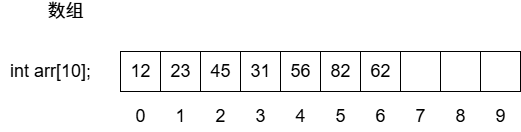
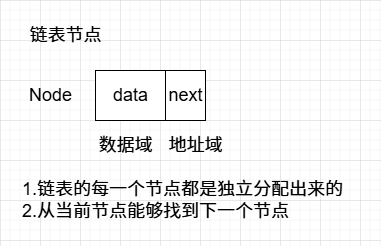
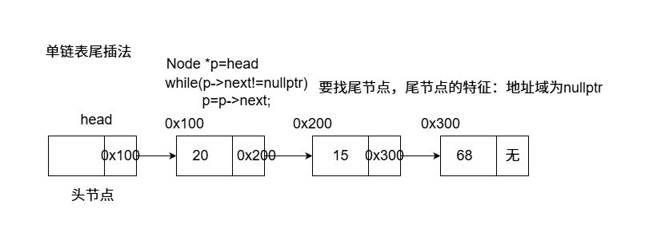
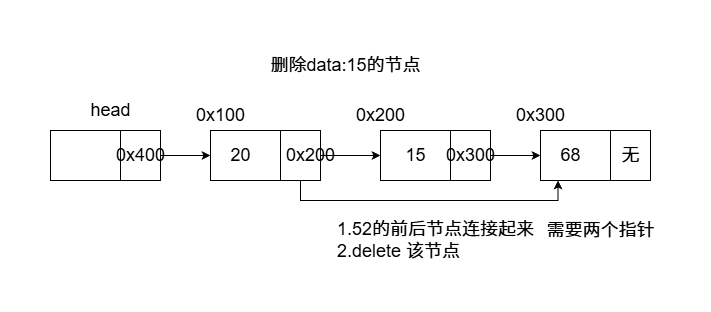
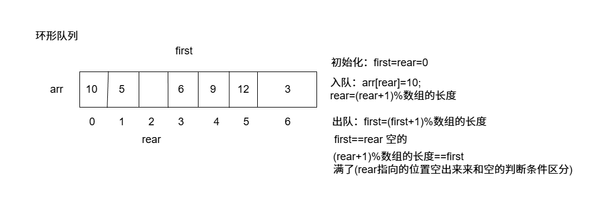

## 基本概念

**数据结构：**相互之间存在一种或者多种特定关系的数据元素的集合。在逻辑上可以分为**线性结构，散列结构，树形结构，图形结构**等等。

**算法：**求解具体问题的步骤描述，代码上表现的是解决特定问题的一组有限的指令序列。

**算法复杂度**：**时间和空间复杂度**，衡量算法效率，算法在执行过程中，**随着数据规模n的增长，算法执行所花费的时间和空间的增长速度**。

**常见的时间复杂度**：

| 大O计法  | 应用实例                             |
| :------- | ------------------------------------ |
| O(1)     | 数组随机访问，哈希表                 |
| O(logn)  | 二分搜素，二叉堆调整，AVL,红黑树查找 |
| O(n)     | 线性搜索                             |
| O(nlogn) | 堆排序，快速排序，归并排序           |
| O(n^2)   | 冒泡排序，选择排序，插入排序         |
| O(2^n)   | 子集树                               |
| O(n!)    | 排列树                               |

**常见算法的时间复杂度关系：O(1)<O(logn)<O(n)<O(nlogn)<O(n^2)<O(2^n)<O(n!)<O(n^n)**

## 线性表

### 数组



特点：内存是连续的。

优点：

1. 下标访问(随机访问)时间复杂度是O(1)
2. 末尾位置增加/删除元素时间复杂度是O(1)
3. 访问元素前后相邻位置的元素非常方便。

缺点：

1. 非末尾位置增加/删除元素需要进行大量的数据移动，时间复杂度O(n)
2. 搜索的时间复杂度：当是无序数组时，线性搜索O(n)。当是有序数组时，二分搜索O(logn)
3. 数组扩容消耗比较大(这里需要解释)，看下列扩容代码

**数组本身及基本功能实现**

```c++
// array.cpp : 此文件包含 "main" 函数。程序执行将在此处开始并结束。
//

#include <iostream>
#include <time.h>

//数组实现 不考虑泛型
class Array
{
public:
    Array(int size = 10) :mCur(0), mCap(size)
    {
        mpArr = new int[mCap]();
    }
    ~Array()
    {
        delete[] mpArr;
        mpArr = nullptr;
    }

    //末尾增加元素
    void push_back(int val)
    {
        if (mCur == mCap)
        {
            expand(2 * mCap);
        }
        mpArr[mCur++] = val;
    }
    //末尾删除元素
    void pop_back()
    {
        if (mCur == 0)
        {
            return;
        }
        mCur--;
    }

    //按位置增加元素
    void insert(int pos, int val)
    {
        if (pos<0 || pos>mCap)
        {
            return;//可以尝试throw exception
        }
        if (mCur == mCap)
        {
            expand(2 * mCap);
        }

        //移动元素
        for (int i = mCur - 1;i >= pos;i--)
        {
            mpArr[i + 1] = mpArr[i];

        }
        mpArr[pos] = val;
        mCur++;
    }

    //按位置删除，和find函数联动可以方便
    void erase(int pos)
    {
        if (pos<0 || pos>=mCur)
        {
            return;//可以尝试throw exception
        }
        for (int i = pos + 1;i < mCur;i++)
        {
            mpArr[i - 1] = mpArr[i];
        }
        
        mCur--;
    }

    //元素查询
    int find(int val)
    {
        for (int i = 0;i < mCur;i++)
        {
            if (mpArr[i] == val)
            {
                return i;
            }
        }
        return -1;
    }
    //打印数据
    void show() const
    {
        for (int i = 0;i < mCur;i++)
        {
            std::cout << mpArr[i] << " ";
        }
        std::cout << std::endl;
    }

private:
    int* mpArr; //指向可扩容的数组内存
    int mCap; //数组的容量
    int mCur; //数组有效元素个数

    //内部数组扩容
    void expand(int size)
    {
        //1.先开辟size大小的内存空间
        int* p = new int[size];
        //2.移动数据
        memcpy(p, mpArr, sizeof(int) * mCap);
        //3.释放原来的数组
        delete[]mpArr;
        mpArr = p;
        mCap = size;
    }

};

int main()
{
    Array arr;
    srand(time(0));
    for (int i = 0;i < 10;i++)
    {
        arr.push_back(rand() % 100);
    }
    arr.show();
    arr.pop_back();
    arr.show();

    arr.insert(0, 100);
    arr.show();

    arr.insert(10, 200);
    arr.show();

    int pos = arr.find(100);
    if (pos != -1)
    {
        arr.erase(pos);
    }
    arr.show();

}
```

#### **数组应用**

**1.逆序字符串（使用双指针）**

```c++
//逆序字符串（使用双指针）
void Reverse(char arr[], int size)
{
    //两个指针分别指向开头和末尾
    char* p = arr;
    char* q = arr + size - 1;
    //判断条件是p<q
    while (p < q)
    {
        //交换元素,前面指针后移，后面指针前移
        char ch = *p;
        *p = *q;
        *q = ch;
        p++;
        q--;
    }
}
int main()
{
    char arr[] = "hello world";
    Reverse(arr, strlen(arr));
    std::cout << arr << std::endl;
}
```

**2.整型数组，把偶数调整到数组的左边，把奇数调整到数组的右边**

```c++
//整型数组，把偶数调整到数组的左边，把奇数调整到数组的右边
//使用双指针解决
void AdjustArray(int arr[], int size)
{
    //前指针找奇数，后指针找偶数，找到交换元素，之后继续找直到双指针相遇。
    int* p = arr;
    int* q = arr + size - 1;
    
    while (p < q)
    {
        //p找奇数
        while (p < q)
        {
            if ((*p & 0x1) == 1)
            {
                break;
            }
            p++;
        }
        

        //q找偶数
        while (p < q)
        {
            if ((*q & 0x1) == 0)
            {
                break;
            }
            q--;
        }
        //这里继续往下要不满足条件是奇数或偶数，要不就是p<q条件被打破

        //所以到这里p指向奇数，q指向偶数
        //交换元素
        if (p < q)//预防全奇数和全偶数
        {
            int tmp = *p;
            *p = *q;
            *q = tmp;
            p++;
            q--;
        }
        
    }
}
int main()
{
    int arr[10] = { 0 };
    srand(time(0));
    for (int i = 0;i < 10;i++)
    {
        arr[i] = rand() % 100;
    }
    for (int v : arr)
    {
        std::cout << v << " ";
    }
    std::cout << std::endl;
    AdjustArray(arr,10);
    for (int v : arr)
    {
        std::cout << v << " ";
    }
    std::cout << std::endl;
}
```

**3.移除元素(leetcode 27)**

```c++
class Solution {
public:
    int removeElement(vector<int>& nums, int val) {
        //采取双指针方法，前指针找等于val的位置，后指针找
        //不等于val的位置，交换元素(或者把前指针对应的元素修改为后指针对应的值)
        //定义双指针
        int i=0,j=nums.size()-1;
        //遍历条件
        while(i<=j)
        {
            if(nums[i]!=val)
            {
                i++;
                continue;
            }
            if(nums[j]==val)
            {
                j--;
                continue;
            }
            //到达这里就是满足条件
            nums[i++]=nums[j--];
        }
        return i;
    }
};
```

### 链表


**特点：每一个节点都是在堆内存上独立出来的，节点内存不连续**

优点：

1. 内存利用率高，不需要大块连续内存
2. 插入和删除节点不需要移动其他节点，时间复杂度O(1)
3. 不需要专门进行扩容操作

缺点：

1. 内存占用量大，每一个节点多出存放地址的空间
2. 节点内存不连续，无法进行内存随机访问
3. 链表搜索效率不高，只能从头节点开始逐节点遍历。

链表节点：



```c++
struct Node
{
    int data;
    Node *next;
}
```

####  单链表

每一个节点只能找到下一个节点，无法回退到上一个节点，末尾节点的指针域是nullptr






**单链表接口实现**

```c++
#include <iostream>
#include <stdlib.h>
#include <time.h>
using namespace std;

//节点类型
struct Node
{
	Node(int data = 0) :data_(data), next_(nullptr) {}
	int data_;
	Node* next_;
};

//单链表代码实现
class Clink
{
public:
	Clink()
	{
		//给head_初始化指向头节点
		head_ = new Node();
	}

	~Clink()
	{
		//节点的释放
		Node* p = head_;
		while (p != nullptr)
		{
			head_ = head_->next_;
			delete p;
			p = head_;
		}
		head_ = nullptr;
	}
public:
	//链表尾插法 O(n)
	void insertTail(int val)
	{
		//先找到当前链表的末尾节点
		Node* p = head_;
		while (p->next_ != nullptr)
		{
			p = p->next_;
		}
		//生成新节点
		Node* node = new Node(val);

		//把新节点挂在尾节点的后面
		p->next_ = node;

	}
	//链表的头插法 O(1)
	void insertHead(int val)
	{
		Node* node = new Node(val);
		node->next_ = head_->next_;
		head_->next_ = node;
	}

	//链表节点的删除
	void Remove(int val)
	{
		Node* q = head_;
		Node* p = head_->next_;
		while (p != nullptr)
		{
			if (p->data_ == val)
			{
				q->next_ = p->next_;
				delete p;
				return;
			}
			else
			{
				q = p;
				p = p->next_;
			}
		}
	}
	//删除多个节点
	void RemoveAll(int val)
	{
		Node* q = head_;
		Node* p = head_->next_;

		while (p != nullptr)
		{
			if (p->data_ == val)
			{
				q->next_ = p->next_;
				delete p;
				//对指针p进行重置
				p = q->next_;
			}
			else
			{
				q = p;
				p = p->next_;
			}
		}
	}

	//搜索 O(n)
	bool Find(int val)
	{
		Node* p = head_->next_;
		while (p != nullptr)
		{
			if (p->data_ == val)
			{
				return true;
			}
			else
			{
				p = p->next_;
			}
		}
		return false;
	}
	//链表打印
	void Show()
	{
		Node* p = head_->next_;
		while (p != nullptr)
		{
			std::cout << p->data_ << " ";
			p = p->next_;
		}
	}
private:
	Node* head_;//指向链表的头节点
};

int main()
{
	Clink link;
	srand(time(0));
	for (int i = 0;i < 10;i++)
	{
		int val = rand() % 100;
		link.insertHead(val);
		std::cout << val << " ";
	}
	std::cout << std::endl;
	link.Show();
	std::cout << std::endl;
	link.insertHead(23);
	link.insertTail(23);
	link.Show();
	std::cout << std::endl;
	link.RemoveAll(23);
	link.Show();
}
```

#### 单链表应用

1.单链表逆序（leetcode206）

```c++
/**
 * Definition for singly-linked list.
 * struct ListNode {
 *     int val;
 *     ListNode *next;
 *     ListNode() : val(0), next(nullptr) {}
 *     ListNode(int x) : val(x), next(nullptr) {}
 *     ListNode(int x, ListNode *next) : val(x), next(next) {}
 * };
 */
/*
这道题是没有虚拟头节点的，我自建了头节点。
*/
class Solution {
public:
    ListNode* reverseList(ListNode* head) {
        if(head==nullptr)
            return nullptr;
        ListNode prehead;
        prehead.next=head;

        ListNode *tmp=nullptr;
        ListNode *cur=prehead.next;
        prehead.next=nullptr;
        while(cur!=nullptr)
        {
            tmp=cur->next;

            //头插
            cur->next=prehead.next;
            prehead.next=cur;

            cur=tmp;
        }
        return prehead.next;
    }
};
```

2.单链表求倒数第K个节点（leetcode 面试题02.02）

```c++
/**
 * Definition for singly-linked list.
 * struct ListNode {
 *     int val;
 *     ListNode *next;
 *     ListNode() : val(0), next(nullptr) {}
 *     ListNode(int x) : val(x), next(nullptr) {}
 *     ListNode(int x, ListNode *next) : val(x), next(next) {}
 * };
 */
class Solution {
public:
    int kthToLast(ListNode* head, int k) {
        ListNode *pre=head;
        ListNode *p=head;
        //因为k有效，所以不做判断
        // if(k<1)
        //     return false;
        for(int i=0;i<k;i++)
        {
            p=p->next;
            //因为给定k保证有效,所以不判断了
            // if(p==nullptr)
            //     return false;
        }
        while(p!=nullptr)
        {
            p=p->next;
            pre=pre->next;
        }
        return pre->val;

    }
};
//这里有无虚拟头节点都一样
//时间复杂度 O(n) 空间复杂度O(1)
```

3.合并两个有序单链表（leetcode 21）

```c++
/**
 * Definition for singly-linked list.
 * struct ListNode {
 *     int val;
 *     ListNode *next;
 *     ListNode() : val(0), next(nullptr) {}
 *     ListNode(int x) : val(x), next(nullptr) {}
 *     ListNode(int x, ListNode *next) : val(x), next(next) {}
 * };
 */
class Solution {
public:
    ListNode* mergeTwoLists(ListNode* list1, ListNode* list2) {
        //虚拟头节点
        ListNode prehead;
        prehead.next=list1;
        //last指针代表处理好的链表部分
        ListNode *last=&prehead;
        //p,q分别代表list1和list2未合并链表的起始
        ListNode *p=list1;
        ListNode *q=list2;
        while(p!=nullptr && q!=nullptr)
        {
            if(q->val<=p->val)
            {
                last->next=q;
                q=q->next;
                last=last->next;
            }
            else
            {
                last->next=p;
                p=p->next;
                last=last->next;
            }
        }
        //无论谁先结束,直接放在last后面
        if(p!=nullptr)
        {
            last->next=p;
        }
        if(q!=nullptr)
        {
            last->next=q;
        }
        return prehead.next;

    }
};
```

4.单链表判断是否有环？求环的入口节点（leetcode 142）

```c++
/**
 * Definition for singly-linked list.
 * struct ListNode {
 *     int val;
 *     ListNode *next;
 *     ListNode(int x) : val(x), next(NULL) {}
 * };
 */
 //采用双指针应用：快慢指针来判断是否有环
 //由fast指针遍历节点的数量是slow指针遍历节点的数量的2倍
 //得出结论：入环节点到头节点的距离和快慢指针相遇节点到入环节点距离相同

class Solution {
public:
    ListNode *detectCycle(ListNode *head) {
        ListNode *fast=head;
        ListNode *slow=head;
        if(head==nullptr||head->next==nullptr)
        {
            return nullptr;
        }
        while(fast!=nullptr&&fast->next!=nullptr)
        {
            fast=fast->next->next;
            slow=slow->next;
            if(fast==slow)
            {
                ListNode *huan=head;
                while(huan!=fast)
                {
                    huan=huan->next;
                    fast=fast->next;
                }
                return huan;
            }
        }
        return nullptr;
    }
};
```

5.判断两个单链表是否相交（leetcode 160）

```c++
/**
 * Definition for singly-linked list.
 * struct ListNode {
 *     int val;
 *     ListNode *next;
 *     ListNode(int x) : val(x), next(NULL) {}
 * };
 */
class Solution {
public:
    ListNode *getIntersectionNode(ListNode *headA, ListNode *headB) {
        ListNode *pa=headA;
        ListNode *pb=headB;
        int ia=0;
        int ib=0;
        while(pa!=nullptr)
        {
            ia++;
            pa=pa->next;
        }
        while(pb!=nullptr)
        {
            ib++;
            pb=pb->next;
        }
        pa=headA;
        pb=headB;
        if(ia>ib)
        {
            for(int i=ia-ib;i>0;i--)
                pa=pa->next;
            while(pa!=pb)
            {
                pa=pa->next;
                pb=pb->next;
            }
            if(pa==nullptr)
            {
                return nullptr;
            }
            return pa;
        }else
        {
            for(int i=ib-ia;i>0;i--)
                pb=pb->next;
            while(pa!=pb)
            {
                pa=pa->next;
                pb=pb->next;
            }
            if(pa==nullptr)
            {
                return nullptr;
            }
            return pa;
        }
    }
};
```

6.删除链表倒数第N个节点（leetcode 19）

```c++
/**
 * Definition for singly-linked list.
 * struct ListNode {
 *     int val;
 *     ListNode *next;
 *     ListNode() : val(0), next(nullptr) {}
 *     ListNode(int x) : val(x), next(nullptr) {}
 *     ListNode(int x, ListNode *next) : val(x), next(next) {}
 * };
 */
class Solution {
public:
    ListNode* removeNthFromEnd(ListNode* head, int n) {
        //一些特殊情况处理
        if(n<=0) return nullptr;

        //设计删除，需要找到前置节点。所以我要找倒数第n个节点
        //为什么不直接找倒数第N+1个，因为如果倒数第n个是头节点，就会报错
        //所以把这种情况剔除出来
        ListNode *p=head;
        ListNode *q=head;
        for(int i=0;i<n;i++)
        {
            q=q->next;
        }
        //这里q==nullptr说明倒数第n个节点都是第一个节点
        if(q==nullptr)
        {
            head=head->next;
            return head;
        }
        //先找倒数第n+1个节点
        while(q->next!=nullptr)
        {
            p=p->next;
            q=q->next;
        }
        p->next=p->next->next;
        return head;
    }
};
```

7.旋转链表（leetcode 61）

```c++
/**
 * Definition for singly-linked list.
 * struct ListNode {
 *     int val;
 *     ListNode *next;
 *     ListNode() : val(0), next(nullptr) {}
 *     ListNode(int x) : val(x), next(nullptr) {}
 *     ListNode(int x, ListNode *next) : val(x), next(next) {}
 * };
 */
class Solution {
public:
    ListNode* rotateRight(ListNode* head, int k) {
        if(head==nullptr)
        {
            return nullptr;
        }
        //先得到该链表的元素个数
        ListNode *p=head;
        int i=0;
        while(p!=nullptr)
        {
            i++;
            p=p->next;
        }
        //找到倒数第k%i+1个元素
        p=head;
        ListNode *q=head;
        for(int j=0;j<(k%i);j++)
        {
            q=q->next;
        }
        while(q->next!=nullptr)
        {
            p=p->next;
            q=q->next;
        }
        q->next=head;
        head=p->next;
        p->next=nullptr;
        return head;
    }
};
```

#### 单向循环链表

**特点**

1. 每一个节点除了数据域，还有一个next指针域指向下一个节点。
2. 末尾节点的指针域指向头节点。

**接口实现**

```c++
// 单向循环链表.cpp : 此文件包含 "main" 函数。程序执行将在此处开始并结束。
//

#include <iostream>
#include <stdlib.h>
#include <time.h>
//单向循环链表
class CircleLink
{
public:
    CircleLink()
    {
        head_ = new Node();
        tail_ = head_;
        head_->next_ = head_;
    }
    ~CircleLink()
    {
        Node* p = head_->next_;
        while (p != head_)
        {
            head_->next_ = p->next_;
            delete p;
            p = head_->next_;
        }
        delete head_;
    }

    //尾插法
    void InsertTail(int val)
    {
        Node* p = new Node(val);
        p->next_ = head_;
        tail_->next_ = p;
        tail_ = p;
    }

    //头插法
    void InsertHead(int val)
    {
        Node* node = new Node(val);
        node->next_ = head_->next_;
        head_->next_ = node;
        //这里预防空链表插入第一个有效节点，tail要更新
        if (node->next_ == head_)
        {
            tail_ = node;
        }
    }
    //删除节点
    void Remove(int val)
    {
        Node* q = head_;
        Node* p = head_->next_;
        while (p!= head_)
        {
            if (p->data_ == val)
            {
                //找到删除节点
                q->next_ = p->next_;
                delete p;
                //如果删除的是末尾节点，更新tail
                if (q->next_ == head_)
                {
                    tail_ = q;
                }
                return;
            }
            else
            {
                q = p;
                p = p->next_;
            }
        }
    }

    //查询
    bool Find(int val) const
    {
        Node* p = head_->next_;
        while (p != head_)
        {
            if (p->data_ == val)
            {
                return true;
            }else
            {
                p = p->next_;
            }
        }
        return false;
    }
    //打印链表
    void Show() const
    {
        Node* p = head_->next_;
        while (p != head_)
        {
            std::cout << p->data_ << " ";
            p = p->next_;
        }
        std::cout << std::endl;
    }
private:
    struct Node
    {
        Node(int data = 0) :data_(data), next_(nullptr)
        {}
        int data_;
        Node* next_;
    };

    Node* head_; //指向头节点
    Node* tail_; //指向末尾节点
};


int main()
{
    CircleLink clink;
    srand(time(NULL));
    clink.InsertHead(100);

    for (int i = 0;i < 10;i++)
    {
        clink.InsertTail(rand() % 100);
    }
    clink.Show();

    clink.InsertTail(200);
    clink.Show();

    clink.Remove(200);
    clink.Show();
    
}
```

> 约瑟夫环问题

已知n个人(以编号1，2，3...n分别表示)围坐在一张圆桌，从编号为k的人开始报数，数到m的那个人出列，他的下一个人又从1开始报数，数到m的那个人又出列，依此规律重复下去，直到全部出列，求输出人的顺序？

```c++
#include <iostream>
#include <stdlib.h>
#include <time.h>

struct Node
{
    Node(int data = 0) :data_(data), next_(nullptr)
    {}
    int data_;
    Node* next_;
};

//约瑟夫环问题-不带头节点
void Joseph(Node* head,int k,int m)
{
    Node* p = head;
    Node* q = head;
    //可能有k=1,m=1的情况出现，需要特殊处理
    while (q->next_ != head)
    {
        q = q->next_;
    }

    //从第k个人开始报数
    for (int i = 1;i < k;i++)
    {
        q = p;
        p = p->next_;
    }

    //第k个人开始报数
    for (;;)
    {
        for (int i = 1;i < m;i++)
        {
            q = p;
            p = p->next_;
        }
        //删除节点
        std::cout << p->data_ << " ";
        if (p == q)
        {
            delete p;
            break;
        }
        q->next_ = p->next_;
        delete p;
        p = q->next_;
    }
}
int main()
{
    Node* head = new Node(1);
    Node* n2 = new Node(2);
    Node* n3 = new Node(3);
    Node* n4 = new Node(4);
    Node* n5 = new Node(5);
    Node* n6 = new Node(6);
    Node* n7 = new Node(7);
    Node* n8 = new Node(8);
    head->next_ = n2;
    n2->next_ = n3;
    n3->next_ = n4;
    n4->next_ = n5;
    n5->next_ = n6;
    n6->next_ = n7;
    n7->next_ = n8;
    n8->next_ = head;
    Joseph(head, 1, 3);
}
```

#### 双向链表

**特点：**

1. 每一个节点除了数据域，还有next指针域指向下一个节点，pre指针域指向前一个节点
2. 头节点的pre是NULL,末尾节点的next是NULL。

**接口实现：**

```c++
// 双向链表.cpp : 此文件包含 "main" 函数。程序执行将在此处开始并结束。
//

#include <iostream>

//定义双向链表的节点类型
struct Node
{
    Node(int data = 0) 
        : data_(data)
        , next_(nullptr)
        , pre_(nullptr)
    {}
    int data_;
    Node* next_;//指向下一个节点
    Node* pre_;//指向前一个节点
};

//双向链表
class DoubleLink
{
public:
    DoubleLink()
    {
        head_ = new Node();
    }
    ~DoubleLink()
    {
        Node* p = head_;
        while (p != nullptr)
        {
            Node* q = p->next_;
            delete p;
            p = q;
        }
    }
public:
    //头插法
    void InsertHead(int val)
    {
        Node* node = new Node(val);
        node->next_ = head_->next_;
        node->pre_ = head_;
        if (head_->next_ != nullptr)
        {
            head_->next_->pre_ = node;
        }
        head_->next_ = node;
    }
    //尾插法
    void InsertTail(int val)
    {
        Node* p = head_;
        while (p->next_ != nullptr)
        {
            p = p->next_;
        }
        Node* node = new Node(val);
        p->next_ = node;
        node->pre_ = p;
    }
    //节点删除
    void Remove(int val)
    {
        Node* p = head_->next_;
        while (p != nullptr)
        {
            if (p->data_ == val)
            {
                p->pre_->next_ = p->next_;
                if (p->next_ != nullptr)
                {
                    p->next_->pre_ = p->pre_;
                }
                Node* next = p->next_;
                delete p;
                p = next;
                //return;
            }
            else
            {
                p = p->next_;
            }
        }
    }
    //节点搜索
    bool Find(int val)
    {
        Node* p = head_->next_;
        while (p != nullptr)
        {
            if (p->data_ == val)
            {
                return true;
            }
            p = p->next_;
        }
        return false;
    }
    //链表节点输出
    void Show()
    {
        Node* p = head_->next_;
        while (p != nullptr)
        {
            std::cout << p->data_ << " ";
            p = p->next_;
        }
        std::cout << std::endl;
    }
private:
    Node* head_;//指向头节点
};

int main()
{
    DoubleLink dLink;
    dLink.InsertTail(20);
    dLink.InsertTail(12);
    dLink.InsertTail(78);
    dLink.InsertTail(32);
    dLink.InsertTail(7);
    dLink.InsertTail(90);

    dLink.Show();

    dLink.InsertHead(100);
    dLink.Show();

    dLink.Remove(78);
    dLink.Show();
}
```

#### 双向循环链表

**特点：**

1.  每一个节点除了数据域，还有next指针域指向下一个节点，pre指针域指向前一个节点。
2. 头节点的pre指向末尾节点，末尾节点的next指向头节点。

**C++ list容器底层就是双向循环链表**

**接口实现：**

```c++
// 双向链表.cpp : 此文件包含 "main" 函数。程序执行将在此处开始并结束。
//

#include <iostream>

//定义双向循环链表的节点类型
struct Node
{
    Node(int data = 0)
        : data_(data)
        , next_(nullptr)
        , pre_(nullptr)
    {}
    int data_;
    Node* next_;//指向下一个节点
    Node* pre_;//指向前一个节点
};

//双向循环链表
class DoubleCircleLink
{
public:
    DoubleCircleLink()
    {
        head_ = new Node();
        head_->next_ = head_;
        head_->pre_ = head_;
    }
    ~DoubleCircleLink()
    {
        Node* p = head_->next_;
        while (p != head_)
        {
            Node* q = p->next_;
            delete p;
            p = q;
        }
        delete head_;
        head_ = nullptr;
    }
public:
    //头插法
    void InsertHead(int val)
    {
        Node* node = new Node(val);
        node->next_ = head_->next_;
        node->pre_ = head_;
        head_->next_->pre_ = node;
        head_->next_ = node;
    }
    //尾插法
    void InsertTail(int val)
    {
        Node* p = head_->pre_;
        Node* node = new Node(val);
        node->next_ = head_;
        node->pre_ = p;
        head_->pre_ = node;
        p->next_ = node;
    }
    //节点删除
    void Remove(int val)
    {
        Node* p = head_->next_;
        while (p != head_)
        {
            if (p->data_ == val)
            {
                p->pre_->next_ = p->next_;
                p->next_->pre_ = p->pre_;
                Node* next = p->next_;
                delete p;
                p = next;
                //return;
            }
            else
            {
                p = p->next_;
            }
        }
    }
    //节点搜索
    bool Find(int val)
    {
        Node* p = head_->next_;
        while (p != head_)
        {
            if (p->data_ == val)
            {
                return true;
            }
            p = p->next_;
        }
        return false;
    }
    //链表节点输出
    void Show()
    {
        Node* p = head_->next_;
        while (p != head_)
        {
            std::cout << p->data_ << " ";
            p = p->next_;
        }
        std::cout << std::endl;
    }
private:
    Node* head_;//指向头节点
};

int main()
{
    DoubleCircleLink dLink;
    dLink.InsertTail(20);
    dLink.InsertTail(12);
    dLink.InsertTail(78);
    dLink.InsertTail(32);
    dLink.InsertTail(7);
    dLink.InsertTail(90);

    dLink.Show();

    dLink.InsertHead(100);
    dLink.Show();

    dLink.Remove(78);
    dLink.Show();
}
```

### 栈

**特点：**先进后出，后进先出


#### 顺序栈

依赖数组实现

**接口实现：**

```c++
// 顺序栈.cpp : 此文件包含 "main" 函数。程序执行将在此处开始并结束。
//

#include <iostream>

//顺序栈 C++容器适配器 stack
class SeqStack
{
public:
    SeqStack(int size = 10)
        :mtop(0)
        ,mcap(size)
    {
        mpStack = new int[mcap];
    }
    ~SeqStack()
    {
        delete[] mpStack;
        mpStack = nullptr;
    }
public:
    //入栈
    void push(int val)
    {
        //栈空间满了
        if (mtop == mcap)
        {
            //栈扩容
            expand(2 * mcap);
        }
        mpStack[mtop++] = val;
    }
    //出栈
    void pop()
    {
        if (mtop == 0)
        {
            throw "stack is empty!";
        }
        mtop--;
    }
    //获取栈顶元素
    int top() const
    {
        if (mtop == 0)
        {
            throw "stack is empty!";
        }
        return mpStack[mtop - 1];
    }
    //判断栈空
    bool empty() const
    {
        return mtop == 0;
    }
    //栈元素个数
    int size() const
    {
        return mtop;
    }
private:
    void expand(int size)
    {
        int* p = new int[size];
        memcpy(p, mpStack, mtop*sizeof(int));
        delete[] mpStack;
        mpStack = p;
        mcap = size;
    }

private:
    int* mpStack;
    int mtop;//栈顶位置
    int mcap;//栈空间大小
};

int main()
{
    int arr[] = { 12,4,56,7,89,31,53,75 };
    SeqStack s;
    for (int v : arr)
    {
        s.push(v);
    }

    while (!s.empty())
    {
        std::cout << s.top() << " ";
        s.pop();
    }
    std::cout<<std::endl;
    //s.top();
}
```

#### 链式栈

依赖链表实现

**接口实现：**

```c++
// 链式栈.cpp : 此文件包含 "main" 函数。程序执行将在此处开始并结束。
//

#include <iostream>

//链式栈
class LinkStack
{
public:
    LinkStack():size_(0)
    {
        head_ = new Node();
    }
    ~LinkStack()
    {
        Node* p = head_->next_;
        while (p != nullptr)
        {
            head_->next_ = p->next_;
            delete p;
            p = head_->next_;
        }
        delete head_;
        head_ = nullptr;
    }
public:
    //入栈 把链表头节点后面，第一个有效元素当作栈顶位置
    void push(int val)
    {
        Node* node = new Node(val);
        node->next_ = head_->next_;
        head_->next_ = node;
        size_++;
    }
    //出栈
    void pop()
    {
        if (head_->next_ == nullptr)
        {
            throw "Stack is empty!";
        }
        Node* p = head_->next_;
        head_->next_ = p->next_;
        delete p;
        size_--;
    }
    //获取栈顶元素
    int top() const
    {
        if (head_->next_ == nullptr)
        {
            throw "Stack is empty!";
        }
        return head_->next_->data_;
    }
    //判空
    bool empty() const
    {
        return head_->next_ == nullptr;
    }
    //返回栈元素个数
    int size() const
    {
        return size_;
    }
private:
    struct Node
    {
        Node(int data=0)
            :data_(data)
            , next_(nullptr)
        {}
        int data_;
        Node* next_;
    };
    int size_;
    Node* head_;
    
};
int main()
{
    int arr[] = { 12,4,56,7,89,31,53,75 };
    LinkStack s;
    for (int v : arr)
    {
        s.push(v);
    }

    while (!s.empty())
    {
        std::cout << s.top() << " ";
        s.pop();
    }
    std::cout << std::endl;
    //s.top();
}
```

#### 栈的应用

1.有效的括号（leetcode 20）

```c++
class Solution {
public:
    bool isValid(string s) {
        //左括号入栈，右括号匹配
        std::stack<char> cs;
        for(char ch:s)
        {
            if(ch=='('||ch=='['||ch=='{')
            {
                cs.push(ch);
            }else
            {
                //遇到右括号了
                //这里判空，避免先出现右括号的情况
                if(cs.empty())
                {
                    return false;
                }
                char cmp=cs.top();
                cs.pop();
                if(ch==')' &&cmp!='(' || ch==']'&&cmp!='['||ch=='}'&&cmp!='{')
                {
                    return false;
                }
            }
        }
        //如果栈是空的，则是有效的
        if(!cs.empty())
            return false;
        return true;
    }
};
```

2.逆波兰表达式（后缀表达式）求值（leetcode 150）

```c++
class Solution {
public:
    int calc(int left,int right,char sign)
    {
        switch(sign)
        {
            case '+':
            return left+right;
            case '-':
            return left-right;
            case '*':
            return left*right;
            case '/':
            return left/right;
        }
        throw "";
    }
    int evalRPN(vector<string>& tokens) {
        //1.遇到数字直接入栈(数字栈)
        //2.遇到符号，出栈两个数字
        //3.运算两个数字，把结果再入栈
        std::stack<int> intStack;
        for(string &str:tokens)
        {
            if(str.size()==1 && (str[0]=='+'||str[0]=='-'||str[0]=='*'||str[0]=='/'))
            {
                //遇到运算符了 计算结果后再入栈
                int right=intStack.top();
                intStack.pop();
                int left=intStack.top();
                intStack.pop();
                intStack.push(calc(left,right,str[0]));
            }else
            {
                //遇到数字,直接入栈
                /*
                    C++11
                    string -> int stoi,stol
                    int-> string to_string
                */
                intStack.push(stoi(str));
            }
        }
        return intStack.top();
    }
};
```

3.中缀转后缀表达式

```c++
// 中缀转后缀.cpp : 此文件包含 "main" 函数。程序执行将在此处开始并结束。
//

#include <iostream>
#include <string>
#include <stack>
//中缀表达式 =》后缀表达式

/*
中缀转后缀
遇到数字，直接输出
遇到符号：
	1.栈为空，符号直接入栈(符号栈)
	2.如果是'(',直接入栈
	3.用当前符号和栈顶符号比较优先级
		若当前符号>栈顶符号 当前符号入栈，结束
		若当前符号<=栈顶符号 栈顶符号出栈并输出，继续和栈顶符号比较，如果栈为空就停止比较,把当前符号入栈。
												如果当前符号是')',要一直出栈，直到遇见'('为止
*/
//比较符号优先级
bool Priority(char ch, char topch)
{
	if ((ch == '*' || ch == '/') && (topch == '+' || topch == '-'))
	{
		return true;
	}
	if (topch == '('&&ch!=')')
	{
		return true;
	}
	return false;
}


//这里问题简化，不考虑负数，数字都为一位
std::string MiddleToEndExpr(std::string expr) {
    std::string result;
    std::stack < char > s;
    for (char ch : expr) {
        if (ch >= '0' && ch <= '9') {
            result += ch;
        }
        else {
            for (;;) {
                //处理符号
                if (s.empty() || ch == '(') {
                    s.push(ch);
                    break;
                }
                char topch = s.top();
                //true ch优先级大于topch
                if (Priority(ch, topch)) {
                    s.push(ch);
                    break;
                }
                else {
                    s.pop();
                    if (topch == '(')
                        break;
                    result += topch;
                }
            }
        }
    }
    //如果符号栈还存留符号，直接输出到后缀表达式
    while (!s.empty()) {
        result += s.top();
        s.pop();
    }

    return result;
}


int main()
{
	std::cout << MiddleToEndExpr("(1+2)*(3+4)") << std::endl;
	std::cout << MiddleToEndExpr("2+(4+6)/2+6/3") << std::endl;
    std::cout << MiddleToEndExpr("2+6/(4-2)+(4+6)/2") << std::endl;
}
```

### 队列

特点：先进先出，后进后出

#### 环形队列



依赖数组实现，但必须实现环形

**接口实现：**

```c++
// 环形队列.cpp : 此文件包含 "main" 函数。程序执行将在此处开始并结束。
//

#include <iostream>

//环形队列
class Queue
{
public:
    Queue(int size = 10)
        :cap_(size)
        , front_(0)
        , rear_(0)
        , size_(0)
    {
        pQue_ = new int[cap_];
    }
    ~Queue()
    {
        delete[] pQue_;
        pQue_ = nullptr;
    }
public:
    //入队
    void push(int val)
    {
        if ((rear_ + 1) % cap_ == front_)
        {
            expand(2 * cap_);
        }
        pQue_[rear_] = val;
        size_++;
        rear_ = (rear_ + 1) % cap_;
    }
    //出队
    void pop()
    {
        if (front_ == rear_)
            throw "queue is empty!";
        front_ = (front_ + 1) % cap_;
        size_--;
    }
    //获取队头元素
    int front() const
    {
        if (front_ == rear_)
            throw "queue is empty!";
        return pQue_[front_];
    }
    //获取队尾元素
    int back() const
    {
        if (front_ == rear_)
            throw "queue is empty!";
        //负数取模是不行的，所以再加cap_
        return pQue_[(rear_ - 1 + cap_) % cap_];
    }

    //判空
    bool empty() const
    {
        return front_ == rear_;
    }

    //判断队列元素个数
    int size() const
    {
        return size_;
    }
private:
    //扩容接口
    void expand(int size)
    {
        int* p = new int[size];
        //这里不能直接原封不动内存照搬，要遍历插入
        int i = 0;
        int j = front_;
        for(;j!=rear_;i++,j=(j+1)%cap_)
        {
            p[i] = pQue_[j];
        }
        cap_ = size;
        delete[] pQue_;
        pQue_ = p;
        front_ = 0;
        rear_ = i;
    }
private:
    int* pQue_;
    int cap_; //空间容量
    int front_; //队头
    int rear_; //队尾
    int size_; //元素个数
};
int main()
{
    int arr[] = { 12,4,56,7,89,31,53,75 };
    Queue que;
    for (int v : arr)
    {
        que.push(v);
    }
    std::cout << que.front() << std::endl;
    std::cout << que.back() << std::endl;

    que.push(100);
    que.push(200);
    que.push(300);
    std::cout << que.front() << std::endl;
    std::cout << que.back() << std::endl;

    while (!que.empty())
    {
        std::cout << que.front() << " "<< que.back() << std::endl;;
        que.pop();
    }
}
```

#### 链式队列

依赖链表实现，通过双向循环链表实现

**接口实现：**

```c++
// 链式队列.cpp : 此文件包含 "main" 函数。程序执行将在此处开始并结束。
//

#include <iostream>

//链式队列基于双向循环链表
class LinkQueue
{
public:
    LinkQueue()
    {
        head_ = new Node();
        head_->next_ = head_;
        head_->pre_ = head_;
    }
    ~LinkQueue()
    {
        Node* p = head_->next_;
        while (p != head_)
        {
            head_->next_ = p->next_;
            p->next_->pre_ = head_;
            delete p;
            p = head_->next_;
        }
        delete head_;
        head_ = nullptr;
    }
public:
    //入队操作
    void push(int val)
    {
        Node* node = new Node(val);
        node->next_ = head_;
        node->pre_ = head_->pre_;
        head_->pre_->next_ = node;
        head_->pre_ = node;
    }
    //出队
    void pop()
    {
        if (head_->next_ == head_)
            throw "队列为空";
        Node* p = head_->next_;
        head_->next_ = p->next_;
        p->next_->pre_ = head_;
        delete p;
    }
    //获取队头元素
    int front() const
    {
        if (head_->next_ == head_)
            throw "队列为空";
        return head_->next_->data_;
    }
    //获取队尾元素
    int back() const
    {
        if (head_->next_ == head_)
            throw "队列为空";
        return head_->pre_->data_;
    }
    //判空
    bool empty()
    {
        return head_->next_ == head_;
    }
private:
    struct Node
    {
        Node(int data=0)
            :data_(data)
            ,next_(nullptr)
            ,pre_(nullptr)
        {}
        int data_;
        Node* next_;
        Node* pre_;
    };
    Node* head_;//指向头节点

};

int main()
{
    int arr[] = { 12,4,56,7,89,31,53,75 };
    LinkQueue que;
    for (int v : arr)
    {
        que.push(v);
    }
    std::cout << que.front() << std::endl;
    std::cout << que.back() << std::endl;

    que.push(100);
    que.push(200);
    que.push(300);
    std::cout << que.front() << std::endl;
    std::cout << que.back() << std::endl;

    while (!que.empty())
    {
        std::cout << que.front() << " " << que.back() << std::endl;;
        que.pop();
    }
}
```

#### 队列应用

1.用栈实现队列(leetcode 232)

```c++
class MyQueue {
public:
    /*
    1.第一个栈专门用于push
    2.第二个栈用来pop()和peek(),第一次pop/peek就把数据倒过来放到第二个栈
    第二个栈就这样输出，push还放到第一个栈，
    如果第二个栈为空了，把第一个栈里元素全部倒过来放到第二个栈去pop/peek
    这样节约了时间
    */
    MyQueue() {
        
    }
    
    void push(int x) {
        s1.push(x);
    }
    
    int pop() {
        if(s1.empty()&&s2.empty())
        {
            throw "队列为空";
        }else if(s2.empty())
        {
            while(!s1.empty())
            {
                int x=s1.top();
                s2.push(x);
                s1.pop();
            }
        }
        int x=s2.top();
        s2.pop();
        return x;
    }
    
    int peek() {
        if(s1.empty()&&s2.empty())
        {
            throw "队列为空";
        }else if(s2.empty())
        {
            while(!s1.empty())
            {
                int x=s1.top();
                s2.push(x);
                s1.pop();
            }
        }
        return s2.top();
    }
    
    bool empty() {
        return s1.empty()&&s2.empty();
    }
private:
    std::stack<int> s1,s2;
};

/**
 * Your MyQueue object will be instantiated and called as such:
 * MyQueue* obj = new MyQueue();
 * obj->push(x);
 * int param_2 = obj->pop();
 * int param_3 = obj->peek();
 * bool param_4 = obj->empty();
 */
```

2.用队列实现栈(leetcode 225)

```c++
class MyStack {
public:
    /*
    这里只用一个队列实现栈,当栈push时，该元素已经入队，把他前面的所有元素出队后再入队
    这样就实现栈的功能了
    */
    MyStack() {
        
    }
    
    void push(int x) {
        que.push(x);
        if(!que.empty())
        {
            for(int i=1;i<que.size();i++)
            {
                int val=que.front();
                que.pop();
                que.push(val);
            }
        }
    }
    
    int pop() {
        if(que.empty())
        {
            throw "栈为空";
        }
        int val=que.front();
        que.pop();
        return val; 
    }
    
    int top() {
        if(que.empty())
        {
            throw "栈为空";
        }
        return que.front();
    }
    
    bool empty() {
        return que.empty();
    }
private:
    std::queue<int> que;
};

/**
 * Your MyStack object will be instantiated and called as such:
 * MyStack* obj = new MyStack();
 * obj->push(x);
 * int param_2 = obj->pop();
 * int param_3 = obj->top();
 * bool param_4 = obj->empty();
 */
```

## 搜索