## 基本概念

**数据结构：**相互之间存在一种或者多种特定关系的数据元素的集合。在逻辑上可以分为**线性结构，散列结构，树形结构，图形结构**等等。

**算法：**求解具体问题的步骤描述，代码上表现的是解决特定问题的一组有限的指令序列。

**算法复杂度**：**时间和空间复杂度**，衡量算法效率，算法在执行过程中，**随着数据规模n的增长，算法执行所花费的时间和空间的增长速度**。

**常见的时间复杂度**：

| 大O计法  | 应用实例                             |
| :------- | ------------------------------------ |
| O(1)     | 数组随机访问，哈希表                 |
| O(logn)  | 二分搜素，二叉堆调整，AVL,红黑树查找 |
| O(n)     | 线性搜索                             |
| O(nlogn) | 堆排序，快速排序，归并排序           |
| O(n^2)   | 冒泡排序，选择排序，插入排序         |
| O(2^n)   | 子集树                               |
| O(n!)    | 排列树                               |

**常见算法的时间复杂度关系：O(1)<O(logn)<O(n)<O(nlogn)<O(n^2)<O(2^n)<O(n!)<O(n^n)**

## 线性表

### 数组

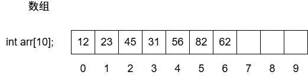

特点：内存是连续的。

优点：

1. 下标访问(随机访问)时间复杂度是O(1)
2. 末尾位置增加/删除元素时间复杂度是O(1)
3. 访问元素前后相邻位置的元素非常方便。

缺点：

1. 非末尾位置增加/删除元素需要进行大量的数据移动，时间复杂度O(n)
2. 搜索的时间复杂度：当是无序数组时，线性搜索O(n)。当是有序数组时，二分搜索O(logn)
3. 数组扩容消耗比较大(这里需要解释)，看下列扩容代码

**数组本身及基本功能实现**

```c++
// array.cpp : 此文件包含 "main" 函数。程序执行将在此处开始并结束。
//

#include <iostream>
#include <time.h>

//数组实现 不考虑泛型
class Array
{
public:
    Array(int size = 10) :mCur(0), mCap(size)
    {
        mpArr = new int[mCap]();
    }
    ~Array()
    {
        delete[] mpArr;
        mpArr = nullptr;
    }

    //末尾增加元素
    void push_back(int val)
    {
        if (mCur == mCap)
        {
            expand(2 * mCap);
        }
        mpArr[mCur++] = val;
    }
    //末尾删除元素
    void pop_back()
    {
        if (mCur == 0)
        {
            return;
        }
        mCur--;
    }

    //按位置增加元素
    void insert(int pos, int val)
    {
        if (pos<0 || pos>mCap)
        {
            return;//可以尝试throw exception
        }
        if (mCur == mCap)
        {
            expand(2 * mCap);
        }

        //移动元素
        for (int i = mCur - 1;i >= pos;i--)
        {
            mpArr[i + 1] = mpArr[i];

        }
        mpArr[pos] = val;
        mCur++;
    }

    //按位置删除，和find函数联动可以方便
    void erase(int pos)
    {
        if (pos<0 || pos>=mCur)
        {
            return;//可以尝试throw exception
        }
        for (int i = pos + 1;i < mCur;i++)
        {
            mpArr[i - 1] = mpArr[i];
        }
        
        mCur--;
    }

    //元素查询
    int find(int val)
    {
        for (int i = 0;i < mCur;i++)
        {
            if (mpArr[i] == val)
            {
                return i;
            }
        }
        return -1;
    }
    //打印数据
    void show() const
    {
        for (int i = 0;i < mCur;i++)
        {
            std::cout << mpArr[i] << " ";
        }
        std::cout << std::endl;
    }

private:
    int* mpArr; //指向可扩容的数组内存
    int mCap; //数组的容量
    int mCur; //数组有效元素个数

    //内部数组扩容
    void expand(int size)
    {
        //1.先开辟size大小的内存空间
        int* p = new int[size];
        //2.移动数据
        memcpy(p, mpArr, sizeof(int) * mCap);
        //3.释放原来的数组
        delete[]mpArr;
        mpArr = p;
        mCap = size;
    }

};

int main()
{
    Array arr;
    srand(time(0));
    for (int i = 0;i < 10;i++)
    {
        arr.push_back(rand() % 100);
    }
    arr.show();
    arr.pop_back();
    arr.show();

    arr.insert(0, 100);
    arr.show();

    arr.insert(10, 200);
    arr.show();

    int pos = arr.find(100);
    if (pos != -1)
    {
        arr.erase(pos);
    }
    arr.show();

}
```

#### **数组应用**

**1.逆序字符串（使用双指针）**

```c++
//逆序字符串（使用双指针）
void Reverse(char arr[], int size)
{
    //两个指针分别指向开头和末尾
    char* p = arr;
    char* q = arr + size - 1;
    //判断条件是p<q
    while (p < q)
    {
        //交换元素,前面指针后移，后面指针前移
        char ch = *p;
        *p = *q;
        *q = ch;
        p++;
        q--;
    }
}
int main()
{
    char arr[] = "hello world";
    Reverse(arr, strlen(arr));
    std::cout << arr << std::endl;
}
```

**2.整型数组，把偶数调整到数组的左边，把奇数调整到数组的右边**

```c++
//整型数组，把偶数调整到数组的左边，把奇数调整到数组的右边
//使用双指针解决
void AdjustArray(int arr[], int size)
{
    //前指针找奇数，后指针找偶数，找到交换元素，之后继续找直到双指针相遇。
    int* p = arr;
    int* q = arr + size - 1;
    
    while (p < q)
    {
        //p找奇数
        while (p < q)
        {
            if ((*p & 0x1) == 1)
            {
                break;
            }
            p++;
        }
        

        //q找偶数
        while (p < q)
        {
            if ((*q & 0x1) == 0)
            {
                break;
            }
            q--;
        }
        //这里继续往下要不满足条件是奇数或偶数，要不就是p<q条件被打破

        //所以到这里p指向奇数，q指向偶数
        //交换元素
        if (p < q)//预防全奇数和全偶数
        {
            int tmp = *p;
            *p = *q;
            *q = tmp;
            p++;
            q--;
        }
        
    }
}
int main()
{
    int arr[10] = { 0 };
    srand(time(0));
    for (int i = 0;i < 10;i++)
    {
        arr[i] = rand() % 100;
    }
    for (int v : arr)
    {
        std::cout << v << " ";
    }
    std::cout << std::endl;
    AdjustArray(arr,10);
    for (int v : arr)
    {
        std::cout << v << " ";
    }
    std::cout << std::endl;
}
```

**3.移除元素(leetcode 27)**

```c++
class Solution {
public:
    int removeElement(vector<int>& nums, int val) {
        //采取双指针方法，前指针找等于val的位置，后指针找
        //不等于val的位置，交换元素(或者把前指针对应的元素修改为后指针对应的值)
        //定义双指针
        int i=0,j=nums.size()-1;
        //遍历条件
        while(i<=j)
        {
            if(nums[i]!=val)
            {
                i++;
                continue;
            }
            if(nums[j]==val)
            {
                j--;
                continue;
            }
            //到达这里就是满足条件
            nums[i++]=nums[j--];
        }
        return i;
    }
};
```

### 链表

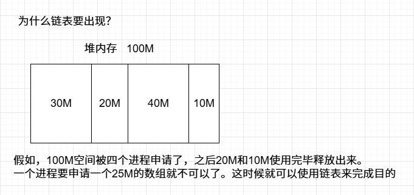

**特点：每一个节点都是在堆内存上独立出来的，节点内存不连续**

优点：

1. 内存利用率高，不需要大块连续内存
2. 插入和删除节点不需要移动其他节点，时间复杂度O(1)
3. 不需要专门进行扩容操作

缺点：

1. 内存占用量大，每一个节点多出存放地址的空间
2. 节点内存不连续，无法进行内存随机访问
3. 链表搜索效率不高，只能从头节点开始逐节点遍历。

链表节点：

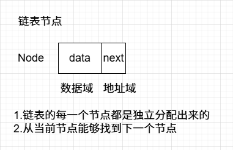

```c++
struct Node
{
    int data;
    Node *next;
}
```

####  单链表

每一个节点只能找到下一个节点，无法回退到上一个节点，末尾节点的指针域是nullptr

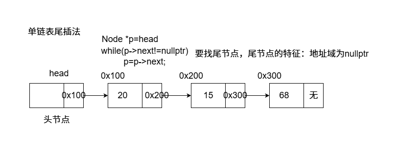

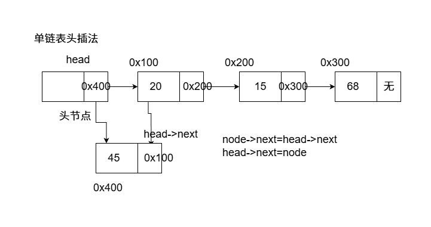

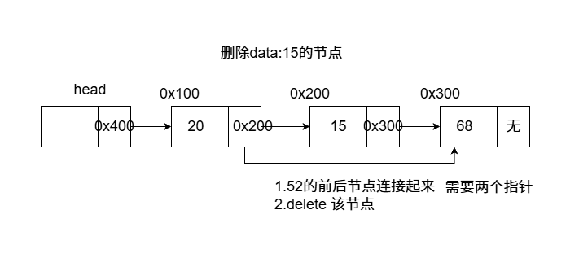

**单链表接口实现**

```c++
#include <iostream>
#include <stdlib.h>
#include <time.h>
using namespace std;

//节点类型
struct Node
{
	Node(int data = 0) :data_(data), next_(nullptr) {}
	int data_;
	Node* next_;
};

//单链表代码实现
class Clink
{
public:
	Clink()
	{
		//给head_初始化指向头节点
		head_ = new Node();
	}

	~Clink()
	{
		//节点的释放
		Node* p = head_;
		while (p != nullptr)
		{
			head_ = head_->next_;
			delete p;
			p = head_;
		}
		head_ = nullptr;
	}
public:
	//链表尾插法 O(n)
	void insertTail(int val)
	{
		//先找到当前链表的末尾节点
		Node* p = head_;
		while (p->next_ != nullptr)
		{
			p = p->next_;
		}
		//生成新节点
		Node* node = new Node(val);

		//把新节点挂在尾节点的后面
		p->next_ = node;

	}
	//链表的头插法 O(1)
	void insertHead(int val)
	{
		Node* node = new Node(val);
		node->next_ = head_->next_;
		head_->next_ = node;
	}

	//链表节点的删除
	void Remove(int val)
	{
		Node* q = head_;
		Node* p = head_->next_;
		while (p != nullptr)
		{
			if (p->data_ == val)
			{
				q->next_ = p->next_;
				delete p;
				return;
			}
			else
			{
				q = p;
				p = p->next_;
			}
		}
	}
	//删除多个节点
	void RemoveAll(int val)
	{
		Node* q = head_;
		Node* p = head_->next_;

		while (p != nullptr)
		{
			if (p->data_ == val)
			{
				q->next_ = p->next_;
				delete p;
				//对指针p进行重置
				p = q->next_;
			}
			else
			{
				q = p;
				p = p->next_;
			}
		}
	}

	//搜索 O(n)
	bool Find(int val)
	{
		Node* p = head_->next_;
		while (p != nullptr)
		{
			if (p->data_ == val)
			{
				return true;
			}
			else
			{
				p = p->next_;
			}
		}
		return false;
	}
	//链表打印
	void Show()
	{
		Node* p = head_->next_;
		while (p != nullptr)
		{
			std::cout << p->data_ << " ";
			p = p->next_;
		}
	}
private:
	Node* head_;//指向链表的头节点
};

int main()
{
	Clink link;
	srand(time(0));
	for (int i = 0;i < 10;i++)
	{
		int val = rand() % 100;
		link.insertHead(val);
		std::cout << val << " ";
	}
	std::cout << std::endl;
	link.Show();
	std::cout << std::endl;
	link.insertHead(23);
	link.insertTail(23);
	link.Show();
	std::cout << std::endl;
	link.RemoveAll(23);
	link.Show();
}
```

#### 单链表应用

1.单链表逆序（leetcode206）

```c++
/**
 * Definition for singly-linked list.
 * struct ListNode {
 *     int val;
 *     ListNode *next;
 *     ListNode() : val(0), next(nullptr) {}
 *     ListNode(int x) : val(x), next(nullptr) {}
 *     ListNode(int x, ListNode *next) : val(x), next(next) {}
 * };
 */
/*
这道题是没有虚拟头节点的，我自建了头节点。
*/
class Solution {
public:
    ListNode* reverseList(ListNode* head) {
        if(head==nullptr)
            return nullptr;
        ListNode prehead;
        prehead.next=head;

        ListNode *tmp=nullptr;
        ListNode *cur=prehead.next;
        prehead.next=nullptr;
        while(cur!=nullptr)
        {
            tmp=cur->next;

            //头插
            cur->next=prehead.next;
            prehead.next=cur;

            cur=tmp;
        }
        return prehead.next;
    }
};
```

2.单链表求倒数第K个节点（leetcode 面试题02.02）

```c++
/**
 * Definition for singly-linked list.
 * struct ListNode {
 *     int val;
 *     ListNode *next;
 *     ListNode() : val(0), next(nullptr) {}
 *     ListNode(int x) : val(x), next(nullptr) {}
 *     ListNode(int x, ListNode *next) : val(x), next(next) {}
 * };
 */
class Solution {
public:
    int kthToLast(ListNode* head, int k) {
        ListNode *pre=head;
        ListNode *p=head;
        //因为k有效，所以不做判断
        // if(k<1)
        //     return false;
        for(int i=0;i<k;i++)
        {
            p=p->next;
            //因为给定k保证有效,所以不判断了
            // if(p==nullptr)
            //     return false;
        }
        while(p!=nullptr)
        {
            p=p->next;
            pre=pre->next;
        }
        return pre->val;

    }
};
//这里有无虚拟头节点都一样
//时间复杂度 O(n) 空间复杂度O(1)
```

3.合并两个有序单链表（leetcode 21）

```c++
/**
 * Definition for singly-linked list.
 * struct ListNode {
 *     int val;
 *     ListNode *next;
 *     ListNode() : val(0), next(nullptr) {}
 *     ListNode(int x) : val(x), next(nullptr) {}
 *     ListNode(int x, ListNode *next) : val(x), next(next) {}
 * };
 */
class Solution {
public:
    ListNode* mergeTwoLists(ListNode* list1, ListNode* list2) {
        //虚拟头节点
        ListNode prehead;
        prehead.next=list1;
        //last指针代表处理好的链表部分
        ListNode *last=&prehead;
        //p,q分别代表list1和list2未合并链表的起始
        ListNode *p=list1;
        ListNode *q=list2;
        while(p!=nullptr && q!=nullptr)
        {
            if(q->val<=p->val)
            {
                last->next=q;
                q=q->next;
                last=last->next;
            }
            else
            {
                last->next=p;
                p=p->next;
                last=last->next;
            }
        }
        //无论谁先结束,直接放在last后面
        if(p!=nullptr)
        {
            last->next=p;
        }
        if(q!=nullptr)
        {
            last->next=q;
        }
        return prehead.next;

    }
};
```

4.单链表判断是否有环？求环的入口节点（leetcode 142）

```c++
/**
 * Definition for singly-linked list.
 * struct ListNode {
 *     int val;
 *     ListNode *next;
 *     ListNode(int x) : val(x), next(NULL) {}
 * };
 */
 //采用双指针应用：快慢指针来判断是否有环
 //由fast指针遍历节点的数量是slow指针遍历节点的数量的2倍
 //得出结论：入环节点到头节点的距离和快慢指针相遇节点到入环节点距离相同

class Solution {
public:
    ListNode *detectCycle(ListNode *head) {
        ListNode *fast=head;
        ListNode *slow=head;
        if(head==nullptr||head->next==nullptr)
        {
            return nullptr;
        }
        while(fast!=nullptr&&fast->next!=nullptr)
        {
            fast=fast->next->next;
            slow=slow->next;
            if(fast==slow)
            {
                ListNode *huan=head;
                while(huan!=fast)
                {
                    huan=huan->next;
                    fast=fast->next;
                }
                return huan;
            }
        }
        return nullptr;
    }
};
```

5.判断两个单链表是否相交（leetcode 160）

```c++
/**
 * Definition for singly-linked list.
 * struct ListNode {
 *     int val;
 *     ListNode *next;
 *     ListNode(int x) : val(x), next(NULL) {}
 * };
 */
class Solution {
public:
    ListNode *getIntersectionNode(ListNode *headA, ListNode *headB) {
        ListNode *pa=headA;
        ListNode *pb=headB;
        int ia=0;
        int ib=0;
        while(pa!=nullptr)
        {
            ia++;
            pa=pa->next;
        }
        while(pb!=nullptr)
        {
            ib++;
            pb=pb->next;
        }
        pa=headA;
        pb=headB;
        if(ia>ib)
        {
            for(int i=ia-ib;i>0;i--)
                pa=pa->next;
            while(pa!=pb)
            {
                pa=pa->next;
                pb=pb->next;
            }
            if(pa==nullptr)
            {
                return nullptr;
            }
            return pa;
        }else
        {
            for(int i=ib-ia;i>0;i--)
                pb=pb->next;
            while(pa!=pb)
            {
                pa=pa->next;
                pb=pb->next;
            }
            if(pa==nullptr)
            {
                return nullptr;
            }
            return pa;
        }
    }
};
```

6.删除链表倒数第N个节点（leetcode 19）

```c++
/**
 * Definition for singly-linked list.
 * struct ListNode {
 *     int val;
 *     ListNode *next;
 *     ListNode() : val(0), next(nullptr) {}
 *     ListNode(int x) : val(x), next(nullptr) {}
 *     ListNode(int x, ListNode *next) : val(x), next(next) {}
 * };
 */
class Solution {
public:
    ListNode* removeNthFromEnd(ListNode* head, int n) {
        //一些特殊情况处理
        if(n<=0) return nullptr;

        //设计删除，需要找到前置节点。所以我要找倒数第n个节点
        //为什么不直接找倒数第N+1个，因为如果倒数第n个是头节点，就会报错
        //所以把这种情况剔除出来
        ListNode *p=head;
        ListNode *q=head;
        for(int i=0;i<n;i++)
        {
            q=q->next;
        }
        //这里q==nullptr说明倒数第n个节点都是第一个节点
        if(q==nullptr)
        {
            head=head->next;
            return head;
        }
        //先找倒数第n+1个节点
        while(q->next!=nullptr)
        {
            p=p->next;
            q=q->next;
        }
        p->next=p->next->next;
        return head;
    }
};
```

7.旋转链表（leetcode 61）

```c++
/**
 * Definition for singly-linked list.
 * struct ListNode {
 *     int val;
 *     ListNode *next;
 *     ListNode() : val(0), next(nullptr) {}
 *     ListNode(int x) : val(x), next(nullptr) {}
 *     ListNode(int x, ListNode *next) : val(x), next(next) {}
 * };
 */
class Solution {
public:
    ListNode* rotateRight(ListNode* head, int k) {
        if(head==nullptr)
        {
            return nullptr;
        }
        //先得到该链表的元素个数
        ListNode *p=head;
        int i=0;
        while(p!=nullptr)
        {
            i++;
            p=p->next;
        }
        //找到倒数第k%i+1个元素
        p=head;
        ListNode *q=head;
        for(int j=0;j<(k%i);j++)
        {
            q=q->next;
        }
        while(q->next!=nullptr)
        {
            p=p->next;
            q=q->next;
        }
        q->next=head;
        head=p->next;
        p->next=nullptr;
        return head;
    }
};
```

#### 单向循环链表

**特点**

1. 每一个节点除了数据域，还有一个next指针域指向下一个节点。
2. 末尾节点的指针域指向头节点。

**接口实现**

```c++
// 单向循环链表.cpp : 此文件包含 "main" 函数。程序执行将在此处开始并结束。
//

#include <iostream>
#include <stdlib.h>
#include <time.h>
//单向循环链表
class CircleLink
{
public:
    CircleLink()
    {
        head_ = new Node();
        tail_ = head_;
        head_->next_ = head_;
    }
    ~CircleLink()
    {
        Node* p = head_->next_;
        while (p != head_)
        {
            head_->next_ = p->next_;
            delete p;
            p = head_->next_;
        }
        delete head_;
    }

    //尾插法
    void InsertTail(int val)
    {
        Node* p = new Node(val);
        p->next_ = head_;
        tail_->next_ = p;
        tail_ = p;
    }

    //头插法
    void InsertHead(int val)
    {
        Node* node = new Node(val);
        node->next_ = head_->next_;
        head_->next_ = node;
        //这里预防空链表插入第一个有效节点，tail要更新
        if (node->next_ == head_)
        {
            tail_ = node;
        }
    }
    //删除节点
    void Remove(int val)
    {
        Node* q = head_;
        Node* p = head_->next_;
        while (p!= head_)
        {
            if (p->data_ == val)
            {
                //找到删除节点
                q->next_ = p->next_;
                delete p;
                //如果删除的是末尾节点，更新tail
                if (q->next_ == head_)
                {
                    tail_ = q;
                }
                return;
            }
            else
            {
                q = p;
                p = p->next_;
            }
        }
    }

    //查询
    bool Find(int val) const
    {
        Node* p = head_->next_;
        while (p != head_)
        {
            if (p->data_ == val)
            {
                return true;
            }else
            {
                p = p->next_;
            }
        }
        return false;
    }
    //打印链表
    void Show() const
    {
        Node* p = head_->next_;
        while (p != head_)
        {
            std::cout << p->data_ << " ";
            p = p->next_;
        }
        std::cout << std::endl;
    }
private:
    struct Node
    {
        Node(int data = 0) :data_(data), next_(nullptr)
        {}
        int data_;
        Node* next_;
    };

    Node* head_; //指向头节点
    Node* tail_; //指向末尾节点
};


int main()
{
    CircleLink clink;
    srand(time(NULL));
    clink.InsertHead(100);

    for (int i = 0;i < 10;i++)
    {
        clink.InsertTail(rand() % 100);
    }
    clink.Show();

    clink.InsertTail(200);
    clink.Show();

    clink.Remove(200);
    clink.Show();
    
}
```

> 约瑟夫环问题

已知n个人(以编号1，2，3...n分别表示)围坐在一张圆桌，从编号为k的人开始报数，数到m的那个人出列，他的下一个人又从1开始报数，数到m的那个人又出列，依此规律重复下去，直到全部出列，求输出人的顺序？

```c++
#include <iostream>
#include <stdlib.h>
#include <time.h>

struct Node
{
    Node(int data = 0) :data_(data), next_(nullptr)
    {}
    int data_;
    Node* next_;
};

//约瑟夫环问题-不带头节点
void Joseph(Node* head,int k,int m)
{
    Node* p = head;
    Node* q = head;
    //可能有k=1,m=1的情况出现，需要特殊处理
    while (q->next_ != head)
    {
        q = q->next_;
    }

    //从第k个人开始报数
    for (int i = 1;i < k;i++)
    {
        q = p;
        p = p->next_;
    }

    //第k个人开始报数
    for (;;)
    {
        for (int i = 1;i < m;i++)
        {
            q = p;
            p = p->next_;
        }
        //删除节点
        std::cout << p->data_ << " ";
        if (p == q)
        {
            delete p;
            break;
        }
        q->next_ = p->next_;
        delete p;
        p = q->next_;
    }
}
int main()
{
    Node* head = new Node(1);
    Node* n2 = new Node(2);
    Node* n3 = new Node(3);
    Node* n4 = new Node(4);
    Node* n5 = new Node(5);
    Node* n6 = new Node(6);
    Node* n7 = new Node(7);
    Node* n8 = new Node(8);
    head->next_ = n2;
    n2->next_ = n3;
    n3->next_ = n4;
    n4->next_ = n5;
    n5->next_ = n6;
    n6->next_ = n7;
    n7->next_ = n8;
    n8->next_ = head;
    Joseph(head, 1, 3);
}
```

#### 双向链表

**特点：**

1. 每一个节点除了数据域，还有next指针域指向下一个节点，pre指针域指向前一个节点
2. 头节点的pre是NULL,末尾节点的next是NULL。

**接口实现：**

```c++
// 双向链表.cpp : 此文件包含 "main" 函数。程序执行将在此处开始并结束。
//

#include <iostream>

//定义双向链表的节点类型
struct Node
{
    Node(int data = 0) 
        : data_(data)
        , next_(nullptr)
        , pre_(nullptr)
    {}
    int data_;
    Node* next_;//指向下一个节点
    Node* pre_;//指向前一个节点
};

//双向链表
class DoubleLink
{
public:
    DoubleLink()
    {
        head_ = new Node();
    }
    ~DoubleLink()
    {
        Node* p = head_;
        while (p != nullptr)
        {
            Node* q = p->next_;
            delete p;
            p = q;
        }
    }
public:
    //头插法
    void InsertHead(int val)
    {
        Node* node = new Node(val);
        node->next_ = head_->next_;
        node->pre_ = head_;
        if (head_->next_ != nullptr)
        {
            head_->next_->pre_ = node;
        }
        head_->next_ = node;
    }
    //尾插法
    void InsertTail(int val)
    {
        Node* p = head_;
        while (p->next_ != nullptr)
        {
            p = p->next_;
        }
        Node* node = new Node(val);
        p->next_ = node;
        node->pre_ = p;
    }
    //节点删除
    void Remove(int val)
    {
        Node* p = head_->next_;
        while (p != nullptr)
        {
            if (p->data_ == val)
            {
                p->pre_->next_ = p->next_;
                if (p->next_ != nullptr)
                {
                    p->next_->pre_ = p->pre_;
                }
                Node* next = p->next_;
                delete p;
                p = next;
                //return;
            }
            else
            {
                p = p->next_;
            }
        }
    }
    //节点搜索
    bool Find(int val)
    {
        Node* p = head_->next_;
        while (p != nullptr)
        {
            if (p->data_ == val)
            {
                return true;
            }
            p = p->next_;
        }
        return false;
    }
    //链表节点输出
    void Show()
    {
        Node* p = head_->next_;
        while (p != nullptr)
        {
            std::cout << p->data_ << " ";
            p = p->next_;
        }
        std::cout << std::endl;
    }
private:
    Node* head_;//指向头节点
};

int main()
{
    DoubleLink dLink;
    dLink.InsertTail(20);
    dLink.InsertTail(12);
    dLink.InsertTail(78);
    dLink.InsertTail(32);
    dLink.InsertTail(7);
    dLink.InsertTail(90);

    dLink.Show();

    dLink.InsertHead(100);
    dLink.Show();

    dLink.Remove(78);
    dLink.Show();
}
```

#### 双向循环链表

**特点：**

1.  每一个节点除了数据域，还有next指针域指向下一个节点，pre指针域指向前一个节点。
2. 头节点的pre指向末尾节点，末尾节点的next指向头节点。

**C++ list容器底层就是双向循环链表**

**接口实现：**

```c++
// 双向链表.cpp : 此文件包含 "main" 函数。程序执行将在此处开始并结束。
//

#include <iostream>

//定义双向循环链表的节点类型
struct Node
{
    Node(int data = 0)
        : data_(data)
        , next_(nullptr)
        , pre_(nullptr)
    {}
    int data_;
    Node* next_;//指向下一个节点
    Node* pre_;//指向前一个节点
};

//双向循环链表
class DoubleCircleLink
{
public:
    DoubleCircleLink()
    {
        head_ = new Node();
        head_->next_ = head_;
        head_->pre_ = head_;
    }
    ~DoubleCircleLink()
    {
        Node* p = head_->next_;
        while (p != head_)
        {
            Node* q = p->next_;
            delete p;
            p = q;
        }
        delete head_;
        head_ = nullptr;
    }
public:
    //头插法
    void InsertHead(int val)
    {
        Node* node = new Node(val);
        node->next_ = head_->next_;
        node->pre_ = head_;
        head_->next_->pre_ = node;
        head_->next_ = node;
    }
    //尾插法
    void InsertTail(int val)
    {
        Node* p = head_->pre_;
        Node* node = new Node(val);
        node->next_ = head_;
        node->pre_ = p;
        head_->pre_ = node;
        p->next_ = node;
    }
    //节点删除
    void Remove(int val)
    {
        Node* p = head_->next_;
        while (p != head_)
        {
            if (p->data_ == val)
            {
                p->pre_->next_ = p->next_;
                p->next_->pre_ = p->pre_;
                Node* next = p->next_;
                delete p;
                p = next;
                //return;
            }
            else
            {
                p = p->next_;
            }
        }
    }
    //节点搜索
    bool Find(int val)
    {
        Node* p = head_->next_;
        while (p != head_)
        {
            if (p->data_ == val)
            {
                return true;
            }
            p = p->next_;
        }
        return false;
    }
    //链表节点输出
    void Show()
    {
        Node* p = head_->next_;
        while (p != head_)
        {
            std::cout << p->data_ << " ";
            p = p->next_;
        }
        std::cout << std::endl;
    }
private:
    Node* head_;//指向头节点
};

int main()
{
    DoubleCircleLink dLink;
    dLink.InsertTail(20);
    dLink.InsertTail(12);
    dLink.InsertTail(78);
    dLink.InsertTail(32);
    dLink.InsertTail(7);
    dLink.InsertTail(90);

    dLink.Show();

    dLink.InsertHead(100);
    dLink.Show();

    dLink.Remove(78);
    dLink.Show();
}
```

### 栈

**特点：**先进后出，后进先出

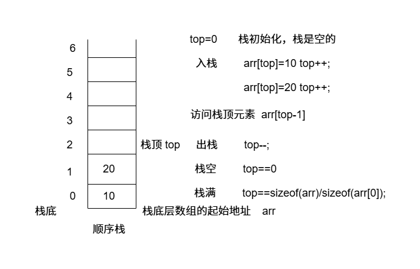

#### 顺序栈

依赖数组实现

**接口实现：**

```c++
// 顺序栈.cpp : 此文件包含 "main" 函数。程序执行将在此处开始并结束。
//

#include <iostream>

//顺序栈 C++容器适配器 stack
class SeqStack
{
public:
    SeqStack(int size = 10)
        :mtop(0)
        ,mcap(size)
    {
        mpStack = new int[mcap];
    }
    ~SeqStack()
    {
        delete[] mpStack;
        mpStack = nullptr;
    }
public:
    //入栈
    void push(int val)
    {
        //栈空间满了
        if (mtop == mcap)
        {
            //栈扩容
            expand(2 * mcap);
        }
        mpStack[mtop++] = val;
    }
    //出栈
    void pop()
    {
        if (mtop == 0)
        {
            throw "stack is empty!";
        }
        mtop--;
    }
    //获取栈顶元素
    int top() const
    {
        if (mtop == 0)
        {
            throw "stack is empty!";
        }
        return mpStack[mtop - 1];
    }
    //判断栈空
    bool empty() const
    {
        return mtop == 0;
    }
    //栈元素个数
    int size() const
    {
        return mtop;
    }
private:
    void expand(int size)
    {
        int* p = new int[size];
        memcpy(p, mpStack, mtop*sizeof(int));
        delete[] mpStack;
        mpStack = p;
        mcap = size;
    }

private:
    int* mpStack;
    int mtop;//栈顶位置
    int mcap;//栈空间大小
};

int main()
{
    int arr[] = { 12,4,56,7,89,31,53,75 };
    SeqStack s;
    for (int v : arr)
    {
        s.push(v);
    }

    while (!s.empty())
    {
        std::cout << s.top() << " ";
        s.pop();
    }
    std::cout<<std::endl;
    //s.top();
}
```

#### 链式栈

依赖链表实现

**接口实现：**

```c++
// 链式栈.cpp : 此文件包含 "main" 函数。程序执行将在此处开始并结束。
//

#include <iostream>

//链式栈
class LinkStack
{
public:
    LinkStack():size_(0)
    {
        head_ = new Node();
    }
    ~LinkStack()
    {
        Node* p = head_->next_;
        while (p != nullptr)
        {
            head_->next_ = p->next_;
            delete p;
            p = head_->next_;
        }
        delete head_;
        head_ = nullptr;
    }
public:
    //入栈 把链表头节点后面，第一个有效元素当作栈顶位置
    void push(int val)
    {
        Node* node = new Node(val);
        node->next_ = head_->next_;
        head_->next_ = node;
        size_++;
    }
    //出栈
    void pop()
    {
        if (head_->next_ == nullptr)
        {
            throw "Stack is empty!";
        }
        Node* p = head_->next_;
        head_->next_ = p->next_;
        delete p;
        size_--;
    }
    //获取栈顶元素
    int top() const
    {
        if (head_->next_ == nullptr)
        {
            throw "Stack is empty!";
        }
        return head_->next_->data_;
    }
    //判空
    bool empty() const
    {
        return head_->next_ == nullptr;
    }
    //返回栈元素个数
    int size() const
    {
        return size_;
    }
private:
    struct Node
    {
        Node(int data=0)
            :data_(data)
            , next_(nullptr)
        {}
        int data_;
        Node* next_;
    };
    int size_;
    Node* head_;
    
};
int main()
{
    int arr[] = { 12,4,56,7,89,31,53,75 };
    LinkStack s;
    for (int v : arr)
    {
        s.push(v);
    }

    while (!s.empty())
    {
        std::cout << s.top() << " ";
        s.pop();
    }
    std::cout << std::endl;
    //s.top();
}
```

#### 栈的应用

1.有效的括号（leetcode 20）

```c++
class Solution {
public:
    bool isValid(string s) {
        //左括号入栈，右括号匹配
        std::stack<char> cs;
        for(char ch:s)
        {
            if(ch=='('||ch=='['||ch=='{')
            {
                cs.push(ch);
            }else
            {
                //遇到右括号了
                //这里判空，避免先出现右括号的情况
                if(cs.empty())
                {
                    return false;
                }
                char cmp=cs.top();
                cs.pop();
                if(ch==')' &&cmp!='(' || ch==']'&&cmp!='['||ch=='}'&&cmp!='{')
                {
                    return false;
                }
            }
        }
        //如果栈是空的，则是有效的
        if(!cs.empty())
            return false;
        return true;
    }
};
```

2.逆波兰表达式（后缀表达式）求值（leetcode 150）

```c++
class Solution {
public:
    int calc(int left,int right,char sign)
    {
        switch(sign)
        {
            case '+':
            return left+right;
            case '-':
            return left-right;
            case '*':
            return left*right;
            case '/':
            return left/right;
        }
        throw "";
    }
    int evalRPN(vector<string>& tokens) {
        //1.遇到数字直接入栈(数字栈)
        //2.遇到符号，出栈两个数字
        //3.运算两个数字，把结果再入栈
        std::stack<int> intStack;
        for(string &str:tokens)
        {
            if(str.size()==1 && (str[0]=='+'||str[0]=='-'||str[0]=='*'||str[0]=='/'))
            {
                //遇到运算符了 计算结果后再入栈
                int right=intStack.top();
                intStack.pop();
                int left=intStack.top();
                intStack.pop();
                intStack.push(calc(left,right,str[0]));
            }else
            {
                //遇到数字,直接入栈
                /*
                    C++11
                    string -> int stoi,stol
                    int-> string to_string
                */
                intStack.push(stoi(str));
            }
        }
        return intStack.top();
    }
};
```

3.中缀转后缀表达式

```c++
// 中缀转后缀.cpp : 此文件包含 "main" 函数。程序执行将在此处开始并结束。
//

#include <iostream>
#include <string>
#include <stack>
//中缀表达式 =》后缀表达式

/*
中缀转后缀
遇到数字，直接输出
遇到符号：
	1.栈为空，符号直接入栈(符号栈)
	2.如果是'(',直接入栈
	3.用当前符号和栈顶符号比较优先级
		若当前符号>栈顶符号 当前符号入栈，结束
		若当前符号<=栈顶符号 栈顶符号出栈并输出，继续和栈顶符号比较，如果栈为空就停止比较,把当前符号入栈。
												如果当前符号是')',要一直出栈，直到遇见'('为止
*/
//比较符号优先级
bool Priority(char ch, char topch)
{
	if ((ch == '*' || ch == '/') && (topch == '+' || topch == '-'))
	{
		return true;
	}
	if (topch == '('&&ch!=')')
	{
		return true;
	}
	return false;
}


//这里问题简化，不考虑负数，数字都为一位
std::string MiddleToEndExpr(std::string expr) {
    std::string result;
    std::stack < char > s;
    for (char ch : expr) {
        if (ch >= '0' && ch <= '9') {
            result += ch;
        }
        else {
            for (;;) {
                //处理符号
                if (s.empty() || ch == '(') {
                    s.push(ch);
                    break;
                }
                char topch = s.top();
                //true ch优先级大于topch
                if (Priority(ch, topch)) {
                    s.push(ch);
                    break;
                }
                else {
                    s.pop();
                    if (topch == '(')
                        break;
                    result += topch;
                }
            }
        }
    }
    //如果符号栈还存留符号，直接输出到后缀表达式
    while (!s.empty()) {
        result += s.top();
        s.pop();
    }

    return result;
}


int main()
{
	std::cout << MiddleToEndExpr("(1+2)*(3+4)") << std::endl;
	std::cout << MiddleToEndExpr("2+(4+6)/2+6/3") << std::endl;
    std::cout << MiddleToEndExpr("2+6/(4-2)+(4+6)/2") << std::endl;
}
```

### 队列

特点：先进先出，后进后出

#### 环形队列

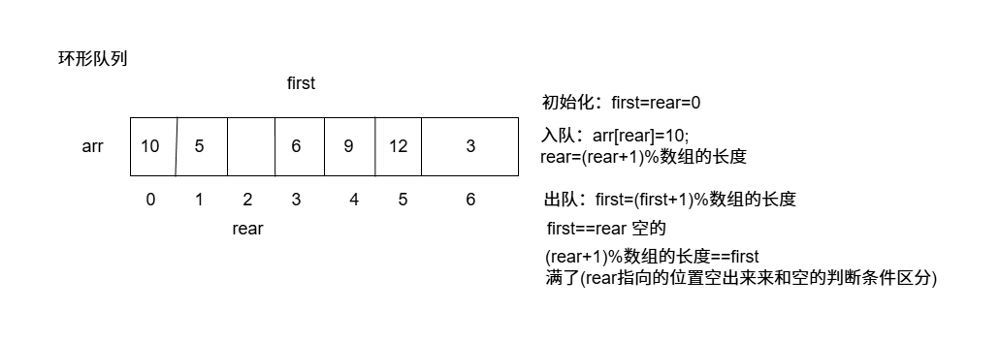

依赖数组实现，但必须实现环形

**接口实现：**

```c++
// 环形队列.cpp : 此文件包含 "main" 函数。程序执行将在此处开始并结束。
//

#include <iostream>

//环形队列
class Queue
{
public:
    Queue(int size = 10)
        :cap_(size)
        , front_(0)
        , rear_(0)
        , size_(0)
    {
        pQue_ = new int[cap_];
    }
    ~Queue()
    {
        delete[] pQue_;
        pQue_ = nullptr;
    }
public:
    //入队
    void push(int val)
    {
        if ((rear_ + 1) % cap_ == front_)
        {
            expand(2 * cap_);
        }
        pQue_[rear_] = val;
        size_++;
        rear_ = (rear_ + 1) % cap_;
    }
    //出队
    void pop()
    {
        if (front_ == rear_)
            throw "queue is empty!";
        front_ = (front_ + 1) % cap_;
        size_--;
    }
    //获取队头元素
    int front() const
    {
        if (front_ == rear_)
            throw "queue is empty!";
        return pQue_[front_];
    }
    //获取队尾元素
    int back() const
    {
        if (front_ == rear_)
            throw "queue is empty!";
        //负数取模是不行的，所以再加cap_
        return pQue_[(rear_ - 1 + cap_) % cap_];
    }

    //判空
    bool empty() const
    {
        return front_ == rear_;
    }

    //判断队列元素个数
    int size() const
    {
        return size_;
    }
private:
    //扩容接口
    void expand(int size)
    {
        int* p = new int[size];
        //这里不能直接原封不动内存照搬，要遍历插入
        int i = 0;
        int j = front_;
        for(;j!=rear_;i++,j=(j+1)%cap_)
        {
            p[i] = pQue_[j];
        }
        cap_ = size;
        delete[] pQue_;
        pQue_ = p;
        front_ = 0;
        rear_ = i;
    }
private:
    int* pQue_;
    int cap_; //空间容量
    int front_; //队头
    int rear_; //队尾
    int size_; //元素个数
};
int main()
{
    int arr[] = { 12,4,56,7,89,31,53,75 };
    Queue que;
    for (int v : arr)
    {
        que.push(v);
    }
    std::cout << que.front() << std::endl;
    std::cout << que.back() << std::endl;

    que.push(100);
    que.push(200);
    que.push(300);
    std::cout << que.front() << std::endl;
    std::cout << que.back() << std::endl;

    while (!que.empty())
    {
        std::cout << que.front() << " "<< que.back() << std::endl;;
        que.pop();
    }
}
```

#### 链式队列

依赖链表实现，通过双向循环链表实现

**接口实现：**

```c++
// 链式队列.cpp : 此文件包含 "main" 函数。程序执行将在此处开始并结束。
//

#include <iostream>

//链式队列基于双向循环链表
class LinkQueue
{
public:
    LinkQueue()
    {
        head_ = new Node();
        head_->next_ = head_;
        head_->pre_ = head_;
    }
    ~LinkQueue()
    {
        Node* p = head_->next_;
        while (p != head_)
        {
            head_->next_ = p->next_;
            p->next_->pre_ = head_;
            delete p;
            p = head_->next_;
        }
        delete head_;
        head_ = nullptr;
    }
public:
    //入队操作
    void push(int val)
    {
        Node* node = new Node(val);
        node->next_ = head_;
        node->pre_ = head_->pre_;
        head_->pre_->next_ = node;
        head_->pre_ = node;
    }
    //出队
    void pop()
    {
        if (head_->next_ == head_)
            throw "队列为空";
        Node* p = head_->next_;
        head_->next_ = p->next_;
        p->next_->pre_ = head_;
        delete p;
    }
    //获取队头元素
    int front() const
    {
        if (head_->next_ == head_)
            throw "队列为空";
        return head_->next_->data_;
    }
    //获取队尾元素
    int back() const
    {
        if (head_->next_ == head_)
            throw "队列为空";
        return head_->pre_->data_;
    }
    //判空
    bool empty()
    {
        return head_->next_ == head_;
    }
private:
    struct Node
    {
        Node(int data=0)
            :data_(data)
            ,next_(nullptr)
            ,pre_(nullptr)
        {}
        int data_;
        Node* next_;
        Node* pre_;
    };
    Node* head_;//指向头节点

};

int main()
{
    int arr[] = { 12,4,56,7,89,31,53,75 };
    LinkQueue que;
    for (int v : arr)
    {
        que.push(v);
    }
    std::cout << que.front() << std::endl;
    std::cout << que.back() << std::endl;

    que.push(100);
    que.push(200);
    que.push(300);
    std::cout << que.front() << std::endl;
    std::cout << que.back() << std::endl;

    while (!que.empty())
    {
        std::cout << que.front() << " " << que.back() << std::endl;;
        que.pop();
    }
}
```

#### 队列应用

1.用栈实现队列(leetcode 232)

```c++
class MyQueue {
public:
    /*
    1.第一个栈专门用于push
    2.第二个栈用来pop()和peek(),第一次pop/peek就把数据倒过来放到第二个栈
    第二个栈就这样输出，push还放到第一个栈，
    如果第二个栈为空了，把第一个栈里元素全部倒过来放到第二个栈去pop/peek
    这样节约了时间
    */
    MyQueue() {
        
    }
    
    void push(int x) {
        s1.push(x);
    }
    
    int pop() {
        if(s1.empty()&&s2.empty())
        {
            throw "队列为空";
        }else if(s2.empty())
        {
            while(!s1.empty())
            {
                int x=s1.top();
                s2.push(x);
                s1.pop();
            }
        }
        int x=s2.top();
        s2.pop();
        return x;
    }
    
    int peek() {
        if(s1.empty()&&s2.empty())
        {
            throw "队列为空";
        }else if(s2.empty())
        {
            while(!s1.empty())
            {
                int x=s1.top();
                s2.push(x);
                s1.pop();
            }
        }
        return s2.top();
    }
    
    bool empty() {
        return s1.empty()&&s2.empty();
    }
private:
    std::stack<int> s1,s2;
};

/**
 * Your MyQueue object will be instantiated and called as such:
 * MyQueue* obj = new MyQueue();
 * obj->push(x);
 * int param_2 = obj->pop();
 * int param_3 = obj->peek();
 * bool param_4 = obj->empty();
 */
```

2.用队列实现栈(leetcode 225)

```c++
class MyStack {
public:
    /*
    这里只用一个队列实现栈,当栈push时，该元素已经入队，把他前面的所有元素出队后再入队
    这样就实现栈的功能了
    */
    MyStack() {
        
    }
    
    void push(int x) {
        que.push(x);
        if(!que.empty())
        {
            for(int i=1;i<que.size();i++)
            {
                int val=que.front();
                que.pop();
                que.push(val);
            }
        }
    }
    
    int pop() {
        if(que.empty())
        {
            throw "栈为空";
        }
        int val=que.front();
        que.pop();
        return val; 
    }
    
    int top() {
        if(que.empty())
        {
            throw "栈为空";
        }
        return que.front();
    }
    
    bool empty() {
        return que.empty();
    }
private:
    std::queue<int> que;
};

/**
 * Your MyStack object will be instantiated and called as such:
 * MyStack* obj = new MyStack();
 * obj->push(x);
 * int param_2 = obj->pop();
 * int param_3 = obj->top();
 * bool param_4 = obj->empty();
 */
```

## 搜索

### 二分搜索

代码实现和复杂度分析

```c++
// 二分搜索算法.cpp : 此文件包含 "main" 函数。程序执行将在此处开始并结束。
//

#include <iostream>
//二分搜索非递归实现
int BinarySearch(int arr[], int size, int val)
{
    int first = 0;
    int last = size - 1;

    while (first <= last)
    {
        int mid = (first + last) / 2;
        if (arr[mid] == val)
        {
            return mid;
        }
        else if (arr[mid] > val)
        {
            last = mid - 1;
        }
        else
        {
            first = mid + 1;
        }
    }
    return -1;
}


int main()
{
    int arr[] = { 12,25,34,39,45,57,63,78,82,96,100 };
    int size = sizeof(arr) / sizeof(arr[0]);
    std::cout << BinarySearch(arr, size, 39) << std::endl;
    std::cout << BinarySearch(arr, size, 45) << std::endl;
    std::cout << BinarySearch(arr, size, 12) << std::endl;
    std::cout << BinarySearch(arr, size, 64) << std::endl;
}
```

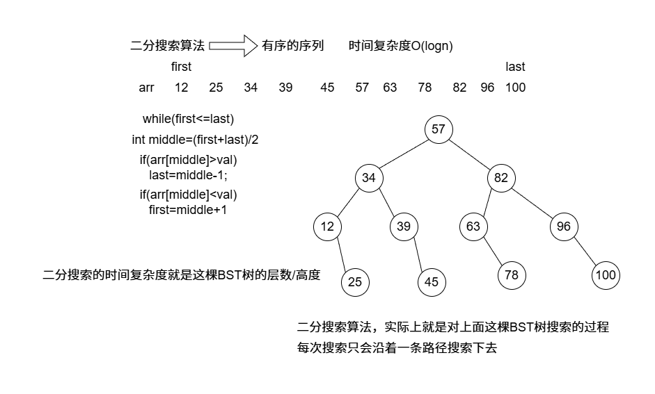

**递归实现**

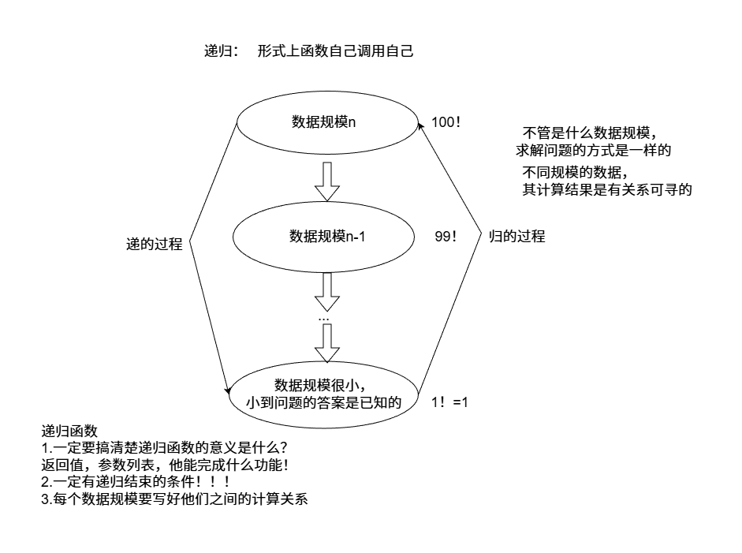

递归代码实现：

```c++
//二分搜索递归代码
int BinarySearch1(int arr[], int i, int j, int val)
{
    if (i > j)
    {
        return -1;
    }
    int mid = (i + j) / 2;
    if (arr[mid] == val)
    {
        return mid;
    }
    else if (arr[mid] > val)
    {
        BinarySearch1(arr, i, mid - 1, val);
    }
    else
    {
        BinarySearch1(arr, mid + 1, j, val);
    }
}
int BinarySearch(int arr[], int size, int val)
{
    return BinarySearch1(arr, 0, size-1, val);
}


int main()
{
    int arr[] = { 12,25,34,39,45,57,63,78,82,96,100 };
    int size = sizeof(arr) / sizeof(arr[0]);
    std::cout << BinarySearch(arr, size, 39) << std::endl;
    std::cout << BinarySearch(arr, size, 45) << std::endl;
    std::cout << BinarySearch(arr, size, 12) << std::endl;
    std::cout << BinarySearch(arr, size, 64) << std::endl;
}
```

## 排序算法

### 冒泡排序

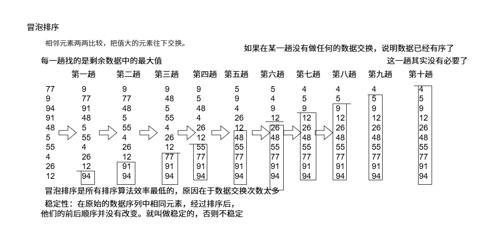

特点：相邻元素两两比较，把值大的元素往下交换。

缺点：数据交换次数太多了。

```c++
// 基础排序.cpp : 此文件包含 "main" 函数。程序执行将在此处开始并结束。
//

#include <iostream>
#include <stdlib.h>
#include <time.h>

//冒泡排序算法
void BubbleSort(int arr[], int size)
{
    //外层表示趟数  
    for (int i = 0;i < size - 1;i++)
    {
        bool flag = false;
        //一趟的处理
        for (int j = 0;j < size - 1- i;j++)
        {
            if (arr[j] > arr[j + 1])
            {
                int tmp = arr[j];
                arr[j] = arr[j + 1];
                arr[j + 1] = tmp;
                flag = true;
            }
        }
        //如果在某一趟没有做任何的数据交换，说明数据已经有序了
        if (!flag)
            return;
    }
    
}

int main()
{
    int arr[10];
    srand(time(NULL));

    for (int i = 0;i < 10;i++)
    {
        arr[i] = rand() % 100 + 1;
    }
    for (int v : arr)
    {
        std::cout << v << " ";
    }
    std::cout << std::endl;
    BubbleSort(arr, 10);
    for (int v : arr)
    {
        std::cout << v << " ";
    }
    std::cout << std::endl;
}
```

### 选择排序

特点：每次在剩下的元素中选择值最小的元素，和当前元素进行交换。

缺点：相比于冒泡排序，交换的次数少了，但是比较的次数依然很多。

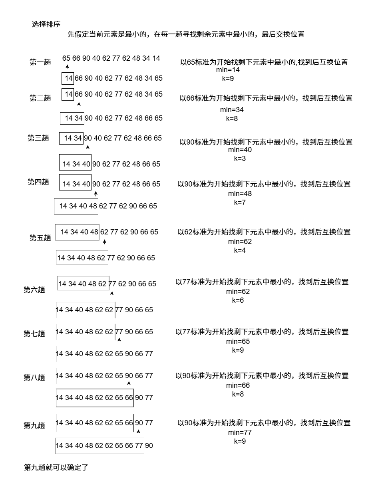

```c++
// 基础排序.cpp : 此文件包含 "main" 函数。程序执行将在此处开始并结束。
//

#include <iostream>
#include <stdlib.h>
#include <time.h>

//选择排序算法 O(n^2) 空间复杂度：O(1) 稳定性：不稳定。例子5 5 3-》3 5 5
void ChoiceSort(int arr[], int size)
{
    for (int i = 0;i < size - 1;i++)
    {
        int min = arr[i];
        int k = i;
        for (int j = i+1;j < size;j++)
        {
            if (min > arr[j])
            {
                min = arr[j];
                k = j;
            }
        }
        if (i != k)
        {
            int tmp = arr[i];
            arr[i] = arr[k];
            arr[k] = tmp;
        } 
    }
}


int main()
{
    int arr[10];
    srand(time(NULL));

    for (int i = 0;i < 10;i++)
    {
        arr[i] = rand() % 100 + 1;
    }
    for (int v : arr)
    {
        std::cout << v << " ";
    }
    std::cout << std::endl;
    ChoiceSort(arr, 10);
    for (int v : arr)
    {
        std::cout << v << " ";
    }
    std::cout << std::endl;
}
```

### 插入排序

特点：从第二个元素开始，把前面的元素序列当作已经有序的，然后找合适的位置插入。

优点：插入排序是普通排序中效率最高的排序算法，而且在数据越趋于有序的情况下，插入排序的效率是最高的。

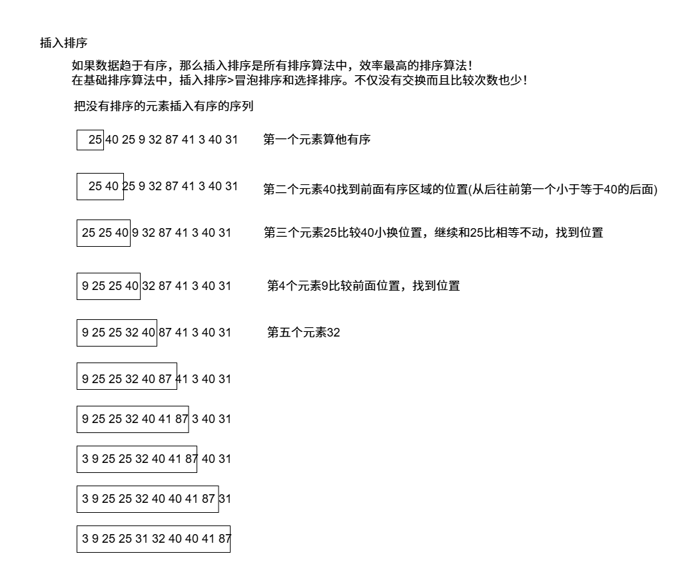

```c++
// 基础排序.cpp : 此文件包含 "main" 函数。程序执行将在此处开始并结束。
//

#include <iostream>
#include <stdlib.h>
#include <time.h>

//插入排序算法
void InsertSort(int arr[], int size)
{
    for (int i = 1;i < size;i++)
    {
        int val = arr[i];
        int j = i - 1;
        for (;j >= 0;j--)
        {
            if (arr[j] <= val)
            {
                break;
            }
            arr[j + 1] = arr[j];
        }
        arr[j + 1] = val;
    }
}

int main()
{
    int arr[10];
    srand(time(NULL));

    for (int i = 0;i < 10;i++)
    {
        arr[i] = rand() % 100 + 1;
    }
    for (int v : arr)
    {
        std::cout << v << " ";
    }
    std::cout << std::endl;
    InsertSort(arr, 10);
    for (int v : arr)
    {
        std::cout << v << " ";
    }
    std::cout << std::endl;
}
```

### 希尔排序

特点：可以看作是多路的插入排序，分组的数据越趋于有序，整体的数据也越趋于有序，插入排序效率完美体现。

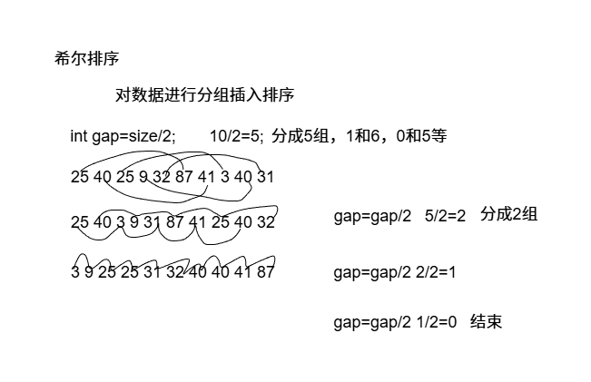

```c++
// 基础排序.cpp : 此文件包含 "main" 函数。程序执行将在此处开始并结束。
//

#include <iostream>
#include <stdlib.h>
#include <time.h>

//希尔排序
void ShellSort(int arr[], int size)
{
    for (int gap = size / 2;gap != 0;gap = gap / 2)
    {
        for (int i = gap;i < size;i++)
        {
            int val = arr[i];
            int j = i - gap;
            for (;j >= 0;j-=gap)
            {
                if (arr[j] <= val)
                {
                    break;
                }
                arr[j + gap] = arr[j];
            }
            arr[j + gap] = val;
        }
    }
}
int main()
{
    int arr[10];
    srand(time(NULL));

    for (int i = 0;i < 10;i++)
    {
        arr[i] = rand() % 100 + 1;
    }
    for (int v : arr)
    {
        std::cout << v << " ";
    }
    std::cout << std::endl;
    ShellSort(arr, 10);
    for (int v : arr)
    {
        std::cout << v << " ";
    }
    std::cout << std::endl;
}
```

### 四种排序排序性能对比：

| 排序算法           | 100000组(单位：ms) |
| ------------------ | ------------------ |
| 冒泡排序(效率最低) | 19.32s             |
| 选择排序(效率次之) | 4.066s             |
| 插入排序(效率最高) | 3.475s             |
| 希尔排序(效率更高) | 0.019s             |

| 排序算法 | 平均时间复杂度                 | 最好时间复杂度 | 最坏时间复杂度 | 空间复杂度 | 稳定性 |
| -------- | ------------------------------ | -------------- | -------------- | ---------- | ------ |
| 冒泡排序 | O(n^2)                         | O(n)           | O(n^2)         | O(1)       | 稳定   |
| 选择排序 | O(n^2)                         | O(n^2)         | O(n^2)         | O(1)       | 不稳定 |
| 插入排序 | O(n^2)                         | O(n)           | O(n^2)         | O(1)       | 稳定   |
| 希尔排序 | 依赖不同的增量序列设置O(n^1.3) | O(n)           | O(n^2)         | O(1)       | 不稳定 |

插入排序的效率最好，尤其在数据已经趋于有序的情况下，采用**插入排序效率最高**。

一般中等数据量的排序都用希尔排序，选择合适的增量序列，效率就已经不错了，如果数据量比较大，可以选择高级的排序算法，如快速排序。

### 快速排序

**冒泡排序的升级算法。**

每次选择基准数，把小于基准数的放到基准数的左边，把大于基准数的放到基准数的右边，采用“分治思想”处理剩余的序列元素，直到整个序列变为有序序列。

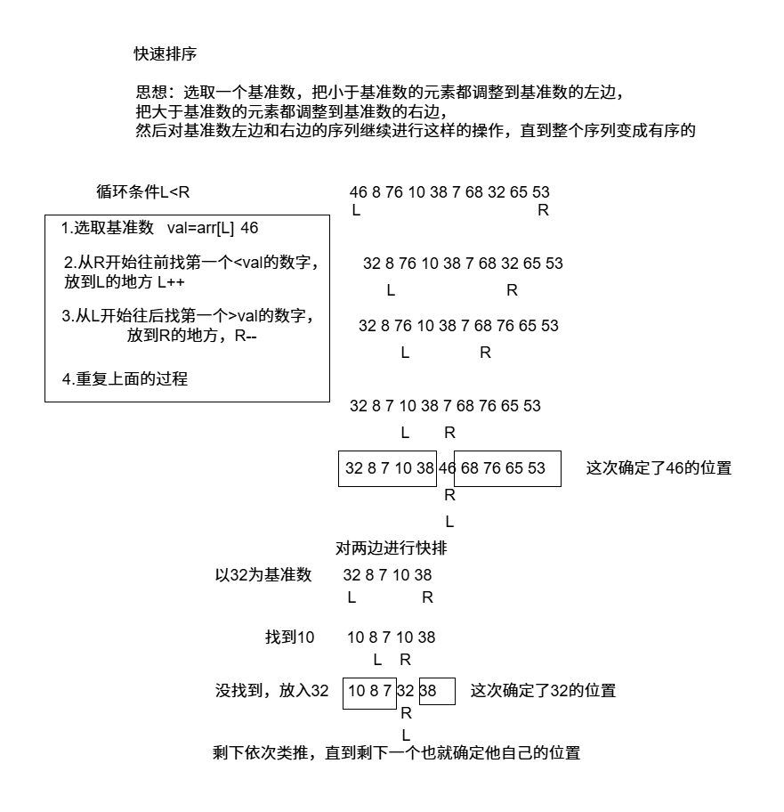

```c++
// 快速排序.cpp : 此文件包含 "main" 函数。程序执行将在此处开始并结束。
//

#include <iostream>
#include <stdlib.h>
#include <time.h>


//快排分割处理函数 时间复杂度(最好和平均): O(n*logn) 空间复杂度：O(logn) 递归的深度所占用的栈内存
//                  最坏时间复杂度：O(n^2) 空间复杂度O(n)
int Partation(int arr[], int l, int r)
{
    //记录基准数
    int val = arr[l];

    //一次快排处理
    while (l < r)
    {
        while (l<r && arr[r] > val)
        {
            r--;
        }
        if (l < r)
        {
            arr[l] = arr[r];
            l++;
        }
        while (l<r && arr[l]<val)
        {
            l++;
        }
        if (l < r)
        {
            arr[r] = arr[l];
            r--;
        }
    }
    //l==r的位置放基准数
    arr[l] = val;
    return l;
}
//快排的递归接口
void QuickSort(int arr[], int begin, int end)
{
    if (begin >= end)//快排递归结束条件
    {
        return;
    }
    //在[begin,end]区间的元素做一次快排分割处理
    int pos = Partation(arr, begin, end);
    //对基准数的左边和右边分别进行快排
    QuickSort(arr, begin, pos - 1);
    QuickSort(arr, pos + 1, end);
}
//快速排序
void QuickSort(int arr[], int size)
{
    return QuickSort(arr, 0, size - 1);
}
int main()
{
    int arr[10];
    srand(time(NULL));

    for (int i = 0;i < 10;i++)
    {
        arr[i] = rand() % 100 + 1;
    }
    for (int v : arr)
    {
        std::cout << v << " ";
    }
    std::cout << std::endl;
    QuickSort(arr, 10);
    for (int v : arr)
    {
        std::cout << v << " ";
    }
    std::cout << std::endl;
}
```

**算法效率提升：**

1. 对于小段趋于有序的序列采用插入排序。(设定序列小到一定数量使用插入排序)
2. 三数取中法。取序列中间的数arr[(l+r)/2],旨在挑选合适的基准数，防止快排退化成冒泡排序
3. 随机数法

### 归并排序

也采用“分治思想”，先进行序列划分，再进行元素的有序合并。

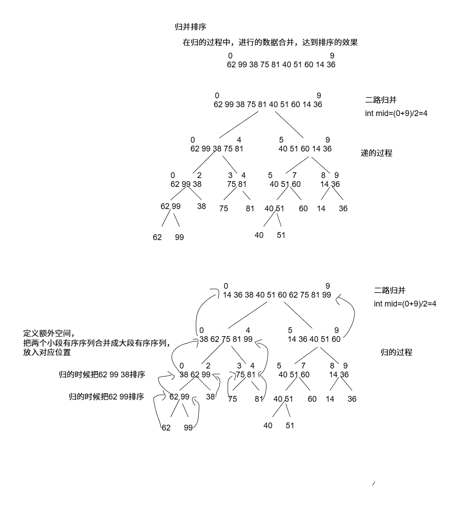

```c++
// 归并排序.cpp : 此文件包含 "main" 函数。程序执行将在此处开始并结束。
//

#include <iostream>
#include <stdlib.h>
#include <time.h>

//归并过程函数
void Merge(int arr[], int l, int m, int r, int* p)
{
    //int* p = new int[r - l + 1];
    int idx = 0;
    int i = l;
    int j = m + 1;
    while (i <= m && j <= r)
    {
        if (arr[i] <= arr[j])
        {
            p[idx++] = arr[i++];
        }
        else
        {
            p[idx++] = arr[j++];
        }
    }
    while (i <= m)
    {
        p[idx++] = arr[i++];
    }
    while (j <= r)
    {
        p[idx++] = arr[j++];
    }

    //再把合并好的大段有序结果，拷贝到原始arr数组[l,r]区间内
    for (i = l, j = 0;i <= r;i++, j++)
    {
        arr[i] = p[j];
    }
    //delete[] p;
    p = nullptr;
}
//归并排序递归接口
void MergeSort(int arr[], int begin, int end, int* p)
{
    //递归结束条件
    if (begin >= end)
        return;

    int mid = (begin + end) / 2;
    //先递
    MergeSort(arr, begin, mid, p);
    MergeSort(arr, mid + 1, end, p);
    //再归并 [begin,mid] [mid+1,end]把两个小段有序序列，合并成大段有序的序列
    Merge(arr, begin, mid, end, p);
}
//归并排序
void MergeSort(int arr[], int size)
{
    int* p = new int[size];
    MergeSort(arr, 0, size - 1, p);
    delete[]p;
}


int main()
{
    int arr[10];
    srand(time(NULL));

    for (int i = 0;i < 10;i++)
    {
        arr[i] = rand() % 100 + 1;
    }
    for (int v : arr)
    {
        std::cout << v << " ";
    }
    std::cout << std::endl;
    MergeSort(arr, 10);
    for (int v : arr)
    {
        std::cout << v << " ";
    }
    std::cout << std::endl;
}
```

### 堆排序

**二叉堆**

就是一颗**完全二叉树**，分为两种典型的堆，分别是**大根堆**和**小根堆**

满足0<=i<=(n-1)/2,n代表最后一个元素的下标。

如果arr[i]<=arr[2*i+1]&&arr[i]<=arr[2*i+1+2],就是**小根堆**

如果arr[i]>=arr[2*i+1]&&arr[i]>=arr[2*i+1+2],就是**大根堆**

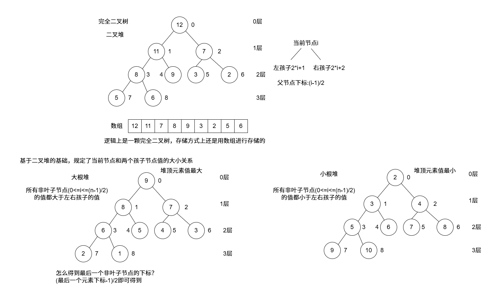

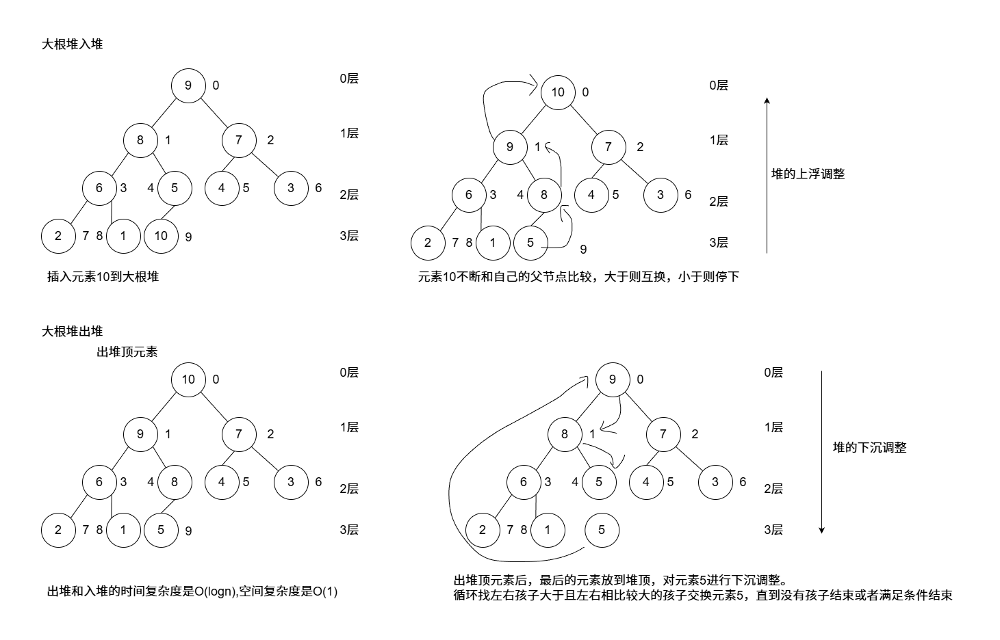

**基于堆的优先级队列代码实现：**

```c++
// 二叉堆.cpp : 此文件包含 "main" 函数。程序执行将在此处开始并结束。
//

#include <iostream>
#include <functional>
#include <stdlib.h>
#include <time.h>
//优先级队列实现 priority_queue
class PriorityQueue
{
public:
    using Comp = std::function<bool(int, int)>;
    PriorityQueue(int cap=20, Comp comp = std::greater<int>())
        :size_(0)
        , cap_(cap)
        , comp_(comp)
    {
        que_ = new int[cap_];
    }
    PriorityQueue(Comp comp)
        :size_(0)
        , cap_(20)
        , comp_(comp)
    {
        que_ = new int[cap_];
    }
    ~PriorityQueue()
    {
        delete[] que_;
        que_ = nullptr;
    }

public:
    //入堆操作
    void push(int val)
    {
        //判断扩容
        if (size_ == cap_)
        {
            int* p = new int[2 * cap_];
            memcpy(p, que_, cap_ * sizeof(int));
            delete[] que_;
            que_ = p;
            cap_ *= 2;
        }
        if (size_ == 0)
        {
            //只有一个元素，不用进行堆的上浮调整
            que_[size_] = val;
        }
        else
        {
            //堆里面有多个元素，需要进行上浮调整
            shiftUp(size_,val);
        }
        size_++;
    }
    //出堆操作
    void pop()
    {
        if (size_ == 0)
        {
            throw "container is empty!";
        }
        size_--;
        if (size_ > 0)
        {
            //删除堆顶元素，还有剩余的元素，要进行堆的下浮调整
            shiftDown(0,que_[size_]);
        }
    }
    bool empty() const
    {
        return size_ == 0;
    }
    int top() const
    {
        if (size_ == 0)
        {
            throw "container is empty!";
        }
        return que_[0];
    }
    int size() const
    {
        return size_;
    }
private:
    //入堆上浮调整 O(logn)
    void shiftUp(int i, int val)
    {
        while (i > 0) //最多计算到根节点
        {
            int father = (i - 1) / 2;
            if (comp_(val, que_[father]))
            {
                que_[i] = que_[father];
                i = father;
            }
            else
            {
                break;
            }
        }
        //把val放到i的位置
        que_[i] = val;
    }
    //出堆下沉调整 O(logn)
    void shiftDown(int i, int val)
    {
        //i下沉不能超过最后一个有孩子的节点
        //i <= (size - 2) / 2这里注意size为1时会出现负数所以改为2 * i + 1 < size_
        while (2 * i + 1 < size_)
        {
            int child = 2 * i + 1;//第i个节点的左孩子
            
            if (child + 1 < size_ && comp_(que_[child + 1], que_[child]))
            {
                //如果i节点的右孩子的值大于左孩子，child记录为右孩子
                child = child + 1;
            }
            if (comp_(que_[child], val))
            {
                que_[i] = que_[child];
                i = child;
            }
            else
            {
                break;//已经满足堆的性质，提前结束
            }
        }
        que_[i] = val;
    }
private:
    int* que_; //指向动态扩容的数组
    int size_; //数组元素的个数
    int cap_; //数组的总空间大小
    Comp comp_; //比较器对象
};
int main()
{
    //PriorityQueue que;//基于大根堆实现的优先级队列
    PriorityQueue que([](int a, int b)//基于小根堆实现的优先级队列
        {return a < b;});
    srand(time(NULL));
    for (int i = 0;i < 10;i++)
    {
        que.push(rand() % 100);
    }
    while (!que.empty())
    {
        std::cout << que.top() << " ";
        que.pop();
    }
    std::cout << std::endl;

}
```

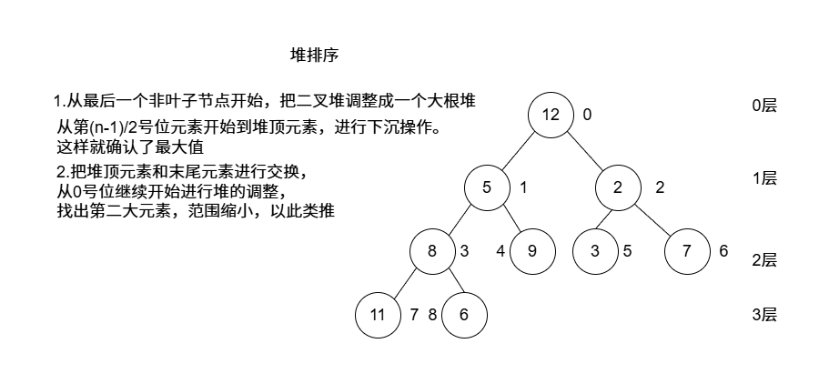

**堆排序代码：**

```c++
// 堆排序.cpp : 此文件包含 "main" 函数。程序执行将在此处开始并结束。
//

#include <iostream>
#include <stdlib.h>
#include <time.h>

//堆的下沉调整
void shiftDown(int arr[], int i, int size)
{
    int val = arr[i];
    //i <= (size - 2) / 2这里注意size为1时会出现负数所以改为2 * i + 1 < size
    while (2 * i + 1 < size)
    {
        int child = 2 * i + 1;
        if (child + 1 < size && arr[child + 1] > arr[child])
        {
            child = child + 1;
        }
        if (arr[child] > val)
        {
            arr[i] = arr[child];
            i = child; //i继续指向它的孩子
        }
        else
        {
            break;
        }
    }
    arr[i] = val;
}


//堆排序(大根堆) 从小到大排序 时间复杂度 O(n*logn) 空间复杂度O(1)
void HeapSort(int arr[], int size)
{
    int n = size - 1;
    //从最后一个非叶子节点
    for (int i = (n - 1) / 2;i >= 0;i--)
    {
        shiftDown(arr, i, size);
    }
    //把堆顶元素和末尾元素交换，从堆顶开始进行下沉操作
    for (int i = n;i > 0;i--)
    {
        int tmp = arr[i];
        arr[i] = arr[0];
        arr[0] = tmp;
        shiftDown(arr, 0, i);
    }
}

int main()
{
    int arr[10];
    srand(time(NULL));

    for (int i = 0;i < 10;i++)
    {
        arr[i] = rand() % 100 + 1;
    }
    for (int v : arr)
    {
        std::cout << v << " ";
    }
    std::cout << std::endl;
    HeapSort(arr, 10);
    for (int v : arr)
    {
        std::cout << v << " ";
    }
    std::cout << std::endl;
}
```

| 排序算法 | 平均时间复杂度 | 最好时间复杂度 | 最坏时间复杂度 | 空间复杂度    | 稳定性 |
| -------- | -------------- | -------------- | -------------- | ------------- | ------ |
| 堆排序   | O(n*logn)      | O(n*logn)      | O(n*logn)      | O(1)          | 不稳定 |
| 快速排序 | O(n*logn)      | O(n*logn)      | O(n^2)         | O(logn)->O(n) | 不稳定 |
| 归并排序 | O(n*logn)      | O(n*logn)      | O(n*logn)      | O(n)          | 稳定   |

### 快排&归并&堆排序&希尔性能测试

| 数据规模 | 快速排序 | 归并排序 | 希尔排序 | 堆排序  |
| -------- | -------- | -------- | -------- | ------- |
| 1000万   | 0.974s   | 1.605s   | 3.257s   | 2.274s  |
| 5000万   | 4.871s   | 8.471s   | 18.712s  | 14.718s |
| 1亿      | 9.717s   | 17.266s  | 41.887s  | 32.279s |

**1.不管是快排，或者归并排序，遍历元素的时候都是按照顺序遍历的，对CPU缓存是友好的(CPU缓存命中率高)。但是堆排序，访问元素的时候，是按照父子节点的关系访问的，并不是按照顺序访问的，所以排序过程中，不管是进行元素上浮调整，还是下沉调整，对CPU缓存不友好**

**2.堆排序的过程中，进行元素下沉调整所作的无效比较过多(因为它本身就小，所以最终下沉到的地方，和末尾位置相差不远，中间做了很多比较，无用功太多)**

### 高级算法的一些问题

**1.STL里sort算法用的是什么排序算法？**

**首先用的是快速排序算法，如果待排序的序列个数<=32变为插入排序，如果递归层数太深转为堆排序。**

**2.快速排序的时间复杂度不是稳定的nlogn,最坏情况会变成n^2,怎么解决复杂度恶化的问题？**

**三数取中(选择合理的基准数)**

**3.快速排序递归实现时，怎么解决递归层次过深的问题？**

**可以设计一个ideal,当ideal达到一个值后使用堆排。(stl::sort用法)**

**4.递归过深会引发什么问题？**

**函数开销变大导致栈内存溢出，程序挂掉。**

**5.怎么控制递归深度？如果达到递归深度了还没排完序怎么办？**

**达到递归深度可以使用非递归排序算法。**

**6.假设你只有100Mb的内存，需要对1Gb的数据进行排序，最合适的算法是归并算法**

### 基数排序

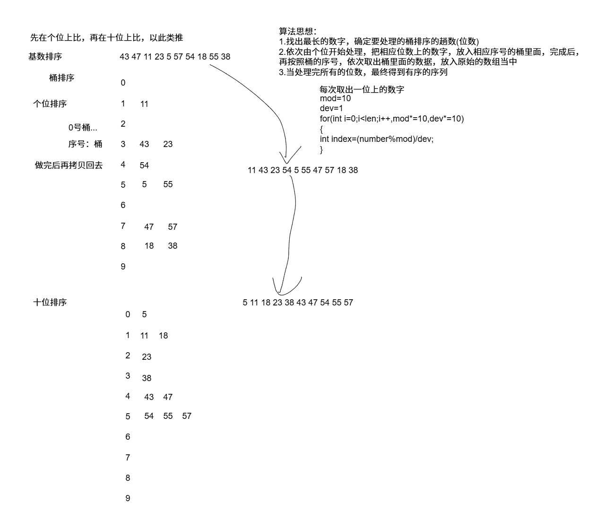

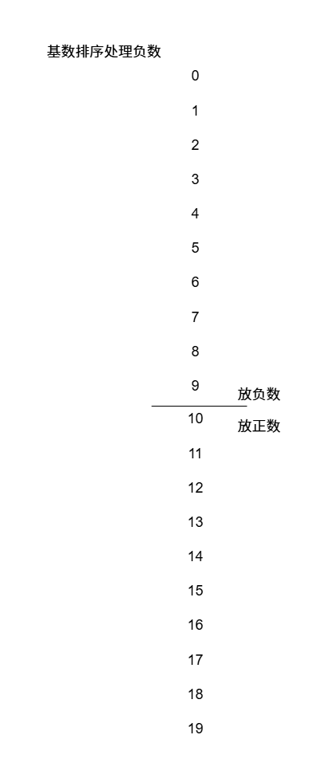


代码：

```c++
// 基数排序.cpp : 此文件包含 "main" 函数。程序执行将在此处开始并结束。
//

#include <iostream>
#include <stdlib.h>
#include <time.h>
#include <string>
#include <vector>
//基数排序代码 处理不了浮点数
void RadixSort(int arr[], int size)
{
    int maxData = arr[0];
    for (int i = 1;i < size;i++)
    {
        if (maxData < abs(arr[i]))
        {
            maxData = abs(arr[i]);
        }
    }
    int len = std::to_string(maxData).size();
    
    std::vector<std::vector<int>> vecs;
    int mod = 10;
    int dev = 1;
    for (int i = 0;i < len;i++, mod *= 10, dev *= 10)
    {
        vecs.resize(20); //20个桶，为了能处理负数
        for (int j = 0;j < size;j++)
        {
            //得到当前元素第i个位置的元素
            int index = arr[j] % mod / dev+10;
            vecs[index].push_back(arr[j]);
        }
        //依次遍历所有的桶，把元素拷贝回原始的数组当中
        int idx = 0;
        for (auto vec : vecs)
        {
            for (int v : vec)
            {
                arr[idx++] = v;
            }
        }
        vecs.clear();
    }
}
int main()
{
    int arr[10];
    srand(time(NULL));

    for (int i = 0;i < 10;i++)
    {
        arr[i] = rand() % 100 + 1;
    }
    for (int v : arr)
    {
        std::cout << v << " ";
    }
    std::cout << std::endl;
    RadixSort(arr, 10);
    for (int v : arr)
    {
        std::cout << v << " ";
    }
    std::cout << std::endl;
}
```

| 排序算法 | 平均时间复杂度 | 最好时间复杂度 | 最坏时间复杂度 | 空间复杂度 | 稳定性 |
| -------- | -------------- | -------------- | -------------- | ---------- | ------ |
| 基数排序 | O(nd)          | O(nd)          | O(nd)          | O(n)       | 稳定   |

## 哈希表

**散列表/哈希表定义：**

**使关键字和其存储位置满足关系：存储位置=f(关键字)，这是一种新的存储技术-散列技术。**

**散列技术是在记录的存储位置和它的关键字之间建立一个确定的对应关系f，使得每个关键字key对应一个存储位置f(key),在查找时，根据这个确定的对应关系找到给定key的映射f(key),如果待查找集合中存在这个记录，则必定在f(key)的位置上。**

**我们把这种对应关系f称为散列函数，又称为哈希函数。采用散列技术把记录存储在一块连续的存储空间中，这块连续的存储空间称为散列表或者哈希表**

**优势：适用于快速的查找，时间复杂度O(1)**

**缺点：占用内存空间比较大，哈希表的空间效率还是不够高。**

**散列函数：**

**设计特点：计算简单，散列地址分布均匀**

**散列冲突处理：**

- **线性探测**
- **链地址法**

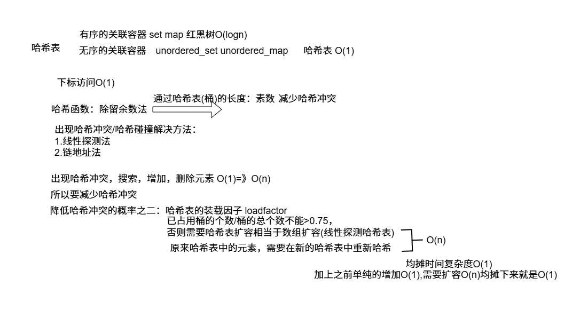

### 线性探测哈希表实现

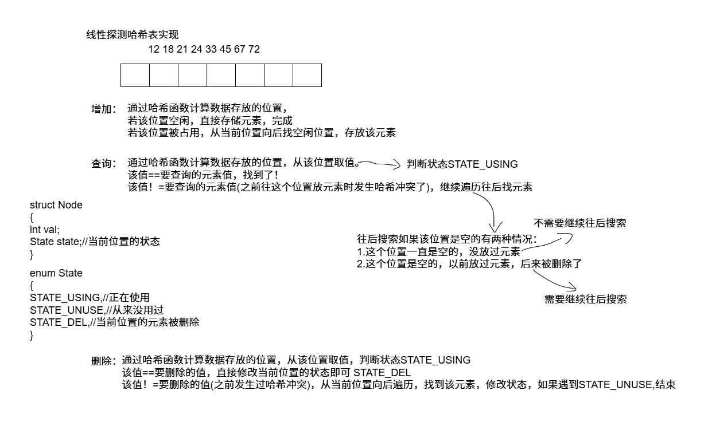

**代码实现：**

```c++
// 线性探测哈希表.cpp : 此文件包含 "main" 函数。程序执行将在此处开始并结束。
//

#include <iostream>

//桶的状态
enum State
{
    STATE_UNUSE,//从未使用的过的桶
    STATE_USING,//正在使用的桶
    STATE_DEL,//元素被删除了的桶
};

//桶的类型
struct Bucket
{
    Bucket(int key = 0, State state = STATE_UNUSE)
        :key_(key)
        , state_(state)
    {}
    int key_; //存储的数据
    State state_; //桶的当前状态
};

//线性探测哈希表类型
class HashTable
{
public:
    HashTable(int size=primes_[0],double loadFactor=0.75)
        :useBucketNum_(0)
        , loadFactor_(loadFactor)
        , primeIdx_(0)
    {
        //把用户传入的size调整到最近的比较大的素数上
        if (size != primes_[0])
        {
            for (;primeIdx_ < PRIME_SIZE;primeIdx_++)
            {
                if (primes_[primeIdx_] >= size)
                    break;
            }
            //用户传入的size值过大，已经超过最后一个素数，调整到最后一个素数
            if (primeIdx_ == PRIME_SIZE)
            {
                primeIdx_--;
            }
        }
        tableSize_ = primes_[primeIdx_];
        table_ = new Bucket[tableSize_];
    }

    ~HashTable()
    {
        delete[] table_;
        table_ = nullptr;
    }

public:
    //插入元素
    bool insert(int key)
    {
        //考虑扩容
        double factor = useBucketNum_*1.0 / tableSize_;
        std::cout << "factor:" << factor << std::endl;
        if (factor > loadFactor_)
        {
            //哈希表开始扩容
            expand();
        }

        int idx = key % tableSize_;

        int i = idx;
        do
        {
            if (table_[i].state_ != STATE_USING)
            {
                table_[i].state_ = STATE_USING;
                table_[i].key_ = key;
                useBucketNum_++;
                return true;
            }
            i = (i + 1) % tableSize_;
        } while (i != idx);

        throw "没有正常插入元素";
    }

    //删除元素
    bool erase(int key)
    {
        int idx = key % tableSize_;
        int i = idx;
        do
        {
            if (table_[i].state_ == STATE_USING && table_[i].key_ == key)
            {
                table_[i].state_ = STATE_DEL;
                useBucketNum_--;
            }
            i = (i + 1) % tableSize_;
        } while (table_[i].state_!=STATE_UNUSE && i != idx);

        return true;
    }

    //查询
    bool find(int key)
    {
        int idx = key % tableSize_;

        int i = idx;
        do
        {
            if (table_[i].state_ == STATE_USING && table_[i].key_ == key)
            {
                return true;
            }
            i = (i + 1) % tableSize_;
        } while (table_[i].state_ != STATE_UNUSE && i != idx);

        return false;
    }
private:
    //扩容操作
    void expand()
    {
        primeIdx_++;
        if (primeIdx_ == PRIME_SIZE)
        {
            throw "HashTable is too large! can not expand anymore";
        }

        Bucket* newTable = new Bucket[primes_[primeIdx_]];
        for (int i = 0;i < tableSize_;i++)
        {
            if (table_[i].state_ == STATE_USING) //旧表中有效的数据重新哈希放到扩容后的新表
            {
                int idx = table_[i].key_ % primes_[primeIdx_];

                int k = idx;
                do
                {
                    if (newTable[k].state_ != STATE_USING)
                    {
                        newTable[k].state_ = STATE_USING;
                        newTable[k].key_ = table_[i].key_;
                        break;
                    }
                    k = (k + 1) % primes_[primeIdx_];
                } while (k!=idx);
            }
        }

        delete[] table_;
        table_ = newTable;
        tableSize_ = primes_[primeIdx_];
    }
private:
    Bucket* table_; //指向动态开辟的哈希表
    int tableSize_; //哈希表当前的长度
    int useBucketNum_;//已经使用的桶的个数
    double loadFactor_; //哈希表的装载因子
    static const int PRIME_SIZE = 10;//素数表的大小
    static int primes_[PRIME_SIZE]; //素数表
    int primeIdx_;//当前使用的素数下标
};
int HashTable::primes_[PRIME_SIZE] = { 3,7,47,97,251,443,911,1471,42773 };

int main()
{
    HashTable htable;
    htable.insert(21);
    htable.insert(32);
    htable.insert(14);
    htable.insert(15);
    htable.insert(22);
    std::cout << htable.find(15) << std::endl;
    htable.erase(15);
    std::cout << htable.find(15) << std::endl;
}
```

### 链式哈希表实现

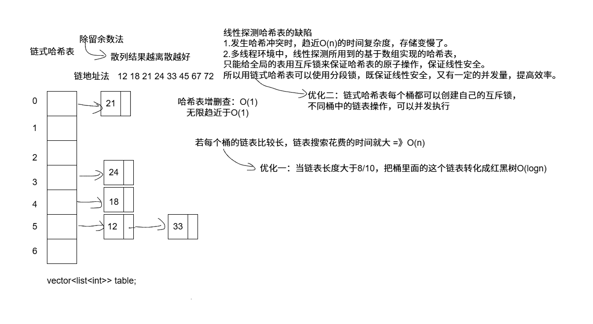

**代码实现：**

```c++
// 链式哈希表.cpp : 此文件包含 "main" 函数。程序执行将在此处开始并结束。
//

#include <iostream>
#include <vector>
#include <list>
#include <algorithm>
//链式哈希表
class HashTable
{
public:
    HashTable(int size = primes_[0], double loadFactor = 0.75)
        :useBucketNum_(0)
        , loadFactor_(loadFactor)
        , primeIdx_(0)
    {
        if (size != primes_[0])
        {
            for (;primeIdx_ < PRIME_SIZE;primeIdx_++)
            {
                if (primes_[primeIdx_] >= size)
                {
                    break;
                }
            }
            if (primeIdx_ == PRIME_SIZE)
            {
                primeIdx_--;
            }
        }
        table_.resize(primes_[primeIdx_]);
    }
public:
    //增加元素 不能重复插入key
    void insert(int key)
    {
        //判断扩容
        double factor = useBucketNum_ * 1.0 / table_.size();
        std::cout << "factor:" << factor << std::endl;

        if (factor > loadFactor_)
        {
            expand();
        }

        int idx = key % table_.size();
        if (table_[idx].empty())
        {
            useBucketNum_++;
            table_[idx].emplace_front(key);
        }
        else
        {
            //使用全局::find泛型算法去重
            auto it = std::find(table_[idx].begin(), table_[idx].end(), key);
            if (it == table_[idx].end())
            {
                //key不存在
                table_[idx].emplace_front(key);
            }
        }
    }

    //删除元素
    void erase(int key)
    {
        int idx = key % table_.size();
        auto it = std::find(table_[idx].begin(), table_[idx].end(), key);
        if (it != table_[idx].end())
        {
            //找到了
            table_[idx].erase(it);
            if (table_[idx].empty())
            {
                useBucketNum_;
            }
        }
    }

    //搜索元素
    bool find(int key)
    {
        int idx = key % table_.size();
        auto it = std::find(table_[idx].begin(), table_[idx].end(), key);
        return it != table_[idx].end();
    }
private:
    //扩容函数
    void expand()
    {
        if (primeIdx_ + 1 == PRIME_SIZE)
        {
            throw "hashtable can not expand anymore!";
        }
        primeIdx_++;
        useBucketNum_ = 0;

        std::vector<std::list<int>> oldTable;
        //swap会不会效率很低？allocator相同，是很高效的，只是交换了两个容器的成员变量
        table_.swap(oldTable);

        table_.resize(primes_[primeIdx_]);

        for (auto list : oldTable)
        {
            for (auto key : list)
            {
                int idx = key % table_.size();
                if (table_.empty())
                {
                    useBucketNum_++;
                }
                table_[idx].emplace_front(key);
            }
        }
    }
private:
    std::vector<std::list<int>> table_; //哈希表的数据结构
    int useBucketNum_;//记录桶的个数
    double loadFactor_;//记录哈希表装载因子

    static const int PRIME_SIZE = 10;//素数表的大小
    static int primes_[PRIME_SIZE]; //素数表
    int primeIdx_;//当前使用的素数下标
};
int HashTable::primes_[PRIME_SIZE] = { 3,7,47,97,251,443,911,1471,42773 };
//如果链表节点过长：散列结果比较集中(散列函数有问题！)
int main()
{
    HashTable htable;
    htable.insert(21);
    htable.insert(32);
    htable.insert(14);
    htable.insert(15);
    htable.insert(22);
    htable.insert(67);
    std::cout << htable.find(15) << std::endl;
    htable.erase(15);
    std::cout << htable.find(15) << std::endl;
}
```

## 大数据处理

### 查重

- 哈希表

  查重或者统计重复的次数。查询的效率高但是占用内存空间较大。

- 位图

  位图法，就是用一个位(0/1)来存储数据的状态，比较适合状态简单，数据量比较大，要求内存使用率低的问题场景。

  位图法解决问题，首先需要知道待处理数据中的最大值，然后按照size=(maxNumber/32)+1的大小来开辟一个int类型的数组,当需要在位图查找某个元素是否存在的时候，首先需要计算该数字对应的数组中的比特位，然后读取值，0表示不存在，1表示已存在。

  位图法有一个很大的缺点，就是数据没有多少，但是最大值却很大，比如有10个整数，最大值是10亿，那么就得按10亿这个数字计算开辟位图数组的大小，太浪费内存空间。

  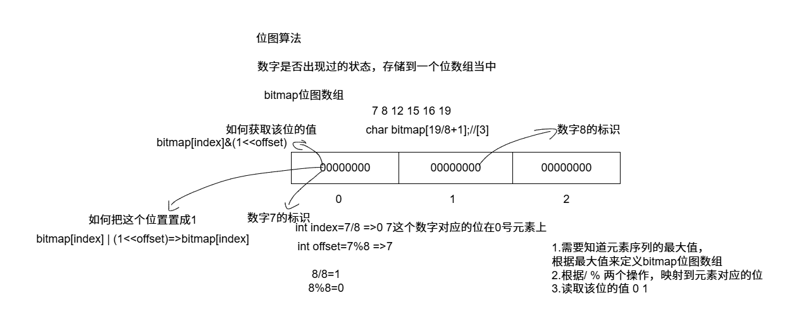

- 布隆过滤器

  在内存有所限制的情况下，快速判断一个元素是否在一个集合(容器)当中，还可以使用布隆过滤器。在使用哈希表比较占内存的情况下，它是一种更高级的“位图法”解决方案，它避免了简单位图法的缺陷。
  
  Bloom Filter是通过一个位数组+k个哈希函数构成的。
  
  Bloom Filter的空间和时间利用率都很高，但是它有一定的错误率。虽然错误率很低，Bloom Filter判断某个元素不在一个集合中，那该元素肯定不在集合中；Bloom Filter判断某个元素在一个集合中，那该元素有可能在，有可能不在集合当中。
  
  Bloom Filter的查找错误率，当然和位数组的大小，以及哈希函数的个数有关系，具体的错误率计算有相应的公式
  
  Bloom Filter默认只支持add增加和query查询操作，不支持delete删除操作(因为存储的状态位有可能也是其他数据的状态位，删除后导致其他元素查找判断出错)。
  
  Bloom Filter增加元素的过程：把元素的值通过k个哈希函数进行计算，得到k个值，然后把值当作位数组的下标，在位数组中把相应k个值修改为1。
  
  Bloom Filter查询元素的过程：把元素的值通过k个哈希函数进行计算，得到k个值，然后把值当作位数组的下标，看看相应位数组下标标识的值是否全部是1，如果有一个1为0，表示元素不存在(判断不存在绝对正确)；如果都为1，表示元素存在(判断存在有错误率)。
  
  很显然，过小的布隆过滤器很快所有的bit位均为1，那么查询任何值都会返回“可能存在”，起不到过滤的目的。布隆过滤器的长度会直接影响误报率，布隆过滤器越长其误报率越小。另外，哈希函数的个数也需要权衡，个数越多则布隆过滤器bit位置为1的速度越快，且布隆过滤器的效率越低；但是如果太少的话，那误报率就会变高。
  
  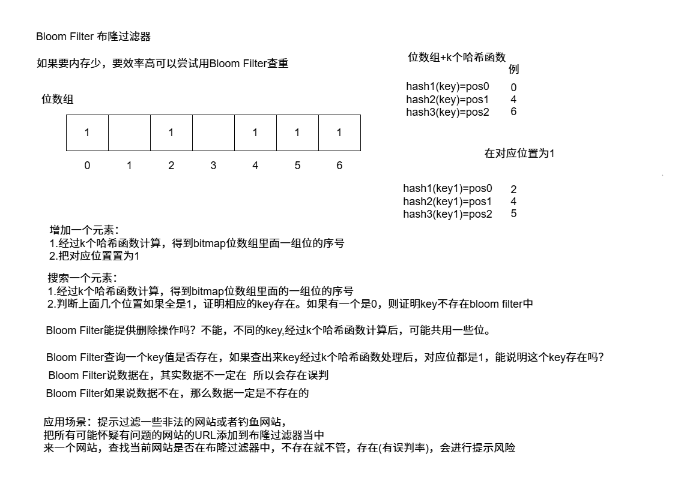

#### 哈希表应用查重

**代码实现：**

```c++
// 大数据查重.cpp : 此文件包含 "main" 函数。程序执行将在此处开始并结束。
//

#include <iostream>
#include <vector>
#include <unordered_set>
#include <unordered_map>

#include <stdlib.h>
#include <time.h>

#include <string>
#if 0
int main()
{
    //模拟问题，vector中放原始的数据
    std::vector<int> vec;

    srand(time(NULL));

    for (int i = 0;i < 10000;i++)
    {
        vec.push_back(rand() % 10000);
    }

    //找第一个出现重复的数字
    //找所有重复出现的数字
    std::unordered_set<int> s1;
    for (auto key : vec)
    {
        auto it = s1.find(key);//O(1)
        if (it == s1.end())
        {
            s1.insert(key);
        }
        else
        {
            std::cout << "第一个重复的key:" << key << std::endl;
            break;//找所有重复的，去掉break
        }
    }
    
    //统计重复数字以及出现的次数
    std::unordered_map<int, int> m1;
    for (int key : vec)
    {
        auto it = m1.find(key);
        if (it == m1.end())
        {
            m1.emplace(key, 1);
        }
        else
        {
            it->second += 1;
        }
    }
    for (auto pair : m1)
    {
        if (pair.second > 1)
        {
            std::cout << "key:" << pair.first << "出现的次数：" << pair.second << std::endl;
        }
    }

    //一组数据有些数字是重复的，把重复的数字过滤掉，每个数字只出现一次
    std::unordered_set<int> s2;//unordered_set本身不允许重复
    for (auto key : vec)
    {
        s1.emplace(key);
    }
 
}
#endif

int main()
{
    std::string src = "jjhfgiyurtytrs";
    //让你找出第一个没有重复出现过的字符
    std::unordered_map<char, int> m;
    for (char ch : src)
    {
        m[ch]++;
    }
    for (char ch : src)
    {
        if (m[ch] == 1)
        {
            std::cout << "第一个没有重复出现过的字符是：" << ch << std::endl;
            return 0;
        }
    }
    std::cout << "所有字符都有重复出现过！" << std::endl;
    return 0;
    
}

/*
查重的面试相关问题

有两个文件分别是a和b,里面放了很多ip地址(url地址/email地址)，让你找出来两个文件重复的ip,输出出来
===》把a文件中所有的ip存放在一个哈希表中，然后遍历文件b,每遍历一个ip，在哈希表中查询一下，有则输出，没有则继续遍历

有两个文件分别是a和b，各自存放约1亿条ip地址，每个ip地址是4个字节，限制内存100M,让你找出来两个文件中重复的ip地址并且输出
===》把两个文件里的ip通过相同的除留余数法放到10个文件中，文件a和文件b分别有10个文件放入，之后把a1文件的ip放入内存哈希表中，依次把
b1文件里ip拿出查询哈希表，查到即为重复。以此类推a1放哈希表查b1,a2放哈希表查b2...
*/
```

#### 位图法应用查重

```c++
// 大数据查重-位图.cpp : 此文件包含 "main" 函数。程序执行将在此处开始并结束。
//

#include <iostream>
#include <vector>
#include <stdlib.h>
#include <time.h>
#include <memory>

/*
有1亿个整数，最大值不超过1亿，问哪些元素重复了？
谁是第一个重复的？谁是第一个不重复的？(这个问题单位图处理不了)内存限制100M

1亿=100M
100M*4个字节=400M
若用哈希表就要用800M

不用哈希表就可以用位图法
int bitmap[100000000/32+1] 3.2M*4=13.2M

推荐的数据序列：数据的个数>=序列里面数字的最大值
*/
int main()
{
    std::vector<int> vec{ 12,78,90,12,123,8,9 };

    //定义位图数组
    int max = vec[0];
    for (int i = 1;i < vec.size();i++)
    {
        if (vec[i] > max)
            max = vec[i];
    }
    std::cout << max << std::endl;
    int* bitmap = new int[max / 32 + 1]();
    std::unique_ptr<int> ptr(bitmap);

    //找第一个重复出现的数字
    for (auto key : vec)
    {
        int index = key / 32;
        int offset = key % 32;

        //取key对应的位的值
        if (0 == (bitmap[index] & (1 << offset)))
        {
            //表示key没有出现过
            bitmap[index] |= (1 << offset);
        }
        else
        {
            std::cout << key << "是第一个重复出现的数字" << std::endl;
            return 0;//如果找所有重复的数字，这句注释
        }
    }

}
```

#### **布隆过滤器应用查重**

```c++
// 布隆过滤器.cpp : 此文件包含 "main" 函数。程序执行将在此处开始并结束。
//

#include <iostream>
#include <vector>
#include "stringhash.hpp"
#include <string>

//布隆过滤器实现
class BloomFilter
{
public:
    BloomFilter(int bitSize = 1471)
        :bitSize_(bitSize)
    {
        bitMap_.resize(bitSize_ / 32 + 1);
    }
public:
    //添加元素
    void setBit(const char* str)
    {
        //计算k组哈希函数的值
        int idx1 = BKDRHash(str) % bitSize_;
        int idx2 = RSHash(str) % bitSize_;
        int idx3 = APHash(str) % bitSize_;

        //把相应的idx1,idx2,idx3这几个位全部置1
        int index=0;
        int offset=0;

        index = idx1 / 32;
        offset = idx1 % 32;
        bitMap_[index] |= (1 << offset);

        index = idx2 / 32;
        offset = idx2 % 32;
        bitMap_[index] |= (1 << offset);

        index = idx3 / 32;
        offset = idx3 % 32;
        bitMap_[index] |= (1 << offset);
    }
    //查询元素
    bool getBit(const char* str)
    {
        //计算k组哈希函数的值
        int idx1 = BKDRHash(str) % bitSize_;
        int idx2 = RSHash(str) % bitSize_;
        int idx3 = APHash(str) % bitSize_;

        int index = 0;
        int offset = 0;

        index = idx1 / 32;
        offset = idx1 % 32;
        if (0 == (bitMap_[index] & (1 << offset)))
        {
            return false;
        }

        index = idx2 / 32;
        offset = idx2 % 32;
        if (0 == (bitMap_[index] & (1 << offset)))
        {
            return false;
        }

        index = idx3 / 32;
        offset = idx3 % 32;
        if (0 == (bitMap_[index] & (1 << offset)))
        {
            return false;
        }

        return true;
    }
private:
    int bitSize_; //位图的长度
    std::vector<int> bitMap_; //位图数组
};

//URL黑名单
class BlackList
{
public:
    void add(std::string url)
    {
        blockList_.setBit(url.c_str());
    }
    bool query(std::string url)
    {
        return blockList_.getBit(url.c_str());
    }
private:
    BloomFilter blockList_;
};
int main()
{
    BlackList list;
    list.add("http://www.baidu.com");
    list.add("http://www.360buy.com");
    list.add("http://www.tmall.com");
    list.add("http://www.tencent.com");

    std::string url = "http://www.tmall.com";
    std::cout << list.query(url) << std::endl;
    std::string url1 = "http://www.mall.com";
    std::cout << list.query(url1) << std::endl;
}
```

### 求top k问题

- 大/小根堆

  利用大根堆过滤前top k小的数据；小根堆过滤前top k大的数据

- 快排分割

  利用快排分割函数每次返回的基准数的位置，找出前top k大的或者前top k小的数据

#### 大/小根堆求解top k

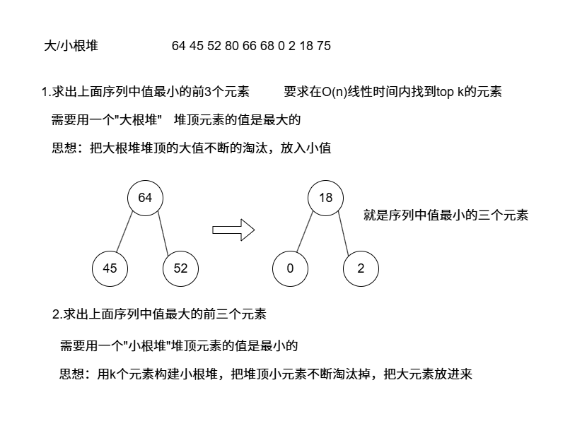

**代码实现**

```c++
// 大数据top k -大小根堆.cpp : 此文件包含 "main" 函数。程序执行将在此处开始并结束。
//

#include <iostream>
#include <time.h>
#include <stdlib.h>
#include <vector>
#include <queue>
#include <functional>
#include <unordered_map>

#if 0
int main()
{
    std::vector<int> vec;
    srand(time(NULL));
    for (int i = 0;i < 1000;i++)
    {
        vec.push_back(rand() % 10000);
    }

#if 0
    //求vec中值最小的前5个元素
    std::priority_queue<int> maxheap;
    int k = 5;

    //由前k个元素构建一个大根堆
    for (int i = 0;i < 5;i++)
    {
        maxheap.push(vec[i]);
    }

    //遍历剩余的元素直到最后
    for (int i = 5;i < vec.size();i++)
    {
        if (maxheap.top() > vec[i])
        {
            maxheap.pop();
            maxheap.push(vec[i]);
        }
    }

    //输出结果
    while (!maxheap.empty())
    {
        std::cout << maxheap.top() << "　";
        maxheap.pop();
    }
#endif

    //求vec中值最大的前5个元素
    std::priority_queue<int,std::vector<int>,std::greater<int>> minheap;
    int k = 5;

    //由前k个元素构建一个大根堆
    for (int i = 0;i < 5;i++)
    {
        minheap.push(vec[i]);
    }

    //遍历剩余的元素直到最后
    for (int i = 5;i < vec.size();i++)
    {
        if (minheap.top() < vec[i])
        {
            minheap.pop();
            minheap.push(vec[i]);
        }
    }

    //输出结果
    while (!minheap.empty())
    {
        std::cout << minheap.top() << "　";
        minheap.pop();
    }
}
#endif

//查重和top k问题综合起来
int main()
{
    std::vector<int> vec;
    srand(time(NULL));
    for (int i = 0;i < 10000;i++)
    {
        vec.push_back(rand() % 1000);
    }

#if 0
    //统计重复次数最小的前3个数字
    std::unordered_map<int, int> map;
    int k = 3;
    for (auto key : vec)
    {
        map[key]++;
    }
    //放入大根堆的时候，需要放key-value键值对
    using Type = std::pair<int, int>;
    using Comp = std::function<bool(Type&, Type&)>;
    std::priority_queue<Type, std::vector<Type>, Comp> maxheap([](Type &a,Type &b)->bool
        {
            return a.second < b.second;
        });

    auto it = map.begin();
    for (int i = 0;i < k;i++,++it)
    {
        maxheap.push(*it);
    }

    for (;it != map.end();++it)
    {
        if (maxheap.top().second > it->second)
        {
            maxheap.pop();
            maxheap.push(*it);
        }
    }

    while (!maxheap.empty())
    {
        std::cout << "key:" << maxheap.top().first << " cnt:" << maxheap.top().second << std::endl;
        maxheap.pop();
    }
#endif

    //统计重复次数最大的前3个数字
    std::unordered_map<int, int> map;
    int k = 3;
    for (auto key : vec)
    {
        map[key]++;
    }
    //放入大根堆的时候，需要放key-value键值对
    using Type = std::pair<int, int>;
    using Comp = std::function<bool(Type&, Type&)>;
    std::priority_queue<Type, std::vector<Type>, Comp> minheap([](Type& a, Type& b)->bool
        {
            return a.second > b.second;
        });

    auto it = map.begin();
    for (int i = 0;i < k;i++, ++it)
    {
        minheap.push(*it);
    }

    for (;it != map.end();++it)
    {
        if (minheap.top().second < it->second)
        {
            minheap.pop();
            minheap.push(*it);
        }
    }

    while (!minheap.empty())
    {
        std::cout << "key:" << minheap.top().first << " cnt:" << minheap.top().second << std::endl;
        minheap.pop();
    }
}
```

#### 快排分割求解top k

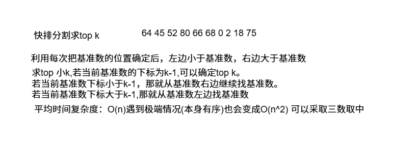

**代码实现：**

```c++
// 大数据top k-快排分割.cpp : 此文件包含 "main" 函数。程序执行将在此处开始并结束。
//

#include <iostream>

//快排分割函数
int Partation(int arr[], int begin, int end)
{
    int val = arr[begin];
    int i = begin;
    int j = end;
    //这里是求top小k个，若求top大k个就是把下面判断条件换为
    while (i < j)
    {
        while (i<j && arr[j] > val)//arr[j]<val
            j--;

        if (i < j)
        {
            arr[i] = arr[j];
            i++;
        }
        while (i < j && arr[i] < val)//arr[i]>val
            i++;
        if (i < j)
        {
            arr[j] = arr[i];
            j--;
        }
    }
    arr[i] = val;
    return i;
}


//求top k的函数
void SelectTopK(int arr[], int begin, int end, int k)
{
    int pos = Partation(arr, begin, end);
    if (pos == k - 1)
    {
        return;
    }
    else if (pos > k - 1)
    {
        SelectTopK(arr, begin, pos - 1,k);
    }
    else
    {
        SelectTopK(arr, pos + 1, end, k);
    }
}
int main()
{
    int arr[] = { 64,45,52,80,66,68,0,2,18,75 };
    int size = sizeof(arr) / sizeof(arr[0]);

    //求值最小的前三个元素
    int k = 3;
    SelectTopK(arr, 0, size - 1, k);

    for (int i = 0;i < k;i++)
    {
        std::cout << arr[i] << " ";
    }
    std::cout << std::endl;
}
```

