## MySQL基础

### MySQL介绍

1. 关系型数据库(**有行有列**) **SQLite(进程内的db)**  NOSQL(**非关系数据库)键值对**（key-value）:redis leveldb rocksdb 大数据分析列式数据库 Hbase
2. 大家熟悉的关系型数据库还有SQL Server,Oracle,MySQL,MariaDB,DB2
3. MySQL区别于其他关系型数据库最大的一个特点就是**支持插件式的存储引擎**，支持如**InnoDB,MyISAM,Memory**等
4. MySQL设计成**C/S模型**
5. MySQL的服务器模型采用的是**I/O复用+可伸缩的线程池**，是实现网络服务器的经典模型。用的是**select+线程池。**这里为什么不设计成epoll+线程池，或者更高效的模型，**用select,因为网络I/O快，但是MySQL还需要把数据存储到磁盘，磁盘I/O速度是比较慢的，所以速度匹配即可，没必要做那么快**。

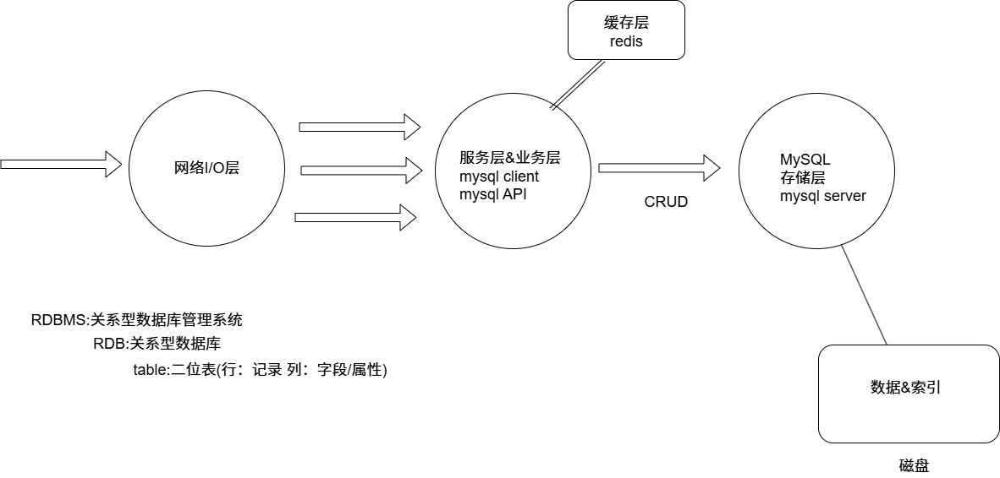

**Windows下MySQL安装目录中有一个my.ini文件，可以做一些配置调优。在data文件夹中，每建立一个数据库会有一个文件夹与其对应。**

**Linux下mysql的配置文件 /etc/my.cnf，没有可以自己创建**

```bash
#在root用户下
netstat -tanp #查看mysql是否启动,这个命令主要显示当前系统的所有 TCP 连接及其状态，并显示对应的进程信息。
service mysql start #启动mysql
```

### MySQL数据类型

**MySQL数据类型定义了数据的大小范围，因此使用时选择合适的类型，不仅会降低表占用的磁盘空间，间接减少了磁盘I/O的次数，提高了表的访问效率，而且索引的效率也和数据的类型息息相关。**

#### **整数类型（Integer Types）**

| 类型               | 大小（字节） | 范围（有符号）                                          | 范围（无符号）                  | 描述           |
| ------------------ | ------------ | ------------------------------------------------------- | ------------------------------- | -------------- |
| `TINYINT`          | 1            | -128 到 127                                             | 0 到 255                        | 很小的整数     |
| `SMALLINT`         | 2            | -32,768 到 32,767                                       | 0 到 65,535                     | 小整数         |
| `MEDIUMINT`        | 3            | -8,388,608 到 8,388,607                                 | 0 到 16,777,215                 | 中等大小的整数 |
| `INT` 或 `INTEGER` | 4            | -2,147,483,648 到 2,147,483,647                         | 0 到 4,294,967,295              | 常用整数类型   |
| `BIGINT`           | 8            | -9,223,372,036,854,775,808 到 9,223,372,036,854,775,807 | 0 到 18,446,744,073,709,551,615 | 大整数         |

可加上 `UNSIGNED` 修饰符来存储更大的非负整数

age INT(9)：整型占用内存的大小是固定的，和具体的类型是强相关的。(M)只是代表整数显示的宽度

####  **浮点与定点类型（Floating-Point and Fixed-Point Types）**

**推荐DECIMAL,FLOAT和DOUBLE数据越界不会报错，DECIMAL会报错**

| 类型                             | 描述         | 范围和精度                                      |
| -------------------------------- | ------------ | ----------------------------------------------- |
| `FLOAT(M,D)`                     | 单精度浮点数 | 近似值，4字节，M是总位数，D是小数位数 7位精度   |
| `DOUBLE(M,D)` 或 `REAL(M,D)`     | 双精度浮点数 | 近似值，8字节，M是总位数，D是小数位数  15位精度 |
| `DECIMAL(M,D)` 或 `NUMERIC(M,D)` | 定点数       | 精确值，适合存储货币等对精度要求高的场景        |

- `M`: 精度（总位数），`D`: 小数位数
- `DECIMAL` 使用字符串进行存储，防止浮点误差
- 如果 `M` 和 `D` 不指定，MySQL 默认为 `DECIMAL(10,0)`

#### **字符型类型**

| 类型         | 最大长度                              | 是否定长 | 是否可设默认值 | 特点说明                            | 典型用途                 |
| ------------ | ------------------------------------- | -------- | -------------- | ----------------------------------- | ------------------------ |
| `CHAR(M)`    | 最多 255 字符                         | ✅        | ✅              | 固定长度，右侧自动补空格            | 固定长度：手机号、身份证 |
| `VARCHAR(M)` | 取决于字符集（如 utf8mb4 最多 21844） | ❌        | ✅              | 变长字符串，节省空间，需额外1-2字节 | 姓名、标题、备注         |
| `TINYTEXT`   | 255 字节                              | ❌        | ❌              | 极短文本，不能设默认值              | 简短评论、小段文字       |
| `TEXT`       | 64 KB                                 | ❌        | ❌              | 常用文本类型，不能设默认值          | 文章正文、用户简介       |
| `MEDIUMTEXT` | 16 MB                                 | ❌        | ❌              | 中大型文本                          | 博文、报告内容           |
| `LONGTEXT`   | 4 GB                                  | ❌        | ❌              | 超大文本                            | 大文档、日志             |

| 类型           | 最大长度        | 特点说明                             | 用途举例               |
| -------------- | --------------- | ------------------------------------ | ---------------------- |
| `BINARY(M)`    | 最多 255 字节   | 类似 `CHAR`，存储二进制数据，定长    | 加密哈希、固定密钥存储 |
| `VARBINARY(M)` | 最多 65535 字节 | 类似 `VARCHAR`，变长二进制字符串     | 二进制令牌、签名       |
| `TINYBLOB`     | 255 字节        | 与 `TINYTEXT` 类似，但用于二进制数据 | 小图标、缩略图         |
| `BLOB`         | 64 KB           | 与 `TEXT` 类似，用于二进制内容       | 图像、音频、文件       |
| `MEDIUMBLOB`   | 16 MB           | 中等大小二进制对象                   | 视频、音频中等资源     |
| `LONGBLOB`     | 4 GB            | 超大二进制对象                       | 文件存储、大附件       |

#### **日期和时间类型**

| 类型        | 占用空间 | 范围/格式                                          | 精度   | 用途示例           |
| ----------- | -------- | -------------------------------------------------- | ------ | ------------------ |
| `DATE`      | 3 字节   | `1000-01-01` 到 `9999-12-31`                       | 到“日” | 出生日期、订单日期 |
| `TIME`      | 3 字节   | `-838:59:59` 到 `838:59:59`                        | 到“秒” | 持续时间、工时     |
| `DATETIME`  | 8 字节   | `1000-01-01 00:00:00` 到 `9999-12-31 23:59:59`     | 到“秒” | 记录某一精确时刻   |
| `TIMESTAMP` | 4 字节   | `1970-01-01 00:00:01` UTC 到 `2038-01-19 03:14:07` | 到“秒” | 创建时间、修改时间 |
| `YEAR`      | 1 字节   | `1901` 到 `2155`                                   | 到“年” | 出厂年份、学年     |

#### 枚举与集合类型（可存储预定义字符串）

| 类型        | 特点说明                                                | 示例用途                                      |
| ----------- | ------------------------------------------------------- | --------------------------------------------- |
| `ENUM(...)` | 从固定字符串列表中选一个值，实际存储为整数索引（1字节） | 性别、状态（如 `'男','女'`、`'启用','禁用'`） |
| `SET(...)`  | 可多选，存储为位图（1~8字节），最多支持 64 个选项       | 标签、用户权限、兴趣爱好                      |

### MySQL运算符

#### 算数运算符

| 运算符 | 含义         | 示例                 | 结果  |
| ------ | ------------ | -------------------- | ----- |
| `+`    | 加法         | `5 + 3`              | `8`   |
| `-`    | 减法         | `5 - 3`              | `2`   |
| `*`    | 乘法         | `5 * 3`              | `15`  |
| `/`    | 除法         | `5 / 2`              | `2.5` |
| `DIV`  | 整除         | `5 DIV 2`            | `2`   |
| `%`    | 取模（余数） | `5 % 2` 或 `5 MOD 2` | `1`   |
| `MOD`  | 同 `%`       | `5 MOD 3`            | `2`   |

#### 逻辑运算符

| 运算符 | 名称            | 示例                        | 说明                           |
| ------ | --------------- | --------------------------- | ------------------------------ |
| `AND`  | 逻辑与          | `age > 18 AND gender = 'M'` | 两个条件都为真，结果才为真     |
| `OR`   | 逻辑或          | `score > 90 OR grade = 'A'` | 至少一个条件为真，结果为真     |
| `NOT`  | 逻辑非          | `NOT (age < 18)`            | 取反，原来为真变为假，反之亦然 |
| `XOR`  | 逻辑异或        | `TRUE XOR FALSE`            | 仅当两个值不同，结果才为真     |
| `!`    | 逻辑非（简写）  | `!is_deleted`               | 等价于 `NOT is_deleted`        |
| `&&`   | 与（MySQL兼容） | `a > 5 && b < 10`           | 等价于 `AND`                   |
| `||`   | 逻辑或          |                             |                                |

#### 比较运算符

| 运算符                    | 含义                  | 示例                              | 结果                      |
| ------------------------- | --------------------- | --------------------------------- | ------------------------- |
| `=`                       | 等于                  | `age = 18`                        | `true` 或 `false`         |
| `!=` 或 `<>`              | 不等于                | `name != 'Tom'`                   | `true` 或 `false`         |
| `>`                       | 大于                  | `score > 60`                      | `true` 或 `false`         |
| `<`                       | 小于                  | `score < 60`                      | `true` 或 `false`         |
| `>=`                      | 大于等于              | `score >= 90`                     | `true` 或 `false`         |
| `<=`                      | 小于等于              | `score <= 100`                    | `true` 或 `false`         |
| `<=>`                     | 安全等于（支持 NULL） | `a <=> NULL`                      | `true` if both NULL       |
| `IS NULL`                 | 判断是否为 NULL       | `birthday IS NULL`                | `true` 或 `false`         |
| `IS NOT NULL`             | 非 NULL               | `email IS NOT NULL`               | `true` 或 `false`         |
| `BETWEEN ... AND ...`     | 在区间内              | `score BETWEEN 60 AND 90`         | 含头尾：`60 ≤ score ≤ 90` |
| `NOT BETWEEN ... AND ...` | 不在区间              | `age NOT BETWEEN 18 AND 25`       | `true` 或 `false`         |
| `IN (...)`                | 属于集合              | `city IN ('Beijing', 'Shanghai')` | 是否存在于集合中          |
| `NOT IN (...)`            | 不属于集合            | `status NOT IN ('A', 'B')`        | `true` 或 `false`         |
| `LIKE`                    | 模糊匹配（单行）      | `name LIKE 'J%'`                  | `J`开头的字符串           |
| `NOT LIKE`                | 非匹配                | `email NOT LIKE '%.com'`          | 不以`.com`结尾            |
| `REGEXP` 或 `RLIKE`       | 正则匹配              | `name REGEXP '^A.*'`              | 匹配正则表达式            |

### MySQL常用函数

| 分类         | 函数名                                | 功能描述                        | 示例                                             | 示例结果                |
| ------------ | ------------------------------------- | ------------------------------- | ------------------------------------------------ | ----------------------- |
| 字符串函数   | `CONCAT(str1, str2, ...)`             | 字符串连接                      | `CONCAT('Hello', 'World')`                       | `'HelloWorld'`          |
|              | `LENGTH(str)`                         | 字节长度（utf8中一个汉字3字节） | `LENGTH('abc')`                                  | `3`                     |
|              | `CHAR_LENGTH(str)`                    | 字符长度（汉字算1个字符）       | `CHAR_LENGTH('你好')`                            | `2`                     |
|              | `UPPER(str)`                          | 转大写                          | `UPPER('abc')`                                   | `'ABC'`                 |
|              | `LOWER(str)`                          | 转小写                          | `LOWER('ABC')`                                   | `'abc'`                 |
|              | `REPLACE(str, from_str, to_str)`      | 字符串替换                      | `REPLACE('abcabc', 'a', 'x')`                    | `'xbcxbc'`              |
|              | `SUBSTRING(str, pos, len)`            | 截取字符串                      | `SUBSTRING('abcdef', 2, 3)`                      | `'bcd'`                 |
|              | `TRIM(str)`                           | 去除字符串首尾空格              | `TRIM('  abc ')`                                 | `'abc'`                 |
| 数值函数     | `ABS(n)`                              | 绝对值                          | `ABS(-10)`                                       | `10`                    |
|              | `ROUND(n, d)`                         | 四舍五入到小数点后 d 位         | `ROUND(3.14159, 2)`                              | `3.14`                  |
|              | `CEIL(n)`                             | 向上取整                        | `CEIL(2.3)`                                      | `3`                     |
|              | `FLOOR(n)`                            | 向下取整                        | `FLOOR(2.7)`                                     | `2`                     |
|              | `MOD(a, b)`                           | 取模                            | `MOD(10, 3)`                                     | `1`                     |
|              | `RAND()`                              | 生成0到1之间随机数              | `RAND()`                                         | `0.123456789`（示例）   |
|              | `TRUNCATE(n, d)`                      | 截断数字到小数点后 d 位         | `TRUNCATE(3.4567, 2)`                            | `3.45`                  |
| 日期时间函数 | `NOW()`                               | 当前日期时间                    | `NOW()`                                          | `'2025-07-25 20:30:00'` |
|              | `CURDATE()`                           | 当前日期                        | `CURDATE()`                                      | `'2025-07-25'`          |
|              | `CURTIME()`                           | 当前时间                        | `CURTIME()`                                      | `'20:30:00'`            |
|              | `DATE_FORMAT(date, fmt)`              | 格式化日期                      | `DATE_FORMAT(NOW(), '%Y-%m-%d')`                 | `'2025-07-25'`          |
|              | `DATEDIFF(a, b)`                      | 计算日期差（a - b）天数         | `DATEDIFF('2025-08-01', '2025-07-25')`           | `7`                     |
|              | `TIMESTAMPDIFF(unit, a, b)`           | 计算两时间差，单位可选          | `TIMESTAMPDIFF(DAY, '2025-07-25', '2025-08-01')` | `7`                     |
|              | `ADDDATE(date, n)`                    | 日期加n天                       | `ADDDATE('2025-07-25', 5)`                       | `'2025-07-30'`          |
|              | `SUBDATE(date, n)`                    | 日期减n天                       | `SUBDATE('2025-07-25', 5)`                       | `'2025-07-20'`          |
| 聚合函数     | `COUNT(*)`                            | 统计行数                        | `SELECT COUNT(*) FROM users`                     | `100`                   |
|              | `SUM(col)`                            | 求和                            | `SUM(price)`                                     | `12345.67`              |
|              | `AVG(col)`                            | 平均值                          | `AVG(score)`                                     | `87.5`                  |
|              | `MAX(col)`                            | 最大值                          | `MAX(age)`                                       | `60`                    |
|              | `MIN(col)`                            | 最小值                          | `MIN(created_at)`                                | `'2020-01-01'`          |
| 条件判断函数 | `IF(expr, a, b)`                      | 条件判断，类似三元运算符        | `IF(score > 60, '及格', '不及格')`               | `'及格'`                |
|              | `IFNULL(expr, val)`                   | 如果 expr 为 NULL，返回 val     | `IFNULL(name, '未知')`                           | `'未知'`                |
|              | `NULLIF(a, b)`                        | 若 a = b，则返回 NULL，否则 a   | `NULLIF(1,1)` → `NULL`                           | `NULL`                  |
|              | `CASE WHEN ... THEN ... ELSE ... END` | 多条件判断                      | 参见下方示例                                     |                         |

### MySQL完整性约束

#### 主键约束

**primary key**(**唯一且不为空**)

#### 自增键约束

**auto_increment(整型自增)**

#### 唯一键约束

**unique(不可以重复但是可以为空)**

#### 非空约束

**not null**

#### 默认值约束

**default**

#### 外键约束

**foreign key** 

```mysql
CREATE TABLE USER(
id INT UNSIGNED PRIMARY KEY AUTO_INCREMENT COMMENT '用户的主键id',
nickname varchar(50) UNIQUE NOT NULL COMMENT '用户的昵称',
age TINYINT UNSIGNED NOT NULL DEFAULT 18,
sex ENUM('male','female'));
```

```mysql
+----------+-----------------------+------+-----+---------+----------------+
| Field    | Type                  | Null | Key | Default | Extra          |
+----------+-----------------------+------+-----+---------+----------------+
| id       | int unsigned          | NO   | PRI | NULL    | auto_increment |
| nickname | varchar(50)           | NO   | UNI | NULL    |                |
| age      | tinyint unsigned      | NO   |     | 18      |                |
| sex      | enum('male','female') | YES  |     | NULL    |                |
+----------+-----------------------+------+-----+---------+----------------+
4 rows in set (0.03 sec)
```

### 关系型数据库表设计

好的设计减少数据冗余。

#### 一对一关系

**在子表中增加一列，关联父表的主键**

```mysql
用户User表：父表
uid 	name 	age		sex
1000	zhang	20		M
1020	liu		21 		W
2010 	Wang	22		M
身份信息Info 子表
uid 	cardid		addrinfo
1020    112233		aaa
2010    334455		bbb
1000	556677		ccc
```

#### 一对多

**在子表中增加一列，关联父表的主键**

```mysql
电商系统：
用户User,商品Product,订单Order
用户和商品：没有关系
用户和订单：一对多的关系 User为父表 Order为子表 在子表中增加一列，关联父表的主键
商品和订单：多对多的关系
User: 
uid 	name 	age		sex
1000	zhang	20		M
1020	liu		21 		W
2010 	Wang	22		M
Product:
pid		pname	price	amount
1		手机		600		100
2		笔记本		2000	50
3		电池		10		200
Order:
orderid		uid		pid		number		money	totalprice	addrinfo
O1000		1000	1		1			600		4640		海定区
O1000		1000	2		2			4000	4640		海定区
O1000		1000	3		5			40		4640		海定区
O2000		2010	2		1			2000	2000		平谷区
```

#### 多对多

**增加一个中间表**

```mysql
电商系统：
用户User,商品Product,订单Order
用户和商品：没有关系
用户和订单：一对多的关系 User为父表 Order为子表 在子表中增加一列，关联父表的主键
商品和订单：多对多的关系 
User: 
uid 	name 	age		sex
1000	zhang	20		M
1020	liu		21 		W
2010 	Wang	22		M
Product:
pid		pname	price	amount
1		手机		600		100
2		笔记本		2000	50
3		电池		10		200
Order:
orderid		uid		pid		number		money	totalprice	addrinfo
O1000		1000	1		1			600		4640		海定区
O1000		1000	2		2			4000	4640		海定区
O1000		1000	3		5			40		4640		海定区
O2000		2010	2		1			2000	2000		平谷区
商品和订单：多对多的关系 
发现Order表太过冗余了，所以增加一个中间表
订单内容表
OrderList:
orderid		pid		number	money
O1000		1		1		600
O1000		2		2		4000
O1000		3		4		40
O2000  		2		1		2000
这里中间表可以orderid,pid为联合主键。
所以Order表改变
Order:
orderid		uid		totalprice	addrinfo
O1000		1000		4640		海定区
O2000		2010		2000		平谷区
```

### 关系型数据库范式

**应用数据库范式可以带来许多好处，最重要的到处归结为三点：**

1. **减少数据冗余(这是最主要的好处，其他好处都是由此而附带的)**
2. **消除异常(插入异常，更新异常，删除异常)**
3. **让数据组织的更加和谐**

**但是数据库范式绝对不是越高越好，范式越高，意味着表越多，多表联合查询的机率就越大，SQL的效率就越低。**

#### 第一范式（1NF）

**每一列保持原子特性**

列都是基本数据项，不能够再进行分割，否则设计成一对多的实体关系。例如表中的地址字段，可以再细分为省，市，区等不可再分割的字段。**不符合第一范式不能称作关系型数据库。**

#### 第二范式（2NF）

**属性完全依赖于主键，主要针对联合主键**

非主属性完全依赖于主关键字，如果不是完全依赖主键，应该拆分成新的实体，设计成一对多的实体关系。

例如：选课关系表为SelectCourse(学号，姓名，年龄，课程名称，成绩，学分),(学号，课程名称)是联合主键，但是学分字段只和课程名称有关，和学号无关，相当于只依赖联合主键的其中一个字段，不符合第二范式。姓名，年龄不符合第二范式

```mysql
所以这里需要拆分
学生表
学号		姓名		年龄

课程表
课程id	课程名称	学分

中间表：选课情况
学号 课程id 成绩
```

#### 第三范式（3NF）

**属性不依赖于其他非主属性**

示例：学生关系表为Student(学号，姓名，年龄，所在学院，学院地点，学院电话)，学号是主键，但是学院电话只依赖于所在学院，并不依赖于主键学号，所以不符合第三范式，应该把学院专门设计成一张表，学生表和学院表，两个是一对多的关系。

**一般关系型数据库满足第三范式就可以了。**

#### BC范式（BCNF）

**每个表中只有一个候选键**

#### 第四范式（4NF）

**消除表中的多值依赖**

## MySQL核心SQL

### 结构化查询语句SQL

SQL是结构化查询语言，它是关系型数据库的通用语言。

SQL主要可以划分三个类别：

1. DDL语句：数据定义语言，这些语句定义了不同的数据库，表，列，索引等数据库对象的定义。通常的语句关键字主要包括**create,drop,alter**等。
2. DML语句：数据操纵语句，用于添加，删除，更新和查询数据库记录，并检查数据完整性，常用的语句关键字主要包括**insert,delete,update和select**等。
3. DCL语句：数据控制语句，用于控制不同的许可和访问级别的语句。这些语句定义了数据库，表，字段，用户的访问权限和安全级别。主要的语句关键字包括**grant,revoke**等。

### 库操作

```mysql
#查询数据库
show databases;
#创建数据库
create database ChatDB;
#删除数据库
drop database ChatDB;
#选择数据库
use ChatDB;
```

### 表操作

查看表

```mysql
show tables;
```

创建表

```mysql
create table user(
    id int unsigned primary key not null auto_increment,
    name varchar(50) unique not null,
    age tinyint not null,
    sex enum('M','W') not null)engine=INNODB default charset=utf8;
```

查看表结构

```mysql
desc user;
```

查看建表sql

```mysql
show create table user\G
```

删除表

```mysql
drop table user;
```

### CRUD操作

#### insert增加

```mysql
insert into user(nickname,name,age,sex) values('fixbug','zhangsan',22,'M');
insert into user(nickname,name,age,sex) values('666','li si',21,'W'),('888','gao yang',20,'M');
```

**这里有个问题：就是一次全插入和多次插入最后结果都是相同的，那么他们有什么区别。**

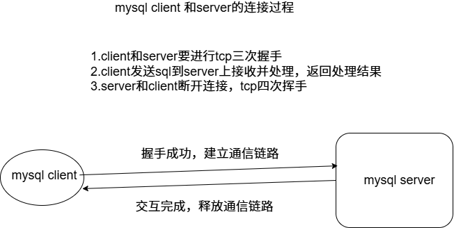

**由上图，多次插入会导致tcp连接次数增多，消耗资源。**

#### update修改

```mysql
update user set age=23 where name='zhangsan';
update user set age=age+1 where id=3;
```

#### delete删除

```mysql
delete from user where age=23;
delete from user where age between 20 and 22;
delete from user;
```

#### select查询

```mysql
select * from user;
select id,nickname,name,age,sex from user;
select id,name from user;
select id,nickname,name,age,sex from user where sex='M' and age>=20 and age<=25;
select id,nickname,name,age,sex from user where sex='M' and age between 20 and 25;
select id,nickname,name,age,sex from user where sex='W' or age>=22;
```

**去重distinct**

```mysql
select distinct name from user;
```

**空值查询**

**is [not] null**

```mysql
select * from user where name is null;
```

**union合并查询**

**把两个结果合并起来，union默认去重，不用修饰distinct，all表示显示所有重复值。**

```mysql
select country from websites union all select country from apps order by country;
```

**带in子查询**

**[不]包含这些元素**

**[not] in(元素1，元素2，...，元素3)**

```mysql
select * from user where id in(10,20,30,40,50);
select * from user where id not in(10,20,30,40,50);
select * from user where id in(select stu_id from grade where average>=60.0);
```

**分页查询**

```mysql
select id,nickname,name,age,sex from user limit 10;
select id,nickname,name,age,sex from user limit 2000,10#偏移2000，再取10个
```

```mysql
explain select * from user where name='zhangsan';
explain:查看SQL语句的执行计划(但是MySQL的自身优化检测不到，可能体现的数据不对)，主键会注册主键索引，唯一键会注册索引，通过索引查询，直接查到（查一次），不需要遍历去查。如果通过没有注册索引的字段去查询的话，就可能变成整表查询（查很多次）。
```

```mysql
select id,nickname,name,age,sex from user limit 10;#没有设计limit 10，它是查完整表返回结果，设计了limit 10 查到10个符合条件的数据就返回。
所以这就可以利用这个特性
在通过一些非注册索引的字段查找时，可以通过limit,提高查询速度。
select * from t_user where email ='1000001@fixbug.com';
+---------+--------------------+----------+
| id      | email              | password |
+---------+--------------------+----------+
| 1000001 | 1000001@fixbug.com | 1000001  |
+---------+--------------------+----------+
1 row in set (0.66 sec)

mysql> select * from t_user where email ='1000001@fixbug.com' limit 1;
+---------+--------------------+----------+
| id      | email              | password |
+---------+--------------------+----------+
| 1000001 | 1000001@fixbug.com | 1000001  |
+---------+--------------------+----------+
1 row in set (0.33 sec)
```

```mysql
分页查询优化
select * from t_user limit 1000000,20;
+---------+--------------------+----------+
| id      | email              | password |
+---------+--------------------+----------+
| 1000001 | 1000001@fixbug.com | 1000001  |
| 1000002 | 1000002@fixbug.com | 1000002  |
| 1000003 | 1000003@fixbug.com | 1000003  |
| 1000004 | 1000004@fixbug.com | 1000004  |
| 1000005 | 1000005@fixbug.com | 1000005  |
| 1000006 | 1000006@fixbug.com | 1000006  |
| 1000007 | 1000007@fixbug.com | 1000007  |
| 1000008 | 1000008@fixbug.com | 1000008  |
| 1000009 | 1000009@fixbug.com | 1000009  |
| 1000010 | 1000010@fixbug.com | 1000010  |
| 1000011 | 1000011@fixbug.com | 1000011  |
| 1000012 | 1000012@fixbug.com | 1000012  |
| 1000013 | 1000013@fixbug.com | 1000013  |
| 1000014 | 1000014@fixbug.com | 1000014  |
| 1000015 | 1000015@fixbug.com | 1000015  |
| 1000016 | 1000016@fixbug.com | 1000016  |
| 1000017 | 1000017@fixbug.com | 1000017  |
| 1000018 | 1000018@fixbug.com | 1000018  |
| 1000019 | 1000019@fixbug.com | 1000019  |
| 1000020 | 1000020@fixbug.com | 1000020  |
+---------+--------------------+----------+
20 rows in set (0.27 sec)
select * from t_user where id>1000000 limit 20;
+---------+--------------------+----------+
| id      | email              | password |
+---------+--------------------+----------+
| 1000001 | 1000001@fixbug.com | 1000001  |
| 1000002 | 1000002@fixbug.com | 1000002  |
| 1000003 | 1000003@fixbug.com | 1000003  |
| 1000004 | 1000004@fixbug.com | 1000004  |
| 1000005 | 1000005@fixbug.com | 1000005  |
| 1000006 | 1000006@fixbug.com | 1000006  |
| 1000007 | 1000007@fixbug.com | 1000007  |
| 1000008 | 1000008@fixbug.com | 1000008  |
| 1000009 | 1000009@fixbug.com | 1000009  |
| 1000010 | 1000010@fixbug.com | 1000010  |
| 1000011 | 1000011@fixbug.com | 1000011  |
| 1000012 | 1000012@fixbug.com | 1000012  |
| 1000013 | 1000013@fixbug.com | 1000013  |
| 1000014 | 1000014@fixbug.com | 1000014  |
| 1000015 | 1000015@fixbug.com | 1000015  |
| 1000016 | 1000016@fixbug.com | 1000016  |
| 1000017 | 1000017@fixbug.com | 1000017  |
| 1000018 | 1000018@fixbug.com | 1000018  |
| 1000019 | 1000019@fixbug.com | 1000019  |
| 1000020 | 1000020@fixbug.com | 1000020  |
+---------+--------------------+----------+
20 rows in set (0.00 sec)
可以看出明显的效率不同
select * from t_user limit 1000000,20;通过limit偏移，是会扫表的，所以耗费效率，所以我们要通过有索引的字段来约束条件，他就不会扫前面的，因为索引。这样效率也提高了
select * from t_user where id>1000000 limit 20;id>的取值一般为上一页最后一条数据的id值
```

**排序order by**

```mysql
select id,nickname,name,age,sex from user where sex='M' and age>=20 and age<=25 order by age asc;(默认为升序)
select id,nickname,name,age,sex from user where sex='M' and age>=20 and age<=25 order by age desc;(降序)
select id,nickname,name,age,sex from user where sex='M' and age>=20 and age<=25 order by name,age asc;(先按name升序，当name相同时，再按age升序)
```

**分组group by**

```mysql
select sex from user group by sex;
select count(id) as number,sex from user group by sex;
select count(id),age from user group by age having age>20;
select age,sex,count(*) from user group by age,sex;
```

**group by后面再筛选就不能用where,要使用having。**

**在使用 ORDER BY 和 GROUP BY 时，建议对相关字段建立索引。**

**如果排序或分组字段没有索引，MySQL 在执行过程中通常会采用 filesort 或创建临时表，这会导致性能下降。通过 EXPLAIN 分析语句时，可以在 Extra 字段看到 Using filesort，这意味着：**

- **MySQL 首先会读取满足条件的数据；**
- **将其加载到内存或临时表中；**
- **然后在内存或磁盘上进行排序；**
- **最终返回排序后的结果。**

**由于这涉及额外的 CPU 和磁盘 I/O 操作，效率会显著降低，尤其是在数据量较大时。因此，在 ORDER BY 或 GROUP BY 中应尽量使用已经建立索引的字段，以提升查询性能。**

### 连接查询


#### 内连接查询

```mysql
#on a.uid=c.uid 区分大表和小表，按照（where过滤后）数据量来区分，小表永远是整表扫描，然后去大表搜索。所以大表建索引才是最有效的
#从student小表中取出所有的a.uid，然后拿着这些uid去exame大表搜素。
#对于inner join内连接，过滤条件写在where的后面和on连接条件里面(会优化成where去过滤)，效果一样的。
select a.uid,a.name,a.age,a.sex,c.score from student a 
inner join exame c 
on a.uid=c.uid 
where c.uid=1 and c.cid=2;

select a.uid,a.name,a.age,a.sex,b.cid,b.cname,b.credit,c.score from exame c
inner join student a on c.uid=a.uid
inner join course b on c.cid=b.cid
where c.uid=1 and c.cid=2;
```

**内连接查询解决单张表的limit分页偏移量的消耗，这个问题可以采用有索引的字段来约束条件来使分页偏移量的消耗消失。**

```mysql
select * from t_user where id>1000000 limit 20;
```

**可是如果我们不知道这个id的值要取多少，偏移量必须写。又该如何提升效率。可以利用临时表存储所需信息的id，再通过这张表和原表inner join进而查出更多的信息。**

```mysql
select id,email,password from t_user limit 1500000,10;
+---------+--------------------+----------+
| id      | email              | password |
+---------+--------------------+----------+
| 1500001 | 1500001@fixbug.com | 1500001  |
| 1500002 | 1500002@fixbug.com | 1500002  |
| 1500003 | 1500003@fixbug.com | 1500003  |
| 1500004 | 1500004@fixbug.com | 1500004  |
| 1500005 | 1500005@fixbug.com | 1500005  |
| 1500006 | 1500006@fixbug.com | 1500006  |
| 1500007 | 1500007@fixbug.com | 1500007  |
| 1500008 | 1500008@fixbug.com | 1500008  |
| 1500009 | 1500009@fixbug.com | 1500009  |
| 1500010 | 1500010@fixbug.com | 1500010  |
+---------+--------------------+----------+
10 rows in set (0.71 sec)
这是正常查的
select id from t_user limit 1500000,10;
+---------+
| id      |
+---------+
| 1500001 |
| 1500002 |
| 1500003 |
| 1500004 |
| 1500005 |
| 1500006 |
| 1500007 |
| 1500008 |
| 1500009 |
| 1500010 |
+---------+
10 rows in set (0.20 sec)
#我们发现查单个字段效率会提高
#所以我们建立临时表（小表）存储带索引的字段，再通过inner join查出相同的结果
select a.id,a.email,a.password from t_user a inner join (select id from t_user limit 1500000,10) b on a.id=b.id;
+---------+--------------------+----------+
| id      | email              | password |
+---------+--------------------+----------+
| 1500001 | 1500001@fixbug.com | 1500001  |
| 1500002 | 1500002@fixbug.com | 1500002  |
| 1500003 | 1500003@fixbug.com | 1500003  |
| 1500004 | 1500004@fixbug.com | 1500004  |
| 1500005 | 1500005@fixbug.com | 1500005  |
| 1500006 | 1500006@fixbug.com | 1500006  |
| 1500007 | 1500007@fixbug.com | 1500007  |
| 1500008 | 1500008@fixbug.com | 1500008  |
| 1500009 | 1500009@fixbug.com | 1500009  |
| 1500010 | 1500010@fixbug.com | 1500010  |
+---------+--------------------+----------+
10 rows in set (0.18 sec)
#肉眼可见的效率提高了。
```

#### 外连接查询

**左连接查询**

```mysql
#把left这边的表所有的数据显示出来，在右表中不存在相应数据，则显示NULL，这里就不存在大小表的区分了，左表整表扫描。
select a.* from User a left join orderlist b on a.uid=b.uid where a.orderid is null;
```

**右连接查询**

```mysql
#把right这边的表所有的数据显示出来，在左表中不存在相应数据，则显示NULL，这里就不存在大小表的区分了，右表整表扫描。
select a.* from User a right join orderlist b on a.uid=b.uid where b.orderid is null;
```

```mysql
#外连接经常用于查找某个用户没有，不存在
#查找没有考试的学生
select * from student where uid not in (select distinct uid from exame);
#select distinct uid from exame 会产生一张中间表存储结果供外面的sql来查询
#not in对于索引的命中并不高
#可以看出用上述方法效率不是很高
select a.* from student a left join exame b on a.uid=b.uid where b.cid is null;
#这样也可以实现效果
```

```mysql
select a.* from student a left join exame b on a.uid=b.uid where b.cid=3;
select a.* from student a inner join exame b on a.uid=b.uid where b.cid=3;
#上述两句效果是一样的，为什么呢，这时候我们用explain查看左连接，先查b表，再查a表，这就和左连接的查表顺序不符，和内连接相符。
#原因在于where筛选数据后b为小表，所以又成了内连接了。所以在外连接查找时，where不要跟具体的筛选，放在on后，where后跟判断null.
select a.* from student a left join exame b on a.uid=b.uid and b.cid=3 where b.cid is null;
#带有一定条件的查询某个用户没有做什么要像上述写的。
```

## MySQL存储引擎

```bash
一张表，MySQL一般如何存储
表的结构，数据，索引
存储引擎直接影响上面内容的存储方式
```

**MyISAM不支持事务，也不支持外键，索引采用非聚集索引，其优势是访问的速度快，对事务完整性没有要求，以select,insert为主的应用基本上都可以使用这个引擎来创建表。MyISAM的表在磁盘上存储三个文件，其文件名都和表名相同，扩展名分别是：**

**.frm(存储表定义)**

**.MYD(MYData，存储数据)**

**.MYI(MYIndex，存储索引)**

**InnoDB存储引擎提供了具有提交，回滚和崩溃恢复能力的事务安全，支持自动增长列，外键等功能，索引采用聚集索引，索引和数据存储在同一个文件，所以InnoDB的表在磁盘上有两个文件，其文件名都和表名相同，扩展名分别是：**

**.frm(存储表定义)**

**.ibd(存储数据和索引)**

**MEMORY存储引擎使用存在内存中的内容创建表。每个MEMORY表实际只对应一个磁盘文件，格式是.frm(表结构定义)。MEMORY类型的表访问非常快，因为它的数据是放在内存中的，并且默认使用HASH索引（不适合做范围查询），但是一旦服务关闭，表中的数据就会丢失掉。**

### 各存储引擎区别

### MySQL 存储引擎对比

| 特性/存储引擎 | **InnoDB**                                                 | **MyISAM**                                     | **Memory**                                     |
| ------------- | ---------------------------------------------------------- | ---------------------------------------------- | ---------------------------------------------- |
| 🔒 锁机制      | ✅ 行级锁 + 表级锁混合（默认行锁，支持多版本并发控制 MVCC） | ❌ 仅支持表级锁，写入或更新时整个表被锁定       | ❌ 仅支持表级锁                                 |
| 🌳 B-树索引    | ✅ 支持，**聚簇索引（主键）**存储数据，辅助索引存主键       | ✅ 支持，**非聚簇索引**，索引与数据分离         | ✅ 支持（基于哈希或 B-Tree，可设置）            |
| 🔗 哈希索引    | ⚠️ 不支持（只有 Adaptive Hash Index，InnoDB 内部使用）      | ❌ 不支持                                       | ✅ 默认使用哈希索引，**也支持 BTree（可配置）** |
| 🔐 外键支持    | ✅ 支持（定义级联删除、更新等外键约束）                     | ❌ 不支持                                       | ❌ 不支持                                       |
| 🔁 事务支持    | ✅ 支持完整事务（ACID），回滚、提交、一致性恢复             | ❌ 不支持事务机制                               | ❌ 不支持事务                                   |
| 📚 索引缓存    | ✅ 支持（通过 Buffer Pool 缓存索引和数据）                  | ✅ 支持（**只缓存索引，不缓存数据**）           | ❌ 不缓存索引（数据在内存中，系统重启即失）     |
| 💾 数据缓存    | ✅ 支持（Buffer Pool 中同时缓存数据和索引）                 | ❌ 不支持数据缓存（每次查询都需从磁盘读取数据） | ✅ 所有数据在内存中，速度极快                   |

**锁机制：表示数据库在并发请求访问的时候，多个事务在操作时，并发操作的粒度。**

**B-树索引和哈希索引：主要是加速SQL的查询速度。**

**外键：子表的字段依赖父表的主键，设置两张表的依赖关系。**

**事务：多个SQL语句，保证他们共同执行的原子操作，要么成功，要么失败，不能只成功一部分，失败需回滚事务。**

**索引缓存和数据缓存：和MySQL Server的查询缓存相关，在没有对数据和索引做修改之前，重复查询可以不用进行磁盘I/O(数据库的性能提升，目的是为了减少磁盘I/O操作来提升数据库访问效率)，读取上一次内存中查询的缓存即可。**

## MySQL索引

**当表中的数据量到达几十万甚至上百万的时候，SQL查询所花费的时间会很长，导致业务超时出错，此时就需要用索引来加速SQL查询。**

**由于索引也是需要存储索引文件的，因此对索引的使用也会涉及磁盘I/O操作。如果索引创建过多，使用不当，会造成SQL查询时，进行大量无用的磁盘I/O操作，降低了SQL的查询效率，适得其反，所以掌握良好得索引创建原则非常重要。**

### 索引分类

**索引是创建在表上的，是对数据库表一列或者多列的值进行排序的一种结果。索引的核心是提高查询的速度。**

**物理上(聚集索引&非聚集索引)/逻辑上(以下六种)**

**索引的优点：提高查询效率**

**索引的缺点：索引并非越多越好，过多的索引会导致CPU使用率居高不下，由于数据的改变，会造成索引文件的改动，过多的磁盘I/O造成CPU负荷太重。**

1. **普通索引：没有任何限制条件，可以给任何类型的字段创建普通索引。(创建新表&已创建表，数量是不限的，一张表的一次sql查询只能用一个索引 where a=1 and b='M'只用其中一个)**
2. **唯一性索引：使用UNIQUE修饰的字段，值不能够重复，主键索引就隶属于唯一性索引。**
3. **主键索引：使用Primary Key修饰的字段会自动创建索引。**
4. **单列索引：在一个字段上创建索引**
5. **多列索引：在表的多个字段上创建索引（多列索引必须使用到第一个列，才能使用到多列索引，否则索引用不上）**
6. **全文索引：使用FULLTEXT参数可以设置全文索引，只支持CHAR,VARCHAR和TEXT类型的字段上，常用于数据量较大的字符串类型上，可以提高查询速度。(线上项目支持专门的搜索功能，给后台服务器增加专门的搜索引擎支持快速高效的搜索 elasticsearch简称es C++开源的搜索引擎 搜狗的workflow,所以最好不要部署到mysql里)**

### 索引创建和删除

**注意：**

1. **经常作为where条件过滤的字段考虑添加索引**
2. **字符串创建索引时，尽量规定索引的长度，而不能让索引值的长度key_len过长**
3. **索引字段涉及类型强转，mysql函数调用，表达式计算等，索引就用不上了（索引失效）。**

```mysql
select * from t_user where password='1000000';
select * from t_user where password=1000000;
password是个varchar类型，加了索引，上面两句的耗时量不同。
```

```mysql
#创建表的时候指定索引字段：
CREATE TABLE index1(id INT,
                    name VARCHAR(20),
                    sex ENUM('male','female'),
                   	INDEX(id));
#在已经创建的表上添加索引：添加索引。后续用这个字段查，索引一定会用到吗，不一定，如果使用索引所消耗的数据量和扫表的数据量差不多的话，会优化成直接扫表。不用索引
CREATE [UNIQUE]INDEX 索引名 ON 表名（属性名（length）[ASC|DESC]）;length为索引的长度,一般在给字符串字段加索引时写明长度
create index pwdidx on t_user(password);
#删除索引
DROP INDEX 索引名 ON 表名;
```

### 索引的执行过程

#### explain查看执行计划

```mysql
EXPLAIN SELECT * FROM user WHERE id = 1;
```

**EXPLAIN 关键字段详细说明表格**

| 字段名               | 详细解释                                                     |
| -------------------- | ------------------------------------------------------------ |
| **id**               | 表示查询中每个 SELECT 子句的唯一标识符。 数值越大，优先级越高，越早执行。常见于子查询和联合查询中。 |
| **select_type**      | 表示查询的类型（即 SELECT 的种类）： 🔹 `SIMPLE`：简单查询，没有子查询或 UNION 🔹 `PRIMARY`：最外层的主查询 🔹 `SUBQUERY`：SELECT 在 WHERE 中嵌套 🔹 `DERIVED`：FROM 子句中的子查询（派生表）🔹`UNION`：UNION 中的第二个及以后查询 🔹 `DEPENDENT SUBQUERY`：依赖外层查询结果的子查询 |
| **table**            | 当前访问的表名或别名，若为临时表，则会显示 `derivedN` 或 `unionN` |
| **partitions**       | 如果使用了分区表，显示所访问的分区。无分区则为 NULL          |
| **type（访问类型）** | 🔥 评估索引使用效率的核心字段，从优到劣如下： 1. `system`（表只有一行） 2. `const`（通过主键或唯一索引查询常量） 3. `eq_ref`（唯一索引 + 连接） 4. `ref`（普通索引 + 连接） 5. `range`（范围查询，如 `>`、`BETWEEN`） 6. `index`（全索引扫描） 7. `ALL`（全表扫描 ⚠️ 需优化） |
| **possible_keys**    | 显示可能用于查询的索引列表。 不一定表示最终用到了。 如果是 `NULL`，说明没有可用索引。 |
| **key**              | 实际使用的索引名称。 为 `NULL` 则表示未使用任何索引。        |
| **key_len**          | 实际使用的索引长度（单位是字节）， 由字段类型、字符集等决定。 ⚠️ 并不等于整个索引长度，仅表示此次查询使用了其中多少部分。 |
| **ref**              | 显示哪个字段或常量被用来与索引中的列进行比较： 如：`const`（常量）、`func`（函数）、`table.column`（表字段）等 |
| **rows**             | MySQL 预计需要读取的记录行数（不是返回行数），越少越好。 是估算值，不一定准确。 |
| **filtered**         | 表示通过 WHERE 条件过滤后，预估保留的记录百分比。 值为百分比形式，100 表示全部通过。 |
| **Extra**            | 显示额外的执行细节，非常重要： 🔹 `Using index`：覆盖索引，无需回表 🔹 `Using where`：使用了 WHERE 过滤条件 🔹 `Using temporary`：使用了临时表（如GROUP BY） 🔹 `Using filesort`：需要额外排序（ORDER BY） 🔹 `Using index condition`：使用了 Index Condition Pushdown（ICP） 🔹 `Impossible WHERE`：WHERE 条件永远不成立 |

### 索引的底层实现原理

**数据库索引是存储在磁盘上的，当数据量大时，就不能把整个索引全部加载到内存了，只能逐一加载每一个磁盘块（对应索引树的节点），索引树越低，越矮胖，磁盘IO次数就少。**

**MySQL支持两种索引，一种是B-树索引，一种是哈希索引，大家知道，B-树和哈希表在查询时的效率是非常高的。**

**这里主要讨论MySQL InnoDB的存储引擎，基于B-树(但实际上MySQL采用的是B+树结构)的索引结构。**

**B-树是一种m阶平衡树，叶子节点都在同一层，由于每个节点存储的数据量比较大，索引整个B-树的层数是非常低的，基本不超过三层。**

**由于磁盘的读取也是按照block块操作的(内存是按page页面操作的)，因此B-树的节点大小一般设置为和磁盘块大小一致，这样一个B-树节点，就可以通过一次磁盘I/O把一个磁盘块的数据全部存储下来，所以当使用B-树存储索引的时候，磁盘I/O的操作次数是最少的(MySQL的读写效率，主要集中在磁盘I/O)。**

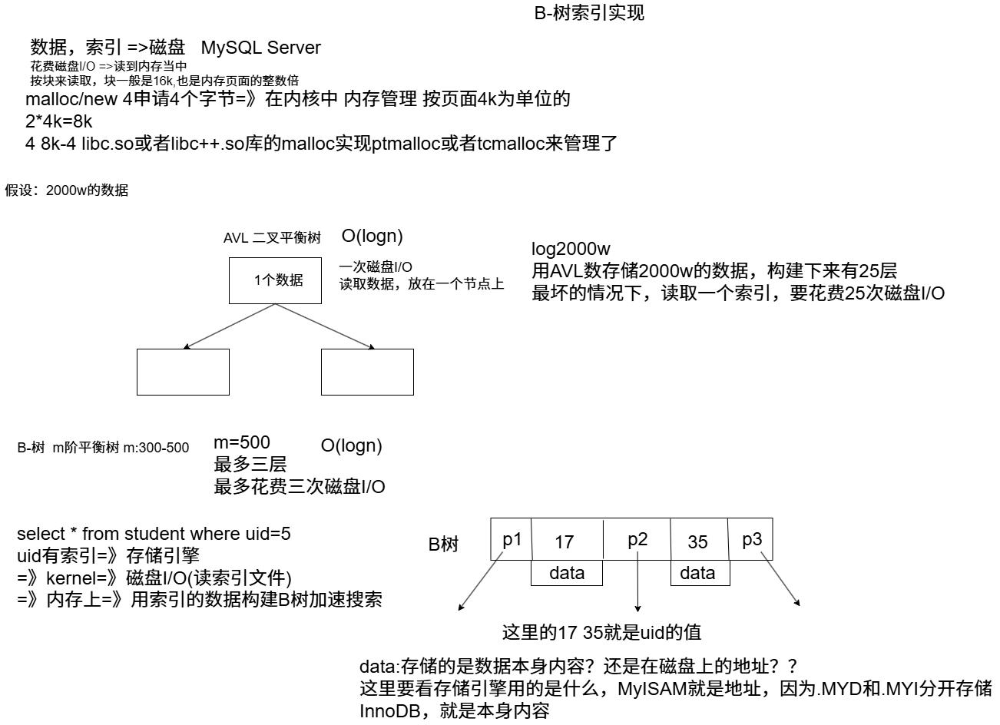

**为什么MySQL(MyISAM和InnoDB)索引底层选择B+树而不是B树呢？**

1. **索引+数据内容分散在不同的节点上，离根节点近，搜索就快；离根节点远，搜索就慢！花费的磁盘IO次数不平均，每一行数据花费的时间也不平均。**
2. **每一个非叶子节点，不仅仅要存储索引(key),还要存储索引值所在的那一行的data数据。一个节点所能存放的索引key值的个数，比只能存储key值的节点的个数要少的多！！！**
3. **这棵树不方便做范围搜索，整表遍历看起来也不方便。**

**有上面的三个原因，由B+树来构建索引。**

```mysql
1.每一个非叶子节点，只存放key,不存储data!
好处就是一个节点存放的key值更多，B+树在理论上来说，层数会更低一些，搜索的效率会更好一些。
2.叶子节点上存储了所有的索引值+数据data:搜索每一个索引对应的值data,都需要跑到叶子节点上，这样每一行记录搜索的时间是非常平均的。
3.叶子节点被串在一个链表当中，形成了一个有序的链表，如果要进行索引树的搜索&整表搜索，直接遍历叶子节点的有序链表即可！或者做范围查询的时候，直接遍历叶子节点的有序链表即可！
```

#### InnoDB的主键和二级索引树

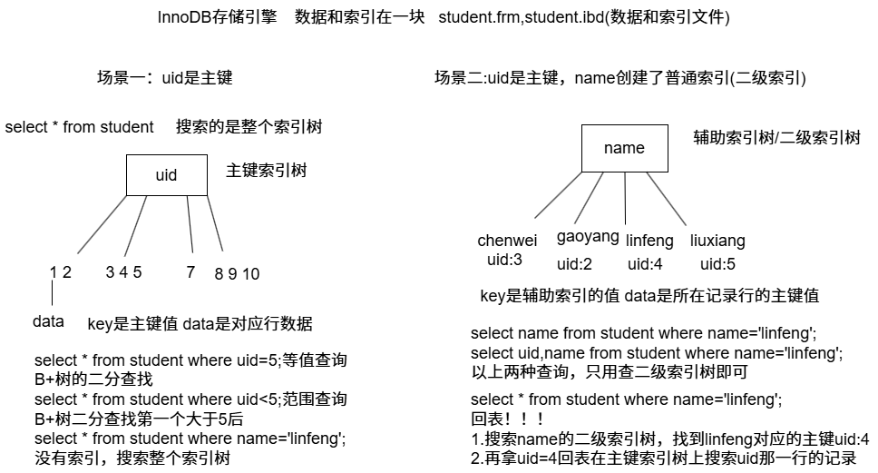

```mysql
select * from student where age=20 order by name;
如果只给age添加索引，行不行？还有什么没考虑到吗？
如果只给age加索引，oder by name 会触发using filesort十分消耗资源，order by可以在name上加索引，但是一次sql,只能使用一次索引。
所以我们这里要使用联合索引(多列索引)
key:age+name 在B+树的链表中先按age排序，再按name排序；age相同，按name进行排序！！！
多列索引必须使用到第一个列，才能使用到多列索引，否则索引用不上
```

#### MyISAM的主键和二级索引树

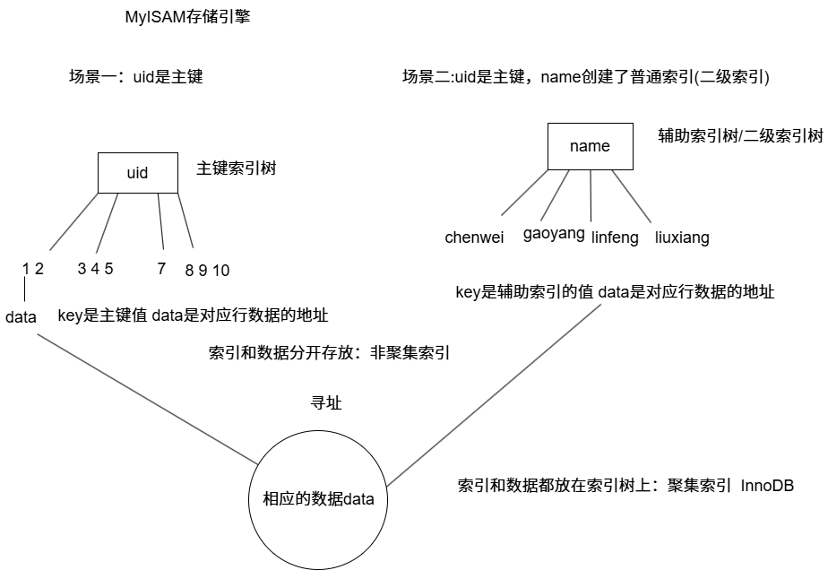

#### 哈希索引

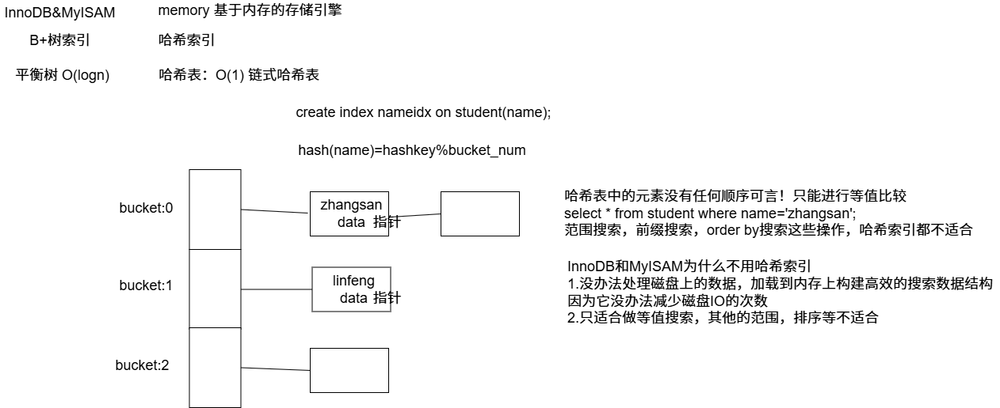

#### InnoDB自适应哈希索引

```mysql
这个数据结构和哈希索引的数据结构是一样的。
InnoDB存储引擎检测到同样的二级索引不断被使用，有回表，(使用等值搜索)，那么底层会根据这个二级索引优化，在内存上根据二级索引树（B+树）上的二级索引值，在内存上构建一个哈希索引，来加强搜索。毕竟等值查询的效率是O(1);
但是自适应哈希索引本身的数据维护也是需要耗费性能的，并不是说自适应哈希索引在任何情况下都会提升二级索引的查询性能！根据参数指标，来具体分析是否打开或者关闭自适应哈希索引。
show engine innodb status\G 能看到两个比较重要的信息：
1.RW_latch等到的线程数量(自适应哈希索引默认分配8个分区)，同一个分区等待的线程数量过多，会造成自适应哈希索引搜索的效率低可以关闭自适应哈希索引
2.走自适应哈希索引搜索的效率（低）和二级索引树搜索的效率（高）可以关闭自适应哈希索引
```

**SQL和索引的优化问题，如何切入？**

**explain 分析sql**

**项目=》很多业务=》各种各样的sql 千条，万条**

**流程：从什么地方能够获取哪些运行时间长，耗性能的sql;然后再用explain去使用它。**

**1.可以使用慢查询日志slow_query_log，设置合理的，业务可以接受的慢查询时间！！**

**2.压测执行各种业务。**

**3.查看慢查询日志，找出所有执行耗时的sql。**

**4.用explain分析这些耗时的sql**

### **慢查询日志**

**MySQL可以设置慢查询日志，当SQL执行的时间超过我们设定的时间，那么这些SQL就会被记录在慢查询日志当中，然后我们通过查看日志，用explain分析这些SQL的执行计划，来判断为什么效率低下，是没有使用到索引？还是索引本身创建的有问题？或者是索引使用到了，但是由于表的数据量太大，花费的时间就是很长，那么此时我们可以把表分为n个小表，比如订单表按年份分成多个小表。**

慢查询日志相关参数如下：

```mysql
show variables like '%slow_query%';
+---------------------+---------------------------------------------------------+
| Variable_name       | Value                                                   |
+---------------------+---------------------------------------------------------+
| slow_query_log      | OFF                                                     |
| slow_query_log_file | /var/lib/mysql/yustone-VMware-Virtual-Platform-slow.log |
+---------------------+---------------------------------------------------------+
2 rows in set (0.27 sec)
```

打开慢查询

```mysql
set global slow_query_log=ON;
```

慢查询日志记录了包含所以执行时间超过参数long_query_time(单位：秒)所设置值的SQL语句的日志，在MySQL上用命令可以查看。如下：

```mysql
show variables like 'long%';
+-----------------+-----------+
| Variable_name   | Value     |
+-----------------+-----------+
| long_query_time | 10.000000 |
+-----------------+-----------+
1 row in set (0.01 sec)
```

这个值是可以修改的，如下：

```mysql
set long_query_time=1;
Query OK, 0 rows affected (0.00 sec)
```

修改完成后，执行sql后可以去对应文件/var/lib/mysql/yustone-VMware-Virtual-Platform-slow.log查看。

## MySQL事务

### 事务概念

**一个事务是由一条或者多条对数据库操作的SQL语句所组成的一个不可分割的单元，只有当事务中的所有操作都正常执行完了，整个事务才会被提交到数据库；如果有部分事务处理失败，那么事务就要回退到最初的状态，因此，事务要么全部执行成功要么全部失败。**

1. **事务是一组SQL语句的执行，要么全部成功，要么全部失败，不能出现部分成功，部分失败的结果。保证事务执行的原子操作。**
2. **事务的所有SQL语句全部执行成功，才能提交(commit)事务，把结果写回磁盘。**
3. **事务执行过程中，有的SQL出现错误，那么事务必须要回滚(rollback)到最初的状态。**

### ACID特性

**每一个事务必须满足下面的4个特性：**

**事务的原子性(Atomic):**

**事务是一个不可分割的整体，事务必须具有原子特性，及当数据修改时，要么全执行，要么全不执行，即不允许事务部分的完成。**

**事务的一致性(Consistency):**

**一个事务执行之前和执行之后，数据库数据必须保持一致性状态。数据库的一致性状态必须由用户来负责，由并发控制机制实现。就拿网上购物来说，你只有让商品出库，又让商品进入顾客的购物车才能构成一个完整的事务。**

**事务的隔离性(Isolation):**

**当两个或者多个事务并发执行时，为了保证数据的安全性，将一个事务内部的操作与其他事务的操作隔离起来，不被其他正在执行的事务所看到，使得并发执行的各个事务之间不能互相影响。**

**事务的持久性(Durability):**

**事务完成(commit)以后，DBMS保证它对数据库中的数据的修改是永久性的(可能出现内存把数据写回磁盘时出现断电)，即使数据库因为故障出错，也应该能够恢复数据！（利用redo log:重做日志 保证数据库的永久性）**

```mysql
事务的ACID特性：
ACD:是由mysql的redo log和undo log机制来保证的。
I:隔离性，是由mysql事务的锁机制来实现保证的。
```

### 事务并发存在的问题

事务处理不经隔离，并发执行事务时通常会发生以下的问题：

**脏读（Dirty Read）:一个事务读取了另一个事务未提交的数据。例如当事务A和事务B并发执行时，当事务A更新后，事务B查询读取到A尚未提交的数据，此时事务A回滚，则事务B读到的数据就是无效的脏数据。（事务B读取了事务A尚未提交的数据）。**（杜绝）

**不可重复读（NonRepeatable Read）:一个事务的操作导致另一个事务前后两次读到不同的数据。例如当事务A和事务B并发执行时，当事务B查询读取数据后，事务A更新操作更改事务B查询到的数据，此时事务B再次去读该数据，发现前后两次读的数据不一样。（事务B读取了事务A已提交的数据）**（看业务能不能接受）

**虚读(Phantom Read) 幻读：一个事务的操作导致另一个事务前后查询的结果数据量不同。例如当事务A和事务B并发执行时，当事务B查询读取数据后，事务A新增或者删除了一条满足事务B查询条件的记录，此时事务B再去查询，发现查询到前一次不存在的记录。或者前一次查询的一些记录不见了。（事务B读取了事务A(已提交)新增加的数据或者读不到事务A删除的数据）。**（看业务能不能接受）

### 事务的隔离级别

MySQL支持的四种隔离级别是：

1. **TRANSACTION_READ_UNCOMMITTED。未提交读。说明在提交前一个事务可以看到另一个事务的变化。这样读脏数据，不可重复读和虚读都是被允许的。**
2. **TRANSACTION_READ_COMMITTED。已提交读。说明读取未提交的数据是不允许的。这个级别仍然允许不可重复读和虚读产生。**
3. **TRANSACTION_REPEATABLE_READ。可重复读。说明事务保证能够再次读取相同的数据而不会失败，都是相同的数据，但虚读仍然会出现。可以解决一部分的幻读（insert/delete）,但是解决不了update造成的幻读。**
4. **TRANSACTION_SERIALIZABLE。串行化。是最高的事务级别，他防止读脏数据，不可重复读和虚读。**

**MySQL默认隔离级别：可重复读,oracle的默认隔离级别：已提交读。**

### MySQL的事务处理命令

```mysql
select @@autocommit;#查看事务是自动(1)还是手动(0)

set autocommit=0;#设置事务为手动(在当前会话生效)
```

```mysql
#MyISAM:不支持事务的！
#InnoDB:最大的特点：支持事务，支持行锁
try{
	begin;#开始一个事务
	SQL语句
	
	commit;#提交一个事务
}catch(... err){
	rollback;#回滚一个事务
}
```

```mysql
SAVEPOINT point1;设置一个名字为point1的保存点
ROLLBACK TO point1;事务回滚到保存点point1,而不是回滚到初始状态
SET SESSION transaction_isolation = 'REPEATABLE-READ';设置事务的隔离级别
SELECT @@transaction_isolation;查询事务的隔离级别
```

```mysql
SELECT @@transaction_isolation;
+-------------------------+
| @@transaction_isolation |
+-------------------------+
| REPEATABLE-READ         |
+-------------------------+
1 row in set (0.02 sec)
```

## MySQL的锁机制


### 表级锁&行级锁

**表级锁：对整张表加锁。开销小，加锁快，不会出现死锁；锁粒度大，发生锁冲突的概率高，并发读低。**

**行级锁：对某行记录加锁。开销大，加锁慢，会出现死锁；锁粒度最小，发生锁冲突的概率最低，并发度高。**

### 排它锁和共享锁

**排它锁（Exclusive）,又称为X锁，写锁。**

**共享锁（Shared）,又称为S锁，读锁。**

**X锁和S锁之间有以下关系： SS可以兼容，XS,SX,XX之间是互斥的**

1. **一个事务对数据对象O加了S锁，可以对O进行读取操作但不能进行更新操作。加锁期间其他事务能对O加S锁但不能加X锁。**
2. **一个事务对数据对象O加了X锁，就可以对O进行读取和更新。加锁期间其他事务不能对O加任何锁。**
3. **手动加锁：select...lock in share mode强制获取共享锁，select...for update获取排它锁**

### InnoDB行级锁

#### 行级锁

**InnoDB存储引擎支持事务处理，表支持行级锁定，并发能力更好。**

1. **InnoDB行锁是通过给索引上的索引项加锁来实现的，而不是给表的行记录加锁实现的，这就意味着只有通过索引数据，InnoDB才使用行级锁，否则InnoDB将使用表锁。**
2. **由于InnoDB的行锁实现是针对索引字段添加的锁，不是针对行记录加的锁，因此虽然访问的是InnoDB引擎下表的不同行，但是如果使用相同的索引字段值作为过滤条件，依然会发生锁冲突，只能串行进行，不能并发进行。**
3. **即使SQL中使用了索引，但是经历MySQL的优化器后，如果认为全表扫描比使用索引效率更高，此时会放弃使用索引，因此不会使用行锁，而是使用表锁，比如对一些很小的表，MySQL就不会去使用索引。**

#### 间隙锁(gap lock)

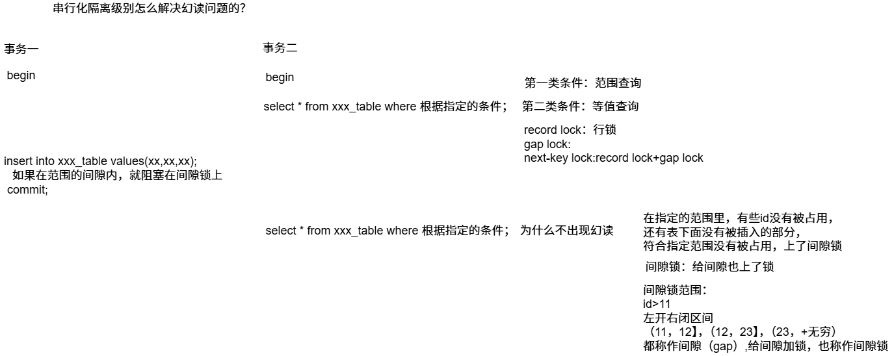

**当我们用范围条件而不是相等条件检索数据，并请求共享或排它锁时，InnoDB会给符合条件的已有数据记录的索引项加锁；对于键值在条件范围内但并不存在的记录，叫做间隙，InnoDB也会对这个间隙加锁，这个锁机制就是所谓的间隙锁。举例来说，假如user表中只有101条记录，其userid的值分别为1，2，100，101，下面的SQL:**

```mysql
select * from user where userid>100 for update;
```

**是一个范围条件的检索，InnoDB不仅会对符合条件的userid值为101的记录加锁，也会对userid大于101(但是这些记录不存在)的间隙加锁，防止其他事务在表的末尾增加数据。**

**InnoDB使用间隙锁的目的，为了防止幻读，以满足串行化隔离级别的要求，对于上面的例子，要是不使用间隙锁，如果其他事务插入了userid大于100的任何记录，那么本事务如果再次执行上述语句，就会发生幻读。**


### InnoDB表级锁

在绝大部分情况下都应该使用行锁，因为事务和行锁往往是选择InnoDB的理由，但个别情况下也使用表级锁；

1. 事务需要更新大部分或全部数据，表又比较大，如果使用默认的行锁，不仅这个事务执行效率低，而且可能造成其他事务长时间等待和锁冲突；
2. 事务涉及多个表，比较复杂，很可能造成死锁，造成大量事务回滚。

```mysql
LOCK TABLE user READ;读锁锁表
LOCK TABLE user WRITE;写锁锁表
事务执行。。。
COMMIT/ROLLBACK;事务提交/回滚
UNLOCK TABLES;本身自带提交事务，释放线程占用的所有表锁。
```

#### 意向共享锁和意向排他锁

**意向共享锁（IS锁）:事务计划给记录加行共享锁，事务在给一行记录加共享锁前，必须先取得该表的IS锁。**

**意向排他锁（IX锁）:事务计划给记录加行排他锁，事务在给一行记录加排他锁前，必须先取得该表的IX锁**

**IS和IX之间是兼容的，没有互斥**


### 死锁

**MyISAM表锁是deadlock free的，这是因为MyISAM总是一次获得所需的全部锁，要么全部满足，要么等待，因此不会出现死锁。但在InnoDB中，除单个SQL组成的事务外，锁是逐步获得的，即锁的粒度比较小，这就决定了在InnoDB中发生死锁是可能的。**


**死锁问题一般都是我们自己的应用造成的，和多线程编程的死锁情况相似，大部分都是由于我们多个线程在获取多个锁资源的时候，获取的顺序不同而导致的死锁问题。因此我们应用在对数据库的多个表作更新的时候，不同的代码段，应对这些表按相同的顺序进行更新操作，以防止锁冲突导致死锁问题。**

### 锁的优化建议

1. **尽量使用较低的隔离级别**
2. **设计合理的索引并尽量使用索引访问数据，使加锁更加准确，减少锁冲突的机会提高并发能力**
3. **选择合理的事务大小，小事务发生锁冲突的概率小**
4. **不同的程序访问一组表时，应尽量约定以相同的顺序访问各表；对一个表而言，尽可能以固定的顺序存取表中的行。这样可以大大减少死锁的机会**
5. **尽量用相等条件访问数据，这样可以避免间隙锁对并发插入的影响**
6. **不要申请超过实际需要的锁级别**
7. **除非必须，查询时不要显式加锁**

### redo log和undo log

**统称为事务日志。区别于binlog是MySQL Server层的日志，这两个属于存储引擎层的日志。**

**redo log：重做日志。**

**undo log: 回滚日志**

**redo log:	用于记录事务操作的变化，确保事务的持久性。redo log是在事务开始后就开始记录，不管事务是否提交都会记录下来，在异常发生时（如数据持久化过程中掉电），InnoDB会使用redo log恢复到掉电前的时刻，保证数据的完整性。**

**innodb_log_buffer_size默认是16M,就是redo log缓冲区的大小，它随着事务开始，就开始写redo log,如果事务比较大，为了避免事务执行过程中花费过多磁盘IO,可以设置比较大的redo log缓存，节省磁盘IO。**

**InnoDB修改操作数据，不是直接修改磁盘上的数据，实际只是修改Buffer Pool的数据。InnoDB总是先把Buffer Pool中的数据改变记录到redo log中，用来进行崩溃后的数据恢复。优先记录redo log,然后再慢慢的将Buffer Pool的脏数据刷新到磁盘上。**

**innodb_log_group_home_dir指定的目录下的两个文件：ib_logfile0,ib_logfile1,该文件被称作重做日志。**

**buffer pool缓存池：**

**作用：加速读和加速写，直接操作data page,写redo log修改就算完成，有专门的线程去做把buffer pool的dirty page写入磁盘。**


**undo log:	保存了事务发生之前的数据的一个版本，用于事务执行时的回滚操作，同时也是实现多版本并发控制（MVCC）下读操作的关键技术。**

**在创建表时，除了自己设定的字段，mysql会自动加一些字段，其中DB_TRX_ID：事务ID  DB_ROLL_PTR：回滚指针**

 **DB_ROLL_PTR：回滚指针指向修改前的数据，修改前的数据在undo log中，当然当前数据库里的数据是最新的。回滚的话，直接从undo log调就可以。**

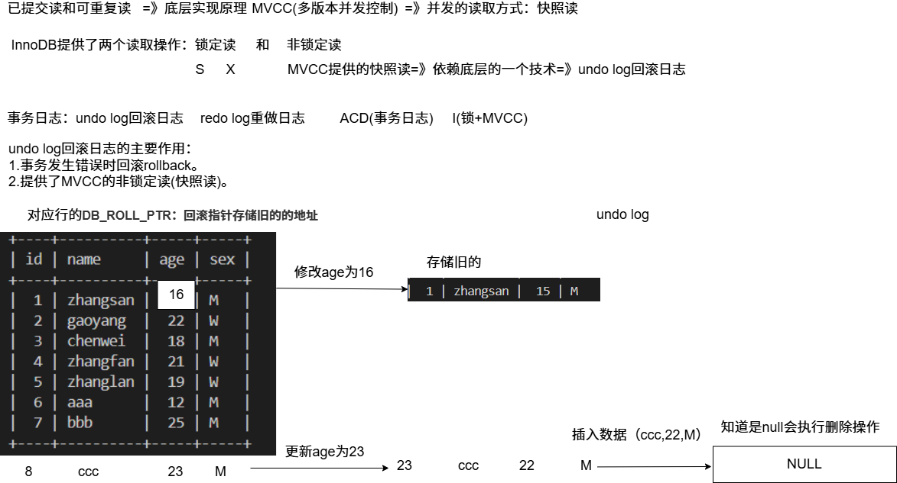

### MVCC多版本并发控制

**MVCC是多版本并发控制，是MySQL中基于乐观锁理论实现隔离级别的方式，用于实现已提交读和可重复读隔离级别的实现，也经常称为多版本数据库。MVCC机制会生成一个数据请求时间点的一致性数据快照（Snapshot）,并用这个快照来提供一定级别（语句级或事务级）的一致性读取。从用户的角度来看，好像是数据库可以提供同一数据的多个版本（系统版本号和事务版本号）。**

**MVCC多版本并发控制中，读操作可以分为两类：**

**1.快照读（Snapshot read）**

​	**读的是记录的可见版本，不用加锁，如select。**

**2.当前读（current read）**

​	**读取的是记录的最新版本，并且当前读返回的记录。如insert,delete,update,select...lock in share mode/for update**

​	**MVCC:每一行记录实际上有多个版本，每个版本的记录除了数据本身之外，增加了其他字段**

​	**DB_TRX_ID:记录当前的事务ID。**

​	**DB_ROLL_PTR:指向undo log日志上数据的指针。**

**逻辑上来看，MVCC 就是为每个事务“搞出了一张表的快照”，但这张“表”并不是实际复制的，而是通过行级的历史版本 + 可见性判断规则拼出来的。**

**已提交读：每次执行语句的时候都重新生成一次快照（Read View）,每次select查询时。**

**可重复读：同一个事务开始的时候生成一个当前事务全局性的快照（Read View）,第一次select查询时。**

**快照内容读取原则：**

1. **版本未提交无法读取生成快照**
2. **版本已提交，但是在快照创建后提交的，无法读取**
3. **版本已提交，但是在快照创建前提交的，可以读取**
4. **当前事务内自己的更新，可以读到。**

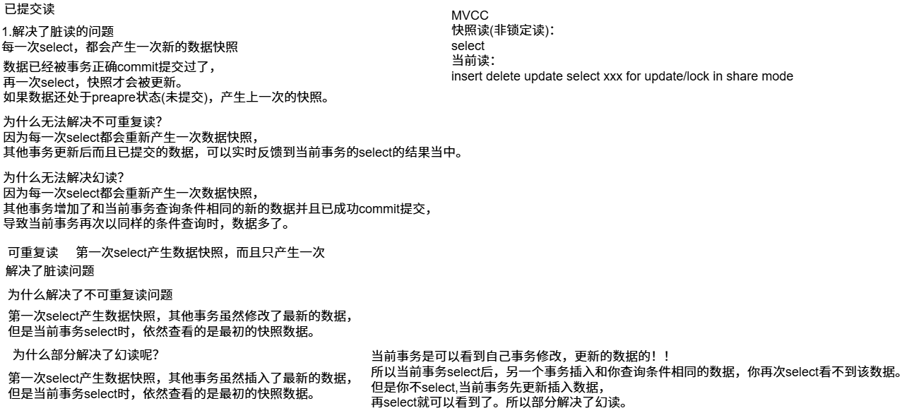

## MySQL优化

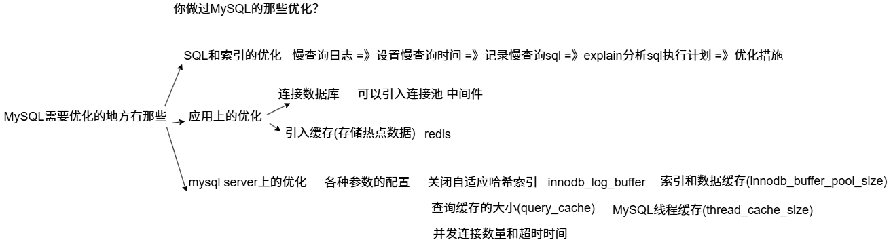

## MySQL日志

```mysql
show variables like 'log_%'; #全局变量	设置&状态	show variables & show status
+----------------------------------------+----------------------------------------+
| Variable_name                          | Value                                  |
+----------------------------------------+----------------------------------------+
| log_bin                                | ON                                     |
| log_bin_basename                       | /var/lib/mysql/binlog                  |
| log_bin_index                          | /var/lib/mysql/binlog.index            |
| log_bin_trust_function_creators        | OFF                                    |
| log_bin_use_v1_row_events              | OFF                                    |
| log_error                              | /var/log/mysql/error.log               |
| log_error_services                     | log_filter_internal; log_sink_internal |
| log_error_suppression_list             |                                        |
| log_error_verbosity                    | 2                                      |
| log_output                             | FILE                                   |
| log_queries_not_using_indexes          | OFF                                    |
| log_raw                                | OFF                                    |
| log_replica_updates                    | ON                                     |
| log_slave_updates                      | ON                                     |
| log_slow_admin_statements              | OFF                                    |
| log_slow_extra                         | OFF                                    |
| log_slow_replica_statements            | OFF                                    |
| log_slow_slave_statements              | OFF                                    |
| log_statements_unsafe_for_binlog       | ON                                     |
| log_throttle_queries_not_using_indexes | 0                                      |
| log_timestamps                         | UTC                                    |
+----------------------------------------+----------------------------------------+
21 rows in set (0.06 sec)
```

关于日志的配置需要到my.cnf去添加。

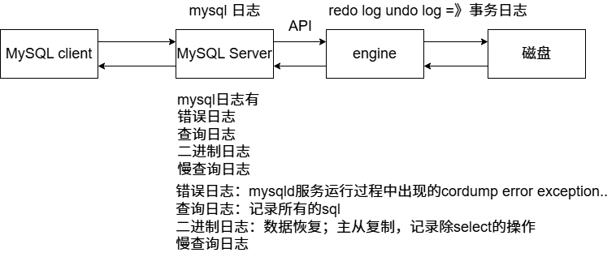

### 二进制日志

**二进制日志(BINLOG)记录了所有的DDL(数据定义语言)语句和DML(数据操纵语言)语句,但是不包括数据查询语句。语句以事件的形式保存，他描述了数据的更改过程。此日志对于灾难时的数据恢复起到极其重要的作用。**

**两个重要的应用场景：主从复制，数据恢复**

**查看binlog**

```mysql
show binary logs;
+---------------+-----------+-----------+
| Log_name      | File_size | Encrypted |
+---------------+-----------+-----------+
| binlog.000027 |       157 | No        |
| binlog.000028 |       157 | No        |
| binlog.000029 |       157 | No        |
| binlog.000030 |       157 | No        |
| binlog.000031 |       157 | No        |
| binlog.000032 |       157 | No        |
| binlog.000033 | 104857956 | No        |
| binlog.000034 | 104857734 | No        |
| binlog.000035 | 104857734 | No        |
| binlog.000036 | 104857688 | No        |
| binlog.000037 | 104857740 | No        |
| binlog.000038 | 104857740 | No        |
| binlog.000039 |  10635266 | No        |
+---------------+-----------+-----------+
13 rows in set (0.02 sec)
```

**通过mysqlbinlog工具(mysql原生自带的工具)可以快速解析大量的binlog日志文件。**

```mysql
#查看 binlog 日志内容
mysqlbinlog /var/lib/mysql/mysql-bin.000001
```

**mysql数据的恢复：过期数据的备份(data.sql)+bin-log数据恢复**

```bash
#bin-log数据恢复 除了通过位置恢复还可以通过时间恢复
mysqlbinlog --start-position=775 --stop-position=1410 mysql-bin.000003 | mysql -u root -p
#过期数据的备份
mysqldump -u root -p mytest user > ~/user.sql
mysqldump -u root -p --databases db1 [db2] > ~/user.sql
mysqldump -u root -p --all-databases > ~/user.sql
mysql界面下还原数据
source ~/user.sql
或者
cat ~/data.sql | mysql -u root -p
```

```bash
前面导出的是mysql的记录
我想直接导出数据
bash下
mysql -u root -p -D school -e "select * from user where age>18" > ~/user.txt
```

## SQL详细处理流程

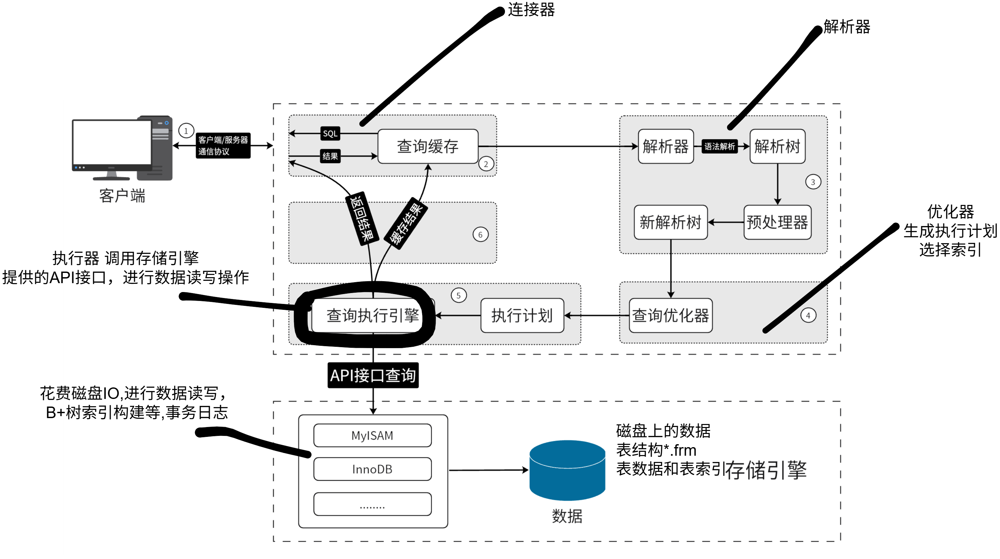

## MySQL集群

**在实际生产环境中，如果对mysql数据库的读和写都在一台数据库服务器中操作，无论是在安全性，高可用性，还是高并发等各个方面都是不能满足实际需求的，一般要通过主从复制的方式来同步数据，再通过读写分离来提升数据库的并发负载能力。**

1. **数据备份 -热备份&容灾&高可用。**
2. **读写分离，支持更大的并发。**

### 主从复制

**原理介绍**

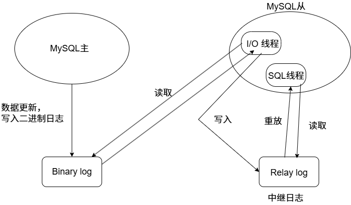

**主从复制的流程：两个日志binlog二进制日志&relay log中继日志和三个线程(master的一个线程和slave的两个线程)**

1. **主库的更新操作写入binlog二进制日志中。**
2. **master服务器创建一个binlog转储线程，将二进制日志内容发送到从服务器。**
3. **slave机器执行START SLAVE命令会在从服务器创建一个IO线程，接收master的binary log复制到其中继日志。首先slave开始一个工作线程(I/O线程)，I/O线程在master上打开一个普通的连接，然后开始binlog dump process,binlog dump process从master的二进制日志中读取事件，如果已经跟上master,它会睡眠并等待master产生新的事件，I/O线程将这些事件写入中继日志。**
4. **sql slave thread(sql从线程)处理该过程的最后一步，sql线程从中继日志中读取事件，并重放其中的事件而更新slave机器的数据，使其与master的数据一致。只要该线程与I/O线程保持一致，中继日志通常会位于os缓存中，所以中继日志的开销很小。**


### mysql主从复制配置

**首先确认防火墙是否开放对应端口(使用ubtuntu)**

```bash
#防火墙（UFW）状态
sudo ufw status
#启用防火墙
sudo ufw enable
#开放指定端口
sudo ufw allow 8080
#仅开放 TCP：
sudo ufw allow 8080/tcp
#仅开放 UDP：
sudo ufw allow 8080/udp
#查看当前已开放的端口
sudo ufw status numbered
#关闭指定端口
sudo ufw delete allow 8080
```

master配置：

1. 开启二进制日志，配置log_bin和全局唯一的server-id.

   ```bash
   sudo vim /etc/my.cnf#编写配置文件
   server-id=1
   expire_logs_days=7
   log-bin=mysql-bin
   sudo systemctl restart mysql#重启mysql
   ```

2. 创建一个用于主从库通信用的账号

   ```mysql
   DROP USER IF EXISTS 'mslave'@'从库ip(如果虚拟机NAT模式可以看错误日志看具体是那个ip)';#删除user变量为mslave（如果要重新配置可以删除再配置）
   CREATE USER 'mslave'@'从库ip(如果虚拟机NAT模式可以看错误日志看具体是那个ip)' IDENTIFIED WITH mysql_native_password BY '1qaz@wsx';
   查看 /var/log/mysql/error.log 中出现的访问主库失败信息，通常能看到连接的 IP
   GRANT REPLICATION SLAVE ON *.* TO 'mslave'@'和IP上同';
   FLUSH PRIVILEGES;
   ```

3. 获取binlog的日志文件名和position

   ```mysql
   mysql>show master status;
   show master status;
   +---------------+----------+--------------+------------------+-------------------+
   | File          | Position | Binlog_Do_DB | Binlog_Ignore_DB | Executed_Gtid_Set |
   +---------------+----------+--------------+------------------+-------------------+
   | binlog.000045 |     1056 |              |                  |                   |
   +---------------+----------+--------------+------------------+-------------------+
   1 row in set (0.00 sec)
   ```

slave配置：

1. 配置全局唯一的server-id=2(配置完需要重启mysql);

2. 使用master创建的账户读取binlog同步数据

   ```mysql
   change master to master_host='主库ip',
   master_port=3306,
   master_user='mslave',
   master_password='1qaz@wsx',
   master_log_file=' binlog.000045',
   master_log_pos=1056;
   ```

3. START SLAVE

   ```mysql
   START SLAVE#开启从库接受主库的binlog
   通过show slave status\G命令查看主从复制状态。
   STOP SLAVE;停止SLAVE，可以修改，再开始
   ```

   **show processlist查看mysql中正在运行的线程。**

```mysql
如果后续在从库出现错误了
可以用
stop slave;
set global sql_slave_skip_counter=5;#跳过5个错误
start slave;
```

### 读写分离

**读写分离就是在主服务器上修改，数据会同步到从服务器上，从服务器只能提供读取数据，不能写入，实现备份的同时也实现了数据库性能的优化，以及提升了服务器安全。**

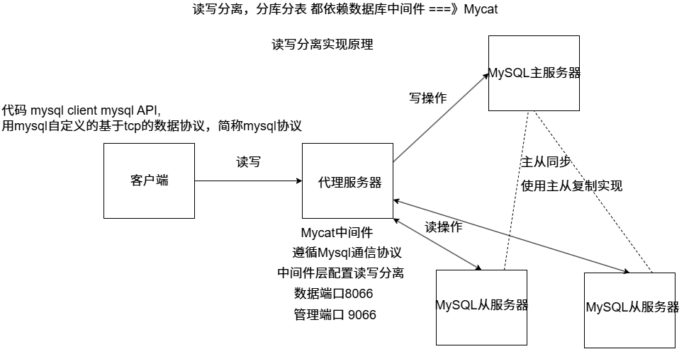

### Mycat读写分离配置

**安装好mycat后，就要对配置进行修改**

**mycat/conf/server.xml：配置的是mycat的账户信息**

```xml
<user name="root" defaultAccount="true">
                <property name="password">123456</property>
                <property name="schemas">TESTDB</property><!--逻辑库-->
                <property name="defaultSchema">TESTDB</property>
```

**mycat/conf/schema.xml：配置读写分离，分库分表等内容**

```xml
<schema name="TESTDB" checkSQLschema="true" sqlMaxLimit="100" randomDataNode="dn1">
	<!-- auto sharding by id (long) -->
	<!--splitTableNames 启用<table name 属性使用逗号分割配置多个表,即多个表使用这个配置-->
	<!--fetchStoreNodeByJdbc 启用ER表使用JDBC方式获取DataNode-->
    <table name="customer" primaryKey="id" dataNode="dn1"/>
	<!--<table name="customer" primaryKey="id" dataNode="dn1,dn2" rule="sharding-by-intfile" autoIncrement="true" fetchStoreNodeByJdbc="true">
		<childTable name="customer_addr" primaryKey="id" joinKey="customer_id" parentKey="id"></childTable>
	</table>-->
	<!-- <table name="oc_call" primaryKey="ID" dataNode="dn1$0-743" rule="latest-month-calldate"
                        /> -->
</schema>
<!-- <dataNode name="dn1$0-743" dataHost="localhost1" database="db$0-743"
                /> -->
<dataNode name="dn1" dataHost="localhost1" database="mytest" /><!--填写对应的数据库/>
<!--<dataNode name="dn4" dataHost="sequoiadb1" database="SAMPLE" /><dataNode name="jdbc_dn1" dataHost="jdbchost" database="db1" /><dataNode       name="jdbc_dn2" dataHost="jdbchost" database="db2" /><dataNode name="jdbc_dn3"       dataHost="jdbchost" database="db3" /> -->
<dataHost name="localhost1" maxCon="1000" minCon="10" balance="0"
                          writeType="0" dbType="mysql" dbDriver="jdbc" switchType="1"  slaveThreshold="100">
	<heartbeat>select user()</heartbeat>
	<!-- can have multi write hosts -->
	<writeHost host="192.168.25.129" url="jdbc:mysql://192.168.25.129:3306/mytest" user="root"
                                   password="123456">
        <readHost host="192.168.1.6" url="jdbc:mysql://192.168.1.6:3306/mytest" user="root"
                                   password="123456"/>
    </writeHost>
    <writeHost host="192.168.1.6" url="jdbc:mysql://192.168.1.6:3306/mytest" user="root" password="123456"/>
	<!-- <writeHost host="hostM2" url="localhost:3316" user="root" password="123456"/> -->
</dataHost>
```

**schema指的是逻辑库和逻辑表，dataNode指的是数据节点，dataHost指的是物理数据库信息。writeHost填写自己部署的写服务器地址readHost填写读服务器地址**

```xml
<writeHost host="192.168.1.6" url="jdbc:mysql://192.168.1.6:3306/mytest" user="root" password="123456"/>
```

**这句当写服务器挂了后，可以把其他服务器或者自己的读服务器变为主服务器**。

```xml
<dataHost name="localhost1" maxCon="1000" minCon="10" balance="0"
                          writeType="0" dbType="mysql" dbDriver="jdbc" switchType="1"  slaveThreshold="100">
```

```xml
maxCon，minCon可以规定连接数。
balance:"0":不开启读写分离
		"1":全部的readHost和stand by writeHost(等待的写服务器)参与select语句的负载
		"2":所有的读操作随机在readHost和writeHost分发
		"3":所有读请求随机分发到writeHost对应的readHost上执行
writeType="0":所有的写操作发送到配置的第一个writeHost,第一个挂掉切换到还生存的第二个writeHost
switchType:"-1"；不自动切换
			"1":自动切换，根据心跳select user()
			"2":基于MySQL的主从同步状态决定是否进行切换 show slave status来检测
```

**启动出错可以去看wrapper.log**

**运行出错可以去看mycat.log**

```mysql
#使用客户端连接
mysql -h ip -P 8066 -u root -p 登录端口为9066是管理端口（监控和管理端口），8066是数据服务端口（SQL 端口）
#默认用户名是 root，密码为你在 conf/server.xml 中 <user> 配置的密码。
```

**如果确认是哪个服务器的数据库执行查，执行写，我们可以看对应数据库查询日志**

## MySQL分库分表

**刚开始多数项目用单机数据库就够了，随着服务器流量越来越大，面对的请求也越来越多，我们做了数据库读写分离，使用多个从库副本（Slave）负责读，使用主库（Master）负责写，master和slave通过主从复制实现数据同步更新，保持数据一致。slave从库可以水平扩展，所以更多的读请求不成问题。**

**但是当用户量级上升，写请求越来越多，怎么保证数据库的负载足够？增加一个Master是不能解决问题的，因为数据要保持一致性，写操作需要2个master同步，相当于重复了，而且架构设计更加复杂。**

**这时需要用到分库分表(sharding)，对写操作进行切分。**

### 库表问题

**单库太大**

**单库处理能力有限，所在服务器上的磁盘空间不足，遇到IO瓶颈，需要将单库切分为更多更小的库。**

**单表太大**

**CRUD效率都很低，数据量太大导致索引膨胀，查询超时，需要把单表切分成多个数据集更小的表。**

### 拆分策略

**单个库太大，先考虑是表多还是数据多：**

1. **如果因为表多而造成数据过多，则使用垂直拆分，即根据业务拆分成不同的库**
2. **如果因为单张表的数据量太大，则使用水平拆分，即把表的数据按照某种规则拆分成多张表。**

**分库分表的原则应先考虑垂直拆分，再考虑水平拆分。**

### 垂直拆分

**MyCat 垂直分库=不同表走不同数据库，但对外仍是一个逻辑库，既解耦又统一**

### 水平分表

**水平分表=将一张表“拆行”为多张表，用路由规则将数据映射到对应表，是应对大表性能瓶颈的核心手段。**

**后续mycat考虑深入**

## 完结散花