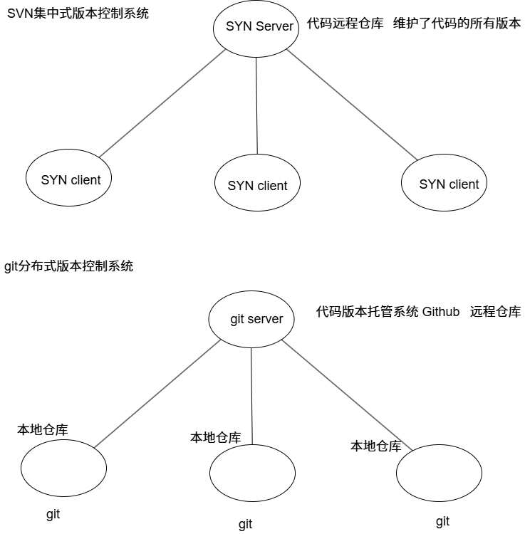
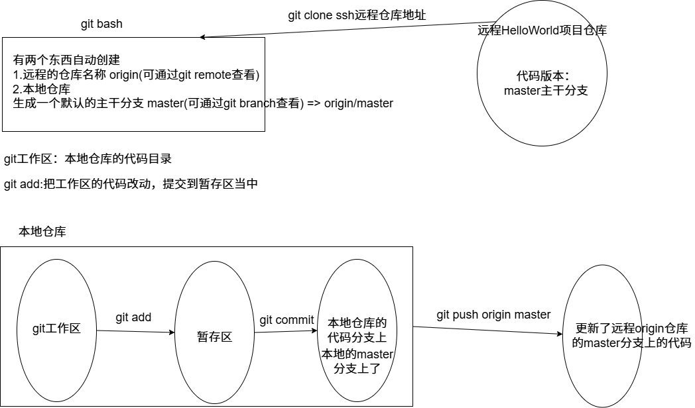
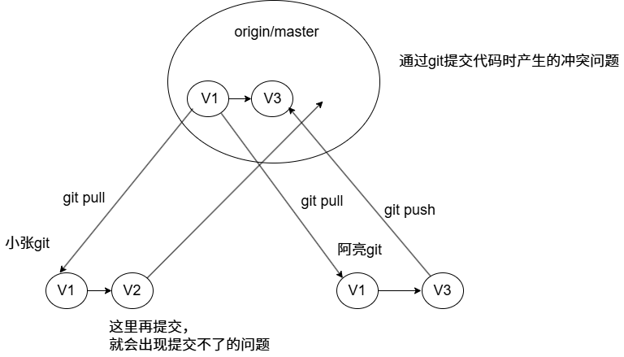
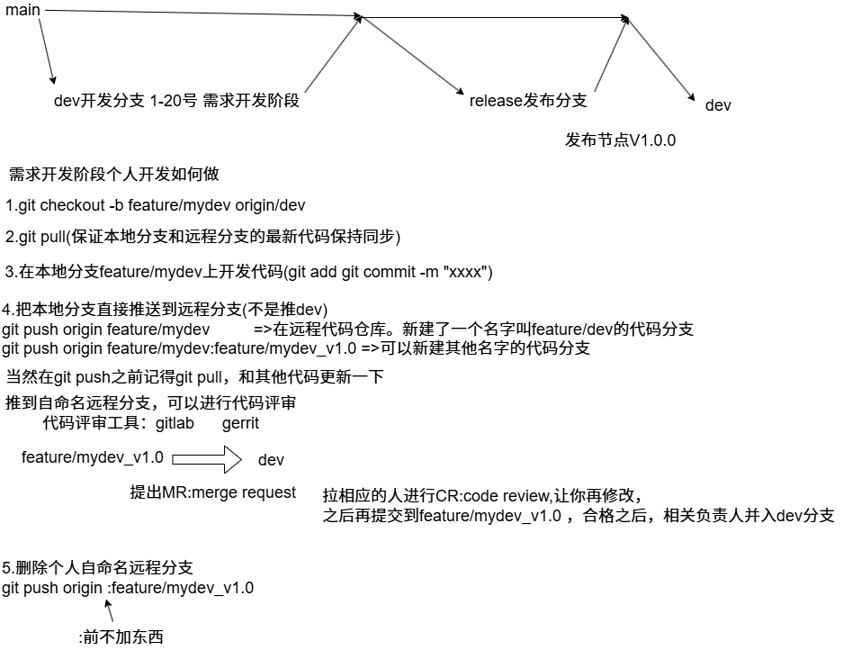
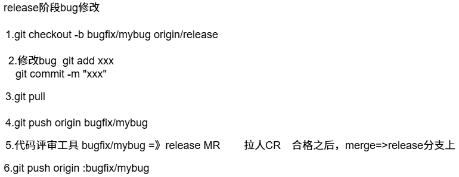

## git介绍

**git是目前世界上最先进的分布式版本控制系统(对比集中式版本控制系统SVN).**



## git常用命令

### git常用基础命令



```bash
27545@oneday MINGW64 /e/Desktop/github
$ git clone git@github.com:YuStone0416/HelloWorld.git #在github云端创建仓库后，使用git clone，生成本地仓库
Cloning into 'HelloWorld'...
remote: Enumerating objects: 3, done.
remote: Counting objects: 100% (3/3), done.
remote: Total 3 (delta 0), reused 0 (delta 0), pack-reused 0 (from 0)
Receiving objects: 100% (3/3), done.

27545@oneday MINGW64 /e/Desktop/github
$ git remote 
fatal: not a git repository (or any of the parent directories): .git

27545@oneday MINGW64 /e/Desktop/github
$ cd HelloWorld/

27545@oneday MINGW64 /e/Desktop/github/HelloWorld (main)
$ git remote #查看本地仓库绑定的远程仓库的名字(不是真名HelloWorld,一般是origin)
origin

27545@oneday MINGW64 /e/Desktop/github/HelloWorld (main)
$ git branch #查看本地仓库的分支(默认生成一个主干分支main)
* main

27545@oneday MINGW64 /e/Desktop/github/HelloWorld (main)
$ git branch -r #查看远程仓库和本地仓库连接的分支
  origin/HEAD -> origin/main
  origin/main

27545@oneday MINGW64 /e/Desktop/github/HelloWorld (main)
$ git status #查看当前操作的状态信息，目前需要把更改过的文件放入暂存区
On branch main
Your branch is up to date with 'origin/main'.

Untracked files:
  (use "git add <file>..." to include in what will be committed)
        main.cpp

nothing added to commit but untracked files present (use "git add" to track)

27545@oneday MINGW64 /e/Desktop/github/HelloWorld (main)
$ git add main.cpp #把对应文件加入暂存区

27545@oneday MINGW64 /e/Desktop/github/HelloWorld (main)
$ git status #再次查看显示没有文件需要添加，可以进行提交了
On branch main
Your branch is up to date with 'origin/main'.

Changes to be committed:
  (use "git restore --staged <file>..." to unstage)
        new file:   main.cpp


27545@oneday MINGW64 /e/Desktop/github/HelloWorld (main)
$ git commit -m "创建main.cpp文件。写了初始代码" #提交当前暂存区的文件到本地仓库的main分支上，-m是说明此次提交的目的
[main 250b7a4] 创建main.cpp文件。写了初始代码
 1 file changed, 13 insertions(+)
 create mode 100644 main.cpp

27545@oneday MINGW64 /e/Desktop/github/HelloWorld (main)
$ git status #再次查看，可以向远程仓库origin的main分支推送更新远程仓库的代码
On branch main
Your branch is ahead of 'origin/main' by 1 commit.
  (use "git push" to publish your local commits)

nothing to commit, working tree clean

27545@oneday MINGW64 /e/Desktop/github/HelloWorld (main)
$ git push origin main #向远程仓库origin的main分支推送，更新远程仓库的代码
Enumerating objects: 4, done.
Counting objects: 100% (4/4), done.
Delta compression using up to 12 threads
Compressing objects: 100% (3/3), done.
Writing objects: 100% (3/3), 453 bytes | 453.00 KiB/s, done.
Total 3 (delta 0), reused 0 (delta 0), pack-reused 0
To github.com:YuStone0416/HelloWorld.git
   8d0bec1..250b7a4  main -> main

27545@oneday MINGW64 /e/Desktop/github/HelloWorld (main)
$ git log #可以查看远程仓库的所有推送信息
commit 250b7a400340ca44fa2cd41a71ea2657a36fbfc1 (HEAD -> main, origin/main, origin/HEAD)
Author: YuStone0416 <2754523646@qq.com>
Date:   Wed Aug 27 23:45:16 2025 +0800

    创建main.cpp文件。写了初始代码

commit 8d0bec1711e3ba259465211fe1bdac385bfe852f
Author: YuStone <103396603+YuStone0416@users.noreply.github.com>
Date:   Wed Aug 27 22:48:06 2025 +0800

    Initial commit
```

```bash
#如果你本地仓库对比远程仓库的代码不是最新的，你想变成最新的
git pull#把远程代码拉取到本地
```

### git各阶段版本回退命令

```bash
#在git工作区修改完后，还没有git add,我发现我修改不对，我想回退到我上一个版本
git checkout -- main.cpp #本质就是<本地仓库/分支> => <当前工作区修改的内容/文件>覆盖掉
#git checkout -- .

#git add后，已经添加到暂存区，但是还没有提交到本地分支
git reset HEAD#把暂存区中的内容删除，又回退到git工作区修改完后，还没有git add的状态了
#git reset HEAD <filename> 把暂存区的对应文件的修改删除

#git commit后，已经提交到本地分支，还没有推送远程仓库
#这里使用git log可以看到此次你提交到本地仓库的信息，当然其他使用远程仓库的用户是看不见的,主要查看你想要回退版本的commit-id
git reset --hard 250b(commit-id可以区分即可)#把本地仓库回退到你想要的版本，暂存区和工作区修改全部清空
#当然如果你回退之后，又想要回退的版本使用git reflog，找到你之前的版本，得到commit-id,使用git reset --hard 250b(commit-id可以区分即可)也是可以回退的。


#git push之后，提交到远程仓库了，如何回退到想要的版本
#如果我发现推送错误版本后，git log发现只有我在推送，我可以在本地先把我的本地仓库版本回退到之前版本，然后再推送。
git push -f origin main #一定加-f,强制推送，远程仓库不允许旧的版本替换新的版本，必须强制

```

```bash
27545@oneday MINGW64 /e/Desktop/github/HelloWorld (main)
$ git status
On branch main
Your branch is up to date with 'origin/main'.

Changes not staged for commit:
  (use "git add <file>..." to update what will be committed)
  (use "git restore <file>..." to discard changes in working directory)
        modified:   main.cpp

no changes added to commit (use "git add" and/or "git commit -a")

27545@oneday MINGW64 /e/Desktop/github/HelloWorld (main)
$ git checkout -- main.cpp

27545@oneday MINGW64 /e/Desktop/github/HelloWorld (main)
$ git add main.cpp

27545@oneday MINGW64 /e/Desktop/github/HelloWorld (main)
$ git status
On branch main
Your branch is up to date with 'origin/main'.

Changes to be committed:
  (use "git restore --staged <file>..." to unstage)
        modified:   main.cpp


27545@oneday MINGW64 /e/Desktop/github/HelloWorld (main)
$ git reset HEAD
Unstaged changes after reset:
M       main.cpp

27545@oneday MINGW64 /e/Desktop/github/HelloWorld (main)
$ git status
On branch main
Your branch is up to date with 'origin/main'.

Changes not staged for commit:
  (use "git add <file>..." to update what will be committed)
  (use "git restore <file>..." to discard changes in working directory)
        modified:   main.cpp

no changes added to commit (use "git add" and/or "git commit -a")

27545@oneday MINGW64 /e/Desktop/github/HelloWorld (main)
$ git add .

27545@oneday MINGW64 /e/Desktop/github/HelloWorld (main)
$ git commit -m "提交"
[main 3a1f83a] 提交
 1 file changed, 1 insertion(+)

27545@oneday MINGW64 /e/Desktop/github/HelloWorld (main)
$ git status
On branch main
Your branch is ahead of 'origin/main' by 1 commit.
  (use "git push" to publish your local commits)

nothing to commit, working tree clean

27545@oneday MINGW64 /e/Desktop/github/HelloWorld (main)
$ git log
commit 3a1f83a95b235eaa00f62366c2cb6401256dcc28 (HEAD -> main)
Author: YuStone0416 <2754523646@qq.com>
Date:   Thu Aug 28 00:36:14 2025 +0800

    提交

commit 250b7a400340ca44fa2cd41a71ea2657a36fbfc1 (origin/main, origin/HEAD)
Author: YuStone0416 <2754523646@qq.com>
Date:   Wed Aug 27 23:45:16 2025 +0800

    创建main.cpp文件。写了初始代码

commit 8d0bec1711e3ba259465211fe1bdac385bfe852f
Author: YuStone <103396603+YuStone0416@users.noreply.github.com>
Date:   Wed Aug 27 22:48:06 2025 +0800

    Initial commit

27545@oneday MINGW64 /e/Desktop/github/HelloWorld (main)
$ git reset --hard 250b
HEAD is now at 250b7a4 创建main.cpp文件。写了初始代码

27545@oneday MINGW64 /e/Desktop/github/HelloWorld (main)
$ git log
commit 250b7a400340ca44fa2cd41a71ea2657a36fbfc1 (HEAD -> main, origin/main, origin/HEAD)
Author: YuStone0416 <2754523646@qq.com>
Date:   Wed Aug 27 23:45:16 2025 +0800

    创建main.cpp文件。写了初始代码

commit 8d0bec1711e3ba259465211fe1bdac385bfe852f
Author: YuStone <103396603+YuStone0416@users.noreply.github.com>
Date:   Wed Aug 27 22:48:06 2025 +0800

    Initial commit

27545@oneday MINGW64 /e/Desktop/github/HelloWorld (main)
$ git reflog
250b7a4 (HEAD -> main, origin/main, origin/HEAD) HEAD@{0}: reset: moving to 250b
3a1f83a HEAD@{1}: commit: 提交
250b7a4 (HEAD -> main, origin/main, origin/HEAD) HEAD@{2}: reset: moving to HEAD
250b7a4 (HEAD -> main, origin/main, origin/HEAD) HEAD@{3}: commit: 创建main.cpp文件。写了初始代码
8d0bec1 HEAD@{4}: clone: from github.com:YuStone0416/HelloWorld.git

27545@oneday MINGW64 /e/Desktop/github/HelloWorld (main)
$ git log
commit 250b7a400340ca44fa2cd41a71ea2657a36fbfc1 (HEAD -> main, origin/main, origin/HEAD)
Author: YuStone0416 <2754523646@qq.com>
Date:   Wed Aug 27 23:45:16 2025 +0800

    创建main.cpp文件。写了初始代码

commit 8d0bec1711e3ba259465211fe1bdac385bfe852f
Author: YuStone <103396603+YuStone0416@users.noreply.github.com>
Date:   Wed Aug 27 22:48:06 2025 +0800

    Initial commit

27545@oneday MINGW64 /e/Desktop/github/HelloWorld (main)
$ git status
On branch main
Your branch is up to date with 'origin/main'.

nothing to commit, working tree clean
```

### git推送代码冲突解决方案



```bash
#这个问题就是使用git pull,把当前远程仓库的最新版本拉取下来，git会自动把你修改过的地方合并，但是它的合并只是把你在项目新增的地方合并，如果你的代码和最新版本的代码相同的地方代码不同，这就需要手动合并，需要自己判断如何修改
```

### git分支版本控制命令

#### git创建本地分支

```bash
27545@oneday MINGW64 /e/Desktop/github/HelloWorld (main)
$ git branch #查看本地处于那个分支
* main
27545@oneday MINGW64 /e/Desktop/github/HelloWorld (main)
$ git branch -r #查看远程连接的是那个分支
  origin/HEAD -> origin/main
  origin/main

27545@oneday MINGW64 /e/Desktop/github/HelloWorld (main)
$ git branch -a #本地分支和远程连接分支都能查看
* main
  remotes/origin/HEAD -> origin/main
  remotes/origin/main
27545@oneday MINGW64 /e/Desktop/github/HelloWorld (main)
$ git checkout -b sortdev #创建本地分支sortdev
Switched to a new branch 'sortdev'

27545@oneday MINGW64 /e/Desktop/github/HelloWorld (sortdev)
$ git status
On branch sortdev
nothing to commit, working tree clean

27545@oneday MINGW64 /e/Desktop/github/HelloWorld (sortdev)
$ git log
commit 250b7a400340ca44fa2cd41a71ea2657a36fbfc1 (HEAD -> sortdev, origin/main, origin/HEAD, main)
Author: YuStone0416 <2754523646@qq.com>
Date:   Wed Aug 27 23:45:16 2025 +0800

    创建main.cpp文件。写了初始代码

commit 8d0bec1711e3ba259465211fe1bdac385bfe852f
Author: YuStone <103396603+YuStone0416@users.noreply.github.com>
Date:   Wed Aug 27 22:48:06 2025 +0800

    Initial commit

27545@oneday MINGW64 /e/Desktop/github/HelloWorld (sortdev)
$ git pull #在本地sortdev分支是默认拉取不了的
There is no tracking information for the current branch.
Please specify which branch you want to merge with.
See git-pull(1) for details.

    git pull <remote> <branch>

If you wish to set tracking information for this branch you can do so with:

    git branch --set-upstream-to=origin/<branch> sortdev


27545@oneday MINGW64 /e/Desktop/github/HelloWorld (sortdev)
$ git branch -vv #查看本地的分支，以及自己处于哪一个分支
  main    250b7a4 [origin/main] 创建main.cpp文件。写了初始代码
* sortdev 250b7a4 创建main.cpp文件。写了初始代码

27545@oneday MINGW64 /e/Desktop/github/HelloWorld (sortdev)
$ git checkout main #切换为main分支
Switched to branch 'main'
Your branch is up to date with 'origin/main'.

27545@oneday MINGW64 /e/Desktop/github/HelloWorld (main)
$ git branch sortdev #创建sortdev分支
fatal: a branch named 'sortdev' already exists

27545@oneday MINGW64 /e/Desktop/github/HelloWorld (main)
$ git checkout sortdev #切换为sortdev分支
Switched to branch 'sortdev'

#注意你在sortdev分支做的事情不会影响本地main分支，当然你最后在sortdev做好你的修改后，进行add和commit提交到sortdev分支就可以合并到main分支上
#在main分支
git merge sortdev
#合并时候再推给远程仓库

git branch -d sortdev#删除分支sortdev,如果还没有合并是删除不了，使用-D

#其实也可以在sortdev分支直接推送远程的分支(需要指定分支)
git push origin sortdev:main
```

#### 合并分支冲突

```bash
上一节合并的时候，一切顺利是因为main分支没有做修改，所以合并的时候一切顺利
有这样一种情况：
1.Tom从本地main分支上创建了一个新的分支sortdev,进行代码开发测试，提交
2.June更新了远程仓库main分支的代码
3.Tom切换到本地分支main，git pull同步远程仓库main主干的最新代码，发现有变化
4.Tom直接git merge sortdev就发生冲突了

这里也需要手动把冲突解决掉，再推送到远端，解决方法和git推送代码冲突解决方案那一节类似
```

#### 远程分支管理

```bash
#查看本地分支
git branch
#查看远程分支
git branch -r
#查看本地分支和远程分支的追踪关系
git branch -vv
#创建本地分支并指定追踪那个远程分支
git checkout -b 本地分支名 远程仓库名/远程分支名
#设置已经存在的本地分支追踪那个远程分支
git branch -u 远程仓库名/远程分支名
```

```bash
远程分支就是在github上手动创建
在本地记得先git pull一下，本地就会知道有一个新的远程分支
```

**Git 分支 & 提交 & 日志总结**

1. **分支与代码资源**

- Git 分支本质上是一个 **指针**，指向某个提交（commit）。
- 所有分支共享同一个代码资源库（`.git/objects`），不会重复占用空间。
- 本地只有一个工作区，切换分支时，工作区代码会随分支变化。

------

2. **切换分支时代码会变吗？**

- **已提交的代码** → 永远安全，不会丢。
- **工作区代码** → 会随分支切换而变化，更新为目标分支对应的版本。
- **未提交的修改** →
  - 如果不冲突，会带到新分支；
  - 如果冲突，Git 会阻止切换，需要先提交、stash 或丢弃。

------

3. **本地提交 vs 远程提交**

- **本地提交**：执行 `git commit` 后，代码只存在于本地仓库，别人看不到。
- **远程提交**：保存在远程仓库（如 GitHub/Gitee），团队共享。
- **同步方式**：
  - 本地 → 远程：`git push`
  - 远程 → 本地：`git pull` 或 `git fetch` + `git merge/rebase`

------

4. **如何查看本地和远程的提交差异**

- 查看本地分支提交：

  ```
  git log branchA
  ```

- 查看远程分支提交：

  ```
  git log origin/branchA
  ```

- 本地比远程多的提交（未 push）：

  ```
  git log origin/branchA..branchA --oneline
  ```

- 远程比本地多的提交（未 pull）：

  ```
  git log branchA..origin/branchA --oneline
  ```

------

5. **`git log` 能看到什么**

- 默认：`git log` → 当前分支的提交历史

- 其他本地分支：

  ```
  git log 分支名
  ```

- 所有分支：

  ```
  git log --all --oneline --graph
  ```

- 提交详情：

  - 简洁模式：`git log --oneline`
  - 图形模式：`git log --graph --oneline --all`
  - 改动文件：`git log --stat`
  - 具体改动：`git log -p`
  - 限制条数：`git log -n 5`
  - 按作者：`git log --author="jun"`
  - 指定文件：`git log branchName -- path/to/file`

## git工作流

```bash
项目代码远程仓库分支：main主干分支 	dev:开发分支	release：发布分支
个人开发分支:		feature特性分支		bugfix缺陷修改分支	hotfix热更新分支(对老版本出补丁)
```



