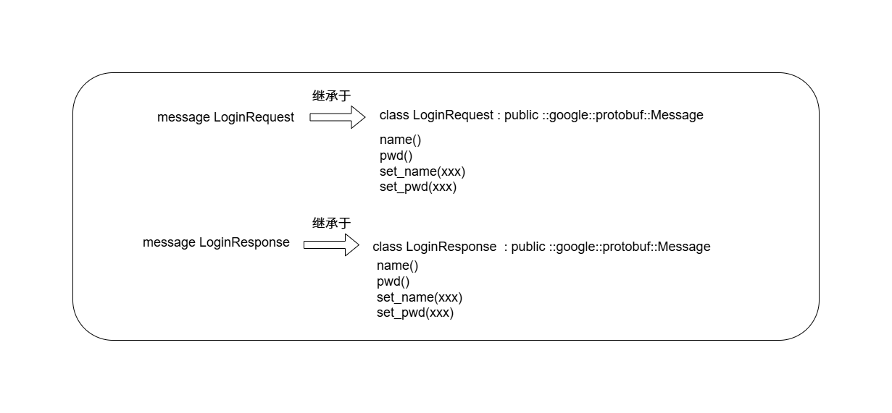
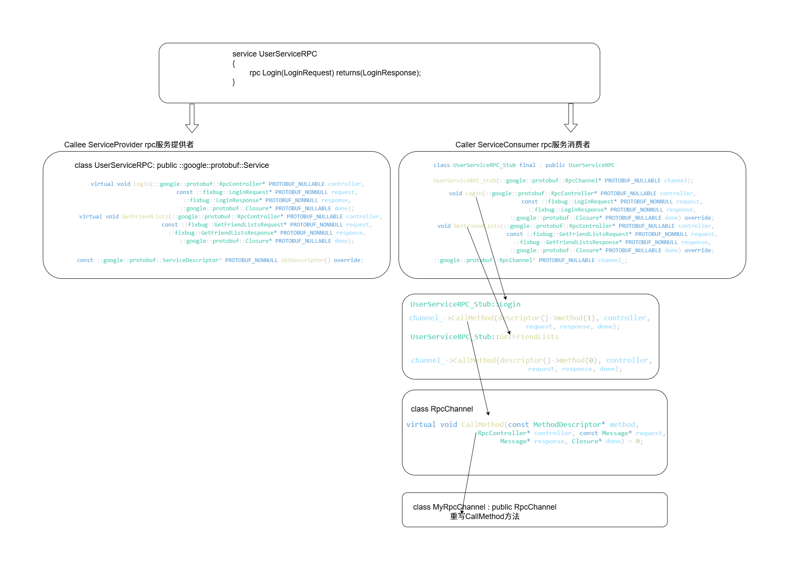

## 实践1

**test.proto文件**

```protobuf
syntax = "proto3"; //声明了protobuf的版本

package fixbug; //声明了代码所在的包（对C++来说是namespace）

//定义登录请求消息类型 name pwd
message LoginRequest
{
    string name = 1; //这里的数字表示第几个字段
    string pwd = 2;
}

//定义登录响应消息类型
message LoginResponse
{
    int32 errcode = 1;
    string errmsg = 2;
    bool success = 3;
}
```

**protobuf可以先声明好消息的结构**

```bash
protoc test.proto --cpp_out=./#使用这条命令可以在当前目录自动生成使用这些消息的cpp文件test.pb.h,test.pb.cc
```

**main.cc测试文件**

```c++
#include "test.pb.h"//包含生成的.h文件

#include <iostream>
#include <string>
int main()
{
    //封装login请求对象的数据
    //这里fixbug就是test.proto文件中package字段声明的当成命名空间
    //LoginRequest就是message声明的当成类使用
    fixbug::LoginRequest req;
    req.set_name("zhangsan");
    req.set_pwd("123456");

    //对象数据序列化 =》string
    std::string send_str;
    if (req.SerializeToString(&send_str))
    {
        std::cout << send_str << std::endl;
    }

    //从send_str反序列化一个login请求对象
    fixbug::LoginRequest reqB;
    if(reqB.ParseFromString(send_str))
    {
        std::cout<<reqB.name()<<std::endl;
        std::cout<< reqB.pwd()<<std::endl;
    }
    return 0;
}
```

```bash
g++ main.cc test.pb.cc $(pkg-config --cflags --libs protobuf) -o test
./test
```

```bash

zhangsan123456
zhangsan
123456
```

**首先我的protobuf版本是32.1，是强制依赖absl 库，所以使用 pkg-config，这个需要**

```bash
sudo apt update
sudo apt install pkgconf
#安装后测试使用
pkg-config --libs protobuf
```

```bash
-L/usr/local/lib -lprotobuf -labsl_log_internal_check_op -labsl_die_if_null -labsl_log_internal_conditions -labsl_log_internal_message -labsl_examine_stack -labsl_log_internal_format -labsl_log_internal_nullguard -labsl_log_internal_structured_proto -labsl_log_internal_log_sink_set -labsl_log_sink -labsl_log_entry -labsl_log_internal_proto -labsl_flags_internal -labsl_flags_marshalling -labsl_flags_reflection -labsl_flags_private_handle_accessor -labsl_flags_commandlineflag -labsl_flags_commandlineflag_internal -labsl_flags_config -labsl_flags_program_name -labsl_log_initialize -labsl_log_internal_globals -labsl_log_globals -labsl_vlog_config_internal -labsl_log_internal_fnmatch -labsl_raw_hash_set -labsl_hashtablez_sampler -labsl_random_distributions -labsl_random_seed_sequences -labsl_random_internal_entropy_pool -labsl_random_internal_randen -labsl_random_internal_randen_hwaes -labsl_random_internal_randen_hwaes_impl -labsl_random_internal_randen_slow -labsl_random_internal_platform -labsl_random_internal_seed_material -labsl_random_seed_gen_exception -labsl_statusor -labsl_status -labsl_cord -labsl_cordz_info -labsl_cord_internal -labsl_hash -labsl_city -labsl_cordz_functions -labsl_exponential_biased -labsl_cordz_handle -labsl_crc_cord_state -labsl_crc32c -labsl_crc_internal -labsl_crc_cpu_detect -labsl_leak_check -labsl_strerror -labsl_str_format_internal -labsl_synchronization -labsl_graphcycles_internal -labsl_kernel_timeout_internal -labsl_stacktrace -labsl_symbolize -labsl_debugging_internal -labsl_demangle_internal -labsl_demangle_rust -labsl_decode_rust_punycode -labsl_utf8_for_code_point -labsl_malloc_internal -labsl_tracing_internal -labsl_time -labsl_civil_time -labsl_time_zone -lutf8_validity -lutf8_range -labsl_strings -labsl_strings_internal -labsl_string_view -labsl_int128 -labsl_base -lrt -labsl_spinlock_wait -labsl_throw_delegate -labsl_raw_logging_internal -labsl_log_severity 
```

**这样就是成功的。**

## 实践2

**test.proto文件**

```protobuf
syntax = "proto3"; //声明了protobuf的版本

package fixbug; //声明了代码所在的包（对C++来说是namespace）

message ResultCode //把错误码和错误信息封装，避免冗余
{
    int32 errcode = 1;
    bytes errmsg = 2;
}

//定义登录请求消息类型 name pwd
message LoginRequest
{
    bytes name = 1; //这里的数字表示第几个字段,对于字符串可以使用bytes存储而不使用string
    bytes pwd = 2;
}

//定义登录响应消息类型
message LoginResponse
{
    ResultCode result =1;
    bool success = 2;
}

//网络传输一般除了单个成员还有列表，映射表(map<int32,string> test)
message GetFriendListsRequest
{
    uint32 userid=1;

}

message User //先声明单个user信息
{
    bytes name =1;
    uint32 age = 2;
    enum Sex
    {
        MAN=0;
        WOMAN=-1;
    }
    Sex sex=3;
}

message GetFriendListsResponse
{
    ResultCode result =1;
    repeated User friend_list=2; //使用repeated可以变为列表
}
```

**这里看到我把string更换为bytes，string存储的是文本，byte存储的是任意二进制数据，但是在C++会自动映射为std::string类型，性能差不多，两者都可以。**

**前面把.proto文件转换为c++文件就不赘述了。**

```c++
#include "test.pb.h"

#include <iostream>
#include <string>

int main()
{
    // //message里面套着一个message如何使用？
    // fixbug::LoginResponse rsp;
    // fixbug::ResultCode *rc=rsp.mutable_result();
    // rc->set_errcode(0);
    // rc->set_errmsg("Login failed");
    

    
    fixbug::GetFriendListsResponse rsp;
    //mutable_message名(套在message里的单个message)的函数返回该指针(可以修改)
    //result()函数是一个只读不可修改的引用，所以用mutable_message名函数
    fixbug::ResultCode *rc=rsp.mutable_result(); 
    rc->set_errcode(0);
    
    //如何处理protobuf中的列表类型
    fixbug::User *user1= rsp.add_friend_list(); //add_列表名的函数返回新增单个列表成员的指针
    user1->set_name("zhang san");
    user1->set_age(20);
    user1->set_sex(fixbug::User::MAN);

    fixbug::User *user2= rsp.add_friend_list();
    user2->set_name("li si");
    user2->set_age(20);
    user2->set_sex(fixbug::User::MAN);
    //查看当前列表中成员个数
    std::cout<<rsp.friend_list_size()<<std::endl;
    //读取当前成员
    for(int i=0;i<rsp.friend_list_size();++i)
    {
        fixbug::User user=rsp.friend_list(i);//返回的是单个成员只读不可修改的引用
        std::cout<<"name :"<<user.name()<<" age: "<<user.age()<<" sex: "<<user.sex()<<std::endl;
    }
    return 0;   
}
```

```bash
2
name :zhang san age: 20 sex: 0
name :li si age: 20 sex: 0
```

## 实践3

**test.proto**

```protobuf
//定义下面的选项，表示生成service服务类和rpc方法描述，不加默认不生成
option cc_generic_services = true;


//在protobuf里面怎末定义描述rpc方法的类型 - service
service UserServiceRPC
{
    rpc Login(LoginRequest) returns(LoginResponse);
    rpc GetFriendLists(GetFriendListsRequest) returns(GetFriendListsResponse);
}
```



