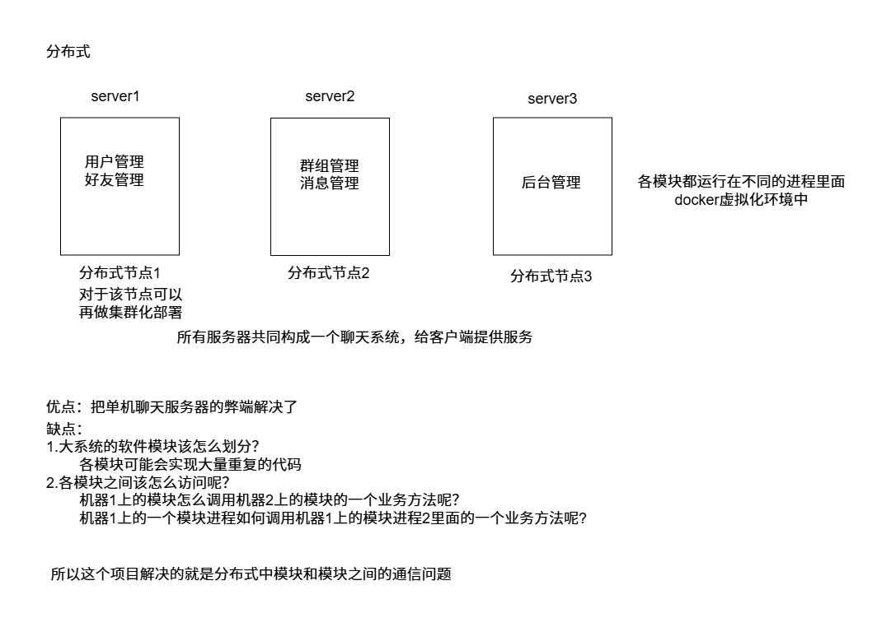

## 集群和分布式

集群：每台服务器独立运行一个工程的所有模块

分布式：一个工程拆分很多模块，每个模块独立部署运行在一个服务器主机上，所有服务器协同工作共同提供服务，每一台服务器称作分布式的一个节点，根据节点的并发要求，对一个节点可以再做节点模块集群部署。




## RPC通信原理

**RPC(Remote Procedure Call Protocol)远程过程调用协议**


**这里使用protobuf而不使用json?**

1. **protobuf是二进制存储；xml和json都是文本存储**

2. **protobuf不需要存储额外的信息；json怎么存储数据的呢？**

   **name:"zhangsan",pwd:"123456",protobuf就是“zhangsan""123456".**

## 分布式网络框架开发

### 配置文件

```bash
#rpc节点的ip地址
rpcserverip=127.0.0.1
#rpc节点的port端口号
rpcserverport=8000
#zk的ip地址
zookeeperip=127.0.0.1
#zk的port端口号
zookeeperport=5000
```

**用户可以修改配置文件来修改rpc节点和zookeeper的ip和端口。**

### 框架读取配置文件类

**mprpcconfig.h**

```c++
#pragma once

#include <unordered_map>
#include <string>
//rpcserverip rpcserverport     zookeeperip zookeeperport
// 框架读取配置文件类
class MprpcConfig
{
public:
    //负责解析加载配置文件
    void LoadConfigFile(const char *config_file);
    //查询配置项信息
    std::string Load(std::string key);
private:
    std::unordered_map<std::string,std::string> m_configMap;
    //去掉字符串前后的空格
    void Trim(std::string &src_buf);
};
```

**mprpcconfig.cc**

```c++
#include "mprpcconfig.h"

#include <iostream>
#include <string>
// 负责解析加载配置文件
void MprpcConfig::LoadConfigFile(const char *config_file)
{
    FILE *pf = fopen(config_file, "r");
    if (nullptr == pf)
    {
        std::cout << config_file << "is not exist!" << std::endl;
        exit(EXIT_FAILURE);
    }

    // 1.注释 2正确的配置项 3.去掉开头多余的空格
    while (!feof(pf))
    {
        char buf[512] = {0};
        // 按行读取，会把\n存取
        fgets(buf, 512, pf);

        // 去掉字符串前面多余的空格
        std::string read_buf(buf);
        Trim(read_buf);
        // 判断#的注释
        if (read_buf[0] == '#' || read_buf.empty())
        {
            continue;
        }
        // 解析配置项
        int idx = read_buf.find('=');
        if (idx == -1)
        {
            // 配置项不合法
            continue;
        }
        std::string key;
        std::string value;
        key = read_buf.substr(0, idx);
        Trim(key);
        //找一下回车
        //127.0.0.1\n
        int endidx=read_buf.find('\n',idx);
        value = read_buf.substr(idx + 1, endidx - idx-1);
        Trim(value);
        m_configMap.insert({key, value});
    }
}
// 查询配置项信息
std::string MprpcConfig::Load(std::string key)
{
    auto it = m_configMap.find(key);
    if (it == m_configMap.end())
    {
        return "";
    }
    return it->second;
}
// 去掉字符串前后的空格
void MprpcConfig::Trim(std::string &src_buf)
{
    int idx = src_buf.find_first_not_of(' ');
    if (idx != -1)
    {
        // 说明字符串前面有空格
        src_buf = src_buf.substr(idx, src_buf.size() - idx);
    }
    // 去掉字符串后面多余的空格
    idx = src_buf.find_last_not_of(' ');
    if (idx != -1)
    {
        // 说明字符串后面有空格
        src_buf = src_buf.substr(0, idx + 1);
    }
}
```

在mprpc框架的基础类MprpcApplication测试

```c++
    //开始加载配置文件了 rpcserver_ip= rpcserver_port zookeeper_ip= zookeeper_port=
    m_config.LoadConfigFile(config_file.c_str());
    // std::cout<<"rpcserverip:"<<m_config.Load("rpcserverip")<<std::endl;
    // std::cout<<"rpcserverip:"<<m_config.Load("rpcserverport")<<std::endl;
    // std::cout<<"rpcserverip:"<<m_config.Load("zookeeperip")<<std::endl;
    // std::cout<<"rpcserverip:"<<m_config.Load("zookeeperport")<<std::endl;
```

在bin目录命令行测试

```bash
./provider -i test.conf 
```

结果：可以看到使用无序哈希表正确保存了

```c++
rpcserverip:127.0.0.1
rpcserverip:8000
rpcserverip:127.0.0.1
rpcserverip:5000
```

### 框架提供的专门服务发布rpc服务的网络对象类

专门在run函数中实现网络服务接收消息，使用muduo的网络板块

```c++
// 启动rpc服务节点，开始提供rpc远程网络调用服务
void RpcProvider::Run()
{
    std::string ip = MprpcApplication::GetInstance().GetMprpcConfig().Load("rpcserverip");
    uint16_t port = atoi(MprpcApplication::GetInstance().GetMprpcConfig().Load("rpcserverport").c_str());
    muduo::net::InetAddress address(ip, port);

    // 创建TcpServer对象
    muduo::net::TcpServer server(&m_eventLoop, address, "RpcProvider");
    // 绑定连接回调和消息读写回调方法
    server.setConnectionCallback(std::bind(&RpcProvider::OnConnection, this, std::placeholders::_1));
    server.setMessageCallback(std::bind(&RpcProvider::OnMessage, this, std::placeholders::_1, std::placeholders::_2, std::placeholders::_3));
    // 设置muduo库的线程数量
    server.setThreadNum(4);

    std::cout << "RpcProvider start service at ip:" << ip << "port:" << port << std::endl;
    // 启动网络服务
    server.start();
    m_eventLoop.loop();
}
```

