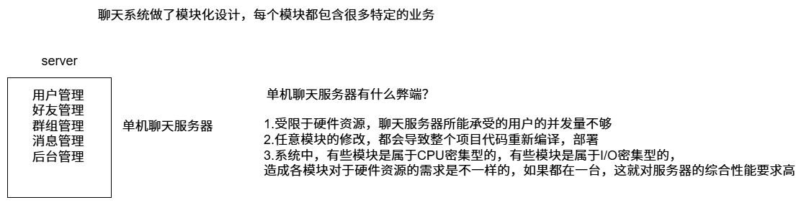

## 集群和分布式

集群：每台服务器独立运行一个工程的所有模块

分布式：一个工程拆分很多模块，每个模块独立部署运行在一个服务器主机上，所有服务器协同工作共同提供服务，每一台服务器称作分布式的一个节点，根据节点的并发要求，对一个节点可以再做节点模块集群部署。




## RPC通信原理

**RPC(Remote Procedure Call Protocol)远程过程调用协议**


**这里使用protobuf而不使用json?**

1. **protobuf是二进制存储；xml和json都是文本存储**

2. **protobuf不需要存储额外的信息；json怎么存储数据的呢？**

   **name:"zhangsan",pwd:"123456",protobuf就是“zhangsan""123456".**

## 分布式网络框架开发

### 配置文件

```bash
#rpc节点的ip地址
rpcserverip=127.0.0.1
#rpc节点的port端口号
rpcserverport=8000
#zk的ip地址
zookeeperip=127.0.0.1
#zk的port端口号
zookeeperport=5000
```

**用户可以修改配置文件来修改rpc节点和zookeeper的ip和端口。**

### 框架读取配置文件类

**mprpcconfig.h**

```c++
#pragma once

#include <unordered_map>
#include <string>
//rpcserverip rpcserverport     zookeeperip zookeeperport
// 框架读取配置文件类
class MprpcConfig
{
public:
    //负责解析加载配置文件
    void LoadConfigFile(const char *config_file);
    //查询配置项信息
    std::string Load(std::string key);
private:
    std::unordered_map<std::string,std::string> m_configMap;
    //去掉字符串前后的空格
    void Trim(std::string &src_buf);
};
```

**mprpcconfig.cc**

```c++
#include "mprpcconfig.h"

#include <iostream>
#include <string>
// 负责解析加载配置文件
void MprpcConfig::LoadConfigFile(const char *config_file)
{
    FILE *pf = fopen(config_file, "r");
    if (nullptr == pf)
    {
        std::cout << config_file << "is not exist!" << std::endl;
        exit(EXIT_FAILURE);
    }

    // 1.注释 2正确的配置项 3.去掉开头多余的空格
    while (!feof(pf))
    {
        char buf[512] = {0};
        // 按行读取，会把\n存取
        fgets(buf, 512, pf);

        // 去掉字符串前面多余的空格
        std::string read_buf(buf);
        Trim(read_buf);
        // 判断#的注释
        if (read_buf[0] == '#' || read_buf.empty())
        {
            continue;
        }
        // 解析配置项
        int idx = read_buf.find('=');
        if (idx == -1)
        {
            // 配置项不合法
            continue;
        }
        std::string key;
        std::string value;
        key = read_buf.substr(0, idx);
        Trim(key);
        //找一下回车
        //127.0.0.1\n
        int endidx=read_buf.find('\n',idx);
        value = read_buf.substr(idx + 1, endidx - idx-1);
        Trim(value);
        m_configMap.insert({key, value});
    }
}
// 查询配置项信息
std::string MprpcConfig::Load(std::string key)
{
    auto it = m_configMap.find(key);
    if (it == m_configMap.end())
    {
        return "";
    }
    return it->second;
}
// 去掉字符串前后的空格
void MprpcConfig::Trim(std::string &src_buf)
{
    int idx = src_buf.find_first_not_of(' ');
    if (idx != -1)
    {
        // 说明字符串前面有空格
        src_buf = src_buf.substr(idx, src_buf.size() - idx);
    }
    // 去掉字符串后面多余的空格
    idx = src_buf.find_last_not_of(' ');
    if (idx != -1)
    {
        // 说明字符串后面有空格
        src_buf = src_buf.substr(0, idx + 1);
    }
}
```

在mprpc框架的基础类MprpcApplication测试

```c++
    //开始加载配置文件了 rpcserver_ip= rpcserver_port zookeeper_ip= zookeeper_port=
    m_config.LoadConfigFile(config_file.c_str());
    // std::cout<<"rpcserverip:"<<m_config.Load("rpcserverip")<<std::endl;
    // std::cout<<"rpcserverip:"<<m_config.Load("rpcserverport")<<std::endl;
    // std::cout<<"rpcserverip:"<<m_config.Load("zookeeperip")<<std::endl;
    // std::cout<<"rpcserverip:"<<m_config.Load("zookeeperport")<<std::endl;
```

在bin目录命令行测试

```bash
./provider -i test.conf 
```

结果：可以看到使用无序哈希表正确保存了

```c++
rpcserverip:127.0.0.1
rpcserverip:8000
rpcserverip:127.0.0.1
rpcserverip:5000
```

### 框架提供的专门服务发布rpc服务的网络对象类RpcProvider

专门在run函数中实现网络服务接收消息，使用muduo的网络板块

增加成员变量

```c++
// 组合了EventLoop
muduo::net::EventLoop m_eventLoop;
```

```c++
// 启动rpc服务节点，开始提供rpc远程网络调用服务
void RpcProvider::Run()
{
    std::string ip = MprpcApplication::GetInstance().GetMprpcConfig().Load("rpcserverip");
    uint16_t port = atoi(MprpcApplication::GetInstance().GetMprpcConfig().Load("rpcserverport").c_str());
    muduo::net::InetAddress address(ip, port);

    // 创建TcpServer对象
    muduo::net::TcpServer server(&m_eventLoop, address, "RpcProvider");
    // 绑定连接回调和消息读写回调方法
    server.setConnectionCallback(std::bind(&RpcProvider::OnConnection, this, std::placeholders::_1));
    server.setMessageCallback(std::bind(&RpcProvider::OnMessage, this, std::placeholders::_1, std::placeholders::_2, std::placeholders::_3));
    // 设置muduo库的线程数量
    server.setThreadNum(4);

    std::cout << "RpcProvider start service at ip:" << ip << "port:" << port << std::endl;
    // 启动网络服务
    server.start();
    m_eventLoop.loop();
}
```

提供给外部使用的，可以发布rpc方法的函数接口**NotifyService**。

这里把对应服务和方法注册到一张表中。

增加成员变量

```c++
// service服务类型信息
struct ServiceInfo {
  // 保存服务对象
  google::protobuf::Service * m_service;
  // 保存服务方法
  std::unordered_map < std::string,
    const google::protobuf::MethodDescriptor * > m_methodMap;//这里string是方法名
};
// 存储注册成功的服务对象和其服务方法的所有信息
std::unordered_map < std::string, ServiceInfo > m_serviceMap;//这里string是服务名
```

实现**NotifyService**函数

```c++
// 这里是框架提供给外部使用的，可以发布rpc方法的函数接口
void RpcProvider::NotifyService(google::protobuf::Service * service) {
    ServiceInfo service_Info;
    //获取服务对象的描述信息
    const google::protobuf::ServiceDescriptor * pserviceDesc = service -> GetDescriptor();
    //获取服务的名字
    std::string service_name = std::string(pserviceDesc -> name());
    //获取服务对象的service的方法的数量
    int methodCnt = pserviceDesc -> method_count();

    std::cout << "service_name:" << service_name << std::endl;
    for (int i = 0; i < methodCnt; ++i) {
        //获取了服务对象指定下标的服务方法的描述（抽象描述）
        const google::protobuf::MethodDescriptor * pmethodDesc = pserviceDesc -> method(i);
        std::string method_name = std::string(pmethodDesc -> name());
        service_Info.m_methodMap.insert({
            method_name,
            pmethodDesc
        });

        std::cout << "method_name:" << method_name << std::endl;
    }
    service_Info.m_service = service;
    m_serviceMap.insert({
        service_name,
        service_Info
    });
}
```

接下来通过muduo服务器在连接和接收消息产生的回调进行网络信息的解析

这里在对网络字符流要解析。所以要规定格式RpcHeader就是header_str,所以在这个消息头前还要说明其大小。在消息末尾还要避免粘包问题，所以在消息头加上参数字符串大小。

**rpcheader.proto**

```protobuf
syntax="proto3";
package mprpc;

message RpcHeader
{
    bytes service_name=1;
    bytes method_name=2;
    uint32 args_size=3;
}
```

```c++
    // 新的socket连接回调
    void OnConnection(const muduo::net::TcpConnectionPtr & );
    // 已建立连接用户的读写事件回调
    void OnMessage(const muduo::net::TcpConnectionPtr & ,
      muduo::net::Buffer * ,
      muduo::Timestamp);

    //Closure回调操作，用于序列化rpc的响应和网络发送
    void SendRpcResponse(const muduo::net::TcpConnectionPtr & , google::protobuf::Message * );
```

```c++
// 新的socket连接/断开连接也会触发回调
void RpcProvider::OnConnection(const muduo::net::TcpConnectionPtr &conn)
{
    if (!conn->connected())
    {
        // 和rpc client的连接断开了
        conn->shutdown();
    }
}

/*
在框架内部，RpcProvider和RpcConsumer协商好之间通信用的protobuf数据类型
service_name method_name args 定义proto的message类型，进行数据头的序列化和反序列化
header_size(4个字节) + header_str +args_str,为了避免粘包问题，所以要有args_size
header_size存储的是二进制而不是整数，要不然太费字节了，而且不好确认大小
*/
// 已建立连接用户的读写事件回调
// 如果远程有一个rpc服务的调用请求，那么onMessage方法就会响应
void RpcProvider::OnMessage(const muduo::net::TcpConnectionPtr &conn,
                            muduo::net::Buffer *buffer,
                            muduo::Timestamp)
{
    // 网络上接收的远程rpc调用请求的字符流 Login args
    std::string recv_buf = buffer->retrieveAllAsString();

    // 从字符流中读取前4个字节的内容
    uint32_t header_size = 0;
    recv_buf.copy((char *)&header_size, 4, 0);

    // 根据header_size读取数据头的原始字符流,反序列化数据，得到rpc请求的详细信息
    std::string rpc_header_str = recv_buf.substr(4, header_size);
    mprpc::RpcHeader rpcHeader;
    std::string service_name;
    std::string method_name;
    uint32_t args_size;
    if (rpcHeader.ParseFromString(rpc_header_str))
    {
        // 数据头反序列化成功
        service_name = rpcHeader.service_name();
        method_name = rpcHeader.method_name();
        args_size = rpcHeader.args_size();
    }
    else
    {
        // 数据头反序列化失败
        std::cout << "rpc_header_str:" << rpc_header_str << "parse error!" << std::endl;
        return;
    }
    // 获取rpc方法参数的字符流数据
    std::string args_str = recv_buf.substr(4 + header_size, args_size);

    // 打印调试信息
    std::cout << "====================================" << std::endl;
    std::cout << "header_size:" << header_size << std::endl;
    std::cout << "rpc_header_str:" << rpc_header_str << std::endl;
    std::cout << "service_name:" << service_name << std::endl;
    std::cout << "method_name:" << method_name << std::endl;
    std::cout << "args_str:" << args_str << std::endl;
    std::cout << "====================================" << std::endl;

    // 获取service对象和method对象
    auto it = m_serviceMap.find(service_name);
    if (it == m_serviceMap.end())
    {
        std::cout << service_name << "is not exist!" << std::endl;
        return;
    }

    auto mit = it->second.m_methodMap.find(method_name);
    if (mit == it->second.m_methodMap.end())
    {
        std::cout << service_name << " : " << method_name << "is not exist!" << std::endl;
        return;
    }
    // service对象
    auto service = it->second.m_service;
    // method对象
    auto method = mit->second;

    // 生成rpc方法调用的请求request和响应response参数
    google::protobuf::Message *request = service->GetRequestPrototype(method).New();
    if (!request->ParseFromString(args_str))
    {
        std::cout << "request parse error! content:" << args_str << std::endl;
        return;
    }
    google::protobuf::Message *response = service->GetResponsePrototype(method).New();

    // 给下面的method方法的调用，绑定一个Closure的回调函数
    google::protobuf::Closure *done = google::protobuf::NewCallback<RpcProvider, const muduo::net::TcpConnectionPtr &, google::protobuf::Message *>(this, &RpcProvider::SendRpcResponse, conn, response);
    // 在框架上根据远端rpc请求，调用当前rpc节点上发布的方法
    // new UserService().Login(controller,request,response,done)
    service->CallMethod(method, nullptr, request, response, done);
}

// Closure回调操作，用于序列化rpc的响应和网络发送
void RpcProvider::SendRpcResponse(const muduo::net::TcpConnectionPtr &conn, google::protobuf::Message *response)
{
    std::string response_str;
    //response进行序列化
    if(response->SerializeToString(&response_str))
    {
        //序列化成功后，通过网络把rpc方法执行的结果发送给rpc的调用方
        conn->send(response_str);
        
    }
    else
    {
        std::cout<<"serialize response_str error!"<<std::endl;
    }
    //模拟http的短链接服务，由rpcprovider主动断开连接
    conn->shutdown();
}
```

### 客户端发送 RPC 请求的统一接口MprpcChannel

**mprpcchannel.h**

```c++
#pragma once
#include <google/protobuf/service.h>

class MprpcChannel : public google::protobuf::RpcChannel
{
public:
    //所有通过stub代理对象调用的rpc方法，都走到这里了，统一做rpc方法调用的数据序列化和网络发送
    void CallMethod(const google::protobuf::MethodDescriptor* method,
                          google::protobuf::RpcController* controller, const google::protobuf::Message* request,
                          google::protobuf::Message* response, google::protobuf::Closure* done);
};
```

**mprpcchannel.cc**

```c++
#include "mprpcchannel.h"
#include "rpcheader.pb.h"
#include "mprpcapplication.h"


#include <google/protobuf/descriptor.h>
#include <google/protobuf/message.h>
#include <string>
#include <sys/types.h>
#include <sys/socket.h>
#include <netinet/in.h>
#include <arpa/inet.h>
#include <errno.h>
/*
header_size+service_name method_name args_size+args
*/
// 所有通过stub代理对象调用的rpc方法，都走到这里了，统一做rpc方法调用的数据序列化和网络发送
void MprpcChannel::CallMethod(const google::protobuf::MethodDescriptor *method,
                              google::protobuf::RpcController *controller, const google::protobuf::Message *request,
                              google::protobuf::Message *response, google::protobuf::Closure *done)
{
    const google::protobuf::ServiceDescriptor *sd=method->service();
    std::string service_name=std::string(sd->name());//service_name
    std::string method_name=std::string(method->name());//method_name

    //获取参数的序列化字符串长度 args_size
    uint32_t args_size=0;
    std::string args_str;
    if(request->SerializeToString(&args_str))
    {
        args_size=args_str.size();
    }
    else
    {
        controller->SetFailed("serialize request error!");
        return ;
    }

    //定义rpc的请求header
    mprpc::RpcHeader rpcHeader;
    rpcHeader.set_service_name(service_name);
    rpcHeader.set_method_name(method_name);
    rpcHeader.set_args_size(args_size);

    uint32_t header_size=0;
    std::string rpc_header_str;
    if(rpcHeader.SerializeToString(&rpc_header_str))
    {
        header_size=rpc_header_str.size();
    }
    else
    {
        controller->SetFailed("serialize rpc header error!");
        return ;
    }

    //组织待发送的rpc请求的字符串
    std::string send_rpc_str;
    send_rpc_str.insert(0,std::string((char *)&header_size,4)); //header_size
    send_rpc_str+=rpc_header_str;//rpcheader
    send_rpc_str+=args_str;//args
    
    // 打印调试信息
    std::cout << "====================================" << std::endl;
    std::cout << "header_size:" << header_size << std::endl;
    std::cout << "rpc_header_str:" << rpc_header_str << std::endl;
    std::cout << "service_name:" << service_name << std::endl;
    std::cout << "method_name:" << method_name << std::endl;
    std::cout << "args_str:" << args_str << std::endl;
    std::cout << "====================================" << std::endl;

    //使用tcp编程，完成rpc方法的远程调用
    int clientfd=socket(AF_INET,SOCK_STREAM,0);
    if(-1==clientfd)
    {
        char errtext[512]={0};
        sprintf(errtext,"create socket error! errno:%d",errno);
        controller->SetFailed(errtext);
        return;
    }

    //读取配置文件rpcserver的信息
    std::string ip = MprpcApplication::GetInstance().GetMprpcConfig().Load("rpcserverip");
    uint16_t port = atoi(MprpcApplication::GetInstance().GetMprpcConfig().Load("rpcserverport").c_str());

    struct sockaddr_in server_addr;
    server_addr.sin_family=AF_INET;
    server_addr.sin_port=htons(port);
    server_addr.sin_addr.s_addr=inet_addr(ip.c_str());


    //连接rpc服务节点
    if(-1==connect(clientfd,(struct sockaddr *)&server_addr,sizeof(server_addr)))
    {
        close(clientfd);
        char errtext[512]={0};
        sprintf(errtext,"connect error! errno:%d",errno);
        controller->SetFailed(errtext);
        return;
    }

    //发送rpc请求
    if(-1==send(clientfd,send_rpc_str.c_str(),send_rpc_str.size(),0))
    {
        close(clientfd);
        char errtext[512]={0};
        sprintf(errtext,"send error! errno:%d",errno);
        controller->SetFailed(errtext);
        return;
    }

    //接收rpc请求的响应值
    char recv_buf[1024]={0};
    int recv_size=0;
    if(-1==(recv_size=recv(clientfd,recv_buf,1024,0)))
    {
        close(clientfd);
        char errtext[512]={0};
        sprintf(errtext,"recv error! errno:%d",errno);
        controller->SetFailed(errtext);
        return;
    }

    //反序列化rpc调用的响应数据
    //std::string response_str(recv_buf,0,recv_size);//bug，recv_buf中遇到\0后面的数据就存不下，导致反序列失败
    //if(!response->ParseFromString(response_str))
    if(!response->ParseFromArray(recv_buf,recv_size))
    {
        close(clientfd);
        char errtext[2048]={0};
        sprintf(errtext,"parse error! response_str:%s",recv_buf);
        controller->SetFailed(errtext);
        return;
    }

    close(clientfd);

}
```

### 告知客户端RPC调用状态MprpcController

**mprpccontroller.h**

```c++
#pragma once
#include <google/protobuf/service.h>
#include <string>

class MprpcController : public google::protobuf::RpcController
{
public:
    MprpcController();
    void Reset();
    bool Failed() const;
    std::string ErrorText() const;
    void SetFailed(const std::string& reason);

    //目前未实现具体的功能
    void StartCancel();
    bool IsCanceled() const;
    void NotifyOnCancel(google::protobuf::Closure *callback);
    
private:
    bool m_failed; //Rpc方法执行过程中的状态
    std::string m_errText;//RPC方法执行过程中的错误信息
};
```

**mprpccontroller.cc**

```c++
#include "mprpccontroller.h"

MprpcController::MprpcController()
{
    m_failed = false;
    m_errText = "";
}

void MprpcController::Reset()
{
    m_failed = false;
    m_errText = "";
}

bool MprpcController::Failed() const
{
    return m_failed;
}

std::string MprpcController::ErrorText() const
{
    return m_errText;
}

void MprpcController::SetFailed(const std::string &reason)
{
    m_failed = true;
    m_errText = reason;
}

// 目前未实现具体的功能
void MprpcController::StartCancel(){}
bool MprpcController::IsCanceled() const{return false;}
void MprpcController::NotifyOnCancel(google::protobuf::Closure *callback){}
```

### 日志板块


**lockqueue.h**

```c++
#pragma once
#include <queue>
#include <thread>
#include <mutex>
#include <condition_variable>

//异步写日志的日志队列
template<typename T>
class LockQueue
{
public:
    //多个worker线程都会写日志queue
    void Push(const T&data)
    {
        std::lock_guard<std::mutex> lock(m_mutex);
        m_queue.push(data);
        m_condvariable.notify_one();
    } 
    //一个线程读日志queue,写日志文件
    T Pop()
    {
        std::unique_lock<std::mutex> lock(m_mutex);
        while(m_queue.empty())
        {
            //日志队列为空，线程进入wait状态
            m_condvariable.wait(lock);
        }
        T data=m_queue.front();
        m_queue.pop();
        return data;
    }
private:
    std::queue<T> m_queue;
    std::mutex m_mutex;
    std::condition_variable m_condvariable;
};
```

**logger.h**

```c++
#pragma once

#include "lockqueue.h"

#include <string>
enum LogLevel
{
    INFO,  // 普通的日志信息
    ERROR, // 错误的日志信息
};

// Mprpc框架提供的日志系统
class Logger
{
public:
    // 获取日志的单例
    static Logger &GetInstance();
    // 设置日志级别
    void SetLogLevel(LogLevel level);
    // 写日志
    void Log(std::string msg);

private:
    int m_loglevel;                  // 记录日志级别
    LockQueue<std::string> m_lckQue; // 日志缓冲队列

    Logger();
    Logger(const Logger &) = delete;
    Logger(Logger &&) = delete;
};

// 定义宏
#define LOG_INFO(logmsgformat, ...)                     \
    do                                                  \
    {                                                   \
        Logger &logger = Logger::GetInstance();         \
        logger.SetLogLevel(INFO);                       \
        char c[1024] = {0};                             \
        snprintf(c, 1024, logmsgformat, ##__VA_ARGS__); \
        logger.Log(c);                                  \
    } while (0);

#define LOG_ERR(logmsgformat, ...)                      \
    do                                                  \
    {                                                   \
        Logger &logger = Logger::GetInstance();         \
        logger.SetLogLevel(ERROR);                      \
        char c[1024] = {0};                             \
        snprintf(c, 1024, logmsgformat, ##__VA_ARGS__); \
        logger.Log(c);                                  \
    } while (0);
    
```

**logger.cc**

```c++
#include "logger.h"

#include <time.h>
#include <iostream>

// 获取日志的单例
Logger &Logger::GetInstance()
{
    static Logger logger;
    return logger;
}
Logger::Logger()
{
    //启动专门的写日志线程
    std::thread writeLogTask([&](){
        for(;;)
        {
            //获取当天的日期，然后取日志信息，写入相应的日志文件当中 a+
            time_t now=time(nullptr);
            tm *nowtm=localtime(&now);

            char file_name[128];
            sprintf(file_name,"%d-%d-%d-log.txt",nowtm->tm_year+1900,nowtm->tm_mon+1,nowtm->tm_mday);
            FILE *pf=fopen(file_name,"a+");
            if(pf==nullptr)
            {
                std::cout<<"logger file : "<<file_name<<"open error!"<<std::endl;
                exit(EXIT_FAILURE);
            }
            std::string msg=m_lckQue.Pop();
            char time_buf[128]={0};
            sprintf(time_buf,"%d:%d:%d =>[%s] ",nowtm->tm_hour,nowtm->tm_min,nowtm->tm_sec,(m_loglevel == INFO ? "info":"error"));
            msg.insert(0,time_buf);
            msg.append("\n");
            
            fputs(msg.c_str(),pf);
            fclose(pf);
        }
    });
    //设置分离线程，守护线程
    writeLogTask.detach();
}
// 设置日志级别
void Logger::SetLogLevel(LogLevel level)
{
    m_loglevel=level;
}
// 写日志,把日志信息写入lockqueue缓冲区当中
void Logger::Log(std::string msg)
{
    m_lckQue.Push(msg);
}
```

### zookeeper在分布式网络通信框架的应用

**zookeeper在本项目起到客户端向zookeeper查找目标服务的rpc节点的地址(ip+port),这个前提是服务端向zookeeper注册的。zookeeper负责协调这之间的关系。并且zookeeper会向rpc节点定期心跳，确保存活。一旦超时，该服务的对应的rpc节点会在zookeeper删除，客户端访问不到。**


**zookeeperutil.h**

```c++
#pragma once

#include <semaphore.h>
#include <zookeeper/zookeeper.h>
#include <string>


//封装的zk客户端类
class ZkClient
{
public:
    ZkClient();
    ~ZkClient();
    //zkclient启动连接zkserver
    void Start();
    //在zkserver上根据指定的path创建znode节点
    void Create(const char *path,const char *data,int datalen,int state=0);
    //根据参数指定的znode节点路径获取znode节点的值
    std::string GetData(const char *path);
private:
    //zk的客户端句柄
    zhandle_t *m_zhangle;
};
```

**zookeeperutil.cc**

```c++
#define THREADED

#include "zookeeperutil.h"
#include "mprpcapplication.h"

#include <semaphore.h>
#include <iostream>


//全局的watcher观察器 zkserver给zkclient的通知
void global_watcher(zhandle_t *zh,int type,int state,const char*path,void *watcherCtx)
{
    if(type==ZOO_SESSION_EVENT) //回调的消息类型是和会话相关的消息类型
    {
        if(state==ZOO_CONNECTED_STATE) //zkclient和zkserver连接成功
        {
            sem_t *sem=(sem_t*)zoo_get_context(zh);
            sem_post(sem);
        }
    }
}

ZkClient::ZkClient() : m_zhangle(nullptr)
{

}
ZkClient::~ZkClient()
{
    if(m_zhangle!=nullptr)
    {
        zookeeper_close(m_zhangle);//关闭句柄，释放资源
    }
}

//连接zkserver
void ZkClient::Start()
{
    std::string host=MprpcApplication::GetInstance().GetMprpcConfig().Load("zookeeperip");
    std::string port=MprpcApplication::GetInstance().GetMprpcConfig().Load("zookeeperport");
    std::string connstr=host+":"+port;

    /*
    zookeeper_mt:多线程版本
    zookeeper的API客户端程序提供了三个线程
    API调用线程
    网络I/O线程
    watcher回调线程
    */
    m_zhangle=zookeeper_init(connstr.c_str(),global_watcher,30000,nullptr,nullptr,0);
    if(nullptr==m_zhangle)
    {
        std::cout<<"zookeeper_init error!"<<std::endl;
        exit(EXIT_FAILURE);
    }
    sem_t sem;
    sem_init(&sem,0,0);
    zoo_set_context(m_zhangle,&sem);

    sem_wait(&sem);
    std::cout<< "zooKeeper_init success!"<<std::endl;
}

void ZkClient::Create(const char *path,const char *data,int datalen,int state)
{
    char path_buffer[128];
    int bufferlen=sizeof(path_buffer);
    int flag;
    //先判断path表示的znode节点是否存在，如果存在，就不再重复创建了
    flag=zoo_exists(m_zhangle,path,0,nullptr);
    if(ZNONODE==flag) //表示path的znode节点不存在
    {
        //创建指定path的znode节点
        flag=zoo_create(m_zhangle,path,data,datalen,&ZOO_OPEN_ACL_UNSAFE,state,path_buffer,bufferlen);
        if(flag==ZOK)
        {
            std::cout<<"znode create success...path:"<<path<<std::endl;
        }
        else
        {
            std::cout<<"flag:"<<flag<<std::endl;
            std::cout<<"znode create error... path:"<<path<<std::endl;
            exit(EXIT_FAILURE);
        }
    }
}

//根据指定的path,获取znode节点的值
std::string ZkClient::GetData(const char* path)
{
    char buffer[64];
    int bufferlen=sizeof(buffer);
    int flag = zoo_get(m_zhangle,path,0,buffer,&bufferlen,nullptr);
    if(flag !=ZOK)
    {
        std::cout<<"get znode error... path:"<<path<<std::endl;
        return "";
    }
    else
    {
        return buffer;
    }
}
```

首先在**RpcProvider::Run()**函数中服务端向zookeeper注册

```c++
    //将当前rpc节点上要发布的服务注册到zk上面，让rpc client可以从zk上发现服务
    //session timeout 30s zkclient 网络I/O线程 1/3*timeout时间发送ping消息
    ZkClient zkCli;
    zkCli.Start();
    //service_name为永久性节点 method_name为临时性节点
    for(auto &sp:m_serviceMap)
    {
        //  /service_name
        std::string service_path="/"+sp.first;
        zkCli.Create(service_path.c_str(),nullptr,0);
        for(auto &mp:sp.second.m_methodMap)
        {
            // /service_name/method_name
            std::string method_path=service_path+"/"+mp.first;
            char method_path_data[128]={0};
            sprintf(method_path_data,"%s:%d",ip.c_str(),port);
            //ZOO_EPHEMERAL表示znode是一个临时性节点
            zkCli.Create(method_path.c_str(),method_path_data,strlen(method_path_data),ZOO_EPHEMERAL);
        }
    }
```

在**MprpcChannel::CallMethod函数**中客户端向zookeeper找到对应rpc节点的地址

```c++
    //rpc调用方想调用service_name的method_name服务，需要查询zk上该服务所在的host信息
    ZkClient zkcli;
    zkcli.Start();
    std::string method_path="/"+service_name+"/"+method_name;
    std::string host_data=zkcli.GetData(method_path.c_str());
    if(host_data == "")
    {
        controller->SetFailed(method_path+"is not exist!");
        return;
    }
    int idx=host_data.find(":");
    if(idx==-1)
    {
        controller->SetFailed(method_path+"address is invalid!");
        return;
    }
    std::string ip=host_data.substr(0,idx);
    uint16_t port=atoi(host_data.substr(idx+1,host_data.size()-idx).c_str());
```

### 项目思路

