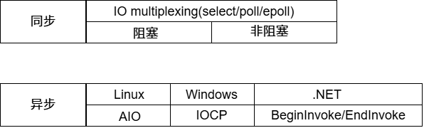
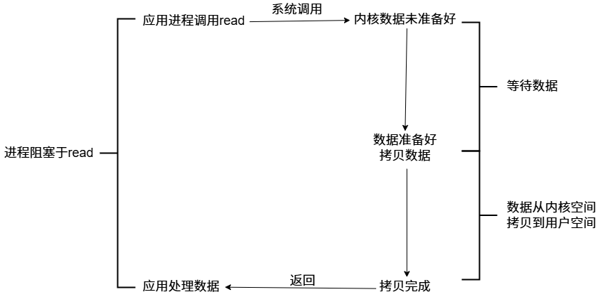
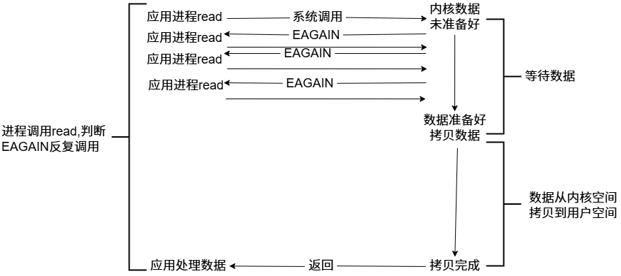
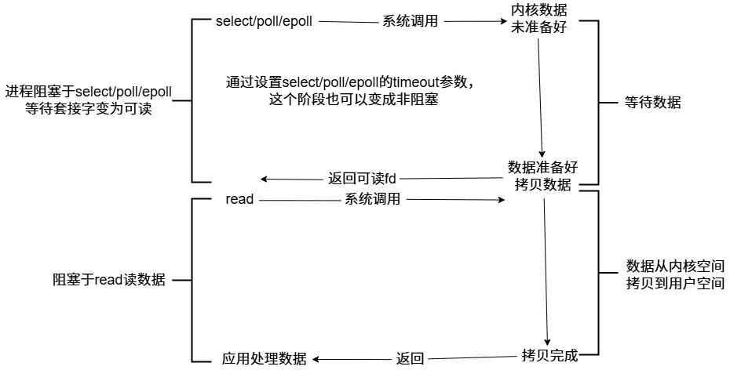
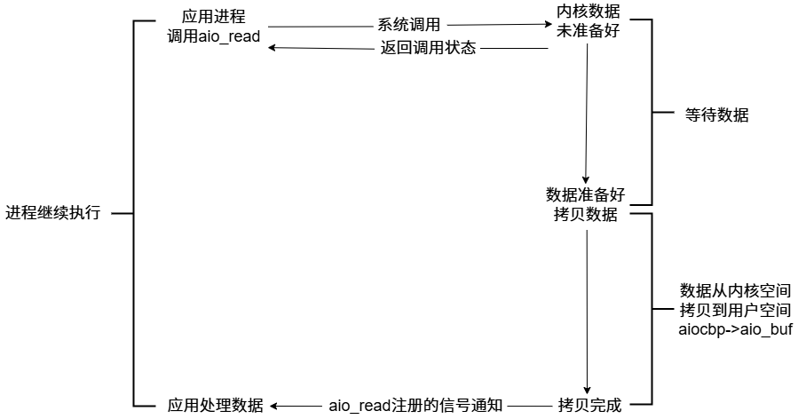
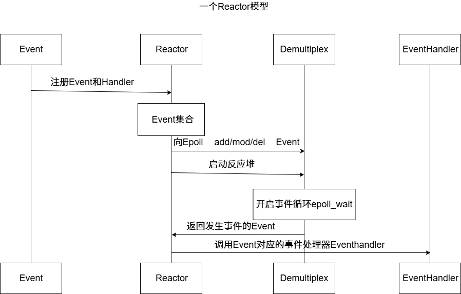

## 剖析前的准备知识

### 阻塞，非阻塞，同步，异步

**典型的一次IO的两个阶段：数据准备和数据读写**

**数据准备：根据系统IO操作的就绪状态**

1. **阻塞：调用IO方法的线程进入阻塞状态**
2. **非阻塞：不会改变线程的状态，通过返回值判断**

**数据读写：根据应用程序和内核的交互方式**

1. **同步：就网络编程而言，不管是阻塞还是非阻塞，都是要一个结果(在那个时间段)，需要程序员手动把数据放入自己准备的变量**
2. **异步：CPU把任务完成后通知我，不需要程序员手动把数据放入自己准备的变量，当前线程是处于在做其他任务的时候。**

**以epoll为例，它是同步，因为我们要把从缓冲区的数据提取到自己准备的变量。**

**陈硕大神：在处理IO的时候，阻塞和非阻塞都是同步IO。只有使用了特殊的API才是异步IO.**



```bash
一个典型的网络IO接口调用，分为两个阶段，分别是"数据就绪"和"数据读写"，数据就绪阶段分为阻塞和非阻塞，表现的结果就是，阻塞当前线程或是直接返回。

同步表示A向B请求调用一个网络IO接口时(或者调用某个业务逻辑API接口时)，数据的读写都是由请求方A自己来完成的(不管是阻塞还是非阻塞)；异步表示A向B请求访问一个网络IO接口时(或者调用某个业务逻辑API接口时),向B传入请求的事件及事件发生时通知的方式，A就可以处理其他逻辑了，当B监听到事件处理完成后，会用事先约定好的通知方式，通知A处理结果。
```

```bash
同步阻塞	int size=recv(fd,buf,1024,0);
同步非阻塞	int size=recv(fd,buf,1024,0);
异步阻塞	这个不合理
异步非阻塞	异步大多和非阻塞搭配
```

### Unix/Linux上的五种IO模型

#### 阻塞 blocking



#### 非阻塞 non-blocking



#### IO复用(IO multiplexing)



#### 信号驱动(signal-driven)


**内核在第一个阶段是异步，在第二个阶段是同步；与非阻塞IO的区别在于它提供了消息通知机制，不需要用户进程不断的轮询检查，减少了系统API的调用次数，提高了效率。**

#### 异步(asynchronous)



```c
 #include <aiocb.h>

 struct aiocb {
   /* The order of these fields is implementation-dependent */

   int aio_fildes; /* File descriptor */
   off_t aio_offset; /* File offset */
   volatile void * aio_buf; /* Location of buffer */
   size_t aio_nbytes; /* Length of transfer */
   int aio_reqprio; /* Request priority */
   struct sigevent aio_sigevent; /* Notification method */
   int aio_lio_opcode;
   /* Operation to be performed;
                                                    lio_listio() only */

   /* Various implementation-internal fields not shown */
 };
```

**典型的异步非阻塞状态。Node.js采用的网络IO模型**

### 好的网络服务器设计

**在这个多核时代，服务端网络编程如何选择线程模型呢？赞同libev作者的观点：one loop per thread is usually a good model,这样多线程服务端编程的问题转换为如何设计一个高效且易于使用的event loop,然后每个线程run一个event loop就行了(当然线程间的同步，互斥少不了，还有其他的耗时事件需要起另外的线程来做)。**

**event loop是non-blocking网络编程的核心，在现实生活中，non-blocking几乎总是和IO-multiplexing一起使用，原因有两点：**

1. **没有人真的会用轮询来检查某个non-blocking IO操作是否完成，这样太浪费CPU资源。**
2. **IO-multiplexing一般不能和blocking IO 用在一起,因为blocking IO中的read/write/accept/connect都有可能阻塞当前线程，这样线程就没有办法处理其他socket上的IO事件**

**所以，当我们提到non-blocking的时候，实际上指的是non-blocking+IO-multiplexing,但用其中任何一个都没有办法很好的实现功能。**

**epoll+fork和epoll+pthread都有不同的应用场景。**

**强大的nginx服务器采用了epoll+fork模型作为网络模块的架构设计，实现了简单好用的负载算法，使各个fork网络进程不会忙的越忙，闲的越闲，并且通过引入一把乐观锁解决了该模型导致的服务器惊群现象，功能十分强大。**

### Reactor模型

**反应器模型（Reactor pattern）是一种为处理服务请求并发提交到一个或者多个服务处理程序的事件设计模式。当请求抵达后，服务处理程序使用解多路分配策略，然后同步地派发这些请求至相关的请求处理程序。**

**重要组件：Event事件，Reactor反应堆，Demultiplex事件分发器，EventHandler事件处理器**



### epoll

#### select和poll的缺点

**select的缺点：**

1. **单个进程能够监视的文件描述符的数量存在最大限制，通常是1024，当然可以更改数量，但由于select采用轮询的方式扫描文件描述符，文件描述符数量越多，性能越差；**
2. **内核/用户空间内存拷贝问题，select需要复制大量的句柄数据结构，产生巨大的开销**
3. **select返回的是含有整个句柄的数组，应用程序需要遍历整个数组才能发现哪些句柄发生了事件**
4. **select的触发方式是水平触发，应用程序如果没有完成对一个已经就绪的文件描述符进行IO操作，那么之后每次select调用还是会将这些文件描述符通知进程。**

**相比select模型，poll使用链表保存文件描述符，因此没有了监视文件数量的限制，但其他三个缺点存在。**

#### epoll原理及其优势

**设想如下场景：有100万个客户端同时与一个服务器进程保持TCP连接。而每一时刻，通常只有几百上千个TCP连接是活跃的。如何实现这样的高并发？**

**在select/poll时代，服务器进程每次都把这100万个连接告诉操作系统(从用户态复制句柄数据结构到内核态)，让操作系统内核去查询这些套接字上是否有事件发生，轮询结束后再将句柄复制到用户态，让服务器应用程序轮询处理已发生的网络事件，这一过程资源消耗较大，所以select/poll一般只能处理几千的并发连接。**

**epoll的设计和实现与select完全不同。epoll通过在Linux内核申请一个简易的文件系统(文件系统一般用什么数据结构：B+树,磁盘IO消耗低，效率高)。把原先的select/poll调用分为3个部分：**

1. **调用epoll_create()建立一个epoll对象(在epoll文件系统中为这个句柄对象分配资源)。**
2. **调用epoll_ctl向epoll对象添加这100万个连接的套接字。**
3. **调用epoll_wait手机发生的事件的fd资源**

**如此一来，要实现上面说的场景，只需要在进程启动时建立一个epoll对象，然后在需要的时候向这个epoll对象中添加或者删除。同时epoll_wait的效率很高，调用epoll_wait时，并没有向操作系统复制这100万个连接的句柄数据，内核也不需要去遍历全部的连接。**

```c
//epoll_create在内核创建的eventpoll结构：
struct eventpoll
{
    ...
    /*红黑树的根节点，这棵树存储着所有添加到epoll中的需要监控的事件*/
    struct rb_root rbr;
    /*双链表中则存放着将要通过epoll_Wait返回给用户的满足条件的事件*/
    struct list_head rdlist;
    ...
};
```

#### LT模式

**内核数据没被读完，就会一直上报数据**

#### ET模式

**内核数据只上报一次**

#### muduo采用的是LT

1. **不会丢失数据或者消息。应用没有读取完数据，内核是会不断上报的。**
2. **低延迟处理。每次读数据只需要一次系统调用；照顾了多个连接的公平性，不会因为某个连接上的数据量过大而影响其他连接处理消息。**
3. **跨平台处理。像select(select和poll是没有ET的)一样可以跨平台使用。**

### muduo网络库基本使用

```c++
/*
muduo网络库给用户提供了两个主要的类
TcpServer:用于编写服务器程序
TcpClient:用于编写客户端程序

epoll+线程池
好处：能够把网络I/O的代码和业务代码区分开
                        用户的连接和断开，用户的可读写事件
*/
#include <muduo/net/TcpServer.h>
#include <muduo/net/EventLoop.h>
#include <iostream>
#include <functional>
#include <string>
using namespace muduo::net;
using namespace muduo;
using namespace std;
/*基于muduo网络库开发服务器程序
1.组合TcpServer对象
2.创建EventLoop事件循环对象
3.明确TcpServer构造函数需要什么参数，输出ChatServer的构造函数
4.在当前服务器类的构造函数当中，注册处理连接的回调函数和处理读写事件的回调函数
5.设置合适的服务端线程数量，muduo库会自己分配I/O线程和worker线程
*/
class ChatServer
{
public:
    ChatServer(EventLoop* loop,//事件循环
            const InetAddress& listenAddr,//IP+PORT
            const string& nameArg)//服务器的名字
            :_server(loop,listenAddr,nameArg)
            ,_loop(loop)
            {
                //给服务器注册注册用户连接的创建和断开的回调
                _server.setConnectionCallback(std::bind(&ChatServer::onConnection,this,placeholders::_1));
                //给服务器注册用户读写事件回调
                _server.setMessageCallback(std::bind(&ChatServer::onMessage,this,placeholders::_1,_2,_3));
                //设置服务器端的线程数量   1个I/O线程 3个worker线程
                _server.setThreadNum(4);
            }
    //开启事件循环
    void start()
    {
        _server.start();
    }
private:
    //专门处理用户的连接创建和断开 
    void onConnection(const TcpConnectionPtr&conn)
    {
       
        if(conn->connected())
        {
            std::cout<<conn->peerAddress().toIpPort()<<"->"
            <<conn->localAddress().toIpPort()<<"state:online"<<std::endl;
        }
        else
        {
            std::cout<<conn->peerAddress().toIpPort()<<"->"
            <<conn->localAddress().toIpPort()<<"state:offline"<<std::endl;
            conn->shutdown();//close(fd);
        }
    }
    //专门处理用户的读写事件
    void onMessage(const TcpConnectionPtr&conn,//连接
                Buffer*buffer,//缓冲区
                Timestamp time)//接收到数据的时间信息
    {
        std::string buf=buffer->retrieveAllAsString();
        std::cout<<"recv data: "<<buf<<"time:"<<time.toString()<<std::endl;
        conn->send(buf);
    }
    muduo::net::TcpServer _server; //#1
    muduo::net::EventLoop *_loop;//#2 epoll
};
int main()
{
    EventLoop loop;
    InetAddress addr("127.0.0.1",6000);
    ChatServer server(&loop,addr,"ChatServer");
    server.start();//listenfd epoll_ctl=>epoll
    loop.loop();//epoll_wait以阻塞方式等待新用户的连接，已连接用户的读写事件等
    return 0;
}
```

## 实现muduo功能代码

### noncopyable类

**noncopyable.h**

```c++
#pragma once
/*
noncopyable被继承后，派生类对象可以正常的构造和析构，但是派生类对象无法进行拷贝构造和赋值操作
*/
class noncopyable
{
public:
    noncopyable(const noncopyable&) = delete;
    noncopyable& operator=(const noncopyable&)=delete;

protected:
    noncopyable()=default;
    ~noncopyable()=default;
};
```

### Logger日志实现

**Timestamp.h(时间类)**

```c++
#pragma once

#include <iostream>
#include <string>

//时间类
class Timestamp
{
public:
    Timestamp();
    //explicit让构造函数/转换函数只能“显式调用”，避免编译器偷偷帮你做类型转换，提升代码安全性。主要用于单个参数
    explicit Timestamp(int64_t microSecondsDinceEpoch);
    static Timestamp now();
    std::string toString() const;
private:
    int64_t microSecondsDinceEpoch_;
};
```

**Timestamp.cc**

```c++
#include "Timestamp.h"

#include <time.h>
Timestamp::Timestamp():microSecondsDinceEpoch_(0){}
Timestamp::Timestamp(int64_t microSecondsDinceEpoch)    
    :microSecondsDinceEpoch_(microSecondsDinceEpoch)
    {}
Timestamp Timestamp::now()
{
    return Timestamp(time(NULL));
}
std::string Timestamp::toString() const
{
    char buf[128]={0};
    tm *tm_time=localtime(&microSecondsDinceEpoch_);
    //%02d按两位数输出整数，不足两位前面补 0。
    snprintf(buf,128,"%4d/%02d/%02d %02d:%02d:%02d",
        tm_time->tm_year+1900,
        tm_time->tm_mon+1,
        tm_time->tm_mday,
        tm_time->tm_hour,
        tm_time->tm_min,
        tm_time->tm_sec);
    return buf;
}
// #include <iostream>
// int main()
// {
//     std::cout<<Timestamp::now().toString()<<std::endl;
//     return 0;
// }
```

**Logger.h(日志类)**

```c++
#pragma once
#include "noncopyable.h"

#include <string>

//LOG_INFO("%S %d",arg1,arg2) 宏定义里的 反斜杠 \ 是用来 换行但不结束宏定义 的。
#define LOG_INFO(LogmsgFormat,...)\
    do\
    {\
        Logger &logger=Logger::instance();\
        logger.setLogLevel(INFO);\
        char buf[1024]={0};\
        snprintf(buf,1024,LogmsgFormat,##__VA_ARGS__);\
        logger.log(buf);\
    }while(0)

#define LOG_ERROR(LogmsgFormat,...)\
    do\
    {\
        Logger &logger=Logger::instance();\
        logger.setLogLevel(ERROR);\
        char buf[1024]={0};\
        snprintf(buf,1024,LogmsgFormat,##__VA_ARGS__);\
        logger.log(buf);\
    }while(0)

#define LOG_FATAL(LogmsgFormat,...)\
    do\
    {\
        Logger &logger=Logger::instance();\
        logger.setLogLevel(FATAL);\
        char buf[1024]={0};\
        snprintf(buf,1024,LogmsgFormat,##__VA_ARGS__);\
        logger.log(buf);\
        exit(-1);\
    }while(0)

//如果定义了这个宏，就会输出DEBUG信息，没有就不输出
#ifdef MUDEBUG
#define LOG_DEBUG(LogmsgFormat,...)\
    do\
    {\
        Logger &logger=Logger::instance();\
        logger.setLogLevel(DEBUG);\
        char buf[1024]={0};\
        snprintf(buf,1024,LogmsgFormat,##__VA_ARGS__);\
        logger.log(buf);\
    }while(0)
#else
    #define LOG_DEBUG(LogmsgFormat,...)
#endif
//定义日志的级别 INFO ERROR FATAL DEBUG
enum LogLevel
{
    INFO,//错误信息
    ERROR,//错误信息
    FATAL,//core信息
    DEBUG,//调试信息
};
//输出一个日志类
class Logger:noncopyable
{
public:
    //获取日志唯一的实例对象
    static Logger& instance();
    //设置日志级别
    void setLogLevel(int level);
    //写日志
    void log(std::string msg);
private:
    int logLevel_;
    Logger(){}
};
```

**Logger.cc**

```c++
#include "Logger.h"
#include "Timestamp.h"

#include <iostream>
//获取日志唯一的实例对象
Logger& Logger::instance()
{
    static Logger logger;
    return logger;
}
//设置日志级别
void Logger::setLogLevel(int level)
{
    logLevel_=level;
}
//写日志 [级别信息] time : msg
void Logger::log(std::string msg)
{
    switch (logLevel_)
    {
    case INFO:
        std::cout<<"[INFO]";
        break;
    case ERROR:
        std::cout<<"[ERROR]";
        break;
    case FATAL:
        std::cout<<"[FATAL]";
        break;
    case DEBUG:
        std::cout<<"[DEBUG]";
        break; 
    default:
        break;
    }
    
    //打印时间和msg
    std::cout << Timestamp::now().toString() << " : "<< msg <<std::endl;
}
```

### InetAddress类实现

**InetAddress.h(socket地址类型)**

```c++
#pragma once

#include <arpa/inet.h>
#include <netinet/in.h>
#include <string>
//封装socket地址类型
class InetAddress
{
public:
    explicit InetAddress(uint16_t port,std::string ip="127.0.0.1");
    explicit InetAddress(const sockaddr_in &addr):addr_(addr)
    {}
    std::string toIp() const;
    std::string toIpPort() const;
    uint16_t toPort() const;
    const sockaddr_in* getSockAddr() const {return &addr_;}
    void setSockAddr(const sockaddr_in &addr) {addr_=addr;}
private:
    sockaddr_in addr_;
};
```

**InetAddress.cc**

```c++
#include "InetAddress.h"

#include <string.h>
InetAddress::InetAddress(uint16_t port, std::string ip)
{
    //保证 addr_ 结构体在使用前全为 0，避免未初始化内存带来的问题
    bzero(&addr_,sizeof(addr_));
    addr_.sin_family=AF_INET;
    addr_.sin_port=htons(port);
    addr_.sin_addr.s_addr=inet_addr(ip.c_str());
}
std::string InetAddress::toIp() const
{
    char buf[64]={0};
    inet_ntop(AF_INET,&addr_.sin_addr,buf,sizeof(buf));
    return buf;
}
std::string InetAddress::toIpPort() const
{
    char buf[64]={0};
    inet_ntop(AF_INET,&addr_.sin_addr,buf,sizeof(buf));
    size_t end=strlen(buf);
    uint16_t port=ntohs(addr_.sin_port);
    snprintf(buf+end,sizeof(buf)-end,":%u",port);
    return buf;
}
uint16_t InetAddress::toPort() const
{
    return ntohs(addr_.sin_port);
}
// #include <iostream>
// int main()
// {
//     InetAddress addr(8080);
//     std::cout<<addr.toIpPort()<<std::endl;
//     return 0;
// }
```

### Timestamp类实现

**Timestamp.h(时间类)**

```c++
#pragma once

#include <iostream>
#include <string>

//时间类
class Timestamp
{
public:
    Timestamp();
    //explicit让构造函数/转换函数只能“显式调用”，避免编译器偷偷帮你做类型转换，提升代码安全性。主要用于单个参数
    explicit Timestamp(int64_t microSecondsDinceEpoch);
    static Timestamp now();
    std::string toString() const;
private:
    int64_t microSecondsDinceEpoch_;
};
```

**Timestamp.cc**

```c++
#include "Timestamp.h"

#include <time.h>
Timestamp::Timestamp():microSecondsDinceEpoch_(0){}
Timestamp::Timestamp(int64_t microSecondsDinceEpoch)    
    :microSecondsDinceEpoch_(microSecondsDinceEpoch)
    {}
Timestamp Timestamp::now()
{
    return Timestamp(time(NULL));
}
std::string Timestamp::toString() const
{
    char buf[128]={0};
    tm *tm_time=localtime(&microSecondsDinceEpoch_);
    //%02d按两位数输出整数，不足两位前面补 0。
    snprintf(buf,128,"%4d/%02d/%02d %02d:%02d:%02d",
        tm_time->tm_year+1900,
        tm_time->tm_mon+1,
        tm_time->tm_mday,
        tm_time->tm_hour,
        tm_time->tm_min,
        tm_time->tm_sec);
    return buf;
}
// #include <iostream>
// int main()
// {
//     std::cout<<Timestamp::now().toString()<<std::endl;
//     return 0;
// }
```

### Channel类实现

**Channel.h(某个文件描述符fd在事件循环中的代理对象)**

**Channel类主要封装了fd,events,revents,callbacks**

```c++
#pragma once

#include "noncopyable.h"
#include "Timestamp.h"

#include <functional>
#include <memory>
/*
关于前置声明 class EventLoop;
什么时候需要 include？
    1.如果类成员是对象（非指针/引用），编译器需要知道对象的大小 → 必须 include。
    2.如果函数参数/返回值是对象（非指针/引用），也需要完整定义。→ 必须 include。
    3.如果只是声明指针、引用，或者在函数里只用到“声明”，那就只 forward declare。

前向声明 vs include 是 编译期依赖管理问题。
    你做成动态库时，头文件暴露给使用者。
    如果使用者只需要知道有 class EventLoop; 就能编译，那库的头文件就不用 include EventLoop.h。
    这样用户编译时依赖更少，只在链接时才需要 .so 提供实现。

能 forward declare 就 forward declare，只有在需要完整定义时才 include。
这样做可以减少编译依赖，加快编译速度，降低耦合。
*/
class EventLoop;
/*
Channel理解为通道，
封装了sockfd和其感兴趣的event,如EPOLLIN,EPOLLOUT事件，
还绑定了poller返回的具体事件
*/
class Channel : noncopyable
{
public:
    using EventCallback = std::function<void()>;
    using ReadEventCallback = std::function<void(Timestamp)>;
    Channel(EventLoop *loop, int fd);
    ~Channel();

    // fd得到Poller通知以后，处理事件
    void handlerEvent(Timestamp receiveTime);

    // 设置回调函数对象
    /*
    这里回调函数使用值传递+move。
    为什么不把参数设置为引用？首先如果使用lambda对象就不能把参数设置为普通引用。反而如果使用lambda，
    值传递+move这种模式效率更高
    */
    void setReadCallback(ReadEventCallback cb)
    {
        readCallback_ = std::move(cb);
    }
    void setWriteCallback(EventCallback cb)
    {
        writeCallback_ = std::move(cb);
    }
    void setCloseCallback(EventCallback cb)
    {
        closeCallback_ = std::move(cb);
    }
    void setErrorCallback(EventCallback cb)
    {
        errorCallback_ = std::move(cb);
    }

    // // channel的tie方法什么时候调用？TcpConnection => Channel
    void tie(const std::shared_ptr<void> &);

    int fd() const
    {
        return fd_;
    }
    int events() const { return events_; }
    void set_revents(int revt) { revents_ = revt; }

    // 设置fd相应的事件状态
    void enableReading()
    {
        events_ |= kReadEvent;
        update();
    }
    void disableReading()
    {
        events_ &= ~kReadEvent;
        update();
    }
    void enableWriting()
    {
        events_ |= kWriteEvent;
        update();
    }
    void disableWriting()
    {
        events_ &= ~kWriteEvent;
        update();
    }
    void disableAll()
    {
        events_ = kNoneEvent;
        update();
    }

    // 返回fd当前的事件状态
    bool isNoneEvent() const { return events_ == kNoneEvent; }
    bool isWriting() const { return events_ & kWriteEvent; }
    bool isReading() const { return events_ & kReadEvent; }

    int index() { return index_; }
    void set_index(int idx) { index_ = idx; }

    // one loop per thread
    EventLoop *ownerLoop() { return loop_; }

    void remove();

private:
    void update();
    void handleEventWithGuard(Timestamp receiveTime);

    static const int kNoneEvent;
    static const int kReadEvent;
    static const int kWriteEvent;

    EventLoop *loop_; // 事件循环
    const int fd_;    // fd,Poller监听的对象
    int events_;      // 注册fd感兴趣的事件
    int revents_;     // Poller返回的具体发生的事件
    int index_;

    std::weak_ptr<void> tie_;
    bool tied_;

    // 因为Channel通道里面能够获知fd最终发生的具体的事件的revents，所以它负责调用具体事件的回调操作
    ReadEventCallback readCallback_;
    EventCallback writeCallback_;
    EventCallback closeCallback_;
    EventCallback errorCallback_;
};
```

**Channel.cc**

```c++
#include "Channel.h"
#include "EventLoop.h"
#include "Logger.h"

#include <sys/epoll.h>
const int Channel::kNoneEvent = 0;
const int Channel::kReadEvent = EPOLLIN | EPOLLPRI;
const int Channel::kWriteEvent = EPOLLOUT;

Channel::Channel(EventLoop *loop, int fd)
    : loop_(loop), fd_(fd), events_(0), revents_(0), index_(-1), tied_(false)
{
}
Channel::~Channel()
{
}

// 防止当channel被手动remove掉，channel还在执行回调操作
void Channel::tie(const std::shared_ptr<void> &obj)
{
    tie_ = obj;
    tied_ = true;
}

/*
当改变channel所表示fd的events事件后，update负责在Poller里面更改fd相应的事件epoll_ctl
EventLoop => ChannelList Poller
*/
void Channel::update()
{
    // 通过Channel所属的EventLoop,调用Poller的相应方法，注册fd的events事件
    loop_->updateChannel(this)
}
// 在channel所属的EventLoop中，把当前的Channel删除掉
void Channel::remove()
{
    loop_->removeChannel(this);
}

// fd得到Poller通知以后，处理事件
void Channel::handlerEvent(Timestamp receiveTime)
{
    if (tied_)
    {
        std::shared_ptr<void> guard = tie_.lock();
        if (guard)
        {
            handleEventWithGuard(receiveTime);
        }
    }
    else
    {
        handleEventWithGuard(receiveTime);
    }
}

// 根据Poller通知的channel发生的具体事件，由channel负责调用具体的回调操作
void Channel::handleEventWithGuard(Timestamp receiveTime)
{
    LOG_INFO("Channel handlerEvent revents:%d", revents_);
    // EPOLLHUP：对端关闭连接（挂起事件）
    // 判断“只有挂起且不可读”才触发关闭回调
    if ((revents_ & EPOLLHUP) && !(revents_ & EPOLLIN))
    {
        if (closeCallback_)
        {
            closeCallback_();
        }
    }

    if (revents_ & EPOLLERR)
    {
        if (errorCallback_)
        {
            errorCallback_();
        }
    }
    if (revents_ & (EPOLLIN | EPOLLPRI))
    {
        if (readCallback_)
        {
            readCallback_(receiveTime);
        }
    }
    if (revents_ & EPOLLOUT)
    {
        if (writeCallback_)
        {
            writeCallback_();
        }
    }
}
```

### Poller类实现

**Poller.h(IO 多路复用机制（epoll/poll/select）的封装)**

```c++
#pragma once

#include "noncopyable.h"
#include "Timestamp.h"

#include <vector>
#include <unordered_map>
class Channel;
class EventLoop;
// muduo库中多路分发器的核心IO复用模块
class Poller : noncopyable
{
public:
    using ChannelList = std::vector<Channel *>;
    Poller(EventLoop *loop);
    virtual ~Poller() = default;

    // 给所有IO复用保留统一的接口
    virtual Timestamp poll(int timeoutMs, ChannelList *activeChannels) = 0;
    virtual void updateChannel(Channel *channel) = 0;
    virtual void removeChannel(Channel *channel) = 0;

    // 判断参数channel是否在当前Poller当中
    bool hasChannel(Channel *channel) const;

    // EventLoop可以通过该接口获取默认的IO复用的具体实现
    // 但是这个不可以在Poller层实现，必须有具体的类才可以
    //所以我们新建DefaPoller.cc把实现写到这里，这样就避免include子类的问题
    //因为需要不依赖对象，所以用static
    static Poller *newDefaultPoller(EventLoop *loop);

protected:
    // map的key:sockfd value:sockfd所属的Channel通道类型
    using ChannelMap = std::unordered_map<int, Channel *>;
    ChannelMap channels_;

private:
    EventLoop *ownerLoop_; // 定义Poller所属的事件循环EventLoop
};
```

**Poller.cc**

```c++
#include "Poller.h"
#include "Channel.h"
Poller::Poller(EventLoop *loop)
    : ownerLoop_(loop)
{
}
// 判断参数channel是否在当前Poller当中
bool Poller::hasChannel(Channel *channel) const
{
    auto it = channels_.find(channel->fd());
    return it != channels_.end() && it->second == channel;
}
```

**DefaultPoller.cc**

```c++
#include "Poller.h"
#include "EPollPoller.h"

#include <stdlib.h>

// EventLoop可以通过该接口获取默认的IO复用的具体实现
// 但是这个不可以在Poller层实现，必须有具体的类才可以
// 所以我们新建DefaPoller.cc把实现写到这里，这样就避免include子类的问题
Poller *Poller::newDefaultPoller(EventLoop *loop)
{
    if (getenv("MUDUO_USE_POLL"))
    {
        return nullptr; // 生成poll的实例
    }
    else
    {
        return new EPollPoller(loop); // 生成epoll的实例
    }
}
```

### EPollPoller类实现

**EPollPoller.h(继承Poller，具体化epoll)**

```c++
#pragma once

#include <vector>
#include <sys/epoll.h>

#include "Poller.h"

class Channel;
/*
epoll的使用
epoll_create
epoll_ctl add/mod/del
epoll_wait
*/
class EPollPoller : public Poller
{
public:
    EPollPoller(EventLoop *loop);
    ~EPollPoller() override; // override让编译器检查这个是否在父类是虚函数

    // 重写基类的抽象方法
    Timestamp poll(int timeoutMs, ChannelList *activeChannels) override;
    void updateChannel(Channel *channel) override;
    void removeChannel(Channel *channel) override;

private:
    static const int kInitEventListSize = 16;

    // 填写活跃的连接
    void fillActiveChannels(int numEvents, ChannelList *activeChannels) const;
    // 更新channel通道
    void update(int operation, Channel *channel);

    using EventList = std::vector<epoll_event>;
    int epollfd_;
    EventList events_;
};
```

**EPollPoller.cc**

```c++
#include "EPollPoller.h"
#include "Logger.h"
#include "errno.h"
#include "Channel.h"

#include <cstring>
#include <unistd.h>
// Channel未添加到Poller中
const int kNew = -1; // Channel的成员index_=-1;
// Channel已添加到Poller中
const int kAdded = 1;
// Channel从Poller中删除
const int kDeleted = 2;
/*
epollfd_(epoll_create1(EPOLL_CLOEXEC)):
EPOLL_CLOEXEC = 创建 epoll fd 的时候就带上 close-on-exec 标志，
确保进程调用 exec() 时这个 fd 不会被子进程继承，避免 fd 泄露。
*/
EPollPoller::EPollPoller(EventLoop *loop)
    : Poller(loop), epollfd_(epoll_create1(EPOLL_CLOEXEC)), events_(kInitEventListSize)
{
    if (epollfd_ < 0)
    {
        LOG_FATAL("epoll_create error:%d \n", errno);
    }
}
EPollPoller::~EPollPoller()
{
    close(epollfd_);
}

// 重写基类的抽象方法
Timestamp EPollPoller::poll(int timeoutMs, ChannelList *activeChannels)
{
    // 实际上应该LOG_DEBUG输出日志更为合理
    LOG_INFO("func=%s -> fd total count:%lu\n", __FUNCTION__, channels_.size());
    /*
    &*events_.begin()为什么不用&events_[0]？
        1.&events_[0] 只有在 events_ 非空 时才合法；
        如果 events_ 的 size()==0，访问 events_[0] 就是 UB（未定义行为）。
        2.&*events_.begin() 即使 events_ 是空的，也不会立刻触发未定义行为（begin() == end()，
        解引用其实还是 UB，但很多实现里更可控，而且用法约定俗成）。
        3.C++11 以后更推荐用 events_.data()，它即使在空 vector 上返回的也是合法指针（但不能解引用）。
    但是如果在调用 epoll_wait 之前 给 vector 提前 resize 了，那么 &events_[0] 就一定安全了，就可以用&events_[0]
    */
    int numEvents = ::epoll_wait(epollfd_, &*events_.begin(), static_cast<int>(events_.size()), timeoutMs);
    int savedError = errno;
    Timestamp now(Timestamp::now());
    if (numEvents > 0)
    {
        LOG_INFO("%d events happened\n", numEvents);
        fillActiveChannels(numEvents, activeChannels);
        if (numEvents == events_.size())
        {
            events_.resize(events_.size() * 2);
        }
    }
    else if (numEvents == 0)
    {
        LOG_DEBUG("%s timeout!\n", __FUNCTION__);
    }
    else
    {
        if (savedError != EINTR)
        {
            errno = savedError;
            LOG_ERROR("EPOLLPoller::poll() err!");
        }
    }
    return now;
}
// channel update remove =>EventLoop updateChannel removeChannel
//=>Poller updateChannel removeChannel
/*
          EventLoop => poller.poll
    ChannelList     Poller
                    ChannelMap <fd,channel*> epollfd
*/
void EPollPoller::updateChannel(Channel *channel)
{
    const int index = channel->index();
    LOG_INFO("func=%s => fd=%d events=%d index=%d \n", __FUNCTION__, channel->fd(), channel->events(), index);
    if (index == kNew || index == kDeleted)
    {
        if (index == kNew)
        {
            int fd = channel->fd();
            channels_[fd] = channel;
        }
        channel->set_index(kAdded);
        update(EPOLL_CTL_ADD, channel);
    }
    else // channel已经在poller上注册过了
    {
        int fd = channel->fd();
        if (channel->isNoneEvent())
        {
            update(EPOLL_CTL_DEL, channel);
            channel->set_index(kDeleted);
        }
        else
        {
            update(EPOLL_CTL_MOD, channel);
        }
    }
}
// 从poller中删除channel
void EPollPoller::removeChannel(Channel *channel)
{
    int fd = channel->fd();
    channels_.erase(fd);
    LOG_INFO("func=%s => fd=%d \n", __FUNCTION__, channel->fd());
    int index = channel->index();
    if (index == kAdded)
    {
        update(EPOLL_CTL_DEL, channel);
    }
    channel->set_index(kNew);
}

// 填写活跃的连接
void EPollPoller::fillActiveChannels(int numEvents, ChannelList *activeChannels) const
{
    for (int i = 0; i < numEvents; ++i)
    {
        Channel *channel = static_cast<Channel *>(events_[i].data.ptr);
        channel->set_revents(events_[i].events);
        activeChannels->push_back(channel); // EventLoop就拿到了它的Poller给他返回的所有发生事件的channel列表
    }
}
// 更新channel通道
void EPollPoller::update(int operation, Channel *channel)
{
    epoll_event event;
    memset(&event, 0, sizeof(event));
    event.events = channel->events();
    event.data.ptr = channel;
    int fd = channel->fd();

    if (::epoll_ctl(epollfd_, operation, fd, &event) < 0)
    {
        LOG_ERROR("epoll_ctl del error:%d\n", errno);
    }
    else
    {
        LOG_FATAL("epoll_ctl del error:%d\n", errno);
    }
}
```

### 获取线程tid

**CurrentThread.h**

```c++
#pragma once

/*
为什么用namespace而不用类？
    1.类 (class)：表示有 状态、需要实例化的东西，比如 Channel、Poller、TcpConnection。
    2.命名空间 (namespace)：表示一组 无状态的工具函数/变量，比如 CurrentThread、std::chrono
    对于一些工作函数可以封装到域中。
*/
namespace CurrentThread
{
    /*
    为什么使用__thread?
        __thread 是 GCC/Clang 提供的 线程局部存储 (Thread Local Storage, TLS) 关键字。
        意思是：每个线程都会有一个独立的 t_cachedTid 变量，互不干扰。
        这样做的好处是：避免加锁开销，又能保证每个线程都能缓存自己的线程 ID。
    */
    /*
    为什么使用extern?
        1.extern表示声明，不分配内存，定义在别处（一般跨文件），不extern声明报错
        2.用于全局变量 / 跨文件共享时，头文件写 extern，cpp 文件写定义。
        3.函数声明默认就是 extern。
    */
    extern __thread int t_cachedTid;
    void cacheTid();
    inline int tid()
    {
        if(__builtin_expect(t_cachedTid==0,0))
        {
            cacheTid();
        }
        return t_cachedTid;
    }
}
```

**CurrentThread.cc**

```c++
#include "CurrentThread.h"

#include <unistd.h>
#include <sys/syscall.h>
namespace CurrentThread
{
    __thread int t_cachedTid;

    void cacheTid()
    {
        if(t_cachedTid==0)
        {
            //通过Linux系统调用，获取当前线程的tid值
            t_cachedTid=static_cast<pid_t>(::syscall(SYS_gettid));
        }
    }
}
```

### EventLoop类实现

**EventLoop.h(事件分发器)**

```c++
#pragma once

#include <functional>
#include <vector>
#include <atomic>
#include <memory>
#include <mutex>

#include "noncopyable.h"
#include "Timestamp.h"
#include "CurrentThread.h"
class Channel;
class Poller;

// 事件循环类  主要包含了两个大模块 Channel Poller(epoll的抽象)
class EventLoop : noncopyable
{
public:
    using Functor = std::function<void()>;

    EventLoop();
    ~EventLoop();

    // 开启事件循环
    void loop();
    // 退出事件循环
    void quit();

    Timestamp pollReturnTime() const { return pollReturnTime_; }

    // 在当前loop执行cb
    void runInLoop(Functor cb);
    // 把cb放入队列中，唤醒loop所在的线程，执行cb
    void queueInLoop(Functor cb);

    // 用来唤醒loop所在的线程
    void wakeup();

    // EventLoop的方法 =》Poller的方法
    void updateChannel(Channel *channel);
    void removeChannel(Channel *channel);
    bool hasChannel(Channel *channel);

    // 判断EventLoop对象是否在自己的线程里面
    bool isInLoopThread() const { return threadId_ == CurrentThread::tid(); }

private:
    void handlerRead();       // wake up
    void doPendingFunctors(); // 执行回调
    using ChannelList = std::vector<Channel *>;

    std::atomic_bool looping_;
    std::atomic_bool quit_; // 标识退出loop循环

    const pid_t threadId_; // 记录当前loop所在线程的id

    Timestamp pollReturnTime_; // poller返回发生事件的channels的时间点
    std::unique_ptr<Poller> poller_;

    /*
    主要作用:当mainLoop获取一个新用户的Channel,通过轮询选择一个subLoop,
    通过该成员唤醒subLoop处理channel
    */
    int wakeupFd_;
    std::unique_ptr<Channel> wakeupChannel_;

    ChannelList activeChannels_;

    std::atomic_bool callingPendingFunctors_; // 标识当前loop是否有需要执行的回调操作
    std::vector<Functor> PendingFunctors_;    // 存储loop需要执行的所有的回调操作
    std::mutex mutex_;                        // 互斥锁用来保护上面vector的线程安全
};
```

**EventLoop.cc**

```c++
#include "EventLoop.h"
#include "Logger.h"
#include "Poller.h"
#include "Channel.h"

#include <sys/eventfd.h>
#include <unistd.h>
#include <fcntl.h>
#include <errno.h>
#include <memory>
// 防止一个线程创建多个EventLoop
__thread EventLoop *t_loopThisThread = nullptr;

// 定义默认的Poller IO复用接口的超时时间
const int kPollTimeMs = 10000;

// 创建wakeupfd,用来notify唤醒subReactor处理新来的channel
/*
跨线程安全唤醒
eventfd返回值就是一个内核提供的原子计数器 fd，能被 epoll 监听，写就是“通知+1”，读就是“取值并清零”。
*/
int createEventfd()
{
    int evtfd = ::eventfd(0, EFD_NONBLOCK | EFD_CLOEXEC);
    if (evtfd < 0)
    {
        LOG_FATAL("eventfd err:%d\n", errno);
    }
    return evtfd;
}

EventLoop::EventLoop()
    : looping_(false), quit_(false), callingPendingFunctors_(false), threadId_(CurrentThread::tid()), poller_(Poller::newDefaultPoller(this)), wakeupFd_(createEventfd()), wakeupChannel_(new Channel(this, wakeupFd_))
{
    LOG_DEBUG("EventLoop create %p in thread %d\n", this, threadId_);
    if (t_loopThisThread)
    {
        LOG_FATAL("Another EventLoop %p exists in this thread %d \n", t_loopThisThread, threadId_);
    }
    else
    {
        t_loopThisThread = this;
    }

    // 设置wakeupfd的事件类型以及发生事件后的回调
    wakeupChannel_->setReadCallback(std::bind(&EventLoop::handlerRead, this));
    // 每一个eventloop都将监听wakeupchannel的EPOLLIN读事件
    wakeupChannel_->enableReading();
}
EventLoop::~EventLoop()
{
    wakeupChannel_->disableAll();
    wakeupChannel_->remove();
    ::close(wakeupFd_);
    t_loopThisThread = nullptr;
}
// 开启事件循环
void EventLoop::loop()
{
    looping_ = true;
    quit_ = false;
    LOG_INFO("EventLoop %p start looping\n", this);

    while (!quit_)
    {
        activeChannels_.clear();
        // 监听两类fd 一种是client的fd,一种是wakeupfd
        pollReturnTime_ = poller_->poll(kPollTimeMs, &activeChannels_);
        for (Channel *channel : activeChannels_)
        {
            // Poller监听哪些channnel发生事件了，然后上报给EventLoop,通知channel处理相应的事件
            channel->handlerEvent(pollReturnTime_);
        }
        // 执行当前EventLoop事件循环需要处理的回调操作
        /*
        IO线程 mainLoop accept fd<=channel subLoop
        mainLoop 实现注册一个回调cb(需要subLoop执行) wakeup subLoop
        执行下面的方法，执行之前mainloop注册的cb
        */
        doPendingFunctors();
    }
    LOG_INFO("EventLoop %p stop looping", this);
    looping_ = false;
}
// 退出事件循环 1.loop在自己的线程调用quit 2.在非loop的线程中，调用loop的quit
void EventLoop::quit()
{
    quit_ = true;

    // 如果在其他线程中调用quit 在一个subloop(worker)中调用了mainLoop(IO)的quit，
    // 由于不知道状态，所以要wakeup
    if (!isInLoopThread())
    {
        wakeup();
    }
}

// 在当前loop执行cb
void EventLoop::runInLoop(Functor cb)
{
    // 在当前的loop线程执行cb
    if (isInLoopThread())
    {
        cb();
    }
    else // 在非当前loop中执行cb,就需要唤醒loop所在线程，执行cb
    {
        queueInLoop(cb);
    }
}
// 把cb放入队列中，唤醒loop所在的线程，执行cb
void EventLoop::queueInLoop(Functor cb)
{
    {
        std::unique_lock<std::mutex> lokc(mutex_);
        PendingFunctors_.emplace_back(std::move(cb));
    }
    // 唤醒相应的，需要执行上面回调操作的loop的线程了
    // || callingPendingFunctors_的意思：如果当前loop正在执行回调，但是loop又有了新的回调，所以需要唤醒，不能再阻塞
    if (!isInLoopThread() || callingPendingFunctors_)
    {
        wakeup(); // 唤醒loop所在线程
    }
}

void EventLoop::handlerRead() // wake up
{
    uint64_t one = 1;
    ssize_t n = read(wakeupFd_, &one, sizeof(one));
    if (n != sizeof(one))
    {
        LOG_ERROR("EventLoop::handleRead() reads %ld bytes instead of 8", n);
    }
}

// 用来唤醒loop所在的线程   向wakeupfd_写一个数据
void EventLoop::wakeup()
{
    uint64_t one = 1;
    ssize_t n = write(wakeupFd_, &one, sizeof(one));
    if (n != sizeof(one))
    {
        LOG_ERROR("EventLoop::wakeup() writes %lu bytes instead of 8", n);
    }
}

// EventLoop的方法 =》Poller的方法
void EventLoop::updateChannel(Channel *channel)
{
    poller_->updateChannel(channel);
}
void EventLoop::removeChannel(Channel *channel)
{
    poller_->removeChannel(channel);
}
bool EventLoop::hasChannel(Channel *channel)
{
    return poller_->hasChannel(channel);
}
// 执行回调
void EventLoop::doPendingFunctors()
{
    std::vector<Functor> functors;
    callingPendingFunctors_ = true;

    {
        std::unique_lock<std::mutex> lock(mutex_);
        functors.swap(PendingFunctors_);
    }
    for (const Functor &functor : functors)
    {
        functor();//执行当前loop需要执行的回调操作
    }
    callingPendingFunctors_ = false;
}
```

### Thread类实现

**Thread.h(对底层pthread的简单封装)**

```c++
#pragma once

#include "noncopyable.h"

#include <functional>
#include <thread>
#include <memory>
#include <unistd.h>
#include <string>
#include <atomic>
class Thread : noncopyable
{
public:
    using ThreadFunc = std::function<void()>;

    explicit Thread(ThreadFunc, const std::string &name = std::string());
    ~Thread();

    void start();
    void join();

    bool started() const { return started_; }
    pid_t tid() const { return tid_; }
    const std::string &name() const { return name_; }

    static int numCreated() { return numCreated_; }

private:
    void setDefaultName();
    bool started_;
    bool joined_;
    std::shared_ptr<std::thread> thread_;
    pid_t tid_;
    ThreadFunc func_;
    std::string name_;
    static std::atomic_int numCreated_;
};
```

**Thread.cc**

```c++
#include "Thread.h"
#include "CurrentThread.h"

#include <semaphore.h>
std::atomic_int Thread::numCreated_(0);
Thread::Thread(ThreadFunc func, const std::string &name)
:started_(false)
,joined_(false)
,tid_(0)
,func_(std::move(func))
,name_(name)
{
    setDefaultName();
}
Thread::~Thread()
{
    if(started_&&!joined_)
    {
        thread_->detach();//设置分离
    }
}

void Thread::start()
{
    started_=true;
    sem_t sem;
    sem_init(&sem,false,0);
    //开启线程
    thread_=std::shared_ptr<std::thread>(new std::thread([&](){
        //获取线程的tid值
        tid_=CurrentThread::tid();
        sem_post(&sem);
        func_();//开启一个线程，专门执行该线程函数
    }));

    //这里必须等待获取上面新创建的线程的tid值
    sem_wait(&sem);
}
void Thread::join()
{
    joined_=true;
    thread_->join();
}
void Thread::setDefaultName()
{
    int num=++numCreated_;
    if(name_.empty())
    {
        char buf[32]={0};
        snprintf(buf,sizeof(buf),"Thread%d",num);
        name_=buf;
    }
}
```

### EventLoopThread类实现

**EventLoopThread.h(加入了EventLoop)**

```c++
#pragma once

#include <functional>
#include <mutex>
#include <condition_variable>
#include <string>

#include "noncopyable.h"
#include "Thread.h"
class EventLoop;
class EventLoopThread : noncopyable
{
public:
    using ThreadInitCallback = std::function<void(EventLoop *)>;
    EventLoopThread(const ThreadInitCallback &cb = ThreadInitCallback(), const std::string &name = std::string());
    ~EventLoopThread();

    EventLoop *startLoop();

private:
    void threadFunc();
    EventLoop *loop_;
    bool exiting_;
    Thread thread_;
    std::mutex mutex_;
    std::condition_variable cond_;
    ThreadInitCallback callback_;
};
```

**EventLoopThread.cc**

```c++
#include "EventLoopThread.h"
#include "EventLoop.h"

#include <memory>
EventLoopThread::EventLoopThread(const ThreadInitCallback &cb, const std::string &name)
    : loop_(nullptr), exiting_(false), thread_(std::bind(&EventLoopThread::threadFunc, this), name), mutex_(), cond_(), callback_(cb)
{
}
EventLoopThread::~EventLoopThread()
{
    exiting_ = true;
    if (loop_ != nullptr)
    {
        loop_->quit();
        thread_.join();
    }
}

EventLoop *EventLoopThread::startLoop()
{
    thread_.start(); // 启动底层的新线程

    EventLoop *loop = nullptr;
    {
        std::unique_lock<std::mutex> lock(mutex_);
        while (loop_ == nullptr)
        {
            cond_.wait(lock);
        }
        loop = loop_;
    }
    return loop;
}

// 下面这个方法，是在单独的新线程里面运行的
void EventLoopThread::threadFunc()
{
    // 创建一个独立的eventloop,和上面的线程是一一对应的，one loop per thread
    EventLoop loop;

    if (callback_)
    {
        callback_(&loop);
    }

    {
        std::unique_lock<std::mutex> lock(mutex_);
        loop_ = &loop;
        cond_.notify_one();
    }

    loop.loop(); // EventLoop loop => Poller.poll
    std::unique_lock<std::mutex> lock(mutex_);
    loop_ = nullptr;
}
```

### EventLoopThreadPool类实现

**EventLoopThreadPool.h**

```c++
#pragma once
#include <functional>
#include <string>
#include <vector>
#include <memory>

#include "noncopyable.h"

class EventLoop;
class EventLoopThread;
class EventLoopThreadPool : noncopyable
{
public:
    using ThreadInitCallback = std::function<void(EventLoop *)>;
    EventLoopThreadPool(EventLoop *baseLoop, const std::string &nameArg);
    ~EventLoopThreadPool();
    void setThreadNum(int numThreads) { numThreads_ = numThreads; }
    void start(const ThreadInitCallback &cb = ThreadInitCallback());

    // 如果工作在多线程，baseLoop_默认以轮询的方式分配channel给subloop
    EventLoop *getNextLoop();

    std::vector<EventLoop*> getAllLoops();

    bool started() const {return started_;}

    const std::string& name()const{return name_;}

private:
    EventLoop *baseLoop_;
    std::string name_;
    bool started_;
    int numThreads_;
    int next_;
    std::vector<std::unique_ptr<EventLoopThread>> threads_;
    std::vector<EventLoop *> loops_;
};
```

**EventLoopThreadPool.cc**

```c++
#include "EventLoopThreadPool.h"
#include "EventLoopThread.h"

#include <memory>
EventLoopThreadPool::EventLoopThreadPool(EventLoop *baseLoop, const std::string &nameArg)
    : baseLoop_(baseLoop), name_(nameArg), started_(false), numThreads_(0), next_(0)
{
}
EventLoopThreadPool::~EventLoopThreadPool()
{
}

void EventLoopThreadPool::start(const ThreadInitCallback &cb)
{
    started_ = true;
    for (int i = 0; i < numThreads_; ++i)
    {
        char buf[name_.size() + 32];
        snprintf(buf, sizeof(buf), "%s%d", name_.c_str(), i);
        EventLoopThread *t = new EventLoopThread(cb, buf);
        threads_.push_back(std::unique_ptr<EventLoopThread>(t));
        loops_.push_back(t->startLoop()); // 底层创建线程，绑定一个新的EventLoop,返回该loop的地址
    }
    // 整个服务端只有一个线程，运行着baseloop
    if (numThreads_ == 0 && cb)
    {
        cb(baseLoop_);
    }
}
// 如果工作在多线程，baseLoop_默认以轮询的方式分配channel给subloop
EventLoop *EventLoopThreadPool::getNextLoop()
{
    EventLoop *loop = baseLoop_;
    if (!loops_.empty()) // 通过轮询获取下一个处理事件的loop
    {
        loop = loops_[next_];
        ++next_;
        if (next_ >= loops_.size())
        {
            next_ = 0;
        }
    }

    return loop;
}

std::vector<EventLoop *> EventLoopThreadPool::getAllLoops()
{
    if (loops_.empty())
    {
        return std::vector<EventLoop *>(1, baseLoop_);
    }
    else
    {
        return loops_;
    }
}
```

### **Socket类实现**

**Socket.h(封装底层socket)**

```c++
#pragma once

#include "noncopyable.h"
class InetAddress;

// 封装socket fd
class Socket : noncopyable
{
public:
    explicit Socket(int sockfd)
        : sockfd_(sockfd)
    {
    }
    ~Socket();
    int fd() const { return sockfd_; }
    void bindAddress(const InetAddress &localaddr);
    void listen();
    int accept(InetAddress *peeraddr);

    void shutdownWrite();

    void setTcpNoDelay(bool on);
    void setReuseAddr(bool on);
    void setReusePort(bool on);
    void setKeepAlive(bool on);

private:
    const int sockfd_;
};
```

**Socket.cc**

```c++
#include "Socket.h"
#include "Logger.h"
#include "InetAddress.h"

#include <unistd.h>
#include <sys/types.h>
#include <sys/socket.h>
#include <string.h>
#include <netinet/tcp.h>
Socket::~Socket()
{
    ::close(sockfd_);
}
void Socket::bindAddress(const InetAddress &localaddr)
{
    if (0!=::bind(sockfd_,(sockaddr *)localaddr.getSockAddr(),sizeof(sockaddr_in)))
    {
        LOG_FATAL("bind sockfd:%d fail \n",sockfd_);
    }
}
void Socket::listen()
{
    if(0!=::listen(sockfd_,1024))
    {
        LOG_FATAL("listen sockfd:%d fail \n",sockfd_);
    }
}
int Socket::accept(InetAddress *peeraddr)
{
    /*
    1.accept函数的参数不合法
    2.返回的connfd没有设置非阻塞
    */
    sockaddr_in addr;
    socklen_t len=sizeof(addr);
    bzero(&addr,sizeof(addr));
    int connfd=::accept4(sockfd_,(sockaddr *)&addr,&len,SOCK_NONBLOCK|SOCK_CLOEXEC);
    if(connfd>=0)
    {
        peeraddr->setSockAddr(addr);
    }
    return connfd;
}

void Socket::shutdownWrite()
{
    if(::shutdown(sockfd_,SHUT_RDWR)<0)
    {
        LOG_ERROR("sockets::shutdownWrite error");
    }
}

void Socket::setTcpNoDelay(bool on)
{
    int optval=on ? 1:0;
    ::setsockopt(sockfd_,IPPROTO_TCP,TCP_NODELAY,&optval,sizeof(optval));
}
void Socket::setReuseAddr(bool on)
{
    int optval=on ? 1:0;
    ::setsockopt(sockfd_,SOL_SOCKET,SO_REUSEADDR,&optval,sizeof(optval));
}
void Socket::setReusePort(bool on)
{
    int optval=on ? 1:0;
    ::setsockopt(sockfd_,IPPROTO_TCP,SO_REUSEPORT,&optval,sizeof(optval));
}
void Socket::setKeepAlive(bool on)
{
    int optval=on ? 1:0;
    ::setsockopt(sockfd_,IPPROTO_TCP,SO_KEEPALIVE,&optval,sizeof(optval));
}
```

### Acceptor类实现

**Acceptor.h**

```c++
#pragma once

#include "noncopyable.h"
#include "Socket.h"
#include "Channel.h"

#include <functional>
class EventLoop;
class InetAddress;
class Acceptor : noncopyable
{
public:
    using newConnectionCallback = std::function<void(int sockfd, const InetAddress &)>;
    Acceptor(EventLoop *loop, const InetAddress &listenAddr, bool reuseport);
    ~Acceptor();

    void setNewConnectionCallback(const newConnectionCallback &cb) { newConnectionCallback_ = cb; }
    bool listenning() const { return listenning_; }
    void listen();

private:
    void handleRead();
    EventLoop *loop_; // Acceptor用的就是用户定义的那个baseLoop,也就是mainloop
    Socket acceptSocket_;
    Channel acceptChannel_;
    newConnectionCallback newConnectionCallback_;
    bool listenning_;
};
```

**Acceptor.cc**

```c++
#include "Acceptor.h"
#include "Logger.h"
#include "InetAddress.h"

#include <sys/types.h>
#include <sys/socket.h>
#include <unistd.h>
static int createNonblocking()
{
    int sockfd = ::socket(AF_INET, SOCK_STREAM | SOCK_NONBLOCK | SOCK_CLOEXEC, 0);
    if (sockfd < 0)
    {
        LOG_FATAL("%s:%s:%d listen socket create err:%d \n", __FILE__, __FUNCTION__, __LINE__, errno);
    }
    return sockfd;
}

Acceptor::Acceptor(EventLoop *loop, const InetAddress &listenAddr, bool reuseport)
    : loop_(loop), acceptSocket_(createNonblocking()) // 创建套接字
    ,acceptChannel_(loop, acceptSocket_.fd()), listenning_(false)
{
    acceptSocket_.setReuseAddr(true);
    acceptSocket_.setReusePort(true);
    acceptSocket_.bindAddress(listenAddr); // 绑定套接字
    // TcpServer::start() Acceptor.listen 有新的用户连接，要执行一个回调(connfd->channel->subloop)
    // baseLoop =>acceptChannel_(listenfd)=>handleRead
    acceptChannel_.setReadCallback(std::bind(&Acceptor::handleRead, this));
}
Acceptor::~Acceptor()
{
    acceptChannel_.disableAll();
    acceptChannel_.remove();
}
void Acceptor::listen()
{
    listenning_ = true;
    acceptSocket_.listen();
    acceptChannel_.enableReading();
}

// listenfd有事件发生了，就是有新用户连接了
void Acceptor::handleRead()
{
    InetAddress peerAddr;
    int connfd = acceptSocket_.accept(&peerAddr);
    if (connfd >= 0)
    {
        if (newConnectionCallback_)
        {
            newConnectionCallback_(connfd, peerAddr); // 轮询找到subloop,唤醒，分发当前的新客户端的Channel
        }
        else
        {
            ::close(connfd);
        }
    }
    else
    {
        LOG_ERROR("%s:%s:%d accept err:%d \n", __FILE__, __FUNCTION__, __LINE__, errno);
        if (errno == EMFILE)
        {
            LOG_ERROR("%s:%s:%d sockfd reached limit! \n", __FILE__, __FUNCTION__, __LINE__);
        }
    }
}
```

### Buffer类实现

**Buffer.h(网络库底层的缓冲区类型定义)**

```c++
#pragma once

#include <vector>

#include <string>
#include <algorithm>
// 网络库底层的缓冲区类型定义
class Buffer
{
public:
    static const size_t kCheapPrepend = 8;
    static const size_t kInitialSize = 1024;
    explicit Buffer(size_t initialSize = kInitialSize)
        : buffer_(kCheapPrepend + initialSize), readerIndex_(kCheapPrepend), writerIndex_(kCheapPrepend)
    {
    }

    size_t readableBytes() const
    {
        return writerIndex_ - readerIndex_;
    }

    size_t writableBytes() const
    {
        return buffer_.size() - writerIndex_;
    }

    size_t prependableBytes() const
    {
        return readerIndex_;
    }
    // 返回缓冲区中可读数据的起始地址
    const char *peek() const
    {
        return begin() + readerIndex_;
    }
    // onMessage string <- Buffer
    void retrieve(size_t len)
    {
        if (len < readableBytes())
        {
            readerIndex_ += len; // 应用只读取了可读缓冲区数据的一部分，就是len,还剩下readerIndex_->writerIndex_没有读
        }
        else
        {
            retrieveAll();
        }
    }

    void retrieveAll()
    {
        readerIndex_ = writerIndex_ = kCheapPrepend;
    }

    // 把onMessage函数上报的Buffer数据，转换成string类型的数据返回
    std::string retrieveAllAsString()
    {
        return retrieveAsString(readableBytes());
    }

    std::string retrieveAsString(size_t len)
    {
        std::string result(peek(), len);
        retrieve(len);
        return result;
    }

    // buffer_.size() - writerIndex_   len
    void ensureWriteableBytes(size_t len)
    {
        if (writableBytes() < len)
        {
            makeSpace(len); // 扩容函数
        }
    }
    // 把[data,data+len]内存上的数据，添加到writable缓冲区当中
    void append(const char *data, size_t len)
    {
        ensureWriteableBytes(len);
        std::copy(data, data + len, beginWrite());
        writerIndex_ += len;
    }
    char *beginWrite()
    {
        return begin() + writerIndex_;
    }
    const char *beginWrite() const
    {
        return begin() + writerIndex_;
    }
    // 从fd上读取数据
    ssize_t readFd(int fd, int *saveErrno);
    //通过fd发送数据
    ssize_t writeFd(int fd,int *saveErrno);
private:
    char *begin()
    {
        return &*buffer_.begin(); // vector底层数组首元素的地址，也就是数组的起始地址
    }
    const char *begin() const
    {
        return &*buffer_.begin();
    }

    void makeSpace(size_t len)
    {
        if (writableBytes() + prependableBytes() < len + kCheapPrepend)
        {
            buffer_.resize(writerIndex_ + len);
        }
        else
        {
            size_t readable = readableBytes();
            std::copy(begin() + readerIndex_, begin() + writerIndex_, begin() + kCheapPrepend);
            readerIndex_ = kCheapPrepend;
            writerIndex_ = readerIndex_ + readable;
        }
    }
    std::vector<char> buffer_;
    size_t readerIndex_;
    size_t writerIndex_;
};
```

**Buffer.cc**

```c++
#include "Buffer.h"

#include <errno.h>
#include <unistd.h>
#include <sys/uio.h>
// 从fd上读取数据
/*
Poller工作在LT模式
Buffer缓冲区是有大小的！但是从fd上读数据的时候，却不知道tcp数据的最终大小
*/
ssize_t Buffer::readFd(int fd, int *saveErrno)
{
    char extrabuf[65536] = {0}; // 栈上的内存空间 64k
    struct iovec vec[2];

    const size_t writable = writableBytes(); // 这是Buffer底层缓冲区剩余的可写空间的大小
    vec[0].iov_base = begin() + writerIndex_;
    vec[0].iov_len = writable;
    vec[1].iov_base = extrabuf;
    vec[1].iov_len = sizeof(extrabuf);

    const int iovcnt = (writable < sizeof(extrabuf)) ? 2 : 1;
    const ssize_t n = ::readv(fd, vec, iovcnt);
    if (n < 0)
    {
        *saveErrno = errno;
    }
    else if (n <= writable)//Buffer的可写缓冲区已经够存储读出来的数据
    {
        writerIndex_ += n;
    }
    else // extrabuf里面也写入了数据
    {
        writerIndex_ = buffer_.size();
        append(extrabuf, n - writable);
    }
    return n;
}
ssize_t Buffer::writeFd(int fd,int *saveErrno)
{
    ssize_t n=::write(fd,peek(),readableBytes());
    if(n<0)
    {
        *saveErrno=errno;
    }
    return n;
}
```

### Callbacks.h(常用的回调类型)

```c++
#pragma once

#include <memory>
#include <functional>
class Buffer;
class TcpConnection;
class Timestamp;

using TcpConnectionPtr=std::shared_ptr<TcpConnection>;
using ConnectionCallback=std::function<void(const TcpConnectionPtr&)>;
using CloseCallback=std::function<void(const TcpConnectionPtr&)>;
using WriteCompleteCallback=std::function<void(const TcpConnectionPtr&)>;

using MessageCallback=std::function<void(const TcpConnectionPtr&,Buffer*,Timestamp)>;

using HignWaterMarkCallback=std::function<void(const TcpConnectionPtr&,size_t)>;
```

### TcpConnection类实现

**TcpConnection.h**

```c++
#pragma once

#include "noncopyable.h"
#include "InetAddress.h"
#include "Callbacks.h"
#include "Buffer.h"
#include "Timestamp.h"

#include <memory>
#include <string>
#include <atomic>
class Channel;
class EventLoop;
class Socket;
/*
    TcpServer => Acceptor => 有一个新用户连接，通过accept函数拿到connfd
    =>TcpConnection设置回调 =》Channel=>POller =>Channel的回调操作
*/
class TcpConnection : noncopyable, public std::enable_shared_from_this<TcpConnection>
{
public:
    TcpConnection(EventLoop *loop,
                  const std::string &name,
                  int sockfd,
                  const InetAddress &localAddr,
                  const InetAddress &peerAddr);
    ~TcpConnection();

    EventLoop *getLoop() const { return loop_; }
    const std::string &name() const { return name_; }
    const InetAddress &localAddress() const { return localAddr_; }
    const InetAddress &peerAddress() const { return peerAddr_; }

    bool connected() const { return state_ == kConnected; }
    // 发送数据
    void send(const std::string &buf);
    // 关闭连接
    void shutdown();

    void setConnectionCallback(const ConnectionCallback &cb)
    {
        connectionCallback_ = cb;
    }
    void setMessageCallback(const MessageCallback &cb)
    {
        messageCallback_ = cb;
    }
    void setWriteCompleteCallback(const WriteCompleteCallback &cb)
    {
        writeCompleteCallback_ = cb;
    }
    void setHighWaterMarkCallback(const HignWaterMarkCallback &cb, size_t highWaterMark)
    {
        hignWaterMarkCallback_ = cb;
        highWaterMark_ = highWaterMark;
    }
    void setCloseCallback(const CloseCallback &cb)
    {
        closeCallback_ = cb;
    }
    // 连接建立
    void connectEstablished();
    // 连接销毁
    void connectedDestroyed();

    

private:
    enum StateE
    {
        kDisconnected,
        kConnecting,
        kConnected,
        kDisconnecting
    };
    void setState(StateE state){state_=state;}
    void handleRead(Timestamp receiveTime);
    void handleWrite();
    void handleClose();
    void handleError();

    
    void sendInLoop(const void *message, size_t len);
    void shutdownInLoop();

    EventLoop *loop_; // 这里绝对不是baseLoop,因为TcpConnection都是在subLoop里面管理的
    const std::string name_;
    std::atomic_int state_;
    bool reading_;

    // 这里和Acceptor类似 Acceptor=>mainLoop     TcpConnection=>subLoop
    std::unique_ptr<Socket> socket_;
    std::unique_ptr<Channel> channel_;

    const InetAddress localAddr_;
    const InetAddress peerAddr_;

    ConnectionCallback connectionCallback_;       // 有新连接时的回调
    MessageCallback messageCallback_;             // 有读写消息时的回调
    WriteCompleteCallback writeCompleteCallback_; // 消息发送完成以后的回调
    HignWaterMarkCallback hignWaterMarkCallback_;
    CloseCallback closeCallback_;
    size_t highWaterMark_;

    Buffer inputBuffer_;//接收数据的缓冲区
    Buffer outputBuffer_;//发送数据的缓冲区
};
```

**TcpConnection.cc**

```c++
#include "TcpConnection.h"
#include "Logger.h"
#include "Socket.h"
#include "Channel.h"
#include "Timestamp.h"
#include "EventLoop.h"

#include <functional>
#include <unistd.h>
#include <errno.h>
#include <sys/types.h>
#include <sys/socket.h>
#include <string.h>
#include <netinet/tcp.h>
static EventLoop *CheckLoopNotNull(EventLoop *loop)
{
    if (loop == nullptr)
    {
        LOG_FATAL("%s:%s:%d TcpConnection Loop is null! \n", __FILE__, __FUNCTION__, __LINE__);
    }
    return loop;
}

TcpConnection::TcpConnection(EventLoop *loop,
                             const std::string &nameArg,
                             int sockfd,
                             const InetAddress &localAddr,
                             const InetAddress &peerAddr)
    : loop_(CheckLoopNotNull(loop))
    , name_(nameArg), state_(kConnecting)
    , reading_(true)
    , socket_(new Socket(sockfd))
    , channel_(new Channel(loop, sockfd))
    , localAddr_(localAddr)
    , peerAddr_(peerAddr)
    , highWaterMark_(64 * 1024 * 1024) // 64M
{
    /*下面给channel设置相应的回调函数，poller给channel通知感兴趣的事件发生了，channel会回调相应的操作函数*/
    channel_->setReadCallback(
        std::bind(&TcpConnection::handleRead, this, std::placeholders::_1));
    channel_->setWriteCallback(
        std::bind(&TcpConnection::handleWrite, this));
    channel_->setCloseCallback(
        std::bind(&TcpConnection::handleClose, this));
    channel_->setErrorCallback(
        std::bind(&TcpConnection::handleError, this));

    LOG_INFO("TcpConnection::ctor[%s] at fd=%d\n", name_.c_str(), sockfd);
    socket_->setKeepAlive(true);
}
TcpConnection::~TcpConnection()
{
    LOG_INFO("TcpConnection::dtor[%s] at fd=%d state=%d\n", name_.c_str(), channel_->fd(), (int)state_);
}

void TcpConnection::send(const std::string &buf)
{
    if(state_==kConnected)
    {
        if(loop_->isInLoopThread())
        {
            sendInLoop(buf.c_str(),buf.size());
        }
        else
        {
            loop_->runInLoop(
                std::bind(&TcpConnection::sendInLoop,this,buf.c_str(),buf.size())
            );
        }
    }
}

/*
发送数据 应用写的快，而内核发送数据慢，需要把待发送数据写入缓冲区，而且设置了水位回调
*/
void TcpConnection::sendInLoop(const void *data, size_t len)
{
    ssize_t nwrote=0;
    ssize_t remaining=len;
    bool faultError=false;
    //之前调用过该connection的shutdown,不能再发送了
    if(state_==kDisconnected)
    {
        LOG_ERROR("disconnected,give up writing");
        return;
    }
    //表示channel_第一次开始写数据，而且缓冲区没有待发送数据
    if(!channel_->isWriting()&&outputBuffer_.readableBytes()==0)
    {
        nwrote=::write(channel_->fd(),data,len);
        if(nwrote>=0)
        {
            remaining=len-nwrote;
            if(remaining==0&&writeCompleteCallback_)
            {
                //既然在这里数据发送完成，就不用再给channel设置epollout事件了
                loop_->queueInLoop(
                    std::bind(writeCompleteCallback_,shared_from_this())
                );
            }
        }
        else //nwrote<0
        {
            nwrote=0;
            if(errno!=EWOULDBLOCK)
            {
                LOG_ERROR("TcpConnection::sendInLoop");
                if(errno==EPIPE||errno==ECONNRESET)//SIGPIPE  RESET
                {
                    faultError=true;
                }
            }
        }
    }
    //说明当前这一次write,并没有把数据全部发送出去，剩余的数据需要保存到缓冲区当中，然后给
    //channel注册epollout事件，poller会tcp的发送缓冲区有空间，会通知相应的sock-channel,
    //调用handleWrite回调方法，把发送缓冲区中的数据全部发送完成
    if(!faultError&&remaining>0)
    {
        //目前发送缓冲区剩余的待发送数据的长度
        size_t oldLen=outputBuffer_.readableBytes();
        if(oldLen+remaining>=highWaterMark_&&oldLen<highWaterMark_&&hignWaterMarkCallback_)
        {
            loop_->queueInLoop(
                std::bind(hignWaterMarkCallback_,shared_from_this(),oldLen+remaining)
            );
        }
        outputBuffer_.append((char*)data+nwrote,remaining);
        if(!channel_->isWriting())
        {
            channel_->enableWriting();//这里一定要注册channel的写事件，否则Poller不会给channel通知epollout
        }
    }
}
// 关闭连接
void TcpConnection::shutdown()
{
    if(state_==kConnected)
    {
        setState(kDisconnecting);
        loop_->runInLoop(
            std::bind(&TcpConnection::shutdownInLoop,this)
        );
    }
}
void TcpConnection::shutdownInLoop()
{
    if(!channel_->isWriting())//说明outputBuffer中的数据已经全部发送完成
    {
        socket_->shutdownWrite();//关闭写端
    }
}

// 连接建立
void TcpConnection::connectEstablished()
{
    setState(kConnected);
    channel_->tie(shared_from_this());
    channel_->enableReading();//向poller注册channel的epollin事件

    //新连接建立，执行回调
    connectionCallback_(shared_from_this());
}
// 连接销毁
void TcpConnection::connectedDestroyed()
{
    if(state_==kConnected)
    {
        setState(kDisconnected);
        channel_->disableAll();//把channel所有感兴趣的事件，从poller中del掉
        connectionCallback_(shared_from_this());
    }
    channel_->remove();//把channel从poller中删除掉
}

void TcpConnection::handleRead(Timestamp receiveTime)
{
    int saveErrno=0;
    ssize_t n=inputBuffer_.readFd(channel_->fd(),&saveErrno);
    if(n>0)
    {
        /*
        已建立连接的用户，有可读事件发生了，调用用户传入的回调操作onMessage
        */
        messageCallback_(shared_from_this(),&inputBuffer_,receiveTime);
    }
    else if(n==0)
    {
        handleClose();
    }
    else
    {
        errno=saveErrno;
        LOG_ERROR("TcpConnection::handleRead");
        handleError();
    }
}
void TcpConnection::handleWrite()
{
 if(channel_->isWriting())
 {
    int saveErrno=0;
    ssize_t n=outputBuffer_.writeFd(channel_->fd(),&saveErrno);
    if(n>0)
    {
        outputBuffer_.retrieve(n);
        if(outputBuffer_.readableBytes()==0)
        {
            channel_->disableWriting();
            if(writeCompleteCallback_)
            {
                //唤醒loop_对应的thread线程，执行回调
                loop_->queueInLoop(
                    std::bind(writeCompleteCallback_,shared_from_this())
                );
            }
            if(state_==kDisconnecting)
            {
                shutdownInLoop();
            }
        }
    }
    else
    {
        LOG_ERROR("TcpConnection::handleWrite");
    }
 }
 else
 {
    LOG_ERROR("TcpConnection fd=%d is down,no more writing \n",channel_->fd());
 }
}

//poller =>channel::closeCallback => TcpConnection::handleClose
void TcpConnection::handleClose()
{
    LOG_INFO("TcpConnection::handleClose fd=%d state=%d \n",channel_->fd(),(int)state_);
    setState(kDisconnected);
    channel_->disableAll();

    TcpConnectionPtr connptr(shared_from_this());
    connectionCallback_(connptr);//执行连接关闭的回调
    closeCallback_(connptr);//关闭连接的回调 执行的是TcpServer::removeConnection回调方法
}
void TcpConnection::handleError()
{
    int optval;
    socklen_t optlen=sizeof(optval);
    int err=0;
    if(::getsockopt(channel_->fd(),SOL_SOCKET,SO_ERROR,&optval,&optlen)<0)
    {
        err=errno;
    }
    else
    {
        err=optval;
    }
    LOG_ERROR("TcpConnection::handleError name:%s - SO_ERROR:%d\n",name_.c_str(),err);
}
```

### TcpServer类实现

**TcpServer.h**

```c++
#pragma once
/*
用户使用muduo编写服务器程序
*/
#include "EventLoop.h"
#include "Acceptor.h"
#include "InetAddress.h"
#include "noncopyable.h"
#include "EventLoopThreadPool.h"
#include "Callbacks.h"
#include "TcpConnection.h"
#include "Buffer.h"

#include <functional>
#include <string>
#include <memory>
#include <atomic>
#include <unordered_map>
// 对外的服务器编程使用的类
class TcpServer : noncopyable
{
public:
    using ThreadInitCallback = std::function<void(EventLoop *)>;
    enum Option
    {
        kNoReusePort,
        kReusePort,
    };
    TcpServer(EventLoop *loop, const InetAddress &listenAddr, const std::string &nameArg,Option option = kNoReusePort);
    ~TcpServer();

    void setThreadInitCallback(const ThreadInitCallback &cb) { threadInitCallback_ = cb; }
    void setConnectionCallback(const ConnectionCallback &cb) { connectionCallback_ = cb; }
    void setMessageCallback(const MessageCallback &cb) { messageCallback_ = cb; }
    void setWriteCompleteCallback(const WriteCompleteCallback &cb) { writeCompleteCallback_ = cb; }

    // 设置底层subloop的个数
    void setThreadNum(int numThreads);

    // 开启服务器监听
    void start();

private:
    void newConnection(int sockfd,const InetAddress &peerAddr);
    void removeConnection(const TcpConnectionPtr&conn);
    void removeConnectionInLoop(const TcpConnectionPtr &conn);
    
    using ConnectionMap = std::unordered_map<std::string, TcpConnectionPtr>;
    EventLoop *loop_; // baseLoop用户定义的loop

    const std::string ipPort_;
    const std::string name_;

    std::unique_ptr<Acceptor> acceptor_;              // 运行在mainLoop,任务是监听新连接事件
    std::shared_ptr<EventLoopThreadPool> threadPool_; // one loop per thread

    ConnectionCallback connectionCallback_;       // 有新连接时的回调
    MessageCallback messageCallback_;             // 有读写消息时的回调
    WriteCompleteCallback writeCompleteCallback_; // 消息发送完成以后的回调

    ThreadInitCallback threadInitCallback_; // loop线程初始化的回调

    std::atomic_int started_;

    int nextConnId_;
    ConnectionMap connections_; // 保存所有的连接
};
```

**TcpServer.cc**

```c++
#include "TcpServer.h"
#include "Logger.h"
#include "TcpConnection.h"

#include <functional>
#include <strings.h>

EventLoop *CheckLoopNotNull(EventLoop *loop)
{
    if (loop == nullptr)
    {
        LOG_FATAL("%s:%s:%d mainLoop is null! \n", __FILE__, __FUNCTION__, __LINE__);
    }
    return loop;
}
TcpServer::TcpServer(EventLoop *loop, const InetAddress &listenAddr, const std::string &nameArg, Option option)
    : loop_(CheckLoopNotNull(loop))
    , ipPort_(listenAddr.toIpPort())
    , name_(nameArg)
    , acceptor_(new Acceptor(loop, listenAddr, option == kReusePort))
    , threadPool_(new EventLoopThreadPool(loop, name_))
    , connectionCallback_()
    , messageCallback_()
    , nextConnId_(1)
    , started_(0)
{
    acceptor_->setNewConnectionCallback(std::bind(&TcpServer::newConnection, this, std::placeholders::_1, std::placeholders::_2));
}

TcpServer::~TcpServer()
{
    for(auto &item:connections_)
    {
        //这个局部的shared_ptr智能指针对象，出了右括号，可以自动释放new出来的TcpConnection对象资源
        TcpConnectionPtr conn(item.second);
        //将智能指针 p 置空（相当于 p = nullptr）。
        //如果这是最后一个指向该对象的 shared_ptr，对象会被释放（引用计数归零时释放）。
        item.second.reset();

        //销毁连接
        conn->getLoop()->runInLoop(
            std::bind(&TcpConnection::connectedDestroyed,conn)
        );
    }
}
// 设置底层subloop的个数
void TcpServer::setThreadNum(int numThreads)
{
    threadPool_->setThreadNum(numThreads);
}

// 开启服务器监听
void TcpServer::start()
{
    if(started_++==0)//防止一个TcpServer对象被start多次
    {
        threadPool_->start(threadInitCallback_);//启动底层的线程池
        loop_->runInLoop(std::bind(&Acceptor::listen,acceptor_.get()));
    }
}

//有一个新的客户端连接，acceptor会执行这个回调操作
void TcpServer::newConnection(int sockfd,const InetAddress &peerAddr)
{
    //轮询算法，选择一个subLoop,来管理channel
    EventLoop *ioLoop=threadPool_->getNextLoop();
    char buf[64]={0};
    snprintf(buf,sizeof(buf),"-%s#%d",ipPort_.c_str(),nextConnId_++);
    std::string connName=name_+buf;
    
    LOG_INFO("TcpServer::newConnection [%s] - new connection [%s] from %s \n",name_.c_str(),connName.c_str(),peerAddr.toIpPort().c_str());
    
    //通过sockfd获取其绑定的本机的ip和端口地址
    sockaddr_in local;
    ::bzero(&local,sizeof(local));
    socklen_t addrlen=sizeof(local);
    if(::getsockname(sockfd,(sockaddr*)&local,&addrlen)<0)
    {
        LOG_ERROR("sockets::getLocalAddr");
    }
    InetAddress localAddr(local);

    //根据连接成功的sockfd,创建TcpConnection连接对象
    TcpConnectionPtr conn(new TcpConnection(
        ioLoop,
        connName,
        sockfd,
        localAddr,
        peerAddr
    ));
    connections_[connName]=conn;
    //下面的回调都是用户设置给TcpServer=>TcpConnection=>Channel=>Poller=>notify channel调用回调
    conn->setConnectionCallback(connectionCallback_);
    conn->setMessageCallback(messageCallback_);
    conn->setWriteCompleteCallback(writeCompleteCallback_);

    //设置了如何关闭连接的回调
    conn->setCloseCallback(
        std::bind(&TcpServer::removeConnection,this,std::placeholders::_1)
    );

    //直接调用TcpConnection::connectEstablished
    ioLoop->runInLoop(
        std::bind(&TcpConnection::connectEstablished,conn)
    );
}

void TcpServer::removeConnection(const TcpConnectionPtr&conn)
{
    loop_->runInLoop(
        std::bind(&TcpServer::removeConnectionInLoop,this,conn)
    );
}
void TcpServer::removeConnectionInLoop(const TcpConnectionPtr &conn)
{
    LOG_INFO("TcpServer::removeConnectionInLoop [%s] - connection [%s] \n",name_.c_str(),conn->name().c_str());

    size_t n=connections_.erase(conn->name());
    EventLoop *ioLoop=conn->getLoop();
    ioLoop->queueInLoop(
        std::bind(&TcpConnection::connectedDestroyed,conn)
    );
}
```

### 各种类的主要内容

**1.Channel类：**

**fd,events,revents,callbacks  listenfd->acceptorChannel  connfd->connectionChannel**

**2.Poller和EPollPoller类:**

**std::unordered_map<int, Channel *>channels_**

**3.EventLoop类:**

**int wakeupFd_;std::unique_ptr<Channel> wakeupChannel_;**

**ChannelList activeChannels_;**

**std::unique_ptr<Poller> poller_;**

**4.EventLoopThreadPool类：**

**getNextLoop():通过轮询算法获取下一个subloop** 

**一个thread对应一个loop=one loop per thread**

**5.Acceptor类：**

**主要封装了listenfd相关的操作 socket bind listen baseLoop**

**6.Buffer类：**

**缓冲区 应用写数据->缓冲区->Tcp发送缓冲区->send**

**7.TcpConnection类：**

**一个连接成功的客户端对应一个TcpConnection 封装了Channel和Sokcet和各种回调 发送和接收缓冲区**

**8.TcpServer类**

**Acceptor,EventLoopThreadPool,ConnectionMap connections_;**